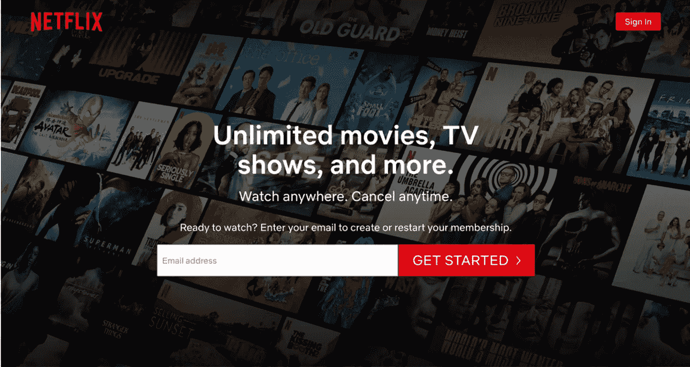
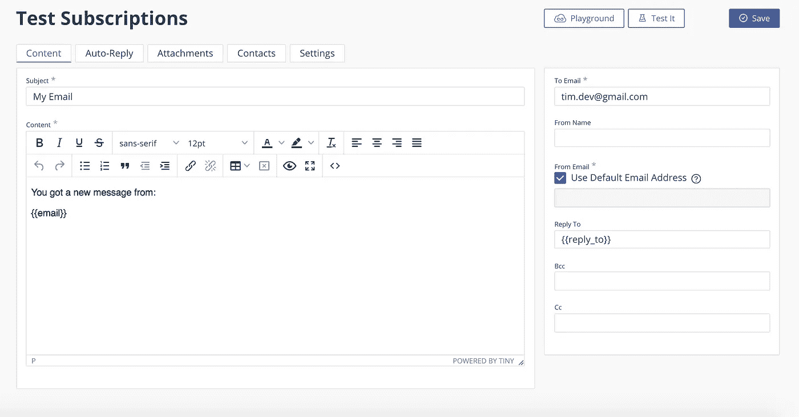

# 如何实现 Email.js API 来创建订阅表单

> 原文：<https://javascript.plainenglish.io/how-to-implement-email-js-api-to-create-a-subscription-form-325c51fbe827?source=collection_archive---------6----------------------->

Email.js 是一个 JavaScript 库，允许用户发送和/或检索电子邮件来建立客户群。您可以使用它来创建一个登录页面，增加订阅或时事通讯，并发送自动电子邮件。它只使用客户端技术，所以不需要服务器。在这篇博客中，我展示了如何通过 React.js 使用 email.js API 生成订阅者。



Image from Netflix.

## 设置帐户

首先，在 [**email.js**](https://dashboard.emailjs.com/sign-in) 创建一个账户，将你的 EmailJS 连接到你支持的电子邮件服务，在这种情况下，我使用的是 Gmail。接下来，找到“电子邮件模板”选项&，点击“创建新模板”按钮。它将打开电子邮件内容。该模板包含多个针对不同字段的动态变量，如*主题*、*内容*、*到地址*、*从名称*等。比方说，你正试图通过收集潜在客户的电子邮件来创造商机；我需要在内容中添加的是*电子邮件*，因为这是我们试图收集的内容。



by Tanuka Das

注意大括号的使用，使用两个左右大括号非常重要。在右边的“收件人”中，添加您希望接收邮件的电子邮件地址。

## 设置代码

假设您有一个 react 项目准备在其上实现 API，安装 EmailJS。

```
npm install emailjs-com --save
```

接下来，在 react 组件上导入 EmailJS。

```
import emailjs from 'emailjs-com'
```

下面是我正在使用的表单的结构:

```
<form className="contact-form" onSubmit={sendEmail}>
  <label>Email</label>
  <input type="email" name="user_email" />
  <input type="submit" value="Send" />
</form>
```

接下来，创建将 API 连接到应用程序的函数。在这种情况下，它被称为`emailSubscriptions()`，带有一个`event`参数。以下函数结构可在 [React EmailJS 文档](https://www.emailjs.com/docs/examples/reactjs/)中找到。

```
emailSubscriptions(e) {
    e.preventDefault();

    emailjs.sendForm('YOUR_SERVICE_ID', 'YOUR_TEMPLATE_ID',     e.target, 'YOUR_USER_ID') .then((result) => {
          console.log(result.text);
      }, (error) => {
          console.log(error.text);
      });
  }
```

`sendForm`中有四个不同的参数需要处理。要在“电子邮件服务”部分找到`'YOUR_SERVICE_ID'`返回您的电子邮箱账号，服务 id 代表您连接电子邮箱的 gmail。然后，导航至模板标题下方的“电子邮件模板”`'YOUR_TEMPLATE_ID'`。`e.target`参数是用户将通过表单提交的内容，所以保持不变。接下来，要找到您的用户 id`'YOUR_USER_ID'`，单击左侧栏上的“集成”选项，找到“API keys”部分，其中包括*用户 id*；复制粘贴在`'YOUR_USER_ID'`处。最后，调用表单中的函数。

```
import React, {Component} from 'react';
import emailjs from 'emailjs-com';class EmailPage extends Component{ emailSubscriptions(e) {
      e.preventDefault(); emailjs.sendForm('service_e655ueI', 'template_sdfn2342g',   e.target, 'user_FS76384TH89394B254B24CB')
        .then((result) => {
            console.log(result.text);
        }, (error) => {
            console.log(error.text);
        });
        e.target.reset();
    }

render() {
  return ( <form className="contact-form" 
         onSubmit={this.emailSubscriptions}>
      <label> Email </label>
      <input type="email" name="email" placeholder="Enter your email here..." />
      <input type="submit" value="Send" />
    </form> )
 }
}
export default EmailPage
```

我还添加了`e.target.reset`，这将在表单提交后重置表单的字段。确保*输入的* **名称**与您账户模板中的动态变量相同。这里，我输入的名字是`name="email"`，EmailJS 模板中的内容是`{{email}}`。

测试您的表单，如果您正确遵循了所有步骤，您应该会在您用来收集用户电子邮件的帐户中收到一封电子邮件。

**既往职务:**

[用 JavaScript 解释并实现的哈希表](https://medium.com/javascript-in-plain-english/hash-tables-explained-and-implemented-in-javascript-9f173a0cd76b?source=your_stories_page-------------------------------------)

[在反应中使用 PropTypes 进行型式检查](https://medium.com/javascript-in-plain-english/type-checking-using-proptypes-in-react-be8c46e7e704?source=your_stories_page-------------------------------------)

[12 种最常见的 JavaScript 数字方法](https://medium.com/swlh/12-most-common-javascript-number-methods-4dfeedb7f2af?source=your_stories_page-------------------------------------)

[12 必须知道下次面试的一系列方法——JavaScript](https://medium.com/@tanuka.das12/12-must-knowarray-methods-for-the-next-interview-javascript-c0221075fce3?source=your_stories_page-------------------------------------)

[数组:左旋转(JavaScript)](https://medium.com/@tanuka.das12/arrays-left-rotation-javascript-2befa87c4c87?source=your_stories_page-------------------------------------)