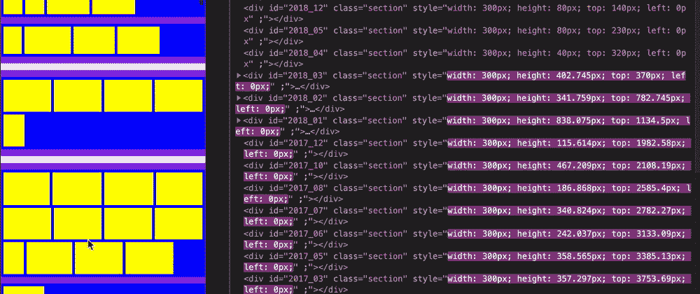
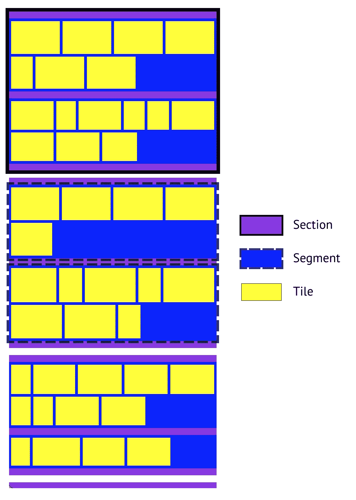
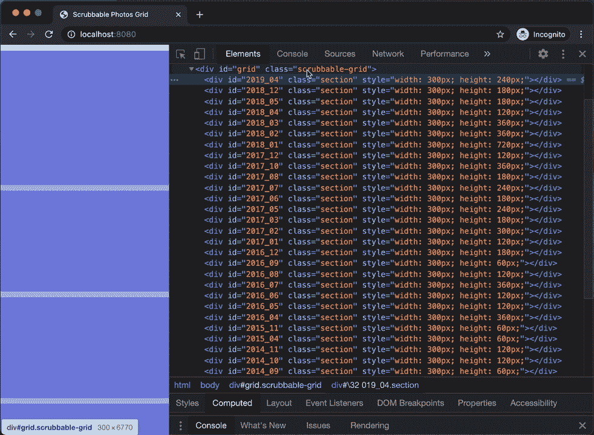
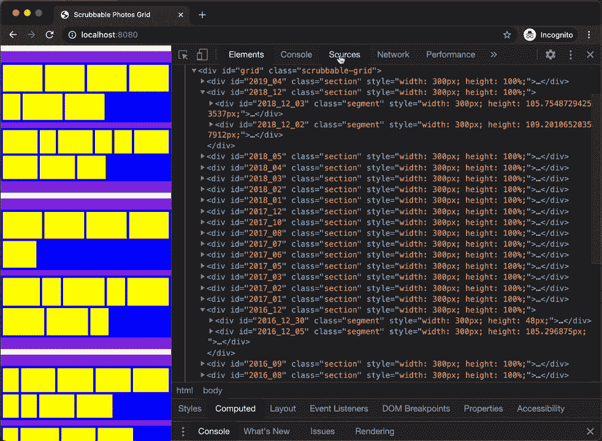
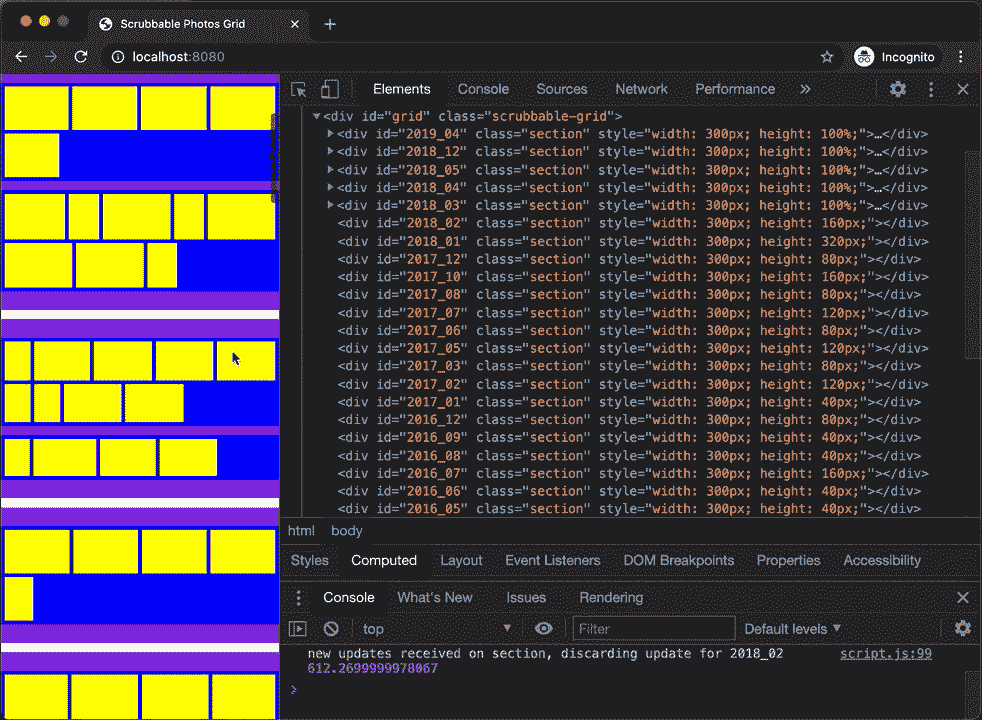
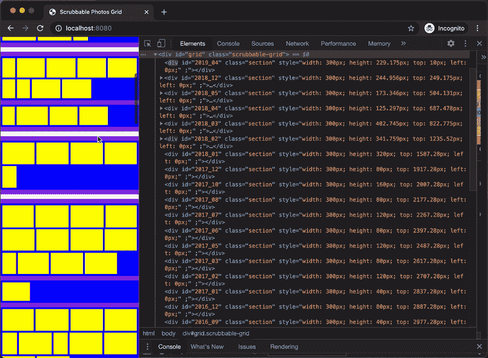
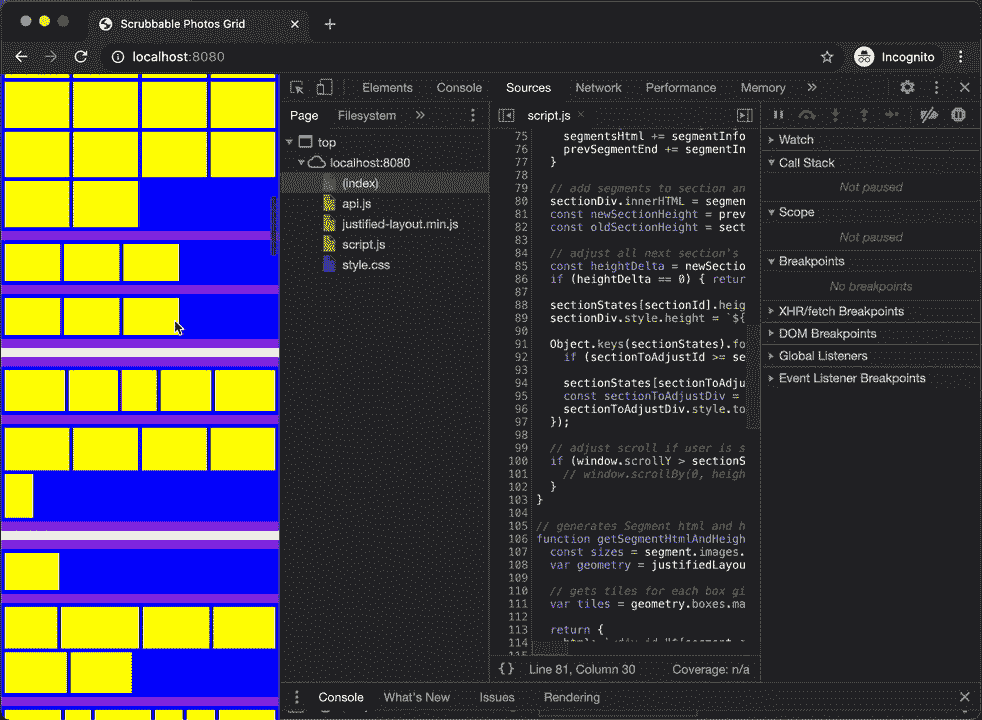
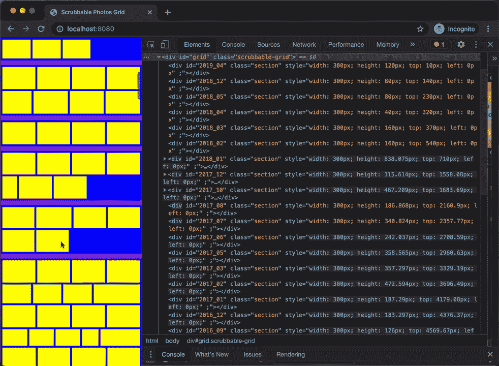

# 如何用 JavaScript 实现 Google 相册网格

> 原文：<https://javascript.plainenglish.io/how-to-implement-google-photos-grid-in-javascript-6c294bcea001?source=collection_archive---------1----------------------->

这是我如何用 JavaScript 实现可擦洗照片网格的一步一步的教程。

谷歌照片使用虚拟可擦洗照片网格。Scrubbable photos grid 将你所有的照片放在网格中，这样用户就可以跳到他们时间线中任意的年/月/日。这个网格是虚拟的，因此我们可以有效地使用用户的资源，如 cpu、内存、磁盘和网络。

在这篇博文中，我将介绍如何用 JavaScript 实现这样一个网格，我们是否可以用一个简单的导航机制来代替它，跳转到任意的年/月/日，这是一个单独的设计讨论。

这个实现将使用许多技术来使这个虚拟网格接近实际网格，包括

*   估计并保持网格高度接近实际高度
*   仅将可见照片加载到 DOM
*   从 DOM 中分离不可见的照片
*   将照片完全放置在网格内
*   在某些情况下，调整滚动位置以补偿布局偏移

# **设计**

在整个博客中，我将总结谷歌为他们的可擦洗网格所做的设计决定，但我会推荐查看这个[谷歌设计博客](https://medium.com/google-design/google-photos-45b714dfbed1)了解细节。

> *我们将保持我们的设计目标与谷歌设计博客中所陈述的一样:*
> 
> **“可擦除照片**——能够快速跳转到照片库的任何部分。
> 
> **对齐布局** —填充浏览器的宽度并保留每张照片的纵横比(无方形裁剪)。
> 
> **60fps 滚动** —确保页面即使在查看数千张照片时也能保持响应。
> 
> **瞬间感受** —尽量减少等待任何东西加载的时间。"

Google 已经做了额外的努力来确保行高是一致的，并且在实现对齐布局时接近目标高度，我们将在这个演示中使用 Flicker 的对齐布局库。

# **实施**

我将一步一步地实现这一点，每一步都是 Github Repo 中的一个提交。如果您想跳过所有详细的解释并检查最终的实现，请检查这个[小故障](https://glitch.com/edit/#!/scrubbable-photos-grid?path=script.js%3A15%3A0)。

我们的网格将被划分为部分，部分将有段，段将有瓷砖和瓷砖将有一个图像标签。当我们需要添加它们时，将会详细介绍这些划分的原因。

我选择 JavaScript 来演示在运行时事情应该如何发生，您应该能够在您选择的任何客户端框架中实现这一点。

## 第一步。将整个网格分成若干部分，并估计它们的高度

与分页和无限滚动相比，scrubbable grid 总是将所有照片显示在网格中，从而正确表示滚动旋钮的有限高度和大小。这也让用户能够立即跳到照片的整个时间轴中的任意时间。

这种低效的实现会在页面加载后立即加载元数据，如整个时间轴中所有照片的宽度和高度。使用每张照片的宽度和高度，我们可以在页面上为网格的实际高度分配空间。这将浪费大量的带宽，初始加载时间将是不可接受的。

为了减少这个初始元数据负载，我们将把整个时间线分成虚拟部分，并估计每个部分的高度，以获得网格的估计高度。我们的初始有效载荷将由所有部分的数组组成，这些部分中有一些图像。将整个网格划分为多个部分的最简单方法是在时间线中每个月划分一个部分。因此，如果用户的时间跨度为 10 年，我们的初始有效载荷将由最大 120 个部分和每个部分的照片数量组成。

我们首先添加带有`grid div`的基本 html 作为网格的容器。

使用的 API 是在`api.js`中模拟的，它基本上依赖于包含的`store.json`的所有部分细节。我们添加了`getSections` api 来检索所有部分，并对每个部分中的图像进行计数。API 使用 50-550 毫秒的随机延迟。

`getSections` api 输出示例

我们添加了`script.js`来加载网格。我们的入口点是`loadUi`，在这里我们称之为`getSections` api。获得所有部分后，我们通过为每个具有估计高度的部分创建一个空的`div`来分配空间。

> *如 Google Design 博客中所述，为了估计部分的高度，我们将假设所有图像的平均纵横比为 3:2，如果水平放置，则该部分中所有图像的总宽度大约为 3:2，然后除以我们的网格宽度，得到当这些图像以网格宽度包裹时部分的大约高度。*

接下来，我们添加基本的`style.css`来突出显示部分

[第一步完全提交](https://github.com/shaileshpandit/scrubbable-photos-grid/commit/7ddef4c73ee010f248a0235bddc3a80496ec4bb5)

**步骤 1 结果** —观察所有具有估计高度的空截面 div 都是在加载时创建的，并给出整个网格和滚动旋钮的估计高度。

## 第二步。用段填充部分

部分是整个网格的虚拟划分，以最小化初始负载资源，而段是网格的可视划分，供用户在逻辑组中导航和查看照片。我们将使用每天的静态片段，但可以基于位置或基于用户一天拥有的照片数量的更细粒度的时间段进行动态划分。

我们添加了`getSegments(sectionId)` api 来检索一个部分的所有片段以及每个片段中的图像。

下面是一个`getSegments(sectionId)`调用的示例输出

接下来，我们在`script.js`中添加`populateSection(sectionDiv)`方法来填充一个 section div。在填充一个我们称为`getSegments(sectionId)` api 的节 div 时，获取所有内部节段的节段 html，将其添加到节 div 中，并将其高度从最初设置的估计高度更新为 100%。

为了生成段 html，我们使用[两端对齐布局](https://www.npmjs.com/package/justified-layout)库。它为我们提供了该段内所有瓷砖的绝对布局。我们使用这个绝对布局生成单独的 tile html，并将其添加为 segment childs。

我们急切地在`populateGrid`中调用`populateSection`来展示填充的部分在 ui 和 DOM 中的样子。

最后，我们制作相对于片段绝对定位的图块，并在`style.css`中高亮显示片段和图块

[第二步完全提交](https://github.com/shaileshpandit/scrubbable-photos-grid/commit/200db9fc752ae537c8f8d153148a27c5add6e0d4)

**步骤 2 结果** —观察所有急切加载的部分和段。

## 第三步。延迟加载和卸载部分

虽然在前面的步骤中，我们急切地在页面加载中加载了所有的部分以进行演示，但是我们希望在部分即将进入视窗时附加它们，在它们离开视窗时分离它们。我们将使用[交叉点观察器](https://developer.mozilla.org/en-US/docs/Web/API/Intersection_Observer_API)来实现这一点。

首先我们创建`sectionObserver` IntersectionObserver，使用`handleSectionIntersection`作为交集处理器，并使用 margin 的`200px`，这样当我们的截面垂直穿过实际视窗+ 200px 的虚拟视窗时，就会触发交集。

我们通过填充输入部分和从虚拟视口分离输出部分来处理相交事件。由于填充一个部分需要获取异步的段，实际填充可能会偏离交集顺序。为了减轻这种情况，我们为所有部分维护`lastSectionUpdateTimes`,并且仅在该部分没有同时更新时填充。

我们通过移除所有子段并且不改变高度来分离该部分。

我们将“sectionObserver”附加到所有部分，而不是急切地加载“populateGrid”中的所有部分。

[第 3 步完全提交](https://github.com/shaileshpandit/scrubbable-photos-grid/commit/b6cab98216964a789f250285cf725e91cad535a7)

**步骤 3 结果** —观察当我们滚动时，部分 div 是如何加载和卸载的。

## 第四步。将段和截面移动到绝对位置

理想情况下，当某些部分的高度改变时，浏览器将有效地计算所有段和部分的位置变化。但是，如果我们想确保我们控制所有的定位变化，我们可以将段和部分都移动到绝对定位。我们的部分将被绝对定位在网格内，而段将被绝对定位在部分内。我们的瓷砖已经完全定位在细分市场内。

首先，我们将节和段设置为绝对位置，并删除 css 中的边距。

接下来，我们在`sectionStates`中将所有区段的`top`、`height`和`lastUpdateTime`维护为一个状态。我们在`populateGrid`中初始化它，并在创建初始分离部分时使用它。

接下来，我们更新`populateSection`来生成具有绝对定位的线段，计算每个线段的顶部。我们计算该部分的新高度，检查它是否已经改变，如果已经改变，我们通过在顶部添加`heightDelta`来移动所有接下来的部分。我们也让`sectionStates`与这些变化保持同步。

现在，在分离截面后，我们不再需要保持旧的高度，因为在移除子段后，绝对高度保持不变。

[第 4 步完全提交](https://github.com/shaileshpandit/scrubbable-photos-grid/commit/ce0d430f51550ea6c69dd0a81cde9fcb5b5b8b26)

**步骤 4 结果** —观察如何通过更新所有后续部分 div 的顶部来保持绝对定位。

## 第五步。布局移动时调整滚动位置

在这一点上，如果你尝试向下滚动，部分将会像预期的那样连接和分离，滚动会感觉正常。当用户线性滚动时，部分被附加，它们的高度改变，更多部分的顶部增加，网格高度改变，整个布局改变，但我们在滚动时没有感觉到跳跃。这是因为所有布局更改都是在当前滚动位置之后。

如果我们允许随机跳转到滚动位置，这将会改变。例如，如果我们在页面加载时跳转到一个随机的滚动位置，我们将处于这样的状态:在我们当前的滚动位置之前，一些分离的部分具有估计的高度。现在，如果我们向上滚动，部分将在滚动位置之前附加，并将在滚动位置之前导致布局更改。当我们滚动时，感觉整个页面都在跳动。要尝试这样做，只需将以下内容添加到步骤 4 提交中的`loadUi`中，并尝试向上滚动。

**页面跳转** —观察滚动时页面跳转到新位置的感觉

为了解决这个问题，我们检查当前的滚动位置是否在我们调整了高度的部分的前面，并在`populateSection`的末尾通过`heightDelta`调整滚动。

[第 5 步完全提交](https://github.com/shaileshpandit/scrubbable-photos-grid/commit/df9599074b011876b9b31b2466503d47b20e98ef)

**最终结果** —观察如何通过调整滚动位置来固定页面跳转

**最终小故障** —打开[直播 app](https://scrubbable-photos-grid.glitch.me) 。使用 Glitch 中的倒带来查看每一步的操作。

# 下一步是什么

还有很多可以补充的，下面是一些你可以尝试的东西:

*   添加实际图像。
*   浏览谷歌博客，添加他们提到的改进。
*   当部分离开虚拟视口时，取消正在进行的 api 调用以获取片段，从而在用户快速滚动时节省带宽。当滚动速度很高时，我们甚至可以推迟获取。
*   向切片添加交叉点观察点，以便为远处的切片加载低分辨率缩略图，为较近的切片加载高分辨率缩略图。
*   添加像时间线而不是滚动旋钮谷歌照片，与此用户将能够跳转到任何年份/月份。
*   在像 React 这样的框架中实现整个东西，你可以为截面、分段和平铺创建组件。
*   这个演示假设网格占用整个视口宽度，你可以使用网格容器的宽度。它当前也不处理视口大小调整。
*   人们甚至可以为可擦洗网格制作开源组件。

# **资源**

*   谷歌设计博客— [构建谷歌照片网络用户界面](https://medium.com/google-design/google-photos-45b714dfbed1)
*   Flickr 的对齐布局库— [对齐布局 npm](https://www.npmjs.com/package/justified-layout)
*   交叉口观察者— [交叉口观察者 Api—Web Api—MDN](https://developer.mozilla.org/en-US/docs/Web/API/Intersection_Observer_API)
*   Github Repo 用于此实现，每个步骤都有提交— [可擦除照片网格](https://github.com/shaileshpandit/scrubbable-photos-grid)
*   带有该实现源代码的 Live 应用程序— [故障](https://glitch.com/edit/#!/scrubbable-photos-grid?path=script.js%3A15%3A0)

如果你能走到这一步，我向你致敬！我喜欢实现它，更喜欢写关于它的东西。这是我很久以来的第一篇科技文章，所以非常感谢任何反馈。

最初发布于 [dev.to](https://dev.to/shaileshpandit/how-to-implement-google-photos-grid-in-javascript-575i)