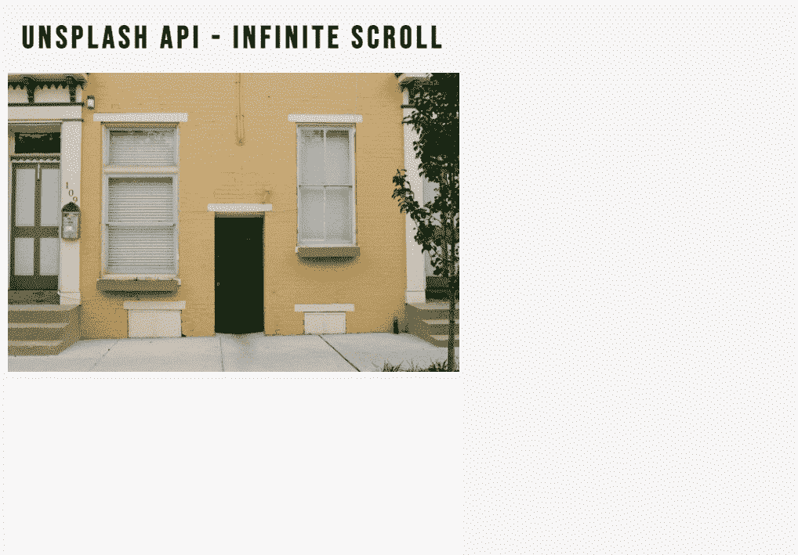
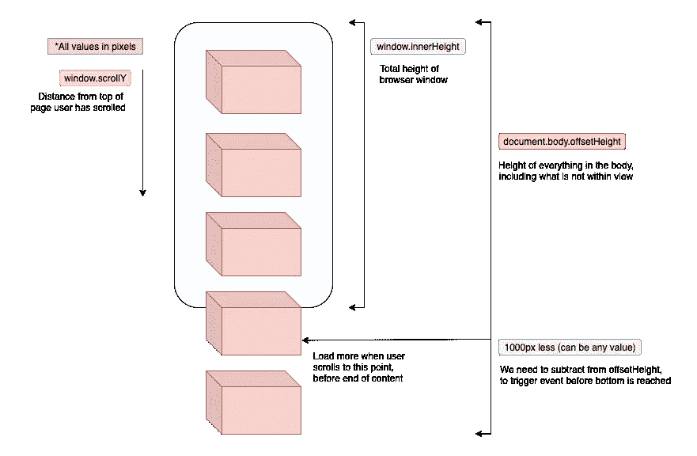

# 如何用普通 JavaScript 实现无限滚动

> 原文：<https://javascript.plainenglish.io/how-to-implement-infinite-scroll-with-vanilla-javascript-f7733cdb026c?source=collection_archive---------13----------------------->



[https://tingchun0113.github.io/infinite-scroll-unsplash-api/](https://tingchun0113.github.io/infinite-scroll-unsplash-api/)

无限滚动经常用于社交媒体网站，如 Twitter 或 Pinterest。该功能允许用户在网站上加载一些图片/内容，然后在到达网页末尾时加载更多图片/内容。

我使用 [Unsplash API](https://unsplash.com/documentation) 来获取随机图片。本文将重点介绍如何使用 JavaScript 利用一些属性来实现无限滚动。你可以在这个 [repo](https://github.com/tingchun0113/infinite-scroll-unsplash-api) 中找到其他项目文件(HTML 或者 CSS 文件)。

# 实现无限滚动的四个属性

A) **window.scrollY** :文档从顶部开始滚动了多远

B) **window.innerHeight** :窗口的可见部分

c)**document . body . offset height**:整个文档的高度

D) 1000px(或任何值):距文件底部的距离

下图更好地说明了这些属性:



JavaScript Web Projects: 20 Projects to Build Your Portfolio

看上面，我们可以听到滚动事件:

```
If A (scrollY) + B (innerHeight) >= C (document height) - D (1000px) -> load more photos 
```

# 最后的想法

还有其他工具([交叉点观察器 API](https://developer.mozilla.org/en-US/docs/Web/API/Intersection_Observer_API) )来实现无限滚动。如果你觉得这篇文章有用或有任何问题，请在 [**LinkedIn**](https://www.linkedin.com/in/tingchunw/) 上联系我，或在 [**Medium**](https://tingchun0113.medium.com/) 上关注我以获取更多文章。

*更多内容请看*[***plain English . io***](http://plainenglish.io/)