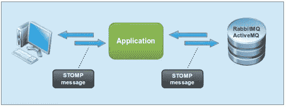

# 如何使用 RabbitMQ 和 Ballerina 实现 STOMP 协议

> 原文：<https://javascript.plainenglish.io/how-to-implement-the-stomp-protocol-using-rabbitmq-with-ballerina-170d10f81359?source=collection_archive---------10----------------------->

## JavaScript 中的连接和实现


今天，我将用 JavaScript 和芭蕾舞语言来写 STOMP 的实现。

> STOMP 是一种可互操作的协议，设计用于通过中介服务器在客户端之间传递异步消息。



# 方案

随着企业世界中数字营销的出现，组织需要能够在官方网站上发布公司更新和新闻。无需手动更新每个媒体频道，组织可以将消息发布到订阅者正在收听的队列或主题中。每个订阅者都有一个连接到任何媒体的服务，并将发布的消息发布到队列/主题。让我们看看芭蕾舞演员如何轻松实现这一点。

# 怎么做？

# 设置环境

1.  首先，去[芭蕾舞郎](http://ballerinalang.org/)网站下载最新的芭蕾舞演员分布。

**注:**此场景在芭蕾舞演员 0.990.2 版本上测试

2.按照以下说明下载并安装 RabbitMQ broker:

[https://www.rabbitmq.com/download.html](https://www.rabbitmq.com/download.html)

3.配置 RabbitMQ 代理的 STOMP 插件，以便启用与 STOMP 相关的消息事务。

[https://www.rabbitmq.com/stomp.html](https://www.rabbitmq.com/stomp.html)

还有关于如何为兔子启用跺脚插件的视频教程 q:[https://www.youtube.com/watch?v=LEjOmn8dfDg](https://www.youtube.com/watch?v=LEjOmn8dfDg)

4.使用终端命令(Linux)启动 RabbitMQ 代理:

```
// To start the broker
invoke-rc.d rabbitmq-server start// To get the status of the broker
invoke-rc.d rabbitmq-server status// To stop the broker
invoke-rc.d rabbitmq-server stop
```


RabbitMQ Broker’s status on terminal once started


# 连接建立


通过发送 **CONNECT** 帧建立 TCP 套接字连接，连接到消息代理。

```
CONNECT
accept-**version**:1.0**,**1.1**,**2.0
login:guest
passcode:guest
host:/^@--------------------------------------------------------------------**string** connect = 
**"CONNECT"** + **"\n"** + 
**"accept-version:"** + acceptVersions + **"\n"** +
**"login:"** + logins + **"\n"** + 
**"passcode:"** + passcodes + **"\n"** +
**"host:"** + vhosts + **"\n"** + **"\n"** +
self.endOfFrame**;**
```

作为返回消息，broker 将回复一个连接的回执。

```
**CONNECTED**
server:RabbitMQ/3.6.15
session:session--CMKQ6EeCxX5gawh8A6qdQ
heart-beat:0,0
version:1.1
```

# 我们开始吧，

# 将消息发布到队列/主题/交换

> ***工作目录结构:***

/根文件夹
├──my . stomp
│└──sender . bal
├──publisher . bal

**Publisher.bal**

开始时，消息发布者将通过发送 **CONNECT** 帧建立 TCP 套接字连接来连接到消息代理，并将生成消息并通过事务块内的 **SEND** 帧将其发送到消息代理。

```
**import** my.stomp**;
import** ballerina/log**;
import** ballerina/io**;
import** ballerina/socket**;
import** ballerina/transactions**;**// This initializes a STOMP connection with the STOMP broker.
stomp:Sender stompSender = **new**({
        host: **"localhost",** port: 61613**,** login: **"guest",** passcode: **"guest",** vhost: **"/",** acceptVersion: **"1.1"** })**;****public function** main() {
    // Message is published within the transaction block.
    // Each message sent should be received from other end else    
    // rollback to retry the message along with transaction Id.
    **transaction** {
        // This sends the Ballerina message to the stomp broker.
        **string** message = **"Hello World From Ballerina";
        string** destination = **"/queue/test";
        var** broadcast = stompSender**->**send(message**,**destination); }
}
```

**Publisher.out**

```
# To run the client, navigate to the directory that contains the
# `.bal` file and use the `ballerina run --experimental` command. **$ ballerina run --experimental publisher.bal****[ballerina/http]** started HTTP/WS endpoint 172.17.0.1:38163
Starting up the Ballerina Stomp ServiceSuccessfully connected to stomp broker
Connect to: 61613
CONNECTED
server:RabbitMQ/3.6.15
session:session-ayVnDSHIzcO5_iTmH9tafA
heart-beat:0,0
version:1.1**# transaction has started**
Begin has been made with transaction: b632dfdb-e182-44bd-a2f7-66652129183c
2019-02-21 11:01:33,882 INFO  [ballerina/transactions] - Created transaction: 7feaf167-de8e-446a-a71f-5982f82af488
Message: Hello World From Ballerina is sent successfully
RECEIPT
receipt-id:abee3b5e-a3b6-4ae9-aeb2-fa127c840aaf**# disconnecting from the broker port**
Disconnected from stomp broker successfully
Leave from: 61613
2019-02-21 11:01:38,960 INFO  [ballerina/transactions] - Running 2-phase commit for transaction: 7feaf167-de8e-446a-a71f-5982f82af488:$anon$.$1
RECEIPT
receipt-id:abee3b5e-a3b6-4ae9-aeb2-fa127c840aaf
```

**Sender.bal(对象)**

```
**import** ballerina/socket**;
import** ballerina/io**;
import** ballerina/log**;
import** ballerina/runtime**;
import** ballerina/system**;***# Configurations related to a STOMP connection
#
#* + host - *STOMP provider url.
#* + port - *STOMP port.
#* + config - *Config.
#* + login - *STOMP user login.
#* + passcode - *STOMP passcode.
#* + vhost - *default stomp vhost.
#* + acceptVersion - *1.1.
#* + socketClient - *socketConnection.
#* + endOfFrame - *null octet.***public type** Sender **client object** { **public string** host = **"";
    public int** port = 0**;
    public string** login = **"";
    public string** passcode = **"";
    public string** vhost = **"";
    public string** acceptVersion = **"";
    private** socket:Client socketClient**;**// End of frame used a null octet (^@ = \u0000).
    **public string** endOfFrame = **"\u0000";** **public** ConnectionConfiguration config = {
        host:host**,** port:port**,** login:login**,** passcode:passcode**,** vhost:vhost**,** acceptVersion:acceptVersion
    }**;** **public function __init**(ConnectionConfiguration stompConfig) {
        **self**.config = stompConfig**;
        self**.host = stompConfig.host**;
        self**.port = stompConfig.port**;
        self**.login = stompConfig.login**;
        self**.passcode = stompConfig.passcode**;
        self**.vhost = stompConfig.vhost**;
        self**.acceptVersion = stompConfig.acceptVersion**;
        self**.socketClient = **new**({
                host: **self**.host**,** port: **self**.port**,** callbackService: ClientService
            })**;
        self->**connect(stompConfig.host**,** stompConfig.port**,** stompConfig.login**,** stompConfig.passcode**,** stompConfig.vhost**,** stompConfig.acceptVersion) **;** } **public remote function** connect(**string** hosts**,int** ports**,string** logins**, string** passcodes**, string** vhosts**, string** acceptVersions)**;** **public remote function** begin()**;** **public remote function** send(**string** messages**, string** destinations)**;** **public remote function** disconnect()**;** }**;****public type** ConnectionConfiguration **record** {
    **string** host**;
    int** port**;
    string** login**;
    string** passcode**;
    string** vhost**;
    string** acceptVersion**;** }**;****remote function** Sender.connect(**string** hosts**, int** ports**, string** logins**, string** passcodes**, string** vhosts**, string** acceptVersions) {
    socket:Client socketClient = self.socketClient**;** io:println(**"Starting up the Ballerina Stomp Service\n"**)**;**// CONNECT frame to get connected.
    **string** connect = **"CONNECT"** + **"\n"** + **"accept-version:"** + acceptVersions + **"\n"** + **"login:"** + logins + **"\n"** + **"passcode:"** + passcodes +
        **"\n"** + **"host:"** + vhosts + **"\n"** + **"\n"** + self.endOfFrame**;** **byte**[] payloadByte = connect.toByteArray(**"UTF-8"**)**;** // Send desired content to the server using the write function.
    **var** writeResult = socketClient**->**write(payloadByte)**;
    if** (writeResult **is error**) {
        io:println(**"Unable to write the connect frame",** writeResult)**;** }
    io:println(**"Successfully connected to stomp broker"**)**;**// Make the publisher wait until it sends the message to the destination.
    runtime:sleep(5000)**;** **var** startBegin = self**->**begin()**;** }**remote function** Sender.begin(){
    socket:Client socketClient = self.socketClient**;**// Generating unique id for message reciept.
    **string** transactionId = system:uuid()**;** **string** begin = **"BEGIN"** + **"\n"** + **"transaction:"** + transactionId + **"\n"** + **"\n"** + self.endOfFrame**;** **byte**[] payloadByte = begin.toByteArray(**"UTF-8"**)**;** // Send desired content to the server using the write function.
    **var** writeResult = socketClient**->**write(payloadByte)**;
    if** (writeResult **is error**) {
        io:println(**"Unable to write the connect frame",** writeResult)**;** }
    io:println(**" Begin has been made with transaction: ",** transactionId)**;** }**remote function** Sender.send(**string** messages**, string** destinations){
    socket:Client socketClient = self.socketClient**;**// Generating unique id for message reciept.
    **string** messageId = system:uuid()**;**// SEND frame to send message.
    **string** send = **"SEND"** + **"\n"** + **"destination:"** + destinations + **"\n"** + **"receipt:"** + messageId + **"\n"** + **"\n"** +
        messages + **"\n"** + **"\n"** + self.endOfFrame**;** **byte**[] payloadByte = send.toByteArray(**"UTF-8"**)**;** // Send desired content to the server using the write function.
    **var** writeResult = socketClient**->**write(payloadByte)**;
    if** (writeResult **is error**) {
        io:println(**"Unable to write the connect frame",** writeResult)**;** }
    io:println(**"Message: ",** messages **," is sent successfully"**)**;**// Make the publisher wait until it sends the message to the destination.
    runtime:sleep(5000)**;** **var** disconnection =  self**->**disconnect()**;** }**remote function** Sender.disconnect() {
    socket:Client socketClient = self.socketClient**;**// DISCONNECT frame to disconnect.
    **string** disconnect = **"DISCONNECT"** + **"\n"** + **"\n"** + self.endOfFrame**;** **byte**[] payloadByte = disconnect.toByteArray(**"UTF-8"**)**;** // Send desired content to the server using the write function.
    **var** writeResult = socketClient**->**write(payloadByte)**;
    if** (writeResult **is error**) {
        io:println(**"Unable to write the connect frame",** writeResult)**;** }
    io:println(**"Disconnected from stomp broker successfully"**)**;** }// Callback service for the TCP client. The service needs to have four predefined resources.
**service** ClientService = **service** { // This is invoked once the client connects to the TCP server.
    **resource function** onConnect(socket:Caller caller) {
        io:println(**"Connect to: ",** caller.remotePort)**;** } // This is invoked when the server sends any content.
    **resource function** onReadReady(socket:Caller caller**, byte**[] content) {
        io:ReadableByteChannel byteChannel = io:createReadableChannel(content)**;** io:ReadableCharacterChannel characterChannel =
        **new** io:ReadableCharacterChannel(byteChannel**, "UTF-8"**)**;
        var** str = characterChannel.read(300)**;
        if** (str **is string**) {
            io:println(**untaint** str)**;** } **else** {
            io:println(str)**;** }
    } // This is invoked once the connection is closed.
    **resource function** onClose(socket:Caller caller) {
        io:println(**"Leave from: ",** caller.remotePort)**;** } // This resource is invoked for the error situation
    // if it happens during the `onConnect`, `onReadReady`, and `onClose` functions.
    **resource function** onError(socket:Caller caller**, error** err) {
        io:println(err)**;** }
}**;**
```

# 从队列/主题/交换中订阅消息

> ***工作目录结构:***

/根文件夹
├──my . stomp subscriber
│└──receiver . bal
├──subscriber . bal

**用户余额**

消息订阅者将通过发送**连接**帧建立 TCP 套接字连接来连接到消息代理，并将通过在事务块内发送**订阅**帧来开始订阅特定目的地上的消息。

```
**import** my.stompSubscriber**;
import** ballerina/log**;
import** ballerina/io**;
import** ballerina/socket**;
import** ballerina/system**;** //import ballerina/transactions;// This initializes a STOMP connection with the STOMP broker.
stompSubscriber:Receiver stompReceiver = **new**({
        host: **"localhost",** port: 61613**,** login: **"guest",** passcode: **"guest",** vhost: **"/",** acceptVersion: **"1.1"** })**;****public function** main() {
    // Message is subscribed within the transaction block.
    // Each message received should be received from other end else 
    // rollback to retry the subscription along with transaction Id.
    **transaction** {
        // This sends the Ballerina message to the stomp broker.
        **string** destination = **"/queue/test";
        string** subscribeId = system:uuid()**;
        string** ack = **"client";
        var** receive = stompReceiver**->**subscribe(destination**,** subscribeId**,** ack);}
}
```

**Receiver.bal (Object)**

```
**import** ballerina/socket**;
import** ballerina/io**;
import** ballerina/log**;
import** ballerina/runtime**;
import** ballerina/system**;***# Configurations related to a STOMP connection
#
#* + host - *STOMP provider url.
#* + port - *STOMP port.
#* + config - *Config.
#* + login - *STOMP user login.
#* + passcode - *STOMP passcode.
#* + vhost - *default stomp vhost.
#* + acceptVersion - *1.1.
#* + socketClient - *socketConnection.
#* + endOfFrame - *null octet.***public type** Receiver **client object** { **public string** host = **"";
    public int** port = 0**;
    public string** login = **"";
    public string** passcode = **"";
    public string** vhost = **"";
    public string** acceptVersion = **"";
    private** socket:Client socketClient**;**// End of frame used a null octet (^@ = \u0000).
    **public string** endOfFrame = **"\u0000";** **public** ConnectionConfiguration config = {
        host:host**,** port:port**,** login:login**,** passcode:passcode**,** vhost:vhost**,** acceptVersion:acceptVersion
    }**;** **public function __init**(ConnectionConfiguration stompConfig) {
        **self**.config = stompConfig**;** //self->send(stompConfig.message,stompConfig.destination);
        **self**.host = stompConfig.host**;
        self**.port = stompConfig.port**;
        self**.login = stompConfig.login**;
        self**.passcode = stompConfig.passcode**;
        self**.vhost = stompConfig.vhost**;
        self**.acceptVersion = stompConfig.acceptVersion**;
        self**.socketClient = **new**({
                host: **self**.host**,** port: **self**.port**,** callbackService: ClientService
            })**;
        self->**connect(stompConfig.host**,** stompConfig.port**,** stompConfig.login**,** stompConfig.passcode**,** stompConfig.vhost**,** stompConfig.acceptVersion) **;** } **public remote function** connect(**string** hosts**,int** ports**,string** logins**, string** passcodes**, string** vhosts**, string** acceptVersions)**;** **public remote function** begin()**;** **public remote function** subscribe(**string** destinations**, string** subscribeId**, string** ack)**;** **public remote function** disconnect()**;** }**;****public type** ConnectionConfiguration **record** {
    **string** host**;
    int** port**;
    string** login**;
    string** passcode**;
    string** vhost**;
    string** acceptVersion**;** }**;****remote function** Receiver.connect(**string** hosts**, int** ports**, string** logins**, string** passcodes**, string** vhosts**, string** acceptVersions) {
    socket:Client socketClient = self.socketClient**;** io:println(**"Starting up the Ballerina Stomp Service\n"**)**;**// CONNECT frame to get connected.
    **string** connect = **"CONNECT"** + **"\n"** + **"accept-version:"** + acceptVersions + **"\n"** + **"login:"** + logins + **"\n"** + **"passcode:"** + passcodes +
        **"\n"** + **"host:"** + vhosts + **"\n"** + **"\n"** + self.endOfFrame**;** **byte**[] payloadByte = connect.toByteArray(**"UTF-8"**)**;** // Send desired content to the server using the write function.
    **var** writeResult = socketClient**->**write(payloadByte)**;
    if** (writeResult **is error**) {
        io:println(**"Unable to write the connect frame",** writeResult)**;** }
    io:println(**"Successfully connected to stomp broker"**)**;**// Make the publisher wait until it sends the message to the destination.
    runtime:sleep(5000)**;** **var** startBegin = self**->**begin()**;** }**remote function** Receiver.begin(){
    socket:Client socketClient = self.socketClient**;**// Generating unique id for message reciept.
    **string** transactionId = system:uuid()**;** **string** begin = **"BEGIN"** + **"\n"** + **"transaction:"** + transactionId + **"\n"** + **"\n"** + self.endOfFrame**;** **byte**[] payloadByte = begin.toByteArray(**"UTF-8"**)**;** // Send desired content to the server using the write function.
    **var** writeResult = socketClient**->**write(payloadByte)**;
    if** (writeResult **is error**) {
        io:println(**"Unable to write the connect frame",** writeResult)**;** }
    io:println(**" Begin has been made with transaction: ",** transactionId)**;** }**remote function** Receiver.subscribe(**string** destinations**, string** subscribeId**, string** ack){
    socket:Client socketClient = self.socketClient**;**//subscribe + "\n" + "destination:"+ destination + "\n" + "id:01\n" + "ack:client\n" + "\n" + END_OF_FRAME;
    // SUBSCRIBE frame to receive messages.
    **string** subscribe = **"SUBSCRIBE"** + **"\n"** + **"destination:"** + destinations + **"\n"** + **"id:"**+ subscribeId + **"ack:"**+ ack + **"\n"** + **"\n"** + self.endOfFrame**;** **byte**[] payloadByte = subscribe.toByteArray(**"UTF-8"**)**;** // Send desired content to the server using the write function.
    **var** writeResult = socketClient**->**write(payloadByte)**;
    if** (writeResult **is error**) {
        io:println(**"Unable to write the connect frame",** writeResult)**;** }
    io:println(**"Subscribed to ",** destinations ,**" with subscriptionId: ",** subscribeId)**;**// Make the publisher wait until it sends the message to the destination.
    runtime:sleep(5000)**;** **var** disconnection =  self**->**disconnect()**;** }**remote function** Receiver.disconnect() {
    socket:Client socketClient = self.socketClient**;**// DISCONNECT frame to disconnect.
    **string** disconnect = **"DISCONNECT"** + **"\n"** + **"\n"** + self.endOfFrame**;** **byte**[] payloadByte = disconnect.toByteArray(**"UTF-8"**)**;** // Send desired content to the server using the write function.
    **var** writeResult = socketClient**->**write(payloadByte)**;
    if** (writeResult **is error**) {
        io:println(**"Unable to write the connect frame",** writeResult)**;** }
    io:println(**"Disconnected from stomp broker successfully"**)**;** }// Callback service for the TCP client. The service needs to have four predefined resources.
**service** ClientService = **service** { // This is invoked once the client connects to the TCP server.
    **resource function** onConnect(socket:Caller caller) {
        io:println(**"Connect to: ",** caller.remotePort)**;** } // This is invoked when the server sends any content.
    **resource function** onReadReady(socket:Caller caller**, byte**[] content) {
        io:ReadableByteChannel byteChannel = io:createReadableChannel(content)**;** io:ReadableCharacterChannel characterChannel =
        **new** io:ReadableCharacterChannel(byteChannel**, "UTF-8"**)**;
        var** str = characterChannel.read(300)**;
        if** (str **is string**) {
            io:println(**untaint** str)**;** } **else** {
            io:println(str)**;** }
    } // This is invoked once the connection is closed.
    **resource function** onClose(socket:Caller caller) {
        io:println(**"Leave from: ",** caller.remotePort)**;** } // This resource is invoked for the error situation
    // if it happens during the `onConnect`, `onReadReady`, and `onClose` functions.
    **resource function** onError(socket:Caller caller**, error** err) {
        io:println(err)**;** }
}**;**
```

**消息发布演示&订阅**


Demonstration of STOMP Publisher & Subscriber in linux

1.  运行***subscriber . bal***

```
ballerina run --experimental subscriber.bal
```

2.然后运行***publisher . bal***

```
ballerina run --experimental publisher.bal
```

3.通过转到，监视 RabbitMQ 管理控制台中传递的连接和消息

```
[http://localhost:15672](http://localhost:15672)
```


Demonstration of RabbitMQ Management console


Shows STOMP connections made using TCP sockets

# 摘要

感谢您一步一步地完成这些步骤，我希望您成功地制定了一个完全用芭蕾舞者语言编写的可行的跺脚协议。让我们在我的下一篇博客中相遇，敬请期待。

*更多内容请看*[*plain English . io*](http://plainenglish.io/)