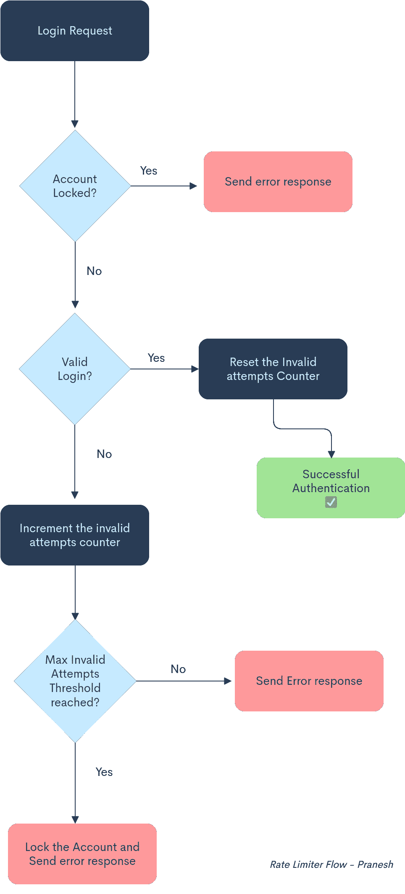
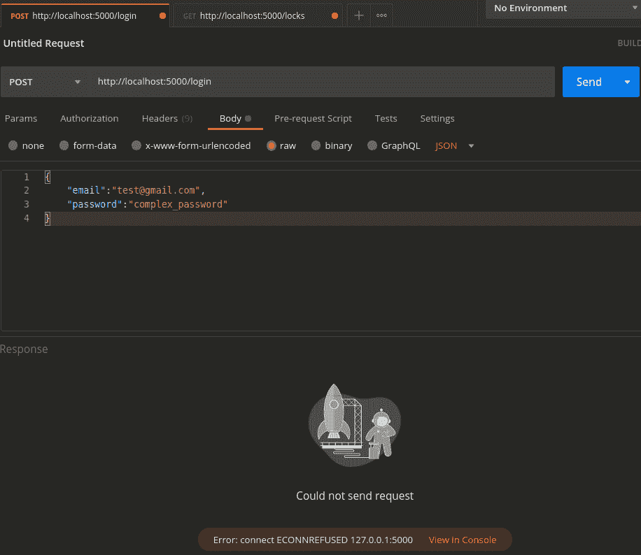
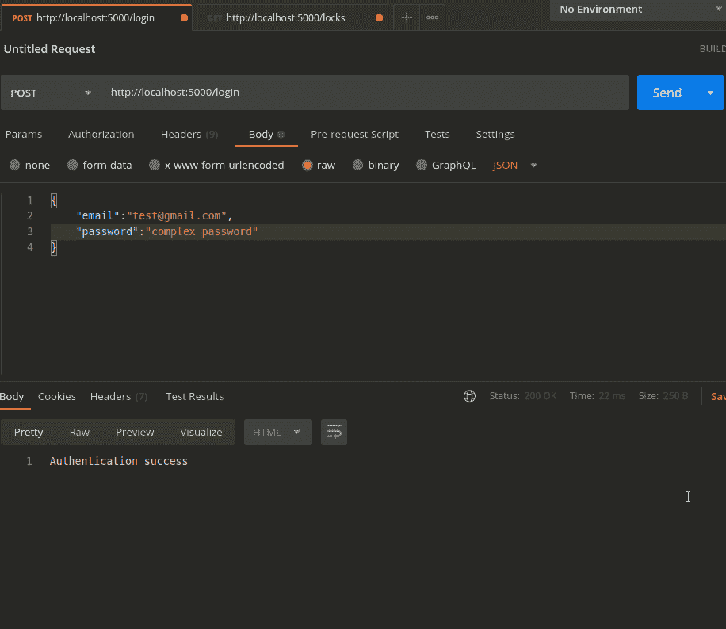
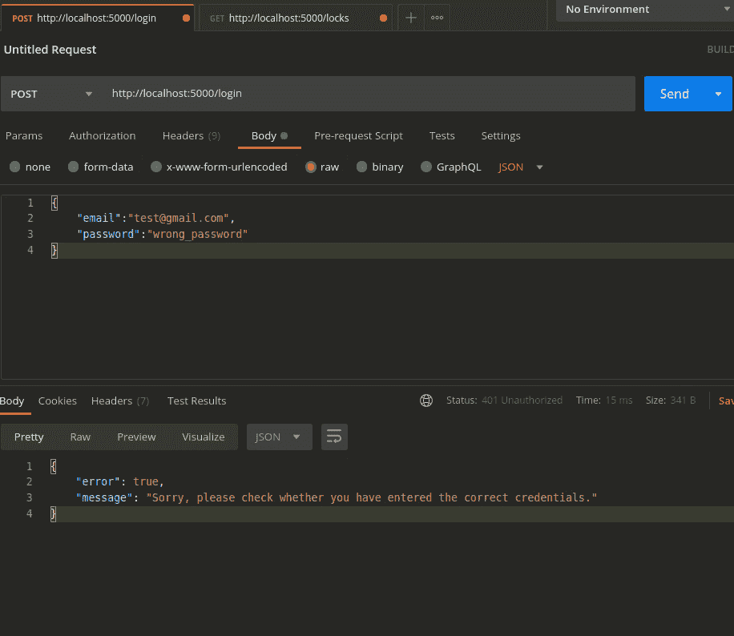
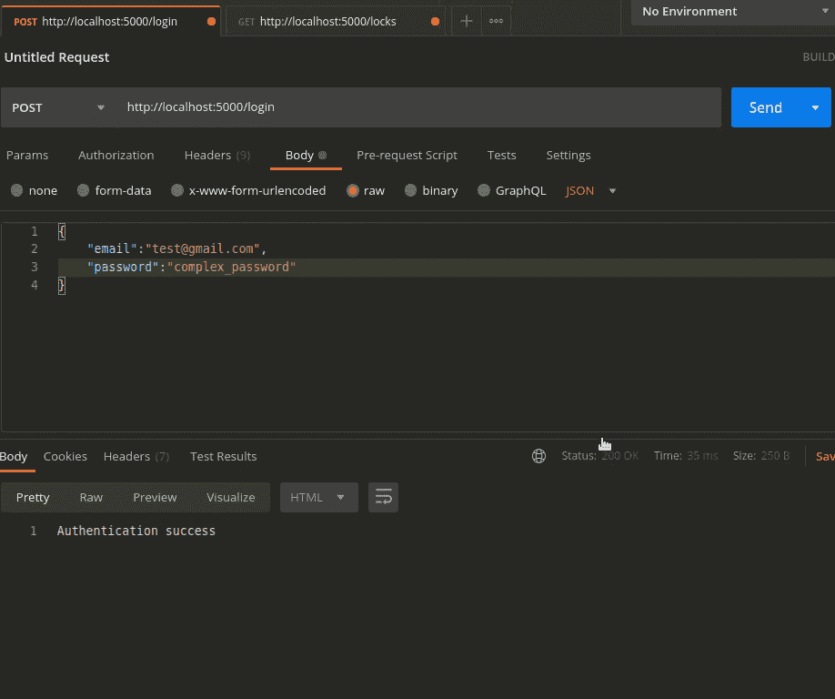

# 如何在 Node.js 中实现自己的速率限制器

> 原文：<https://javascript.plainenglish.io/how-to-implement-your-own-rate-limiter-in-node-js-16166045a2a5?source=collection_archive---------13----------------------->

## 使用 Node.js 开发一个轻量级的内存 API 速率限制器。


速率限制是每个 web 应用程序都应该实现的最重要的特性之一。在限速的情况下有很多变化，比如-

*   基于 IP 的速率限制—防止拒绝服务攻击
*   特定于帐户的速率限制—防止暴力攻击

在这个演示中，我们将实现一个基本的速率限制机制，该机制将在连续 Y 次无效尝试后锁定用户帐户 X 个时间段。此外，我们不打算为此使用任何数据库，因为我想让它更简单和精确。

我将使用 Node.js 来实现速率限制器，但是这个逻辑可以使用任何编程语言来实现。

# 流程:



This is how it works!

# 给我看看代码…

使用`npm init --y`命令创建一个新的 NodeJS 项目。我们需要安装`express`来处理 HTTP 请求，安装`moment`来显示用户帐户解锁的相对剩余时间。

```
npm install express moment --save
```

安装完成后，我们可以将下面的代码添加到`app.js`文件中。

让我们保存文件并使用 Postman 运行一些测试！

*   ***场景 1——成功登录***



*   ***场景 2 —无效登录***



*   ***场景 3——连续 2 次以上无效尝试***



*   ***场景 4— 2 次无效尝试后跟随一次有效登录尝试***



我们可以看到，在所有场景中，限速器都按预期工作。如上所述，这是一个非常基本的实现，它可以在许多方面进一步改进，例如，我们可以定义一个时间范围，在这个时间范围内可以限制点击次数，比如说，3 分钟内 5 次无效登录尝试应该将帐户锁定 24 小时。这些锁存储在应用程序的内存中，因此如果服务器重启或崩溃，它们将会丢失。因此，锁可以在 Redis 或 MongoDB 等数据存储中持久化，以获得更高的一致性和可靠性。此外，还有一些 npm 模块可用于实现速率限制。

编码快乐！🎉

*更多内容请看*[***plain English . io***](http://plainenglish.io/)