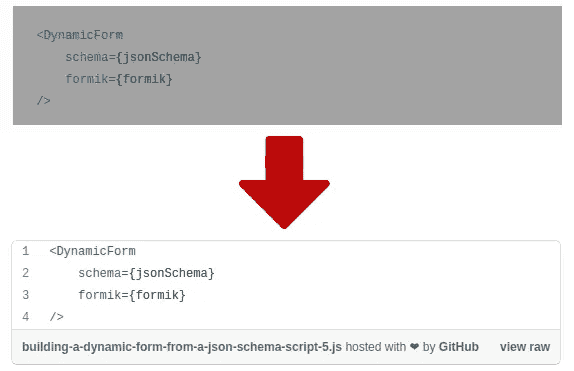

# 如何将 Gatsby 的文章导入带有要点代码片段的媒体

> 原文：<https://javascript.plainenglish.io/how-to-import-gatsby-posts-into-medium-with-gist-code-snippets-168fbde623c5?source=collection_archive---------14----------------------->

Medium 是一个很好的平台，可以与更广泛的受众分享你的博客文章，但有点烦人的是，要获得代码片段，你需要创建一个 GitHub Gist ( [或其他](https://medium.com/pythoneers/9-different-ways-to-embedded-code-in-medium-9213cb4c0a2e))并将其嵌入到文章中。

由于我在博客中写了很多教程，所以将我所有的代码片段一个一个地添加到 GitHub Gist 中要花很多时间，而且我非常懒，所以让我们自动化吧。



# 盖茨比的代码片段

要在 Gatsby 中添加代码片段，您只需使用 markdown 三个反勾号和您正在使用的语言，如下例所示。

```
```javascript
    console.log('hello world!');
```
```

这样，Gatsby 将生成如下所示的 HTML。这对以后很重要。

# 问题是

Medium 有一个超级有用的[工具，可以将任何地方的任何帖子导入到 Medium story](https://medium.com/p/import) 中，但遗憾的是，每个代码片段都会被它忽略。

理想情况下，我可以为我的博客帖子创建一个特殊的 URL，在那里我所有的代码片段都将被一个包含这些代码的 GitHub Gist URL 所取代，这正是我接下来要做的事情😎。

# 为媒体创建特殊的 URL

我希望能够将`/medium-import`添加到我的博客帖子的 URL 末尾，并加载一个特殊的帖子页面，所有代码片段都由 GitHub Gists 替换。

在`gatsby-node.js`文件上，在`createPages`函数中，我将在最后用`/medium-import`路径创建一个额外的页面。

我所有的博客文章现在都可以通过`/blog-post-url`和`/blog-post-url/medium-import`访问。

# 为媒体生成不同的 HTML

对于`generateMediumHTML`函数，我将使用`querySelectorAll`找到所有带有代码片段的 HTML 节点，并用 GitHub Gists URLs 替换它们。

由于所有这些代码都将在 Node 上执行，我将需要 [**jsdom**](https://github.com/jsdom/jsdom) 来操作`HTML DOM`。

所有代码片段将被替换为`<div class="gatsby-highlight" data-language="javascript">https://gist.github.com/some-gist-id</div>`。

# 使用 GitHub Gist API

我将使用 [GitHub Gist API](https://docs.github.com/en/rest/reference/gists#create-a-gist) 做两件事，获取我现有的所有 Gist 以避免用`GET`请求创建同一个 Gist 两次，以及用`POST`请求创建一个新的 Gist。

因为代码将在 Node 中执行，所以我将使用 [**node-fetch**](https://github.com/node-fetch/node-fetch) 来处理 API 请求。

对于`generateGistUrlsForPost`函数，我将再次使用`querySelectorAll`函数通过`textContent`属性获取代码，然后通过 Gist API 将其发送给 GitHub，为此我将需要一个 [GitHub 个人访问令牌](https://github.com/settings/tokens)。

# 呈现新的 HTML

在 React 组件模板中，我可以在`pageContext`中访问一个名为`mediumHTML`的新属性，这就是所有代码片段都被 GitHub Gists 替换的新 HTML。

现在我可以进入[媒体导入工具](https://medium.com/p/import)并通过`/blog-post-url/medium-import`导入任何帖子。

有了这些自动化，期待看到更多来自我的[中型帖子](https://pablopirata.medium.com/)😊。

*最初发布于*[*https://pablo . gg*](https://pablo.gg/en/blog/coding/how-to-import-gatsby-posts-into-medium-with-gist-code-snippets/)*。*

*更多内容请看*[***plain English . io***](http://plainenglish.io/)