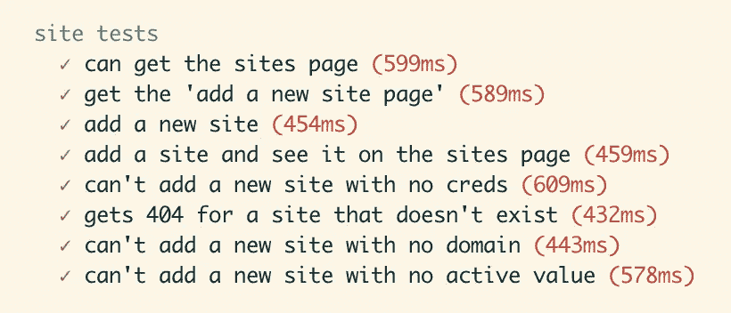
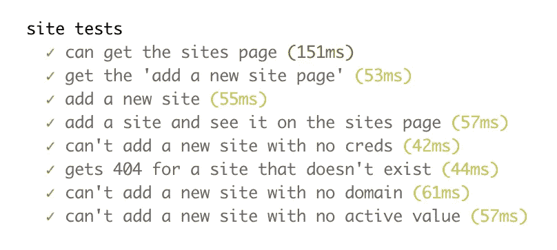

# 如何提高测试的速度

> 原文：<https://javascript.plainenglish.io/how-to-improve-the-speed-of-your-tests-fa2deb021c32?source=collection_archive---------13----------------------->

## 衡量，然后行动

今天，我被提醒要先测量，而不是做假设。

我想我应该写一篇文章浏览一下——这样至少会有一些有用的东西出来，如果它能帮助别人的话。

## 背景

在过去的几天里，我一直在努力提高测试运行速度。一开始还不错，但是我添加的测试越多，运行时间就越长。当在某些部分每个测试花费了**600-1300 毫秒**的时候，我已经厌倦了去做一些事情。



## 出发点

我怀疑这可能是一个数据库问题，但是我想我最好先尝试一些基本的节点概要分析，看看是否有确凿的证据能有所帮助。

该页面上的说明说`--prof`将启用节点概要分析。我想从运行 Mocha 中获得概要结果，而不是“仅仅”Node。将标志添加为`--v8-prof`意味着 Mocha 会将标志传递给 Node:

```
$ NODE_ENV=test mocha --v8-prof --require test/fixtures.js
$ node --prof-process isolate-0x102d57000-8614-v8.log > processed.txt
```

不幸的是，这里没有显示任何明显的东西，但是 C++入口点确实巩固了数据库理论。

```
[C++ entry points]:
   ticks    cpp   total   name
   3497   72.1%   58.8%  T __ZN2v88internal21Builtin_HandleApiCallEiPmPNS0_7IsolateE
   1290   26.6%   21.7%  T
```

`HandleApiCall`的 72%**——我们进行的唯一 API 调用是对数据库的调用，所以这看起来是一个很好的起点。**

## 徒劳的搜索

不幸的是，这就是我搞砸的地方。我忘记了试图找出问题到底是什么，只是开始尝试修复东西。

*   我浪费时间测试从 [knex-cleaner](https://www.npmjs.com/package/knex-cleaner) 到使用`knex("table").del()`单独删除对象的变化。
*   很多测试都是重新播种，我浪费时间试图加速种子中的表截断。
*   我尝试从 PostgreSQL 转换到 SQLite 进行测试
*   我甚至开始考虑重写种子文件

## 停止追逐鹅

最后，我记得测量一下，看看问题到底出在哪里。假设不是测试，我们这里有两个阶段，`clean`和`seed`。让我们试着确定哪一个是问题。

```
exports.dbCleanAndSeed = async function () {
  let cleanFinishedMs, seedFinishedMs, startMs;
  const options = { ignoreTables: ["knex_migrations", "knex_migrations_lock"] };
  startMs = Date.now()
  await knexCleaner.clean(database, options);
  cleanFinishedMs = Date.now();
  await database.seed.run();
  seedFinishedMs = Date.now();
  console.log("Clean took: %i; seed took %i", cleanFinishedMs - startMs, seedFinishedMs - cleanFinishedMs);
}
```

它成功了，告诉我应该往哪里看:

```
site tests
Clean took: 28; seed took 675
    ✓ can get the sites page (732ms)
Clean took: 28; seed took 743
    ✓ get the 'add a new site page' (776ms)
Clean took: 29; seed took 592
    ✓ add a new site (630ms)
Clean took: 26; seed took 594
    ✓ add a site and see it on the sites page (628ms)
Clean took: 29; seed took 748
    ✓ can't add a new site with no creds (779ms)
Clean took: 27; seed took 652
    ✓ gets 404 for a site that doesn't exist (684ms)
Clean took: 30; seed took 732
    ✓ can't add a new site with no domain (769ms)
Clean took: 26; seed took 609
    ✓ can't add a new site with no active value (640ms)
```

好吧。所以，清洁——绝对不是问题！

虽然我有五个种子文件；想知道是否有特定的文件是问题所在？我们确实有 [knex](https://knexjs.org) 的源代码，所以让我们找到种子加载位，看看它是否容易检测。

看起来`knex/lib/seed/Seeder.js`中的`_waterfallBatch()`是负责实际加载种子的函数，所以让我们在那里做一些时间标记。

```
async _waterfallBatch(seeds) {
    const { knex } = this;
    const log = [];
    for (const seedPath of seeds) {
      const importFile = require('../util/import-file'); // late import
      const seed = await importFile(seedPath);
      try {
        const startMs = Date.now()
        await seed.seed(knex);
        const endMs = Date.now()
        console.log(`${seedPath} took ${endMs - startMs} ms`);
[...]
```

运行它…

```
seeds/01_user_seed.js took 147 ms
seeds/02_site_seed.js took 6 ms
seeds/03_review_seed.js took 3 ms
seeds/04_campaign_seed.js took 5 ms
seeds/05_redirect_seed.js took 461 ms
```

哦。是啊，这是相当确凿的。

查看重定向文件，我看到了可能的原因。

`05_redirect_seed.js`:

```
const geoIpData = await iplocate(remoteIp);
```

一个[地理 IP 查找](https://www.npmjs.com/package/node-iplocate)为每一个种子加载。那就行了。

`01_user_seed.js`:

```
return knex('users').insert([
        {email: 'johnwatson@bakerstreet.com',
         passwordHash: Bcrypt.hashSync("Sherlock",
         parseInt(process.env.BCRYPT_SALT_ROUNDS))
        }])
```

以及针对每个插入的用户的 [bcrypt](https://en.wikipedia.org/wiki/Bcrypt) 散列。这就解释了那个人。

## 结论

对于用户种子，我将 Bcrypt salt 轮数减少到 1 —这只是本地测试，因此不需要抵御攻击。

对于重定向，我为种子文件中使用的 IP 实现了一个查找表。结果可以立即看到:

```
seeds/01_user_seed.js took 9 ms
seeds/02_site_seed.js took 5 ms
seeds/03_review_seed.js took 5 ms
seeds/04_campaign_seed.js took 5 ms
seeds/05_redirect_seed.js took 8 ms
```



就这样结束了。希望这对其他人有所帮助！