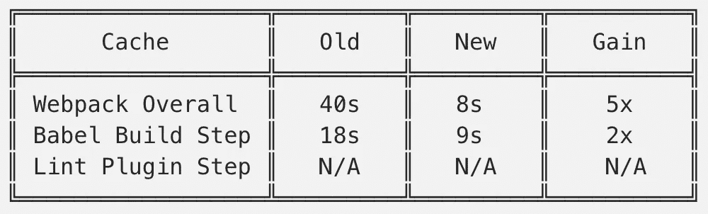
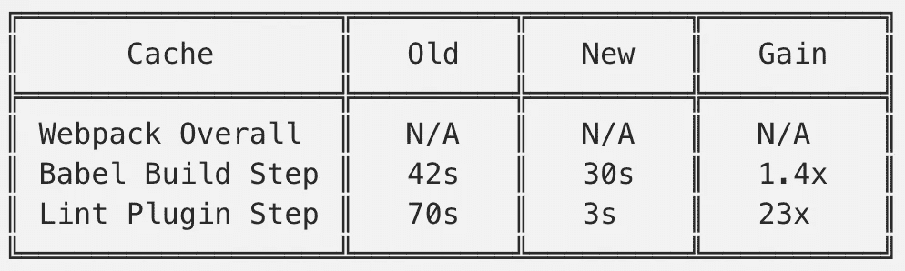

# 如何提高网络包的性能

> 原文：<https://javascript.plainenglish.io/how-to-improve-webpack-performance-7637db26fa5f?source=collection_archive---------2----------------------->

## 通过缓存加快慢速网络包构建


Photo by [Infralist.com](https://unsplash.com/@infralist?utm_source=medium&utm_medium=referral) on [Unsplash](https://unsplash.com?utm_source=medium&utm_medium=referral)

# 我的旅程

对我来说，Webpack 在历史上一直是一种置之不理的配置。如果有什么东西坏了，我才会去看。但我脑子里一直有一个任务，就是提高它的性能。随着 Webpack 5 的发布，我终于开始研究我的构建系统。

# 我的身材

我的 Webpack 配置非常典型——除了 Lint 插件和用于开发构建的 Webpack Dev Server 之外，它还使用了相当标准的加载器和插件进行反应。生产构建需要大约 40 秒来完成，开发构建需要大约 150 秒。我可以采取哪些措施来改善这种情况？

# 贮藏

Webpack 和相关工具支持缓存。构建过程各个阶段的输出将被保存，以便在后续构建中重用，从而减少或消除处理时间。使用 Webpack、Babel 和 Lint 缓存的组合，我能够将构建时间减少 20 倍！

# Webpack 缓存

Webpack 5 引入了持久文件系统缓存。

```
// webpack.config.jsmodule.exports = {
  cache: {
    type: 'filesystem',
  },
};
```

现在，Webpack 可以使用以前版本中的信息，并跳过不必要的步骤！默认情况下，构建缓存在`node_modules/.cache/webpack`中，但这可以使用`cacheDirectory`、`cacheLocation`或`name`缓存选项进行自定义。

在这个简单的添加之后，Webpack 的生产构建只需要 8 秒钟，性能提高了 5 倍！

注意:在本文撰写之时，文件系统缓存并不能完全与 Webpack 开发版本一起工作——即使代码没有更改，它也会导致定期重建。如果这种重建没有发生，Webpack 开发构建也将显示类似的性能提升。

# 巴别塔缓存

在网络包中，`babel-loader`也支持缓存。

```
// webpack.config.jsmodule.exports = {
  module: {
    rules: [
      {
        test: /\.m?js$/,
        exclude: /node_modules/,
        loader: 'babel-loader',
        options: {
          cacheCompression: false,
          cacheDirectory: true,
        },
      },
    ],
  },
}
```

缓存之后，Webpack productions 构建的构建步骤从~18 秒下降到~9 秒，Webpack 开发构建也从~42 秒下降到~30 秒。这对于生产构建来说是 2 倍的性能增益，对于开发构建来说是 1.4 倍的性能增益！

默认情况下，`babel-loader`将缓存数据保存在`node_modules/.cache/babel-loader`中。这可以通过为`cacheDirectory`字段指定字符串目录路径而不是布尔值来定制。

此外，`babel-loader`默认情况下将 gzip 缓存数据。使用`cacheCompression`选项可以关闭该功能，这样可以节省一点解压缩缓存数据的时间。

# Lint 缓存

如果你使用 ESLint 和 Stylelint 插件，它们也有缓存。这些插件占用了大量的处理 Webpack 开发构建时间。在没有缓存的情况下，ESLint 花费了大约 70 秒，主要是因为`prettier/prettier`和`import/no-cycle`规则占据了执行时间的 75%。Stylelint 花费了大约 8 秒钟。

```
// webpack.config.jsmodule.exports = {
  plugins: [
    new ESLintPlugin({ cache: true }),
    new StylelintPlugin({ files: '**/*.css', cache: true }),
  ],
};
```

启用缓存后，两个插件都在大约 3 秒后完成。对于 ESLint 来说，这要快 23 倍！

默认情况下，ESLint 和 Stylelint 缓存分别存储在基目录的`.eslintcache`和`.stylelintcache`中。这可以使用`cacheLocation`选项进行定制。

注意:在命令行中使用 ESLint 和 StyleLint 时，也可以利用缓存。

```
// package.json{
  "scripts": {
    "lint:css": "stylelint '**/*.css' --cache,
    "lint:js": "eslint . --cache,
  },
}
```

# 警告

值得注意的是，这里表示的数字来自相同的构建运行。如果输入完全相同，缓存可以发挥作用，显著提高构建性能。但这并不代表现实生活中的情况，在现实生活中，代码是不断变化的，我们开发功能和修复错误。然而，缓存仍然有帮助，因为大多数时候。大多数更改是增量式的，因此只有一小部分缓存是无效的。没有的部分仍然可以显著提高构建速度。

# 摘要



Webpack Production Build Caching Performance Results



Webpack Development Build Cache Performance Results

# 最后的想法

这三个缓存步骤大大缩短了我的 Webpack 构建时间。仅仅是对配置的小调整就让开发人员的体验发生了巨大的变化。我和我的团队能够更快、更有效地开发。现在，我可以继续忽略 Webpack。

# 资源

*   [官方 Webpack 文档](https://webpack.js.org/)
*   [巴别塔官方文档](https://webpack.js.org/loaders/babel-loader/)
*   [官方 ESLint 文档](https://eslint.org/)
*   [官方 Stylelint 文档](https://stylelint.io/)