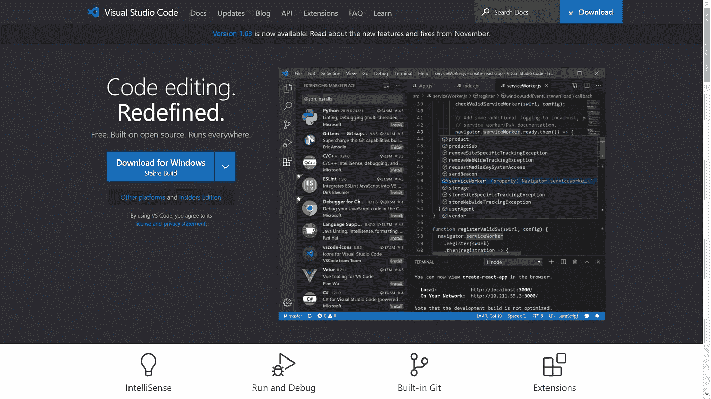
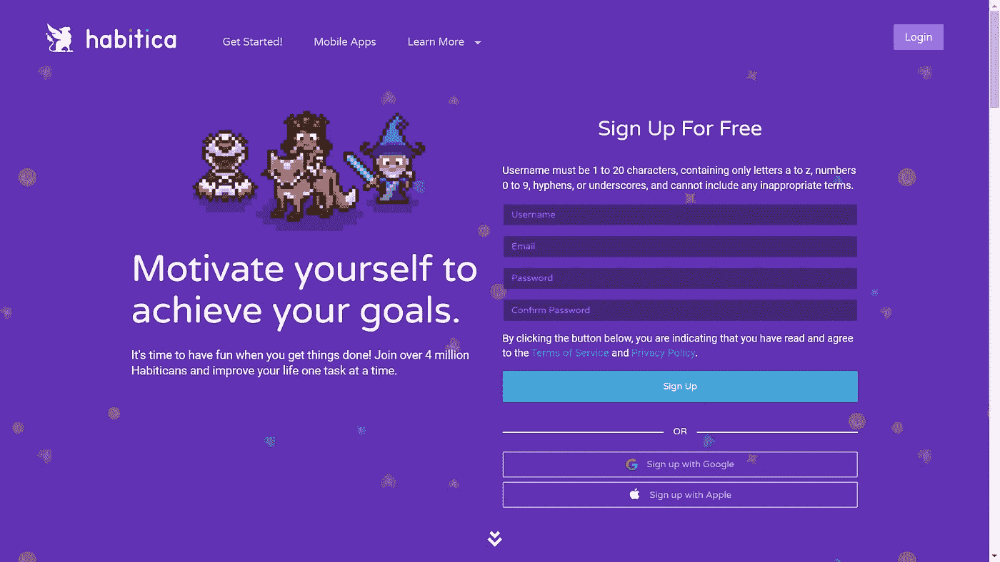
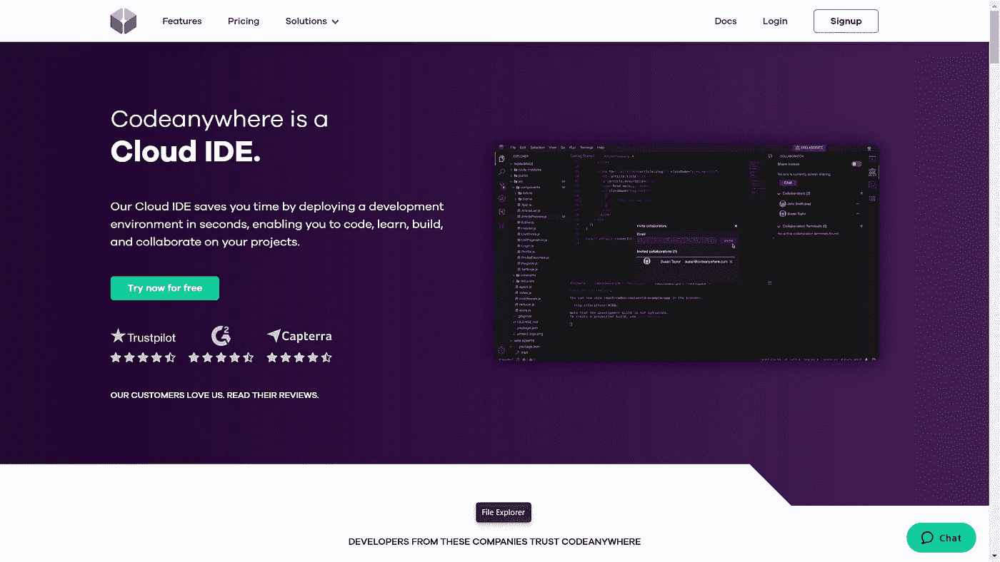

# 如何提高开发人员的工作效率以及相关工具

> 原文：<https://javascript.plainenglish.io/how-to-improve-your-productivity-as-a-developer-and-some-tools-for-it-7aabfba536bc?source=collection_archive---------2----------------------->

如果你正在努力提高开发人员的生产力，你和你的团队可以使用一些策略。下面是一些开始。

## 最大限度地减少分心，做更多的工作

虽然很明显，这可能很难实现。永久通知、开放的工作场所和有限的关注都会导致生产力下降。同样，避免尝试做太多。如果你试图一次做太多的任务，完成所有的任务会花费太长的时间，而且你更有可能犯错误。

## 配置您的集成开发环境(IDE)

定制您的工具，以提高开发人员的生产力，而不损害它。许多 ide 都带有自动完成、突出显示和分析实时代码的特性。使用这些特性来帮助您快速地计划和生成高质量的代码，并实时地从错误中学习。

您还应该考虑对常见任务或代码块使用标题。标题允许您快速添加代码，无需重命名控制盘。

## 清楚地解释项目的细节

详细的信息减少了团队成员之间的紧张，使您能够快速开始工作。清晰的规范也有助于确保测试的有效性和高效性。

## 删除不必要的测试

在今天的老团队中，工程师负责测试，通常将 50%或更多的时间花在维修相关的工作上。提高工程师工作效率的一个重要方法就是回顾和改进这项维修工作。工程师会把时间花在最重要的测试上吗？有人创建无用的测试或与现有测试重叠吗？团队是否保留不再真正需要的测试？回答这些问题可以节省开发人员宝贵的时间。

# 开发人员的生产力工具

首先，也是非常明显的一点，

## **VS 代码(Visual Studio 代码)**

VS Code 是一个文本编辑器，可以用于代码、标记和文档。它包括多项选择、定义索引、拆分编辑和自定义功能。您可以通过自定义扩展来扩展 VS 代码&有很多这样的扩展，每种语言至少有一个。

## **Habitica**

Habitica 是一个生产力工具，你可以用它来游戏化习惯的创造。它的设置就像一个老派的角色扮演游戏，包括你可以升级的角色，并通过完成任务或目标获得经验。Habitica 支持每日、每周和长期的习惯、目标和项目列表。您可以通过网络浏览器或移动应用程序使用它。

## ProofHub

ProofHub 是一个可以用来管理待办事项列表和项目协作的工具。它包括看板、自定义工作流、报告、项目管理、任务和自定义角色的功能。您可以使用 ProofHub 来共享和校对文档、主持在线讨论和记录工作。ProofHub 是一款软件即服务产品，您可以通过浏览器或移动应用程序访问。

## Codeanywhere

Codeanywhere 是您可以使用的另一个代码编辑工具。然而，与 Sublime Text 不同，该工具旨在支持您的代码库上的实时协作。它包括定制布局和颜色、林挺、代码完成、变更比较、预构建容器环境和终端控制台等功能。

Codeanywhere 支持 75 种语言，包括 Python、Ruby、JS 和 C++。你可以将它与各种工具集成，包括 GitHub 和 Dropbox。你可以在网上或通过手机应用程序使用 Codeanywhere。

## 好了，就这些了，谢谢大家的配合！

*更多内容看* [*说白了. io*](http://plainenglish.io/) *。报名参加我们的* [*免费每周简讯*](http://newsletter.plainenglish.io/) *。在我们的* [*社区*](https://discord.gg/GtDtUAvyhW) *获得独家写作机会和建议。*