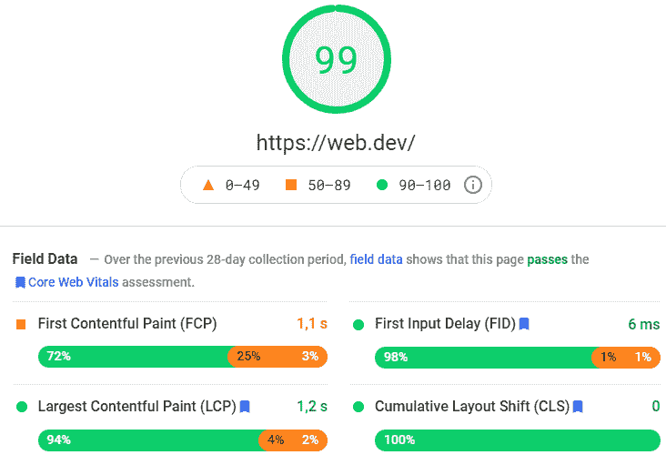
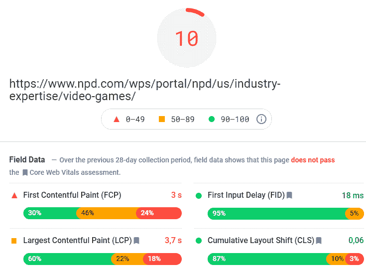
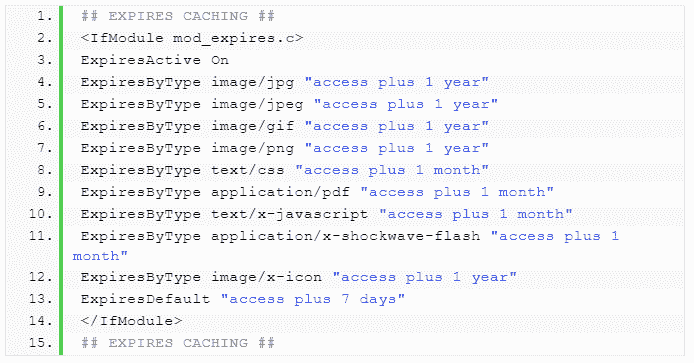

# 如何提高网站的页面加载速度

> 原文：<https://javascript.plainenglish.io/how-to-improve-your-websites-page-load-speed-7394bea11ac2?source=collection_archive---------4----------------------->

如果你曾经经历过一个加载缓慢的网站，你就会明白页面速度会如何影响用户体验。没有人想等 10 秒钟甚至更长时间来获取他们想要的信息。

**快速加载的页面具有更好的用户保留率和更低的反弹率，并且更快赢得用户的信任。**

不管你的设计或内容有多强大，如果你的网站表现不佳，用户不会在你的网站上投资任何时间。

事实上，[一项研究](https://www.websitebuilderexpert.com/building-websites/website-load-time-statistics/)发现，延迟一秒钟的电子商务网站将经历“页面浏览量减少 11%，客户满意度下降 16%，转化率减少 7%”。

此外，页面速度也正在成为[核心网络生命体征](https://www.searchenginejournal.com/google-core-web-vitals-ranking-signals/387142/)形式的排名因素。

因为用户体验非常重要，谷歌正在积极跟踪负载速度指标，如大容量涂料(LCP)、首次输入延迟(FID)和累积布局偏移(CLS)。必须在这三个因素上取得好成绩。您可以通过谷歌搜索控制台中的[核心网络生命体征报告来衡量您的网站的表现。](https://support.google.com/webmasters/answer/9205520?hl=en)

# 3 种测量页面速度的工具

不首先了解你的表现，你就不能优化你的网站速度。有三种简单的工具可以使用:

# 1.[谷歌搜索控制台](https://search.google.com/search-console/about)

虽然它在技术上并不衡量站点速度，但是您可以使用新的核心 web 生命周期报告来查找您需要处理的负载问题。谷歌搜索控制台将对你的整个网站进行评分，并为你提供一个需要优化的网址列表。

# 2.[页面速度洞察](https://developers.google.com/speed/pagespeed/insights/)

由谷歌开发的 PageSpeed Insights 是一款能够识别潜在负载速度问题的站点速度测试工具。这很简单，只需输入您要检查的 URL，该工具就会对您的站点进行爬网并创建一份完整的报告。

该工具将生成桌面和移动评分以及一些优化页面的建议。我们的目标是:

我们需要避免的是:

# 3. [GTmetrix](https://gtmetrix.com/)

如果你想要更先进的功能，或者你想在特定的位置测试你的页面速度，GTmetrix 是一个有用的工具。

它将从不同的位置测试您网站的页面加载速度，以便您可以专注于在您的目标地理区域内提高您网站的用户体验。让这个工具如此有用的是高级设置。您可以设置位置、设备、屏幕分辨率等，以收集更准确的信息来采取行动。

# 提高网站页面加载速度的 8 个步骤

了解了基本知识之后，让我们来探索八种提高网站加载速度的方法:

# 1.优化您的图像

当谈到针对网站速度的[图像优化](http://www.canirank.com/blog/optimize-images-web-better-seo/)时，我们指的是三件事:

# 图像文件大小

图像是添加上下文、解释复杂主题或在内容块之间提供喘息空间的好方法。然而，沉重的图像会减慢你的网页。

你应该以尽可能小的文件为目标。**对于大图像来说，一个好的标记是每个图像 150kb 到 500kb】。毕竟，您可能会有几个图像，它们都会影响页面的整体大小。**

如果你需要压缩它们， [TinyPNG](https://tinypng.com/) 是一个很棒的免费工具，你可以开始使用。只需从您的服务器下载图像，压缩它们，然后重新加载。

**提示:**利用这个机会优化它们的名称、alt 属性和格式。

# 文件格式

创建内容时使用 PNG 图像并不少见。毕竟，它们更容易处理。

问题？这些是导致加载速度缓慢的大型图像类型。不要陷入关于图像扩展的争论，我们推荐使用 jpg。这些已经成为网络上图像的标准格式。它们不会降低质量，而且文件很小。

**注:**备受关注的一个半新业态是 WebPs。这种格式非常轻，比 jpg 轻 33%。缺点是这种格式与一些浏览器仍然存在兼容性问题。

# 图像尺寸

是的。你的图像分辨率很重要。然而，除非它能覆盖用户的所有屏幕空间，否则你并不真的需要 4000 x 4000 的图像。

请确保上传一个体面的图像，在缩放时不会失去质量。即 800 x 1200 的图像在文章上是最常见的。

此外，您必须在图像标签中声明图像的尺寸。浏览器会在图像加载前计算它需要为图像“保存”的空间，减少页面的 CLS(累积布局偏移)。

您可以添加宽度和高度属性。例如:

**T16！—设置 640:360，即 16:9 的宽高比→**

``

这里有一个关于 [CLS 优化](https://web.dev/optimize-cls/)的综合指南，你可以从 web.dev 团队那里得到。

# 2.缩小你的 CSS 和 JavaScript

缩小你的 CSS 和 JavaScript 文件意味着减少浏览器加载显示你的网站所需的每个元素的时间。

因为机器对风格选择不敏感，所以我们可以通过删除空格、删除注释、使用较短的名称，以及基本上去掉机器运行时不需要的任何代码部分来创建更小的文件。

当然，你不希望缩小你正在工作的实际代码，因为它将变得几乎无法阅读。

你想创建一个缩小版的文件，并在你的项目中实现它们。为此，我们推荐两个简单的工具:

*   [https://cssminifier.com/](https://cssminifier.com/)
*   [https://javascript-minifier.com/](https://javascript-minifier.com/)

这些都是简单的工具，只需要你在“输入”框中添加代码，然后点击 minify 将你的代码转换成一个可以复制并粘贴到你的项目中的缩小版本。

**提示:**除了缩小你的文件，你还可以[启用 Gzip 压缩](https://gtmetrix.com/enable-text-compression.html#how-to-enable-text-compression)来进一步减小你的文件大小。

# 3.当心第三方脚本

如果你正在使用像谷歌分析这样的工具，你已经在使用第三方脚本了。

这些脚本对于给你的站点添加新功能非常有帮助。然而，它们仍然是需要在客户端渲染或读取的代码片段，从而影响页面速度和加载时间。确保您添加的代码是优化的和必要的。删除任何不用的东西。

# 4.使用 VPS 托管服务

你的主机提供商使用的服务器对你的网站速度至关重要。如果机器对用户请求的响应很慢，那么无论用户的互联网连接速度有多快，浏览器接收信息的速度都会很慢。

另一个因素是你正在使用的计划。通常，共享计划是便宜的，因为主机提供商为几个客户端租用相同的服务器，这对于低流量的网站来说绰绰有余。

然而，如果你真的需要提高你的网站速度，你将需要从你的服务器访问更多的资源。更重要的是，你需要你的站点可以访问的资源数量的一致性。

首先想到的是专用服务器。你基本上是为自己租了一整台服务器。但是这可能很贵，而且对于大多数用例来说，这远远超出了您的需求。

那么最好的选择是什么呢？一个 [VPS 托管服务](https://www.hostinger.com/tutorials/what-is-vps-hosting)。

虚拟专用服务器就像它听起来的那样。实质上，托管提供商在服务器的操作系统上创建了一个层，让您可以完全控制虚拟机的资源，并将其与其他用户分开。这可以防止其他站点占用您的资源，并允许您根据自己的需要定制服务器。

# 5.使用内容交付网络(CDN)

正如我们上面指出的，你的主机只不过是一台存储你的网站数据的机器，一旦浏览器发出请求，它就通过互联网发送出去。

这对你网站的速度来说意味着你的主机离用户越远，数据传输需要的时间就越长。这就是 CDN 或内容交付网络发挥作用的地方。

简单来说，[CDN 是一个遍布全球的服务器网络，它将你的站点资产](https://www.cloudflare.com/learning/cdn/what-is-a-cdn/)(比如图片、HTML 文件、JSON 文件等等)从最近的服务器交付给你的最终用户。

你会在那里找到几个选项，但如果你赶时间，我们建议你探索 [Cloudflare](https://www.cloudflare.com/cdn/) 。

如果你没有使用内容交付网络，这可能是你能得到的最快的胜利。

# 6.推迟 JavaScript 加载

当您的网站加载时，浏览器会下载网站需要的所有资源，包括 JavaScript 文件。

然而，你的主要焦点需要是为你的用户提供他们想在页面上看到的信息。这就是为什么推迟你的 JavaScript 对[缩短页面加载时间](https://prerender.io/better-response-times/)如此有用。

简而言之，推迟一个文件可以防止它在加载其他(更重要的)元素之前被加载。您可以先加载 HTML 和 CSS，这样用户可以更快地访问内容，只有这样脚本才会加载，以便为您的页面添加额外的功能。

你可以通过使用*延迟*属性来实现。这里有一个关于如何使用 *defer* 有效加载 JavaScript 的深度指南。

**提示:**另一种有效加载 JavaScript 的方法是在关闭 body 标签之前添加脚本。这将使浏览器在获取和执行您的脚本之前解析整个站点。

# 7.启用浏览器缓存

每次用户访问您的网站时，浏览器都需要下载构成您页面的所有文件。如果您可以让浏览器存储数据，以便下次用户键入您的 URL 时，浏览器已经拥有显示其内容所需的所有信息，该怎么办？

为此，您需要[从您的。通过为您的资产设置有效期来访问文件](https://www.hostinger.com/tutorials/website/improving-website-performance-leveraging-browser-cache#Leveraging_Browser_Cache_Using_htaccess)。

Image from [Hostinger](https://www.hostinger.com/)

这将告诉浏览器保留这些文件，直到设定的时间。

**注:**对于归国用户来说，这是一个提高网站加载速度的好方法。

# 8.使用惰性加载

现在，让我们减少首次访客的装载时间，好吗？

我们希望在加载页面的其余部分之前，让浏览器首先呈现页面的顶部(在文件夹内容的上方)。

因此，浏览器将确保用户看到的网站的第一部分立即被加载，而不是等待所有图像和视频被加载以使页面具有交互性。这个过程就是我们所说的惰性加载。

它的伟大之处在于，我们可以在图像和 iframes 中使用*加载*属性来实现它。

``

`<iframe src=”content.html” loading=”lazy”></iframe>`

这些属性将告诉浏览器，只有当用户滚动到元素并且它现在在视口中可见时，才下载元素。

如果你想了解更多，这里有另外五种由 Sitepoint 团队实现惰性加载的方式[。](https://www.sitepoint.com/five-techniques-lazy-load-images-website-performance/)

# 结论

当然，这些不是提高网站性能的唯一方法。

事实上，还有其他方法，比如使用[预取技术](https://soorajchandran.medium.com/speeding-up-your-website-using-prefetching-techniques-8077058b7418)告诉浏览器提前获取一些元素。然而，经过这八个步骤后，你的网站的页面速度应该超过最佳速度。

虽然网站速度对降低反弹率和提高用户保留率至关重要，但例如，在 PageSpeed Insights 达到 85–90 后，您将不会看到任何显著的好处。在对您的网站进行基准测试时，请记住这一点，并明智地投资您的资源。

我希望你已经发现这很有用。如果您有，或者觉得还有其他方法需要我们讨论，请一定在评论中告诉我们。

**关于作者**

Zoltan·贝滕布克是 Prerender T1 的首席技术官，这是一款软件工具，可以让搜索引擎更好地抓取和索引 Javascript 网站。他还是 [Scraper API](https://www.scraperapi.com/) 的首席技术官，该公司允许开发者通过简单的 API 调用从网页中收集数据。