# 如何在 React 应用中加入 Spotify 授权

> 原文：<https://javascript.plainenglish.io/how-to-include-spotify-authorization-in-your-react-app-577b63138fd7?source=collection_archive---------2----------------------->

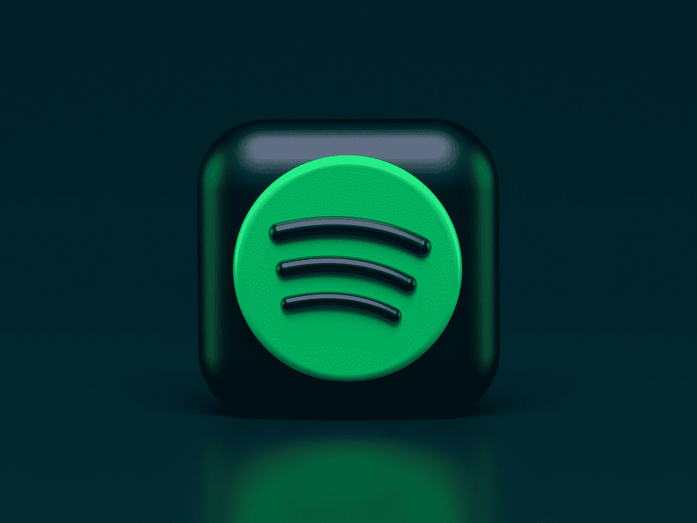

Photo by [Alexander Shatov](https://unsplash.com/@alexbemore?utm_source=medium&utm_medium=referral) on [Unsplash](https://unsplash.com?utm_source=medium&utm_medium=referral)

因此，你需要来自 Spotify 的数据，无论是来自特定用户的数据还是 Spotify 获得的播放列表。在你做这些之前，你必须去[https://developer.spotify.com/](https://developer.spotify.com/)注册成为你的应用程序的用户。

在我们的例子中，我们只是要有一个到 Spotify 的给定认证过程的链接，它将只是重定向回你给的任何链接。设置中的该选项如下所示:

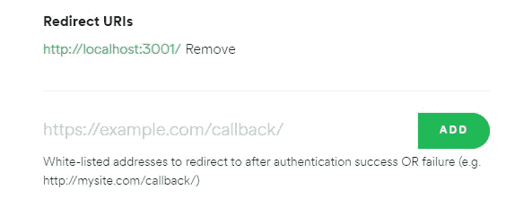

Found in “Edit Settings”

您想要添加的重定向 URI 将是您想要在用户登录后转到的 URI。在这种情况下，它是前端所在的位置，但是在部署之后，它将是您选择的任何域。

在那里，您应该看到一个客户端 ID 和一个显示您的客户端密码的选项。现在记下它们在哪里，你以后会需要它们的。

现在，回到我们的应用程序，我们可以添加一个按钮/链接，将我们带到 Spotify 的端点。对我们来说，它只是 https://accounts.spotify.com/authorize 的 T2。我将这个链接放在我的项目中一个名为 spotify.js 的文件中。

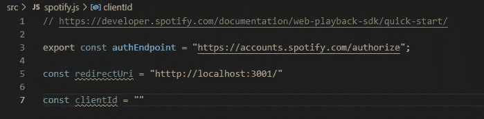

src/spotify.js

接下来我们需要一个范围列表。

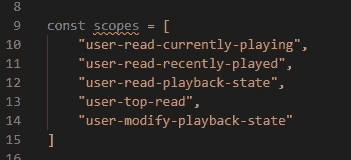

这基本上告诉我们的应用程序用户可以通过 Spotify API 做什么。因此，如果我们不包含删除功能，用户将无法删除任何内容。[这是可用的示波器列表。](https://developer.spotify.com/documentation/general/guides/scopes/)

现在，有了我们所有的部分，我们可以构造当用户按下登录按钮时我们想要发送给他们的 URL。

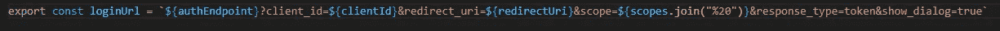

或者

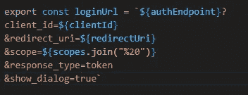

它从 authEndpoint 开始，在问号之后添加所有必要的信息，在&符号之后的所有内容都是另一个新的部分。

好了，现在如果我们把这个加到一个标签上，

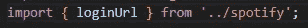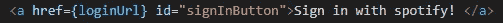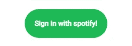

如果我们点击我设计的看起来像按钮的标签，它会把我们带到一个看起来像这样的登录页面:

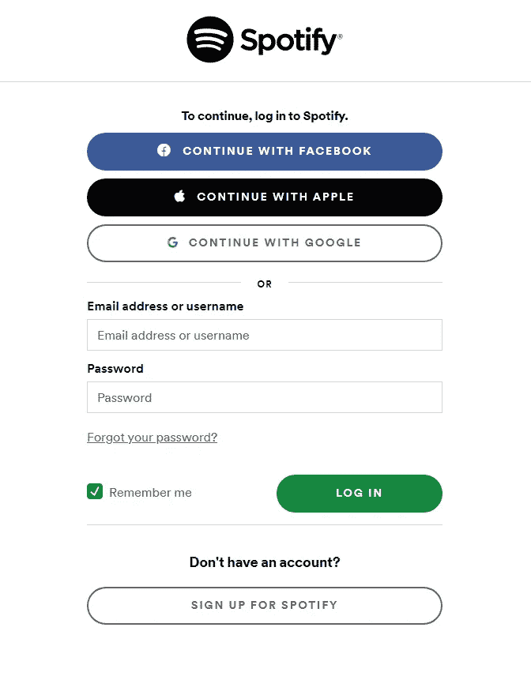

或者，如果您已经从另一个选项卡登录:

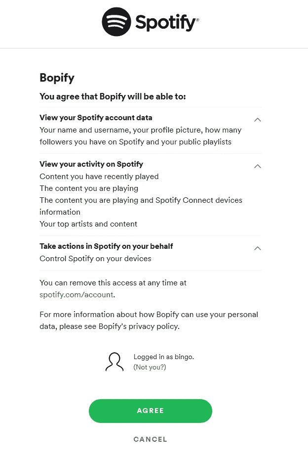

bingo was made for this demonstration btw

好的，很好，那么当有人登录时，具体是做什么的？

当我们返回到我们的重定向 URL 时，我们应该看到一个长字符串，其中包含我们的 accessToken，即“access token = whateveryouraccesstokenis”。

为了从我们得到的 URL 中提取数据，我们可以使用这个函数:

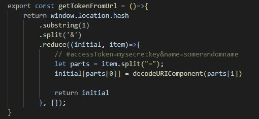

[window.location.hash,](https://developer.mozilla.org/en-US/docs/Web/API/Location/hash) [substring](https://developer.mozilla.org/en-US/docs/Web/JavaScript/Reference/Global_Objects/String/substring), [split](https://developer.mozilla.org/en-US/docs/Web/JavaScript/Reference/Global_Objects/String/split), [reduce](https://developer.mozilla.org/en-US/docs/Web/JavaScript/Reference/Global_Objects/Array/Reduce), and [decodeURIComponent](https://developer.mozilla.org/en-US/docs/Web/JavaScript/Reference/Global_Objects/decodeURIComponent)

这个函数的返回值将是一个填充了从我们登录后他们返回给我们的 URL 中提取的数据的对象。

要实际使用来自对象的数据从 Spotify 获取东西，首先，我们必须:

```
npm install spotify-web-api-js
```

这是用于 React 的 Spotify [包装器](https://github.com/JMPerez/spotify-web-api-js)。这使我们能够在给定正确令牌的情况下轻松地与 Spotify 的数据进行交互。

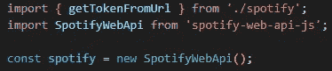

in App.js

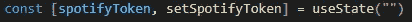

因此，为了实际展示我们可以使用用户信息从 Spotify 获得一些东西，我们可以将控制台日志放在 useEffect 挂钩中:

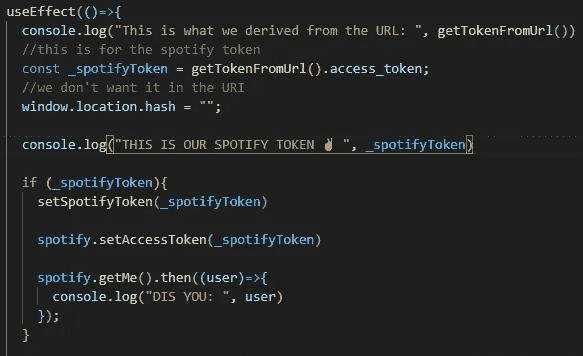

登录后，在我们的浏览器控制台中，我们可以看到:

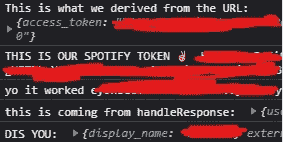

为了检查登录的是否真的是您，您可以检查 images 属性，看看发回的是否真的是您的个人资料图片。

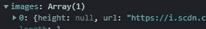

perfect

spotify-web-api-js 包中还包含其他东西，有助于与 spotify 的交互更加顺畅。

*更多内容看*[***plain English . io***](http://plainenglish.io/)