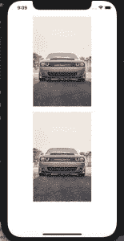
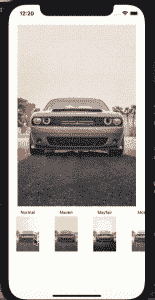

# 如何在 React Native 中实现 Instagram 照片滤镜

> 原文：<https://javascript.plainenglish.io/how-to-instagram-photo-filters-in-react-native-e3681fa634ee?source=collection_archive---------15----------------------->


Instagram 在过去几年中一直在疯狂增长，推动这一增长的关键功能之一是著名的照片过滤器。Instagram 允许用户对照片应用各种滤镜，让照片看起来更好看，从而创造了一款令人惊叹的产品。如今，任何现代照片应用程序都必须支持照片过滤器。因此，我们将了解如何在 React Native 中实现 Instagram 照片滤镜。

在今天的文章中，我们将讨论如何实现 Instagram 照片过滤器。我们将使用[**react-native-image-filter-kit**](https://github.com/iyegoroff/react-native-image-filter-kit)包**。**在 Instamobile，我们使用这个库将照片滤镜功能无缝构建到我们的 [Instagram 克隆](https://www.instamobile.io/app-templates/instagram-clone-app/)中。

## 在 React Native 中实现 Instagram 照片滤镜

首先，让我们将前面提到的包安装到 React 本地项目中，运行:

```
npm install -s react-native-image-filter-kit
```

这里有一个简单的 React Native 项目，它将 Instagram 照片滤镜应用于代码库中包含的一个图像(图像名称为“parrot.png”，因此请确保您将它包含在您的项目文件夹中，以便它可以加载到应用程序中)。在 **App.js** 文件中，只需放置以下代码片段:

```
import React from 'react';
import {Image, SafeAreaView} from 'react-native';
import {Emboss} from 'react-native-image-filter-kit';

const App = () => (
  <>
    <SafeAreaView />
    <Image
      style={styles.image}
      source={require('./parrot.png')}
      resizeMode={'contain'}
    />
    <Emboss
      image={
        <Image
          style={styles.image}
          source={require('./parrot.png')}
          resizeMode={'contain'}
        />
      }
    />
  </>
);

const styles = {
  image: {
    width: 320,
    height: 320,
    marginVertical: 10,
    alignSelf: 'center',
  },
};
```

由`react-native-filter-kit`提供的`Emboss`组件以一个`Image`组件作为道具，并应用过滤器，如下图所示:



库`react-native-image-filter-kit`提供了大量其他过滤器组件，因此我们将找到一种方法来实现一个更全面的过滤器，就像 Instagram 应用程序本身一样。

首先，我们需要定义一个过滤器组件数组，我们要渲染并从中进行选择:

```
import {
  AdenCompat,
  _1977Compat,
  BrannanCompat,
  BrooklynCompat,
  ClarendonCompat,
  EarlybirdCompat,
  GinghamCompat,
  HudsonCompat,
  InkwellCompat,
  KelvinCompat,
  LarkCompat,
  LofiCompat,
  MavenCompat,
  MayfairCompat,
  MoonCompat,
  NashvilleCompat,
  PerpetuaCompat,
  ReyesCompat,
  RiseCompat,
  SlumberCompat,
  StinsonCompat,
  ToasterCompat,
  ValenciaCompat,
  WaldenCompat,
  WillowCompat,
  Xpro2Compat,
} from 'react-native-image-filter-kit'; 

const FILTERS = [
  {
    title: 'Normal',
    filterComponent: AdenCompat,
  },
  {
    title: 'Maven',
    filterComponent: MavenCompat,
  },
  {
    title: 'Mayfair',
    filterComponent: MayfairCompat,
  },
  {
    title: 'Moon',
    filterComponent: MoonCompat,
  },
  {
    title: 'Nashville',
    filterComponent: NashvilleCompat,
  },
  {
    title: 'Perpetua',
    filterComponent: PerpetuaCompat,
  },
  {
    title: 'Reyes',
    filterComponent: ReyesCompat,
  },
  {
    title: 'Rise',
    filterComponent: RiseCompat,
  },
  {
    title: 'Slumber',
    filterComponent: SlumberCompat,
  },
  {
    title: 'Stinson',
    filterComponent: StinsonCompat,
  },
  {
    title: 'Brooklyn',
    filterComponent: BrooklynCompat,
  },
  {
    title: 'Earlybird',
    filterComponent: EarlybirdCompat,
  },
  {
    title: 'Clarendon',
    filterComponent: ClarendonCompat,
  },
  {
    title: 'Gingham',
    filterComponent: GinghamCompat,
  },
  {
    title: 'Hudson',
    filterComponent: HudsonCompat,
  },
  {
    title: 'Inkwell',
    filterComponent: InkwellCompat,
  },
  {
    title: 'Kelvin',
    filterComponent: KelvinCompat,
  },
  {
    title: 'Lark',
    filterComponent: LarkCompat,
  },
  {
    title: 'Lofi',
    filterComponent: LofiCompat,
  },
  {
    title: 'Toaster',
    filterComponent: ToasterCompat,
  },
  {
    title: 'Valencia',
    filterComponent: ValenciaCompat,
  },
  {
    title: 'Walden',
    filterComponent: WaldenCompat,
  },
  {
    title: 'Willow',
    filterComponent: WillowCompat,
  },
  {
    title: 'Xpro2',
    filterComponent: Xpro2Compat,
  },
  {
    title: 'Aden',
    filterComponent: AdenCompat,
  },
  {
    title: '_1977',
    filterComponent: _1977Compat,
  },
  {
    title: 'Brannan',
    filterComponent: BrannanCompat,
  },
];
```

接下来，我们必须在底部呈现过滤器的水平列表，并在选择过滤器时动态地将过滤器图像更改为中心图像。您的 **App.js** 文件将变成:

```
import React, {useRef, useState} from 'react';
import {
  FlatList,
  Image,
  SafeAreaView,
  StyleSheet,
  Text,
  TouchableOpacity,
} from 'react-native';

const App = () => {
  const extractedUri = useRef('https://www.hyundai.com/content/hyundai/ww/data/news/data/2021/0000016609/image/newsroom-0112-photo-1-2021elantranline-1120x745.jpg');
  const [selectedFilterIndex, setIndex] = useState(0);

  const onExtractImage = ({nativeEvent}) => {
    extractedUri.current = nativeEvent.uri;
  };

  const onSelectFilter = selectedIndex => {
    setIndex(selectedIndex);
  };

  const renderFilterComponent = ({item, index}) => {
    const FilterComponent = item.filterComponent;
    const image = (
      <Image
        style={styles.filterSelector}
        source={require('./car.jpg')}
        resizeMode={'contain'}
      />
    );

    return (
      <TouchableOpacity onPress={() => onSelectFilter(index)}>
        <Text style={styles.filterTitle}>{item.title}</Text>
        <FilterComponent image={image} />
      </TouchableOpacity>
    );
  };

  const SelectedFilterComponent = FILTERS[selectedFilterIndex].filterComponent;

  return (
    <>
      <SafeAreaView />
      {selectedFilterIndex === 0 ? (
        <Image
          style={styles.image}
          source={require('./car.jpg')}
          resizeMode={'contain'}
        />
      ) : (
        <SelectedFilterComponent
          onExtractImage={onExtractImage}
          extractImageEnabled={true}
          image={
            <Image
              style={styles.image}
              source={require('./car.jpg')}
              resizeMode={'contain'}
            />
          }
        />
      )}

      <FlatList
        data={FILTERS}
        keyExtractor={item => item.title}
        horizontal={true}
        renderItem={renderFilterComponent}
      />
    </>
  );
};

const styles = StyleSheet.create({
  image: {
    width: 520,
    height: 520,
    marginVertical: 10,
    alignSelf: 'center',
  },
  filterSelector: {
    width: 100,
    height: 100,
    margin: 5,
  },
  filterTitle: {
    fontSize: 12,
    textAlign: 'center',
  },
});
```

这个源代码将生成一个简单的 React Native 应用程序，它支持选择各种 Instagram 照片过滤器，就像真正的 Instagram 照片编辑器一样:



选择后，在变量`extractedUri` ref 上选择过滤器后，处理程序方法`onExtractImage`保存提取图像的 URL，您可以将过滤器保存在您的服务器上。

## 结论

既然我们已经学会了如何实现 Instagram 过滤器，您应该看看我们的 [Instagram 克隆模板](https://www.instamobile.io/app-templates/instagram-clone-app/)，这是一个功能齐全的代码库，支持大多数 Instagram 功能，如照片过滤器、短暂的故事和帖子订阅。

*原载于 2021 年 4 月 15 日*[*https://www . insta mobile . io*](https://www.instamobile.io/react-native-tutorials/instagram-photo-filters-react-native/)*。*

*更多内容请看*[*plain English . io*](http://plainenglish.io/)