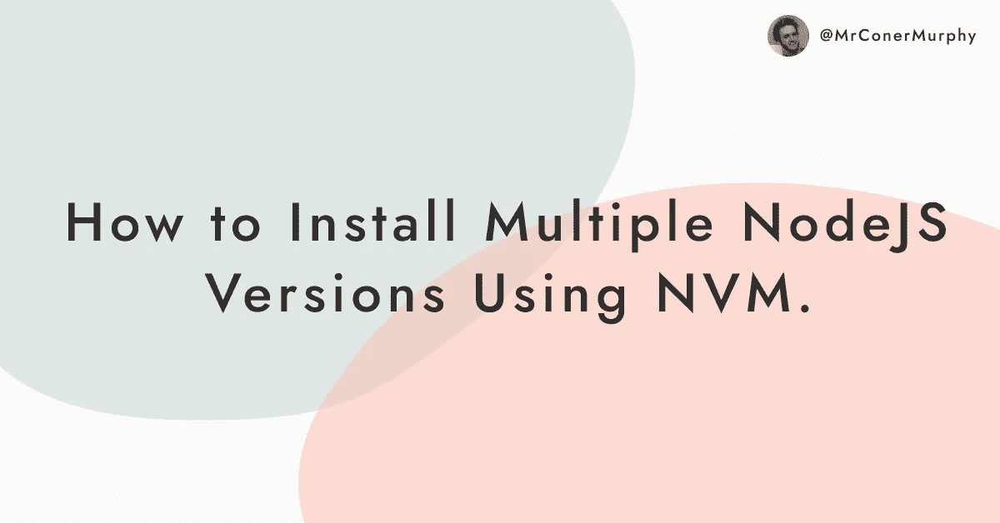

# 如何用 NVM 安装多个 Node.js 版本

> 原文：<https://javascript.plainenglish.io/how-to-install-multiple-node-js-versions-with-nvm-7febfd0bbcdf?source=collection_archive---------23----------------------->



最近，当我更新我的网站时，我也想升级 Node.js 版本。在过去探索过这条道路后，我知道它可能是痛苦的。

因此，我开始了升级 Node.js 的旅程。我发现有多种方法可以解决这个问题。但是，我发现最好的方法是 [NVM 或节点版本管理器。](https://github.com/nvm-sh/nvm)

在这篇文章中，我们将看看如何使用 NVM 来安装多个 Node.js 版本，以及如何在它们之间切换。

# 安装 NVM

要安装 NVM，只需运行作者安装脚本即可，您可以在此处找到[。](https://github.com/nvm-sh/nvm/blob/v0.38.0/install.sh)您可以将它粘贴到您的终端，也可以运行下面的`curl`或`wget`命令来完成:

```
curl -o- https://raw.githubusercontent.com/nvm-sh/nvm/v0.38.0/install.sh | bashwget -qO- https://raw.githubusercontent.com/nvm-sh/nvm/v0.38.0/install.sh | bash
```

运行这个脚本后，您应该会注意到 NVM 存储库已经被复制到一个`~/.nvm`文件夹中。接下来，下面的代码应该添加到您当前的终端配置文件中。

例如，我使用 ZSH 作为位于`~/.zshrc`的终端。安装 NVM 后，我应该会发现下面的代码复制到该文件中。

```
export NVM_DIR="$([ -z "${XDG_CONFIG_HOME-}" ] && printf %s "${HOME}/.nvm" || printf %s "${XDG_CONFIG_HOME}/nvm")"
[ -s "$NVM_DIR/nvm.sh" ] && \. "$NVM_DIR/nvm.sh" # This loads nvm
```

如果一切顺利，NVM 现在应该已经安装好了！

# 使用 NVM

使用 NVM 很简单，让我们来看看您将使用的一些最常见的命令:

## 安装新的 Node.js 版本

要安装新的 Node.js 版本，可以使用以下命令之一。

要获得最新版本，您可以运行:

```
nvm install node # "node" is an alias for the latest version
```

或者，如果您有特定的版本:

```
nvm install 14.8.0 # or 10.10.0, 8.9.1, etc
```

*注意:您安装的第一个版本将成为新 shell 窗口使用的默认版本。*

## 检查已安装的 Node.js 版本

如果您想检查您安装的节点的版本，您可以运行:

```
nvm ls
```

## 检查可以安装哪些 Node.js 版本

如果您有兴趣了解使用 NVM 可以安装哪些版本，您可以运行:

```
nvm ls-remote
```

## 切换 Node.js 版本

要在版本之间切换，您可以使用:

```
nvm use 14.8.0 # or 10.10.0, 8.9.1, etc
```

## 卸载旧的 Node.js 版本

如果要卸载不再需要的节点版本:

```
nvm uninstall 14.8.0 # or 10.10.0, 8.9.1, etc
```

## 解决纷争

如果你像我一样，每次运行这些命令时都遇到错误`nvm: command not found`。或者，如果您有其他问题，可以查看 [NVM GitHub Repo 上的故障排除部分。](https://github.com/nvm-sh/nvm#additional-notes)

不幸的是，我的问题不在故障诊断部分，所以我必须做一些调查。我是这样解决的。

追溯我的步骤后，我发现最初的安装脚本没有将下面的代码添加到我的`~/.zshrc`中。

```
export NVM_DIR="$([ -z "${XDG_CONFIG_HOME-}" ] && printf %s "${HOME}/.nvm" || printf %s "${XDG_CONFIG_HOME}/nvm")"
[ -s "$NVM_DIR/nvm.sh" ] && \. "$NVM_DIR/nvm.sh" # This loads nvm
```

在我打开我的`~/.zshrc`文件并在底部放入那段代码后，NVM 开始工作。如果您遇到`nvm: command not found`错误，请先尝试故障排除指南。如果这没有帮助，请检查它是否安装正确。

如果这些都不起作用，我建议在 GitHub 上开一个问题来寻求支持。

## 结论

就是这样！现在应该已经安装了 NVM，您应该能够安装和使用任意多的 NodeJS 版本。

我希望这篇文章对你有所帮助。如果你这样做了，我会非常感谢你与他人分享它，这样他们也可以找到它的帮助。如果你想看到更多这样的内容，请考虑[在 Twitter 上关注我。](https://twitter.com/MrConerMurphy)

下次见，感谢阅读。😃

【conermurphy.com】本帖最初发表在我的博客上: [*。*](https://conermurphy.com/) *如果你对我发布的帖子感兴趣，请考虑在* [*Twitter 上关注我。*](https://twitter.com/MrConerMurphy)

*更多内容请看*[***plain English . io***](https://plainenglish.io/)