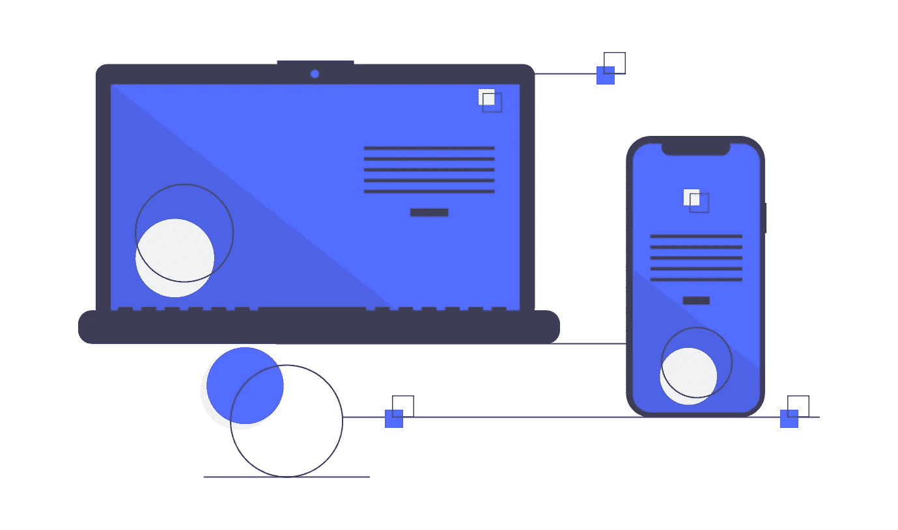
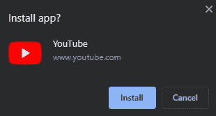
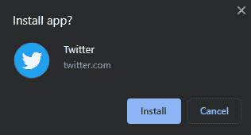

# 如何将 YouTube 安装为渐进式网络应用程序

> 原文：<https://javascript.plainenglish.io/how-to-install-youtube-as-a-progressive-web-app-58ffca89b0ba?source=collection_archive---------12----------------------->

## 你已经可以做到了，而且非常简单

Progressive Web App by Undraw.

最近增加了对[YouTube.com](http://youtube.com/)的渐进式网络应用支持，你现在只需在谷歌浏览器上点击几下就可以安装了。

# 首先，什么是 PWA？

PWA 是我们都知道的 web 应用程序的增强版本，是介于普通 web 应用程序和本机应用程序之间的一种应用程序。

PWA 的主要特征是:

*   高性能，类似于原生应用。
*   离线运行的能力。
*   进入手机的传感器。
*   支持推送通知。
*   手机主屏幕上的图标，类似于原生应用。
*   服务工作线程中的后台处理。

虽然目前，YouTube 的渐进式网络应用程序并不提供这些类型应用程序的所有功能，例如离线使用的可能性，但我认为它标志着在像 [Windows 10X](https://www.windowscentral.com/windows-10x) 这样的操作系统中强调这些功能的重要性。

# 如何安装

只要打开 Chrome 浏览器，进入 https://www.youtube.com/[并查看 Chrome 地址栏。在它的右侧，会出现一个图标，其中一个“+”符号在一个圆圈内，单击它，你就完成了。](https://www.youtube.com/)

Chrome address bar.

Confirmation window.

The Youtube PWA is installed on my desktop.

现在，我们在桌面应用程序启动器中有了一个图标标志，可以快速访问，并在一个没有地址栏和其他 UI 元素的窗口中打开 YouTube，以获得专门的体验。

# 最后的想法

PWA 是谷歌和其他平台绕过 App Store，转而通过浏览器操作的一种方式。此外，它们缩小了本地应用程序和 web 应用程序之间的差距，改善了用户体验。

你可能知道，stadia 在苹果商店里是没有的，但是你可以在 IOS 里安装 stadia 作为 PWA。如果你想把 Stadia 安装成 PWA，就像我们之前对 Youtube 应用程序所做的一样:在 Safari([https://stadia.google.com](https://stadia.google.com/))中打开 Stadia，然后重复这个过程。

我们还有其他可以作为 PWA 安装的 web 服务。例如，Twitter 和 Google Photos 以 pwa 的形式提供。

Confirmation window for installing Twitter as a PWA.

如果你喜欢这篇文章，考虑通过我的[个人资料](https://kesk.medium.com/membership)订阅 Medium。谢谢大家！