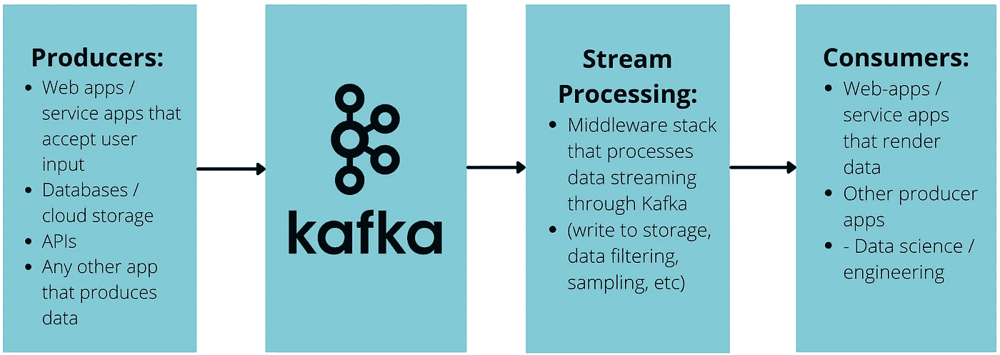

# 如何使用 AtomicKafka 将 Apache Kafka 集成到您的 Web 应用程序中

> 原文：<https://javascript.plainenglish.io/how-to-integrate-apache-kafka-into-your-web-app-using-atomickafka-2eb79b20eaae?source=collection_archive---------8----------------------->

[**AtomicKafka 首页**](http://www.atomickafka.com/) **|** [**库**](https://github.com/oslabs-beta/AtomicKafka) **|** [**演示应用**](https://github.com/AtomicKafka)|[**NPM**](https://www.npmjs.com/package/atomic-kafka)

*AtomicKafka 是一个轻量级的* [*NPM 包*](https://www.npmjs.com/package/atomic-kafka) *开发用于简化在 web 应用程序中使用 Apache Kafka 建立双向、实时数据流的过程。*

**什么是阿帕奇卡夫卡？** Apache Kafka 是一个开源的数据流处理总线，用 Scala 和 Java 编写，经过优化以高性能的方式处理实时数据流。Kafka 平台支持开发高度可扩展的独立微服务应用，这些应用通过 Kafka 集群**产生**、**处理**、**消费**数据。

阿帕奇卡夫卡有很多用例。在支付处理中，使用 Apache Kafka 实时验证和执行在线商家交易。事务数据被生成到集群，由安全微服务处理和使用。然后，银行使用这些数据向客户提供账户监控服务。如果出现可疑活动，将立即进行标记和记录，并在处理数据时向客户发送通知。

**主要概念
消息**是阿帕奇卡夫卡中的主要有效载荷。当向 Kafka 集群产生消息时，该消息被记录到数据流中，并在被消费之前被处理。消息包含一个键-值对(业务数据可以以任何格式存储，包括 JSON、XML、CSV 等)、一个时间戳和经常用于路由的可选元数据头。

**生产者**是向 Kafka 发送消息的微服务应用，**消费者**是订阅发送到 Kafka 集群并通过 Kafka 集群处理的实时数据流的微服务应用。生产者和消费者彼此完全隔离，这意味着他们只通过经纪人与 Kafka 集群进行交互。假设生产者和消费者各自的**主题**在**分区**上有足够的伸缩性来处理负载，这使得生产者和消费者理论上可以无限伸缩。

Typical Flow of Kafka Messages

消息由队列中的**主题**进行线程化。主题可以从任意数量的生产者接收消息，并向订阅该主题的任意消费者发出消息。当代理传输来自生产者的消息时，消息被记录到数据流中，经过处理，然后按插入顺序发送给订阅主题的所有消费者。消息根据管理员为主题设置的保留期进行存储，并在其生命周期中根据需要随时准备就绪。Apache Kafka 的性能相对于其数据管道的大小保持不变，因此数据可以持久存储而不会对性能产生负面影响。

主题被分成**个分区**，每个分区被分配给它们自己的代理。这实现了可扩展的容错环境。Kafka 主题通过增加分区的数量来扩展，这增加了可以为该主题传输消息的代理的数量，从而增加了主题的负载能力。如果一个分区失败，消息仍然可以通过其他分区传输，因为它们已经存在于日志中。

**AtomicKafka 如何工作** 那么，AtomicKafka 到底是什么，它如何将您的 web 应用程序与 Apache Kafka 集成在一起？在开始之前，让我们先解决 web 开发人员在连接到动态数据集群时面临的一些问题。

Websockets 是 web 开发人员用来将 Kafka 微服务应用程序连接到 Kafka 代理的主要解决方案之一。一个正常工作的 Kafka 客户端-代理堆栈需要在客户端和代理之间建立一个 websocket 连接，该连接总是监听向集群产生的消息。在为浏览器开发时，为了保持性能，必须限制这个连接。

此外，由于每个 Kafka 消费者和生产者微服务是相互隔离的，每个应用程序都需要自己的 websocket 连接到代理。这将不可避免地导致大量重复代码。

让我们看看一个精通技术的企业家如何使用 AtomicKafka。假设你经营一家有足够流量的在线 B2B 消费品商店，这样你的库存就会不断变化。您的许多客户可能是回头客，他们依赖您作为其面向消费者的业务的供应商。您已经有了一个用户友好的店面(可能是使用 React 在 TypeScript 中构建的)和某种保存目录和库存信息的数据库。你如何改善体验，让顾客随时看到你的库存？

轻松点。AtomicKafka 抽象掉了所有繁重的工作。你所需要的只是 Apache Kafka 的一个运行实例——要么是一个 [Docker](https://github.com/AtomicKafka/atomicKafkaConsumer/blob/main/docker-compose.yml) 映像，要么是一个通过[融合云](https://www.confluent.io/confluent-cloud/)的云解决方案。配置您的。env 文件来包含 Kafka 引导服务器(以及安全连接通常需要的任何 API 密钥/秘密)，并初始化 AtomicKafka！图书馆会处理剩下的。以下是内置的功能:

*   客户端和服务器之间的 Websocket 连接，接受用户定义的事件字符串和回调
*   代理初始化并连接到 Apache Kafka
*   消费者和生产者类被预定义为尽可能模块化
*   消费者函数接受用户定义的回调函数来支持轻量级流处理
*   React 钩子，它用一个时间间隔来调节 websocket 事件监听器，以维护客户机性能

请随意导航到我们的登录页面或访问我们的 [GitHub](https://github.com/AtomicKafka) ，在那里您可以访问演示上述用例的免费应用程序。

**如何在你的网络应用中实现 AtomicKafka**

**1。**在您的服务器上初始化 AtomicKafkaServer，并使用**组 ID** (仅限消费者)、websocket **事件字符串**和**主题**键在您的服务器上配置消费者和生产者。

**2。**在每个 **producer** 组件上初始化 AtomicKafkaClient，该组件从您的应用程序向 Kafka 集群发送消息。将相应的 web socket**produceMessageEvent 字符串**和 **payload** 传递给生产者，以向您的集群生成消息。**事件字符串**被动态映射到服务器上正确的**主题关键字**。

**3。**初始化每个**消费者**上的 AtomicKafkaClient，他们将订阅您的卡夫卡集群上的一个主题。传入相应的消费者**组 ID** 、websocket **消费者消息事件字符串**、以及**主题**键，并使用内置的 **useInterval 钩子**来限制消费者并保持浏览器性能。

**路线图** 这只是 AtomicKafka 的开始。可以添加很多特性，使 AtomicKafka 成为全栈网络开发人员更健壮的工具。下面的特性包含了我们的长期发展路线图。

*   启用管理代理允许用户访问管理功能，包括对 Kafka-JS 上可用的主题管理服务的更健壮的访问
*   改进对多个流的动态处理
*   添加对消息批处理的本机支持
*   高级流处理支持
*   添加对用 Java 编写的卡夫卡微服务的本地支持

**结论&促成** 感谢您的阅读。我们希望对 AtomicKafka 的介绍会有所帮助。如需了解更多信息，请访问我们的网站。如果您想为 AtomicKafka 做贡献，请[岔开本报道](https://github.com/oslabs-beta/AtomicKafka)。将您的更改提交到一个命名良好的功能分支，然后打开一个请求。我们感谢您对这个开源项目的贡献！

**维护人员**

*   杨薇:[git hub](https://github.com/vickiwyang)/[LinkedIn](https://www.linkedin.com/in/vwyang/)
*   nikhil Massand:[git hub](https://github.com/nikhilmassand)/[LinkedIn](https://www.linkedin.com/in/nikhil-massand/)
*   李宗德:[git hub](https://github.com/amplifygospel)/[LinkedIn](https://www.linkedin.com/in/joseph-lee-a97198213/)
*   David Behmoaras:[git hub](https://github.com/dbehmoaras)/[LinkedIn](https://www.linkedin.com/in/david-behmoaras-6a688057/)

*更内容见于*