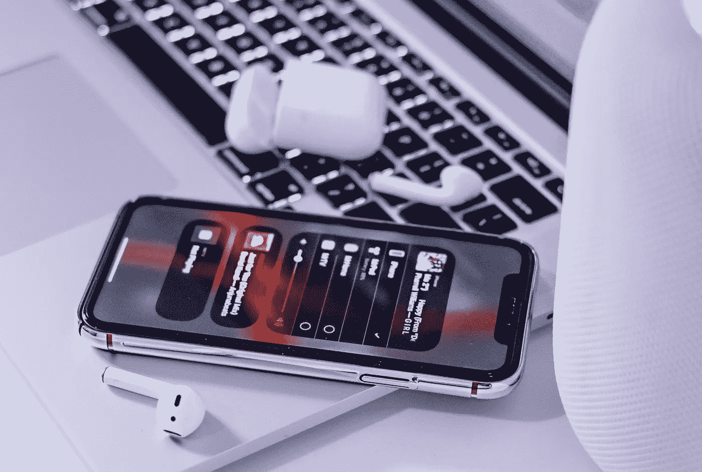

# 如何将 Apple Music 与 JavaScript 整合

> 原文：<https://javascript.plainenglish.io/how-to-integrate-apple-music-with-javascript-9336d6cf95f6?source=collection_archive---------18----------------------->

我们都知道现在音乐流媒体正在蓬勃发展。因为纯粹的方便和易用，用户已经爱上了这种现代的听音乐方式。

但这对 web 开发者来说意味着什么呢？嗯，除非你是 Spotify、苹果、亚马逊或类似的公司，否则你在*【流媒体战争】*中竞争的机会相对较低。但是如果你的目标不同呢？如果你想做一个**音乐播放器**、**附加服务**或类似的东西，而不是流媒体平台本身，那会怎样？既然如此，为什么不让*【大玩家】*帮帮你呢？

在今天的帖子中，我想带你了解一下用苹果的 **MusicKit JS** 将**苹果音乐**集成到你的网络应用程序中的过程。听起来很有趣？

# 为什么选择 Apple Music？

在我们开始之前，我想先回答一个可能的问题:

> 我为什么选择 Apple Music？

你可能已经知道 **Spotify** 是**市场的领导者**。它拥有最大的用户群，同时也拥有最多的付费用户(尽管后者要小得多)。Apple Music 在这两个类别中都落后于 Spotify，排名第二。

因此，如果我们选择基于用户群，我们应该选择 Spotify。然而，还有一些事情你必须记住。那是服务的**公共 API** 。

在这方面，苹果凭借其 **MusicKit** 绝对处于领先地位。它允许你通过易于使用的库直接从你的 iOS、Android 或 web 应用程序集成 Apple Music。

如果你感兴趣，Spotify 确实通过其 [**网络播放 SDK**](https://developer.spotify.com/documentation/web-playback-sdk/) 提供了类似的功能。尽管如此，它目前仍处于测试阶段，支持有限，仅适用于付费用户，并且在用于商业产品之前需要 Spotify 的书面批准。这与苹果的产品相差甚远，但考虑到大多数(如果不是全部)其他流媒体服务根本不提供这样的选择，这仍然是很好的。

# 准备

在开始使用 MusicKit JS 之前，我们必须做一些准备工作。也就是给自己弄个 **Apple Music API 令牌**。

令人惊讶的是，这可能是一个有点令人生畏的任务，尤其是苹果的[相当复杂的文档](https://developer.apple.com/documentation/applemusicapi/getting_keys_and_creating_tokens)。

首先，你需要成为苹果开发者计划****的成员。**这需要精心注册并支付 **100 美元/年**的费用。**

**完成后，我们需要进入 Apple Developer dashboard 并收集一些详细信息:**

1.  **从*成员资格*选项卡中，获取您的**团队 ID** 。**
2.  **接下来，我们需要一个 **MusicKit 标识符**(每个应用一个):**

*   **转到*证书、标识符&配置文件*选项卡。**
*   **在那里，进入*标识符*选项卡。**
*   **点击标题旁边的*“+”*按钮(如果你在团队中，需要*管理员*或*账户持有人*权限才能显示)。**
*   **输入你的应用名称和标识符的“反向域名”名称，点击*“继续”*，然后*“注册”*。**

**3.设置好适当的标识符后，我们现在可以创建一个**私钥**来访问 MusicKit 服务:**

*   **从*证书、标识符&配置文件*，转到*密钥*选项卡(仅对管理员或帐户持有人可见)**
*   **点击*“+”*按钮，输入所需的详细信息，并勾选 *MusicKit 复选框*(如果您有多个 MusicKit 标识符，您需要选择其中一个)**
*   **点击*“确认”*，下载 **.p8 密钥文件**(只能下载一次，注意安全！)**

**4.文件的内容是您的私钥，而文件名应该包含**密钥 ID** 作为文件名的最后十个字符(就在下划线后面)。如果您更改了文件名，密钥 ID 也应该出现在开发人员仪表板中。**

**这里有很多东西，但是我们还没有完成。**

**现在，有了所有的细节，我们终于可以生成访问服务所需的 **JSON Web 令牌** (JWT)。**

**为此，我们将使用一些 JS。 **NodeJS** 具体为 [jsonwebtoken 模块](https://www.npmjs.com/package/jsonwebtoken)，代码如下:**

**使用上面的代码，我们生成并向控制台输出所需的 JWT 令牌。**

**另外，如何管理你的 JWT 代币取决于你自己。在我们的例子中，出于演示目的，我们只需要一个令牌，这就是为什么它被设置为在 **180 天**(最大值)内有效。**

# **综合**

**好吧，所以得到代币是相当多的工作，但从这里开始只会变得更容易。最后来做点编码吧！**

## **装置**

**首先，我们必须“安装”MusicKit JS 库。唯一的官方途径是通过一个指向苹果 CDN 的标签:**

**现在，对于一些 web 开发者(包括我)来说，这可能有点过时了。为了简化开发过程，您可能会寻找一些第三方的基于 NPM 模块的集成，但是我更愿意让它保持原样，在上面添加一些**类型脚本类型**。**

**如果你是一个 TypeScript 用户，打字可以帮助你更容易地浏览任何图书馆。有时候比官方文档还要好！**

**至于 MusicKit JS，有一些类型[公开可用](https://github.com/wsmd/musickit-typescript)。它们并不完美，也有点过时，但还是有帮助的。**

## **初始化**

**安装了库之后，我们现在应该初始化它。有两种方法可以做到这一点——让我们称之为“HTML”和“JS 方法”。**

****HTML 方式****

**在第一个例子中，通过几个 **HTML 标签**让库知道该做什么，你给了它更多的控制权。对于设置，只需在`<head>`中添加一些`<meta>`标签:**

**之后，用户将需要**授权**使用 Apple Music，如果你简单地通过不同的`id`向它显示它应该附加哪些元素，库也可以为你处理这个问题:**

****JS 方式****

**虽然 HTML 设置很方便，但我更喜欢更详细的方式，这样我能更好地控制发生的事情。这就是为什么，从现在开始，我将专门讨论 JS，但是你可以在[官方文档](https://developer.apple.com/documentation/musickitjs/adding_musickit_features_using_html)中找到更多关于 HTML 的内容。**

**首先，你需要听一下`document`元素上的`musickitloaded`，知道什么时候库**可以使用**。就我个人而言，我更喜欢将它包装在一个**承诺**中，以限制*“回调地狱”*的潜力，并实现更干净的代码:**

**当我们知道库已经加载时，我们使用全局 MusicKit 对象的`configure()`方法来创建和配置一个实际的 MusicKit 实例，我们稍后将使用它(类似于 HTML 设置中的`<meta>`标记)。**

**在上面的代码中，我从承诺中解决了这个实例。我还从 MusicKit 对象中清除了全局作用域，因为不再需要它了。**

**为了授权用户，我们可以使用`authorize()`方法，该方法返回流程完成时的承诺。**

## **使用**

**此时，文档和可选类型应该是您的指南。MusicKit JS 让你几乎可以使用**从 **Apple Music app** 本身获得的所有功能**——控制音乐播放、搜索 Apple Music 的目录、操作用户的个人图书馆&等等！**

**说了这么多，让我们来看几个 MusicKit JS 可能性的用例。**

****播放用户的一个播放列表****

****控制音乐播放****

**值得注意的是，在移动到上一首歌曲(`skipToPreviousItem()`)时，MusicKit 库似乎出现了一个**错误**。它导致抛出一个错误，以及一个带有如下消息的**错误对话框**:**

> **调用了 play stop()方法，但没有先前的 play()描述符**

**除了错误的警告，一切都应该工作正常。所以，由于这是一个库错误，你最好的选择是用一些 CSS 隐藏对话框:**

****搜索苹果音乐的目录****

**当使用`search()`和其他查询方法时，需要知道它们接受一个名为`queryParameters`的参数。它是一个传递给底层 API 调用的参数对象，符合[苹果音乐 API 文档](https://developer.apple.com/documentation/applemusicapi)(与 MusicKit JS 文档分开)。再说一遍，苹果的文档相当复杂，所以你需要找到自己的方法。**

# **结论**

**所以，这些只是你可以用 MusicKit JS 做的一些常见的例子。它让你能够广泛接触到 Apple Music 的潜力，而我们只是触及了它的表面。现在你可以去探索更多，并建立自己的苹果音乐集成！**

**如果你有任何问题或者在文档中遇到困难——欢迎在下面留下评论，我会尽力帮助你。**

**想了解更多 web 开发的好处，请在 [Twitter](https://twitter.com/areknawo) 、[脸书](https://www.facebook.com/areknawoblog)或通过[我的简讯](https://areknawo.com#newsletter)关注我的。此外，如果你也有一个编码博客，可以考虑看看[**code write**](https://codewrite.io)—*一个开发人员专用的博客工具*，有很好的编辑体验，一键发布到 Dev.to，Hashnode & **Medium** (处理代码块— GitHub Gists 转换)！**