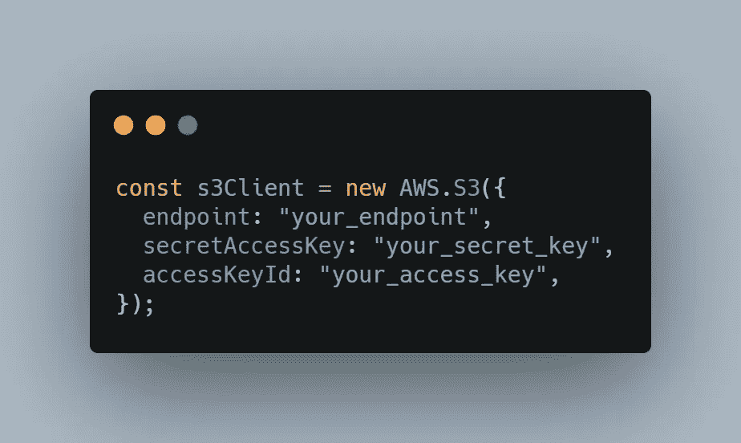
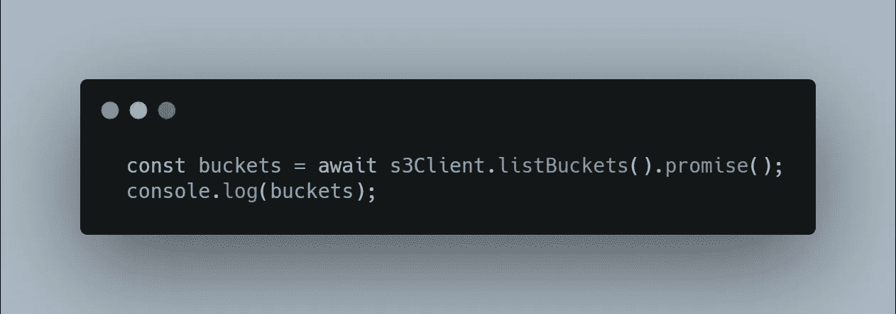
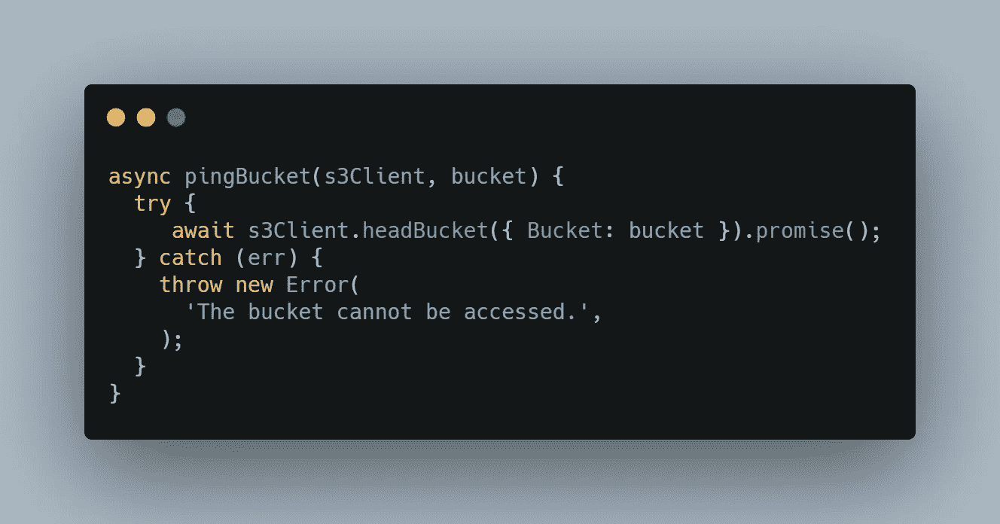
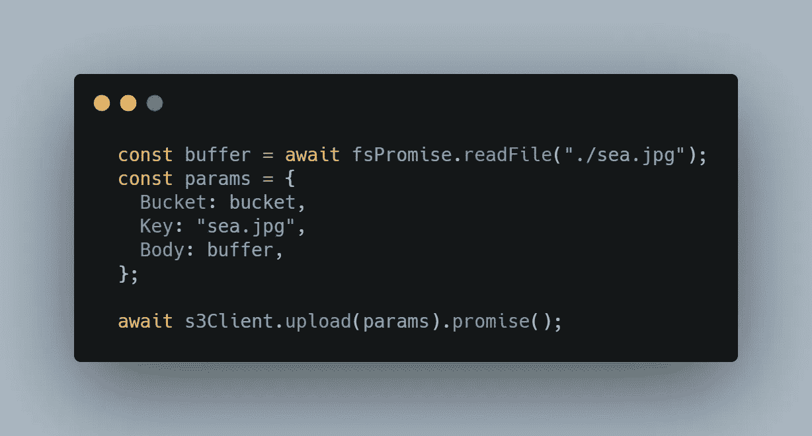
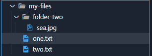
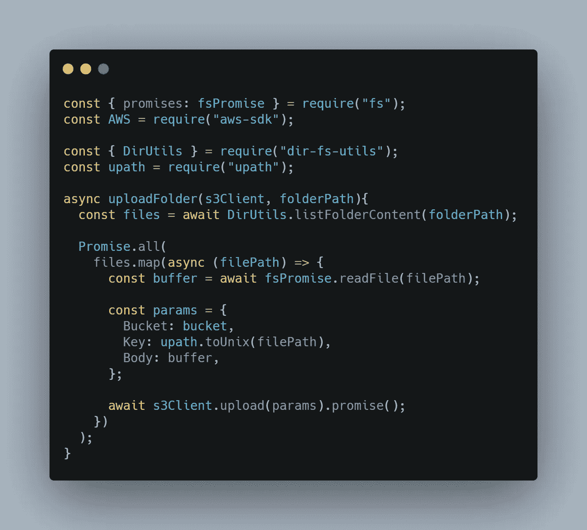
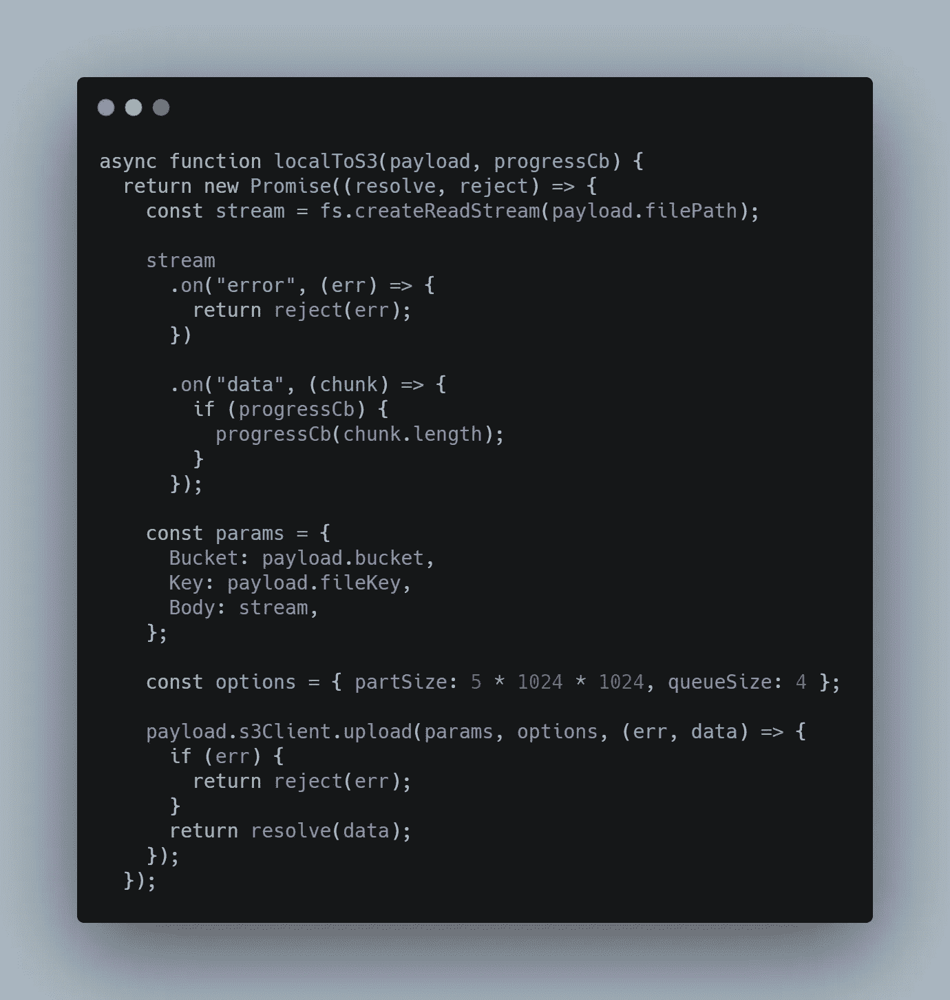
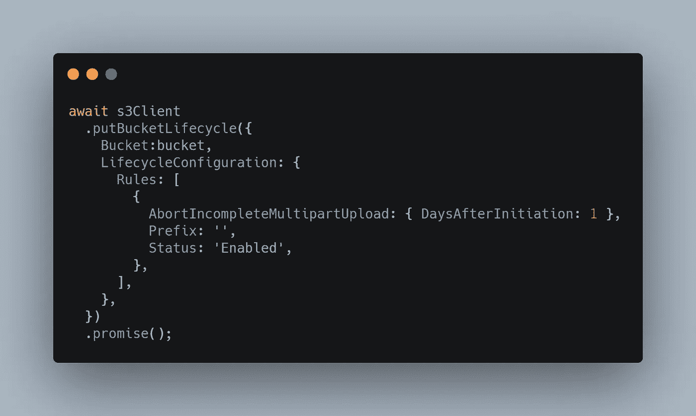
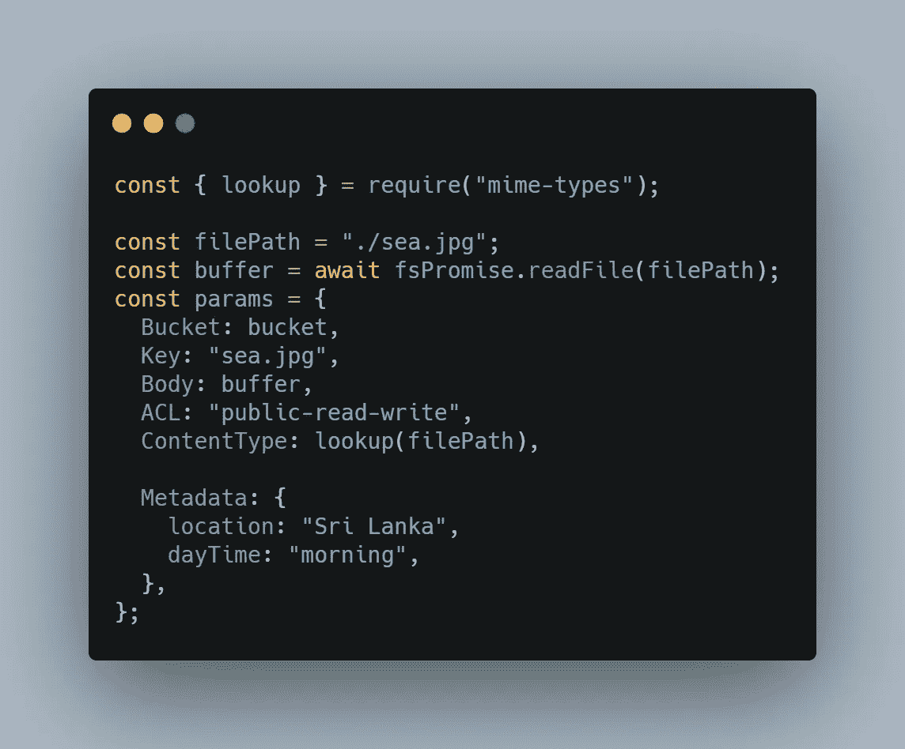
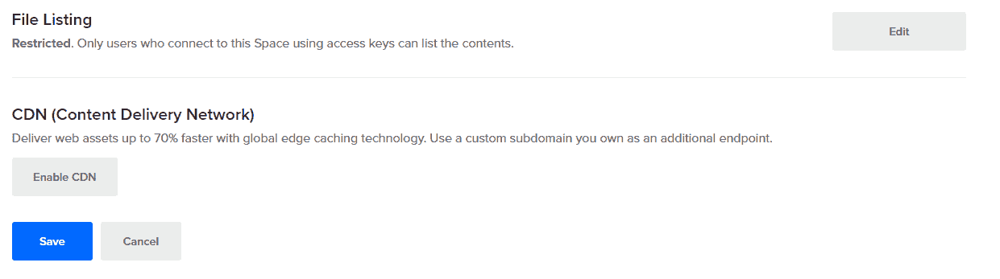

# 如何将对象存储集成到您的 Web 应用程序中

> 原文：<https://javascript.plainenglish.io/how-to-integrate-object-storage-for-your-web-application-f0fc0d0de8d3?source=collection_archive---------14----------------------->


Photo by [Ruchindra Gunasekara](https://unsplash.com/@ruchindra?utm_source=unsplash&utm_medium=referral&utm_content=creditCopyText) on Unsplash

所以，您想创建一个 web 应用程序，但是您有大量的数据需要有效地组织和存储？你只需要这篇文章。

如果你错过了最近的技术趋势，[对象存储](http://lakefs.io/object-storage/)是一个概念，它产生于为大数据提供更好的数据存储的需求。通过这种形式的存储，数据作为“对象”存储在平面层次结构中，您可以保持数据的质量，同时使其易于通过唯一的元数据进行检索。听起来很有希望？

如果您已经知道这是什么，那么您可能正在尝试将它集成到您的 web 应用程序中。因此，在本文中，您将找到一系列代码示例来帮助您开始使用这种类型的架构，并使其更容易集成到您的应用程序中。

在整篇文章中，我们将使用 JavaScript (Node.js)作为编程语言，但是因为大多数对象存储都是 S3 兼容的，所以我们将依赖官方的[亚马逊 S3 库](https://docs.aws.amazon.com/cdk/api/latest/python/aws_cdk.aws_s3/README.html)来与这种类型的架构进行交互。这提供了一个通用性——因为我们可以改变云提供商而不必改变代码级别——并且更容易集成，不管我们使用什么语言。

## 先决条件

要运行这些示例，我们需要安装 Node.js 以及`aws-sdk` NPM [模块](https://www.npmjs.com/package/aws-sdk)和一个新的 **index.js** 文件，其内容如下:

```
const AWS = require("aws-sdk");
const { promises: fsPromise } = require("fs");
```

## 连接到对象存储

要使用代码访问对象存储，您需要一个 API 键及其端点。您可以在云提供商的仪表板中轻松找到这些信息。一旦有了它们，您就可以启动一个新的 AWS S3 客户端，该客户端将用于针对对象存储运行命令。



[RAW](https://carbon.now.sh/?bg=rgba%28171%2C+184%2C+195%2C+1%29&t=seti&wt=none&l=javascript&ds=true&dsyoff=20px&dsblur=68px&wc=true&wa=true&pv=56px&ph=56px&ln=false&fl=1&fm=Hack&fs=14px&lh=133%25&si=false&es=2x&wm=false&code=const%2520s3Client%2520%253D%2520new%2520AWS.S3%28%257B%250A%2520%2520endpoint%253A%2520%2522your_endpoint%2522%252C%250A%2520%2520secretAccessKey%253A%2520%2522your_secret_key%2522%252C%250A%2520%2520accessKeyId%253A%2520%2522your_access_key%2522%252C%250A%257D%29%253B)

没有 PING 命令来验证您的应用程序是否可以与对象存储通信，但是作为一种变通方法，您可以通过执行一个简单的请求来测试这一点，比如列出其中的存储桶。



这里的另一个选项是使用`headBucket`函数。



根据 AWS 文件:

此操作有助于确定存储桶是否存在，以及您是否有访问它的权限。如果存储桶存在，并且您有访问它的权限，该操作将返回 200 OK。否则，该操作可能会返回诸如 404 未找到和 403 禁止之类的响应。

## 上传文件

要上传文件，您需要 3 条信息:

*   目标存储桶的名称
*   对象关键字(这是用来保存对象的关键字，可以是文件名)
*   文件的`Body`(可以是缓冲区或流)



[RAW](https://carbon.now.sh/?bg=rgba%28171%2C+184%2C+195%2C+1%29&t=seti&wt=none&l=javascript&ds=true&dsyoff=20px&dsblur=68px&wc=true&wa=true&pv=56px&ph=56px&ln=false&fl=1&fm=Hack&fs=14px&lh=133%25&si=false&es=2x&wm=false&code=%2520%2520const%2520buffer%2520%253D%2520await%2520fsPromise.readFile%28%2522.%252Fsea.jpg%2522%29%253B%250A%2520%2520const%2520params%2520%253D%2520%257B%250A%2520%2520%2520%2520Bucket%253A%2520bucket%252C%250A%2520%2520%2520%2520Key%253A%2520%2522sea.jpg%2522%252C%250A%2520%2520%2520%2520Body%253A%2520buffer%252C%250A%2520%2520%257D%253B%250A%250A%2520%2520await%2520s3Client.upload%28params%29.promise%28%29%253B)

注意，这里的`Key`匹配文件名以反映正在上传的文件，但是这里的`Key`可以有任何字符串值。

## 上传文件夹

在前面的例子中，我们硬编码了对象`Key`来匹配文件名，但是如果我们想要进行批量上传，比如上传整个文件夹，该怎么办呢？

在对象存储中，不像传统的基于文件夹的存储，没有文件夹的概念。

然而，我们可以通过为对象键提供前缀来模拟这种情况。

例如，我们可以上传一个带有关键字`my-files/image.jpg`的对象，然后使用这个前缀`my-files`来模仿一个文件夹结构。

假设我们有一个文件夹`my-files`,我们想上传到我们的对象存储，我们想保持这个结构。因此，我们使用`my-files/one.txt`、`my-files/two.txt`和`my-files/folder-two/sea.jpg`键上传文件，而不是使用`one.txt`、`two.txt`和`sea.jpg`键上传文件。



借助这两个模块，我们可以很容易地做到这一点: [upath](https://www.npmjs.com/package/upath) 和 [dir-fs-utils](https://www.npmjs.com/package/dir-fs-utils) 。在这里，我们将使用它们来列出一个文件夹的全部内容，然后将路径转换为 UNIX，因为这就是对象前缀应该的样子。



[RAW](https://carbon.now.sh/?bg=rgba%28171%2C+184%2C+195%2C+1%29&t=seti&wt=none&l=javascript&ds=true&dsyoff=20px&dsblur=68px&wc=true&wa=true&pv=56px&ph=56px&ln=false&fl=1&fm=Hack&fs=14px&lh=133%25&si=false&es=2x&wm=false&code=const%2520%257B%2520promises%253A%2520fsPromise%2520%257D%2520%253D%2520require%28%2522fs%2522%29%253B%250Aconst%2520AWS%2520%253D%2520require%28%2522aws-sdk%2522%29%253B%250A%250Aconst%2520%257B%2520DirUtils%2520%257D%2520%253D%2520require%28%2522dir-fs-utils%2522%29%253B%250Aconst%2520upath%2520%253D%2520require%28%2522upath%2522%29%253B%250A%250Aasync%2520uploadFolder%28s3Client%252C%2520folderPath%29%257B%250A%2520%2520const%2520files%2520%253D%2520await%2520DirUtils.listFolderContent%28folderPath%29%253B%250A%250A%2520%2520Promise.all%28%250A%2520%2520%2520%2520files.map%28async%2520%28filePath%29%2520%253D%253E%2520%257B%250A%2520%2520%2520%2520%2520%2520const%2520buffer%2520%253D%2520await%2520fsPromise.readFile%28filePath%29%253B%250A%250A%2520%2520%2520%2520%2520%2520const%2520params%2520%253D%2520%257B%250A%2520%2520%2520%2520%2520%2520%2520%2520Bucket%253A%2520bucket%252C%250A%2520%2520%2520%2520%2520%2520%2520%2520Key%253A%2520upath.toUnix%28filePath%29%252C%250A%2520%2520%2520%2520%2520%2520%2520%2520Body%253A%2520buffer%252C%250A%2520%2520%2520%2520%2520%2520%257D%253B%250A%250A%2520%2520%2520%2520%2520%2520await%2520s3Client.upload%28params%29.promise%28%29%253B%250A%2520%2520%2520%2520%257D%29%250A%2520%2520%29%253B%250A%257D)

## 上传大文件

到目前为止，我们使用一个物体作为缓冲。即使这对于小文件来说完全没问题，但对于大文件来说就不行了。

缓冲区的问题是，当文件被读取时，文件的完整内容被保存在内存中。更简单地说，如果我们有一个 Node.js 应用程序试图加载一个 200 MB 的文件，那么在上传文件时，该应用程序的 RAM 使用量将增加 200 MB。在大多数情况下，NodeJS 进程会崩溃，因为超过了最大内存使用量。

最佳实践是对大于 5MB 的文件使用多部分上传。

幸运的是，AWS S3 图书馆现在有一个`ManagedUpload`在幕后为我们处理这种多部分上传。我们所要做的就是提供一些选项和一个可消耗的阅读流。



[RAW](https://carbon.now.sh/?bg=rgba%28171%2C+184%2C+195%2C+1%29&t=seti&wt=none&l=javascript&ds=true&dsyoff=20px&dsblur=68px&wc=true&wa=true&pv=56px&ph=56px&ln=false&fl=1&fm=Hack&fs=14px&lh=133%25&si=false&es=2x&wm=false&code=async%2520function%2520localToS3%28payload%252C%2520progressCb%29%2520%257B%250A%2520%2520return%2520new%2520Promise%28%28resolve%252C%2520reject%29%2520%253D%253E%2520%257B%250A%2520%2520%2520%2520const%2520stream%2520%253D%2520fs.createReadStream%28payload.filePath%29%253B%250A%250A%2520%2520%2520%2520stream%250A%2520%2520%2520%2520%2520%2520.on%28%2522error%2522%252C%2520%28err%29%2520%253D%253E%2520%257B%250A%2520%2520%2520%2520%2520%2520%2520%2520return%2520reject%28err%29%253B%250A%2520%2520%2520%2520%2520%2520%257D%29%250A%250A%2520%2520%2520%2520%2520%2520.on%28%2522data%2522%252C%2520%28chunk%29%2520%253D%253E%2520%257B%250A%2520%2520%2520%2520%2520%2520%2520%2520if%2520%28progressCb%29%2520%257B%250A%2520%2520%2520%2520%2520%2520%2520%2520%2520%2520progressCb%28chunk.length%29%253B%250A%2520%2520%2520%2520%2520%2520%2520%2520%257D%250A%2520%2520%2520%2520%2520%2520%257D%29%253B%250A%250A%2520%2520%2520%2520const%2520params%2520%253D%2520%257B%250A%2520%2520%2520%2520%2520%2520Bucket%253A%2520payload.bucket%252C%250A%2520%2520%2520%2520%2520%2520Key%253A%2520payload.fileKey%252C%250A%2520%2520%2520%2520%2520%2520Body%253A%2520stream%252C%250A%2520%2520%2520%2520%257D%253B%250A%250A%2520%2520%2520%2520const%2520options%2520%253D%2520%257B%2520partSize%253A%25205%2520*%25201024%2520*%25201024%252C%2520queueSize%253A%25204%2520%257D%253B%250A%250A%2520%2520%2520%2520payload.s3Client.upload%28params%252C%2520options%252C%2520%28err%252C%2520data%29%2520%253D%253E%2520%257B%250A%2520%2520%2520%2520%2520%2520if%2520%28err%29%2520%257B%250A%2520%2520%2520%2520%2520%2520%2520%2520return%2520reject%28err%29%253B%250A%2520%2520%2520%2520%2520%2520%257D%250A%2520%2520%2520%2520%2520%2520return%2520resolve%28data%29%253B%250A%2520%2520%2520%2520%257D%29%253B%250A%2520%2520%257D%29%253B)

上面的代码将给定的文件分割(读取)成 5 MB 的块，并上传这些队列大小为 4 的块。这意味着将同时加载 4 个部分，每个部分为 5 MB。从理论上讲，使用这段代码，我们上传的每个文件的 RAM 使用量最多会增加 20 MB。

同时，如果我们想监控这个上传进度，我们可以提供一个`progressCallback`。请注意，在本例中，进度是在从流中读取零件时测量的。

## 铲斗生命周期配置

如果你正在上传一个文件到对象存储器，而你的上传由于某种原因被中断了，会发生什么？

如果你加载一个缓冲区，那么这就不是问题，但是如果你进行多部分上传，那么已经上传的部分将保留在桶中，并占据那个空间。

根据提供者的不同，您可能会在仪表板中看到空间已被占用，但看不到相应的对象。这是因为上传尚未完成。

为了缓解这个问题，您可以实施一些 bucket 生命周期配置，比如`AbortIncompleteMultipartUpload`。

您可以直接从仪表板进行配置。如果仪表板没有提供这个选项，您可以通过 API 来完成。



[RAW](https://carbon.now.sh/?bg=rgba%28171%2C+184%2C+195%2C+1%29&t=seti&wt=none&l=javascript&ds=true&dsyoff=20px&dsblur=68px&wc=true&wa=true&pv=56px&ph=56px&ln=false&fl=1&fm=Hack&fs=14px&lh=133%25&si=false&es=2x&wm=false&code=await%2520s3Client%250A%2520%2520.putBucketLifecycle%28%257B%250A%2520%2520%2520%2520Bucket%253Abucket%252C%250A%2520%2520%2520%2520LifecycleConfiguration%253A%2520%257B%250A%2520%2520%2520%2520%2520%2520Rules%253A%2520%255B%250A%2520%2520%2520%2520%2520%2520%2520%2520%257B%250A%2520%2520%2520%2520%2520%2520%2520%2520%2520%2520AbortIncompleteMultipartUpload%253A%2520%257B%2520DaysAfterInitiation%253A%25201%2520%257D%252C%250A%2520%2520%2520%2520%2520%2520%2520%2520%2520%2520Prefix%253A%2520%27%27%252C%250A%2520%2520%2520%2520%2520%2520%2520%2520%2520%2520Status%253A%2520%27Enabled%27%252C%250A%2520%2520%2520%2520%2520%2520%2520%2520%257D%252C%250A%2520%2520%2520%2520%2520%2520%255D%252C%250A%2520%2520%2520%2520%257D%252C%250A%2520%2520%257D%29%250A%2520%2520.promise%28%29%253B)

以上配置将在 1 天后中止不完整的多部分上传。

## 对象元数据

对象存储的最大优势之一是可以分配给对象的元数据。

这个元数据可以是一个与您想要提供的信息配对的`key-value`。

除了这些元数据，您还可以配置`ACL`、`ContentType`等等。默认情况下，对象上传为`private`，并且`ContentType`设置为`application/octet-stream`。



[RAW](https://carbon.now.sh/?bg=rgba%28171%2C+184%2C+195%2C+1%29&t=seti&wt=none&l=javascript&ds=true&dsyoff=20px&dsblur=68px&wc=true&wa=true&pv=56px&ph=56px&ln=false&fl=1&fm=Hack&fs=14px&lh=133%25&si=false&es=2x&wm=false&code=const%2520%257B%2520lookup%2520%257D%2520%253D%2520require%28%2522mime-types%2522%29%253B%250A%250Aconst%2520filePath%2520%253D%2520%2522.%252Fsea.jpg%2522%253B%250Aconst%2520buffer%2520%253D%2520await%2520fsPromise.readFile%28filePath%29%253B%250Aconst%2520params%2520%253D%2520%257B%250A%2520%2520Bucket%253A%2520bucket%252C%250A%2520%2520Key%253A%2520%2522sea.jpg%2522%252C%250A%2520%2520Body%253A%2520buffer%252C%250A%2520%2520ACL%253A%2520%2522public-read-write%2522%252C%250A%2520%2520ContentType%253A%2520lookup%28filePath%29%252C%250A%250A%2520%2520Metadata%253A%2520%257B%250A%2520%2520%2520%2520location%253A%2520%2522Sri%2520Lanka%2522%252C%250A%2520%2520%2520%2520dayTime%253A%2520%2522morning%2522%252C%250A%2520%2520%257D%252C%250A%257D%253B)

## 添加内容交付网络(CDN)

大多数云提供商为他们的对象存储架构提供 CDN。根据具体情况，这可以是免费的，也可以是付费的。如果您的应用程序基于交付大量静态内容，例如用户上传的照片，CDN 将大大提高内容的下载速度。



## 结论

对象存储是存储和管理非结构化数据以提高应用程序速度的最佳方式之一，现在，在本文的帮助下，您也可以加快集成速度。

*更多内容请看*[*plain English . io*](http://plainenglish.io/)