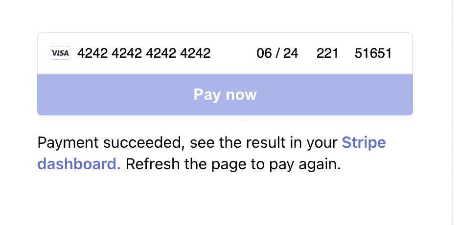
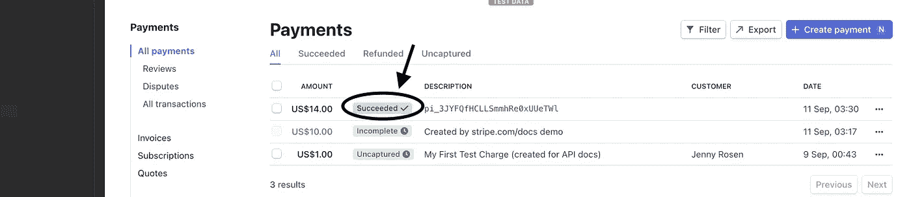

# 如何将 Stripe 与 React 应用程序集成

> 原文：<https://javascript.plainenglish.io/how-to-integrate-stripe-with-a-react-application-27c5a858b7f7?source=collection_archive---------4----------------------->

## 为您的企业接受和处理付款从未如此简单！


Photo by [Ivan Samkov](https://www.pexels.com/@ivan-samkov?utm_content=attributionCopyText&utm_medium=referral&utm_source=pexels) from [Pexels](https://www.pexels.com/photo/businessman-man-person-people-7620903/?utm_content=attributionCopyText&utm_medium=referral&utm_source=pexels)

聪明的人需要聪明的解决方案。并且 [Stripe](https://stripe.com/en-ca) 是一个智能解决方案，用于接受您的数字产品/服务的付款。

今天，我们将把 Stripe 与 React 应用程序集成在一起。为此，我们还需要一个小的快递后端。但是不用担心。我们将从头开始创造一切。

让我们开始吧。

# 去拿钥匙！

首先，在 Stripe 上开户。如果你生活在一个受[支持的国家](https://stripe.com/global)，这应该很简单。

首先，去[https://stripe.com/docs/keys](https://stripe.com/docs/keys)那里获取两个 API 密匙。公的要从`pk`开始

```
pk_test_somerandomgibberish
```

你的密钥应该以`sk`开头

```
sk_test_somerandomgibberish
```

拿到这两把钥匙，把它们藏在某个地方。

> 重要:**不要暴露你的秘钥！仅使用前端的公钥**

# 流程概述

支付过程如下所示

**第一步:**前端对后端进行 API 调用，生成支付意向。

**步骤 2:** 然后服务器使用密钥生成一个`client_secret`，并返回给前端

**第三步:**用户填写正确的卡信息

**第四步:**一个特殊的`CardElement`将在前端收集信息

**步骤 5:** 使用秘密临时密钥，通过条带库进行支付。

就是这样！

# 准备后端

我们将从头开始创建一个快速应用程序，但如果你已经有一个运行的后端，将同样工作。

首先，转到任意目录并创建一个空文件夹。

```
mkdir backend
cd backend
npm init -y
```

它会为你创建一个新的`package.json`文件。现在我们需要我们的`index.js`文件。

为此，运行以下命令

```
touch index.js
```

现在安装一些依赖项

```
npm install express cors nodemon stripe
```

现在转到`package.json`文件，修改`start`脚本，如下所示。它将支持根据变化自动进行重建。

现在，将以下起始代码添加到该应用程序中

index.js

现在去终端运行

```
npm start
```

您的应用程序应该从端口`**3001**`开始

# 准备前端

首先，通过运行以下命令创建一个新的 react 项目

```
npx create-react-app frontend
```

现在进入该项目并安装一些依赖项

```
npm install --save @stripe/react-stripe-js @stripe/stripe-js
```

现在暂时创建一个名为`MyCheckoutForm.js`的新组件，并将其留空。

让我们转到我们的`App.js`文件并加载初始的[条带包装器](https://github.com/stripe/stripe-js/blob/master/README.md#readme)。现在我们的`App.js`文件应该是这样的

App.jsx

现在，让我们创建我们的结帐表单，以实现付款

MyCheckoutForm.jsx

现在，如果您转到终端，通过运行以下命令来运行前端

```
npm start 
```

您将看到如下表格，您可以使用卡号`4242 4242 4242 4242`和任何未来日期作为到期日，任何号码作为 **CVC** 和邮政编码来测试您的支付。



Payment Form

以后你可以去`https://dashboard.stripe.com/test/payments`看看支付成功了！



payment success!

原来如此！现在你可以毫不费力地拿钱了！

# 那现在怎么办？

现在你知道如何接受用户的付款了。现在，您可以自定义用户体验。检查[文档](https://stripe.com/docs/payments)！

如果你想看完整的实现和代码，你可以去下面的仓库。

**前端:**[https://github.com/Mohammad-Faisal/stripe-react-frontend](https://github.com/Mohammad-Faisal/stripe-react-frontend)
**后端:**[https://github.com/Mohammad-Faisal/stripe-node-backend](https://github.com/Mohammad-Faisal/stripe-node-backend)

**通过**[**LinkedIn**](https://www.linkedin.com/in/56faisal/)与我联系

[](/45-npm-packages-to-solve-16-react-problems-a9ab18946224) [## 45 个 NPM 软件包解决 16 个 React 问题

### 关于如何选择完美的 npm 包的深入指导

javascript.plainenglish.io](/45-npm-packages-to-solve-16-react-problems-a9ab18946224) 

## 资源:

条纹 Doc:[https://stripe.com/docs/stripe-js/react](https://stripe.com/docs/stripe-js/react)

*更多内容请看*[***plain English . io***](http://plainenglish.io/)