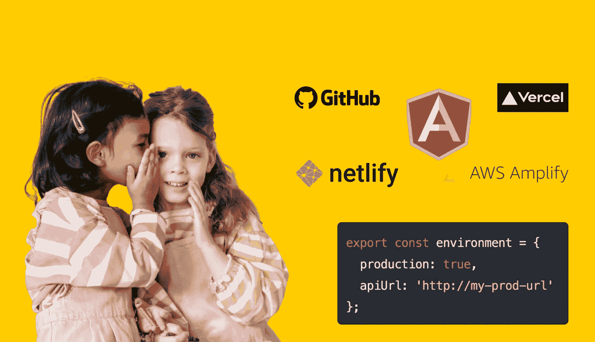
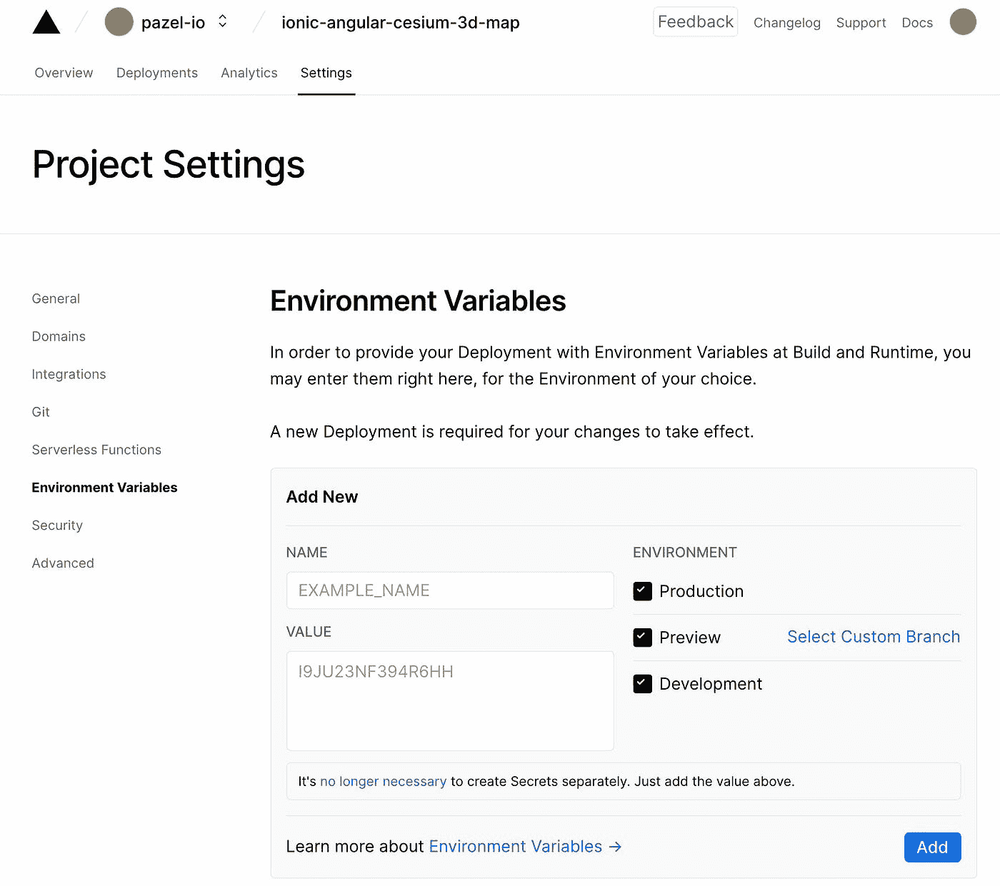
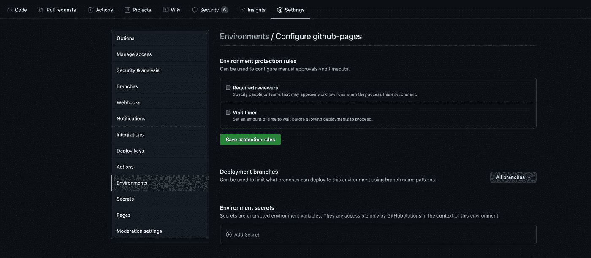
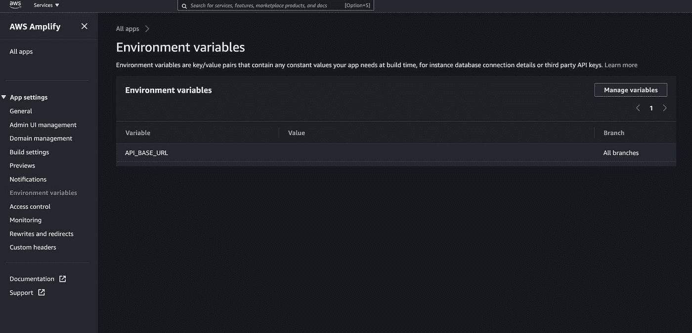

# 如何在 Angular 项目中从源代码中保守秘密🤫

> 原文：<https://javascript.plainenglish.io/how-to-keep-your-secrets-from-your-source-code-in-an-angular-project-6963374b464e?source=collection_archive---------0----------------------->



面对现实吧，我们都有秘密，但那不是我想说的。

本文向您展示了一种技术，可以轻松地使用 Angular 的`environment.ts`文件来访问敏感数据，而不会泄露您的秘密。

# 什么是秘密？

Secret 是指任何不应该作为源代码的一部分被推送的敏感值。这可以是 API 密钥、OAuth 令牌、证书和密码。

作为构建或部署的一部分，这些秘密通常需要与其他提供者或服务集成。

基于不同的部署环境，秘密也可能不同。

例如，您可以将一个测试帐户用于开发，而将不同的 API 密钥用于生产。

# 你为什么要在乎秘密？

许多项目利用基于云的 Git 和 CI/CD 工具来管理源代码、构建和部署。因此，防止秘密泄露到您的源代码中是至关重要的。

在客户端项目中，您通常要处理两种类型的秘密。

## 1.客户端应用程序在与提供商对话时需要使用的秘密。

这些秘密在 JS 包或 API 调用中仍然可见。例如，这些秘密就像你的 Google API 密钥，需要通过 HTTP 请求发送给 Google。

通常对于这些类型的秘密，你需要伴随的安全措施。例如，Google 允许您将一个 API 密钥限制在一个域中，或者将其限制在特定的 Google 服务中。

即使对于这种类型，不在源代码中进行硬编码也是一个好的做法。
硬编码使得基于环境的秘密管理变得困难。

假设您有一个使用不同 Google API 键的测试和生产环境。

如果这个秘密是源代码的一部分，那么每次你想把它从测试 API 密匙变成生产 API 密匙时，你都需要记住修改代码。

同样，更新你的秘密来旋转它可能更具挑战性。

现在让我们补充一个事实，源代码将跨分支和设备传播。

我想你明白了。这很重要，因此，有一些最佳实践和工具可以帮助您。

例如，谷歌有[“安全使用 API 密匙的最佳实践”](https://support.google.com/googleapi/answer/6310037?hl=en)
其中建议不要在源代码中存储 API 键。

或者如果你按下你的 Google API 键，Github 会给你发一封警告邮件。他们正在进行自动秘密扫描。

## 2.秘密只是构建中需要的一部分，而不是之后。

例如，如果我的构建过程可以查询我的内容存储库(headless CMS)来预呈现一些页面以生成静态页面。

在这种情况下，构建完成后，我不需要内容存储库的 API 键。我将只采取结果(静态页面)来部署它们。因此，我可以通过不放入源代码来真正保护我的密钥。

如果你不相信，请阅读[为什么 git 中的秘密是这样一个问题——源代码中的秘密](https://blog.gitguardian.com/secrets-credentials-api-git/)。

# 利用 Angular `environment.ts`文件获取机密

Angular 官方管理环境配置的方式是使用提供的 [environment.ts 文件](https://angular.io/guide/build)。

您可以为每个环境创建一个文件。

```
└──myProject/src/environments/
                   └──environment.ts
                   └──environment.prod.ts
                   └──environment.stage.ts
```

并像这样提供每个环境的配置

```
export const environment = {
  production: true,
  apiUrl: 'http://my-prod-url'
};
```

您可以在代码中轻松访问这种配置。

```
import { environment } from '../environments/environment'; public getBooks() {
    const url = `${environment.apiUrl}/books`;
    return this.http.get<Book>(url);
  }
```

要获得特定于环境的配置，您可以在构建中使用 env 名称。

`ng build --configuration=stage`或者用 angular.json 根据环境来定义同一个东西。

```
"serve": {
  "builder": "@angular-devkit/build-angular:dev-server",
  "options": {
    "browserTarget": "your-project-name:build"
  },
  "configurations": {
    "production": {
      "browserTarget": "your-project-name:build:production"
    },
    "staging": {
      "browserTarget": "your-project-name:build:staging"
    }
  }
},
```

这些配置被推送到您的源代码中以支持构建。因此任何有权访问源代码的人都可以以纯文本的形式看到这些配置。

这种技术对于像 apiUrl 这样的典型配置来说完全没问题，但是对于 secrets 来说就不够好了。

# 解决办法

我们可以通过`environemnt.ts`文件提供秘密，而不需要使用[环境变量](https://en.wikipedia.org/wiki/Environment_variable#:~:text=An%20environment%20variable%20is%20a,in%20which%20a%20process%20runs)将其推送到源代码。

环境变量是一个动态命名的值，它可以影响正在运行的进程在计算机上的行为。它们是流程运行环境的一部分。例如，正在运行的进程可以查询 TEMP 环境变量的值，以找到存储临时文件的合适位置，或者查询 HOME 或 USERPROFILE 变量，以找到运行该进程的用户所拥有的目录结构。

这些`Environment variables`是在你的 Angular build 运行的构建机器上设置的。

设置`Environment variables`有不同的方法，可以根据上下文而有所不同。

我们不想手动设置这些变量，所以我们使用一个[。环境文件](https://www.freecodecamp.org/news/nodejs-custom-env-files-in-your-apps-fa7b3e67abe1/)。您可以一次轻松设置多个环境变量和值。

稍后，您可以使用`.env`文件根据环境读取这些变量。的内容。env 长这样。

```
GOOGLE_API_KEY=34232423423423234233fsajgsaagdda
AUTH0_CLIENT_ID=54235nfgde24gbdf235432
PASSWORD=adjkvknh29827;nbv_
```

因此，我们的想法是加载与环境(测试、生产)相关的`.env`文件，并以某种方式将它们提供给 Angular `environment.ts`文件。

## 这种方法如何更安全？

这种方法更安全，因为包含敏感值的`.env`文件只存在于您的构建机器(私有服务器)上。

因此只有有权访问构建服务器的人才能读取该文件。敏感值不再是源代码的一部分。

## 基于云的 CI/CD 呢？

所有基于云的 CI/CDs 都已经提供了定义和管理`Environment variables`的方法。

一旦设置好了，`Environment variables`将在构建运行时可用，我们可以像访问我们的服务器一样访问它们。此外，`Environment variables`将是安全的，因为它们只能通过基于云的 CI/CD 管理仪表板获得。

以下是一些流行的基于云的 CI/CD 示例。

[韦尔塞尔](https://vercel.com/docs/concepts/projects/environment-variables)



[Github 动作](https://docs.github.com/en/actions/learn-github-actions/environment-variables)



[AWS 放大器](https://docs.aws.amazon.com/amplify/latest/userguide/environment-variables.html)



# 如何访问 Angular environment.ts 文件中的环境变量？

Angular build 已经在运行时利用 Node.js 来完成构建，我们可以添加一个 npm 脚本来生成`environement.ts`作为构建的一部分。

这个脚本将读取环境变量并生成`environement.ts`文件。这个脚本只是 JavaScript，所以编写生成输出所需的任何逻辑。

以下是该脚本的代码。

```
const setEnv = () => {
  const fs = require('fs');
  const writeFile = fs.writeFile;
// Configure Angular `environment.ts` file path
  const targetPath = './src/environments/environment.ts';
// Load node modules
  const colors = require('colors');
  const appVersion = require('../../package.json').version;
  require('dotenv').config({
    path: 'src/environments/.env'
  });
// `environment.ts` file structure
  const envConfigFile = `export const environment = {
  googleApiKey: '${process.env.GOOGLE_API_KEY}',
  auth0ClientId: '${process.env.AUTH0_CLIENT_ID}',
  appVersion: '${appVersion}',
  production: true,
};
`;
  console.log(colors.magenta('The file `environment.ts` will be written with the following content: \n'));
  writeFile(targetPath, envConfigFile, (err) => {
    if (err) {
      console.error(err);
      throw err;
    } else {
      console.log(colors.magenta(`Angular environment.ts file generated correctly at ${targetPath} \n`));
    }
  });
};setEnv();
```

让我们看看这里发生了什么。

*   `process.env`提供对 Node.js 中的环境变量的访问，因此构建机器上存在的任何变量都可以通过它获得。
*   让我们创建一个文件并将内容写入其中。在本例中，生成 environment.ts 文件。
*   作为奖励，我正在阅读`package.json`，这样我就可以得到它的版本。这样，我们可以在 UI 中显示一个版本号。当将版本控制作为发布周期的一部分时，这种技术很方便。
*   `targetPath`指向目标文件应该存在的位置。
*   `envConfigFile`常量是一个模板文字，提供了`environment.ts`文件的模板和内容。你可以在这里指定你想要的`environment.ts`中的变量。
*   `console.log`是为了便于调试时查看文件生成的输出。确保不要在此记录敏感数据。构建完成后，日志通常会保留很长时间。
*   `dotenv`包可以加载一个`.env`文件，这样你就可以访问你在那个文件中定义的变量。这个技巧有助于管理私有构建服务器，甚至是在本地开发机器上构建。如果`dotenv`没有在指定位置找到文件，脚本不会失败。因此，您可以将它留在那里，以支持本地机器构建和基于云的 CI/CDs。

# 自动化 it

要把这些东西粘在一起，我们还需要做两件事。

*   首先，我们需要添加一个 npm 脚本来运行我们新添加的代码。这里，新的`config` npm 脚本将运行我们的代码。我们还为`build`更新了 npm 脚本，以便在构建之前运行`config`。

```
{
  "name": "ionic-angular-cesium-3d-map",
  "version": "0.0.1",
  "author": "Ionic Framework",
  "homepage": "https://ionicframework.com/",
  "scripts": {
    "ng": "ng",
    "start": "ng serve",
    "build": "npm run config && ng build",
    "config": "ts-node src/environments/set-env.ts",
    "test": "ng test",
    "lint": "ng lint",
    "e2e": "ng e2e"
  }
}
```

*   最后但同样重要的是，我们需要从源代码中忽略生成的`environment.ts`文件和`.env`文件。更新您的`.gitignore`以包含这些文件。

```
src/environments/environment.ts 
src/environments/.env
```

完成这些步骤后，当您运行`build`或`config` npm 脚本时，它将生成一个`environment.ts`并将其放在`environment`文件夹中。文件内容会是这样的。

```
export const environment = {
    googleApiKey: 'YOUR_ACTUAL_GOOGLE_API_KEY_FROM_ENV_VARIABLES',
    auth0ClientId: 'YOUR_ACTUAL_AUTH0_CLIENT_ID_FROM_ENV_VARIABLES',
    appVersion: '1.0.0',
    production: true,
};
```

就是这样。现在，您可以在 Angular 项目中访问这些环境配置。

# 结论

我们学会了如何将操作层面`Environment variables`与角度层面`environment.ts`相结合，以达到两全其美并保护我们的秘密。

对于可能需要在不同构建机器上共享的秘密，有更多的方法可以使保存和共享秘密更加方便。我们在这篇文章中读到的只是第一步。

感谢阅读。像往常一样，如果你有任何问题，请在这里给我留言或在 Twitter 上给我发 DM。

# 资源

如果你需要一个利用这个解决方案的例子，请参考我的离子&铯三维地图的例子。

这个项目使用相同的技术来隐藏源代码中使用的`cesiumAccessToken`。

该项目构建于 Vercel 之上，并使用 Vercel 环境变量来提供 cesiumAccessToken。

这里是代码库:[离子角铯 3d 地图](https://github.com/pazel-io/ionic-angular-cesium-3d-map)

# 接触

推特:[_ 帕泽尔](https://twitter.com/home)

*更多内容尽在*[***plain English . io***](http://plainenglish.io/)