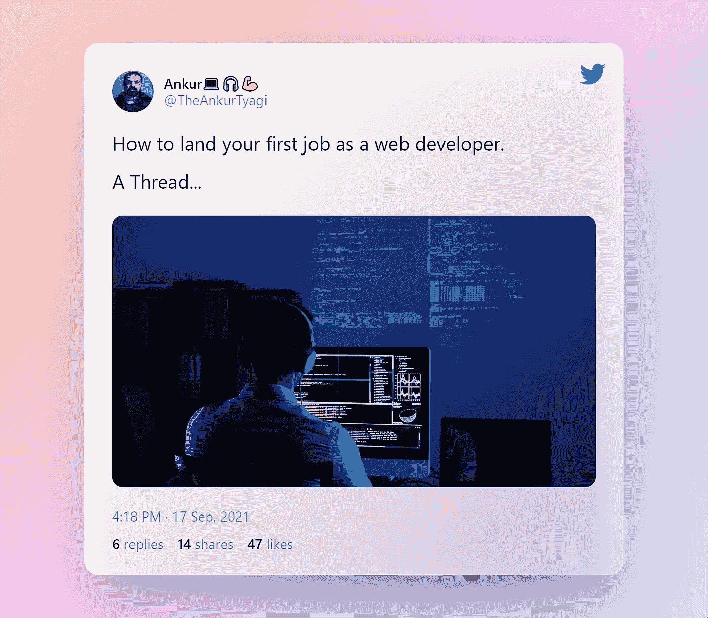
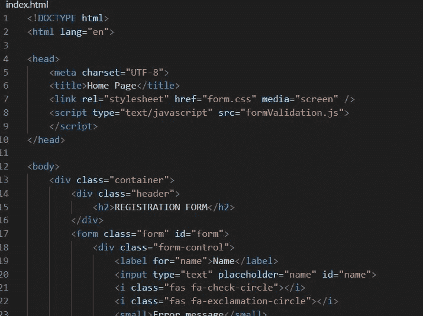

# 如何找到你的第一份网页开发工作

> 原文：<https://javascript.plainenglish.io/how-to-land-your-first-job-as-a-web-developer-90c65e7fded0?source=collection_archive---------13----------------------->

无论你是自学成才，训练营毕业，还是拥有大学学位，当你是一名新面孔的网站开发人员时，获得第一份工作可能会很棘手。

1.  开始编程可能会非常可怕，而且有很多误解，让人们认为编程是他们永远也学不会的技能，或者找到一份 web 开发人员的工作几乎是不可能的任务。
2.  软件开发行业，尤其是 web 开发，充满了没有技术背景的人转行到开发行业并极大地改变了他们的生活的惊人故事。
3.  这是一项很棒的技能，它会教你以不同的方式思考，它会打开很多工作机会的大门，即使在就业市场受到经济衰退严重影响的时候，它也会给你惊人的天赋来建立自己的项目和公司。
4.  web 开发人员是利用编程语言来构建网页和应用程序的人。

有三种类型的网络开发者:

*   前端开发人员
*   后端开发人员
*   全栈开发人员

# 前端开发人员🚀

前端开发人员负责构建您在网页或应用程序上看到并与之交互的内容。

专家将设计、图像或想法转换成代码，让网络浏览器显示网站。

# 后端开发人员🚀

这个角色负责设计和构建支持我们前端应用程序的系统。

后端使应用程序能够在多种设备上运行，或者使存储您的信息成为可能。

例如，当您单击“保存”按钮时，后端开发人员将编写负责接收您的请求的算法和逻辑代码，处理它，将其存储在数据库中(如果需要)并发回结果，以便前端可以让您知道一切顺利。

# 全栈开发人员🚀

这是一个旧角色的新术语，全栈开发人员是一个既能完成前端任务又能完成后端任务的人。

怎样才能成为前端开发者？

现在，让我们进入成为前端开发人员和获得第一份工作所需的步骤。

✍ **学习 HTML & CSS**

为了成为一名前端开发人员，你需要知道的第一件事是关于 web 是如何工作的。

你有没有想过你的浏览器是如何知道如何在屏幕上显示项目的？

如何摆放物品，使用哪些颜色？

✔ **HTML**

超文本标记语言是所有网络浏览器都知道的标准标记语言，它被用来描述你的网站内容。

与其说是它的设计，不如说是它的结构和内容本身。

HTML 使用标签和节点的特定语法。

**几乎没有免费的 HTML/CSS Web 开发资源。**

FreeCodeCamp 是最好的开始方式。

# 一些免费的纪念品👇

*   [Web 开发实践:HTML / CSS 从零开始](https://www.udemy.com/share/101sF0/)
*   [前端 Web 开发基础](https://www.udemy.com/share/101ryM/)
*   [学习 HTML & CSS:如何开始你的 Web 开发生涯](https://www.udemy.com/share/101rFk/)

✔ **CSS**

现在你知道了如何在用户的屏幕上放置内容，我们需要让它看起来漂亮，这就是 CSS 可以帮助你的地方。

CSS 是一种代码语法，用于描述 HTML 元素在屏幕上的显示方式。

# 顶级免费 CSS 资源👇

它允许开发者在屏幕的不同位置放置内容，添加颜色，背景，边框，字体，动画，任何你需要的东西来匹配你的设计，很可能 CSS 支持它。

人们用 CSS 做了很多令人惊奇的事情，从令人惊奇的设计到艺术，动画。

# 我最喜欢的 YouTube 频道👇

*   简化的 Web 开发
*   弗罗林汽水
*   旅行媒体
*   自由代码营
*   网络忍者

# 现在是练习时间

在跳到下一个泳道之前，确保你练习了很多。

你现在可以建立静态网站，制作很多这样的网站，从最基本的开始，当你习惯了之后，再进入更高级的功能。建立一个个人网站。

一旦你对 HTML 和 CSS 有了一点点的熟悉，这对于避免以后的挫折是很重要的，继续学习 JavaScript。

# “是时候学习 JavaScript 并改变世界了”

到目前为止，你已经建立了惊人的网页，但他们不能做得很好？

JavaScript 是一种编程语言，事实上，它是当今最流行的编程语言之一，具有在 web 浏览器中运行的特殊性，因此可用于构建 web 应用程序。

JavaScript 允许您通过处理诸如用户点击元素、定时事件等事件来与 HTML 交互。它还允许您动态地更改页面的内容，这意味着它可以访问“HTML”，或者实际上可以访问页面的 DOM。

学习 JavaScript 将是实现你成为一名 web 开发人员的目标的一大步，这可能是最难的，所以花点时间来学习，这并不容易，但也不是不可能，而且有了大量的免费内容，就没有借口了。

## [学习和练习 JavaScript 的简单有效的方法](/a-simple-and-effective-way-to-learn-practice-javascript-4c43aef62cf7)

# 很少有很棒的学习平台👇

我为你创建了一个学习 HTML | CSS | JAVASCRIPT 前端开发的 100 天路线图👇

[学习前端开发 HTML | CSS | JAVASCRIPT 的 100 天路线图。](https://theankurtyagi.medium.com/100days-roadmap-to-learn-html-css-javascript-for-front-end-development-76d506f4e30)

🚀**制作作品集网站**

**现在你有了技能，是时候展示一下了。**

使用作品集网站展示你的技能在开发者中非常流行。作品集网站基本上是你向雇主或未来客户展示的最佳项目的集合。

🚀**个人网站**

建立你自己的网站，向世界展示你的才华。网站将是一个自我推销，它是开发者的终极课程，所以要让它给人留下深刻印象。这个网站的一个特点是有一个部分，你可以在那里链接或展示项目。

🚀 **GitHub:**

GitHub 是最重要的开源库，也是许多开放应用程序的家园。获得一个帐户是免费的，你可以在几分钟内开始托管你的代码。

[绝对初学者的 Git](https://www.freecodecamp.org/news/an-introduction-to-git-for-absolute-beginners-86fa1d32ff71/)

现在你的作品集出来了，你需要在简历上下功夫，做这件事的合适地点是 LinkedIn。

你可能已经知道 LinkedIn，但如果没有，那就去看看。建立你的简历，列出项目，一个杀手级的个人资料描述，重要的是，开始建立关系网。

🚀**框架时间**

现在是时候加快步伐，进入框架世界了。

框架是一组简化开发任务的函数和库。

较新的框架是复杂的代码片段，有时甚至会重新发明我们对 web 编程的方式。

**我个人推荐搭配以下其中一款:**

这里没有正确或错误的选项，根据项目的类型，有一个偏好和便利。但他们是 2021 年的佼佼者。

# 面试准备👇

好样的。你现在是一名网站开发人员，尽管你仍然需要找一份工作。与其他职业相比，作为一名网页开发人员进行面试是其独特的经历。

你必须向面试官展示你的经历，在这一点上，你在学习过程中建立了哪些辅助项目？

你还必须向面试官展示你知道如何编码，你对 HTML、CSS 和 JavaScript 有一定的了解，甚至可能对某个特定的框架有所了解。

如果面试中有一部分你实际上必须编写一小段代码，不要感到惊讶，

确保你之前练习过你的技能，你会做得很好。

[我过去在面试中经常问的 JavaScript 问题。](/12-common-javascript-questions-i-used-to-ask-in-interview-be39ce27b3c5)

一些博客对你接下来的面试有帮助。

[求职面试中最不该说的 5 件事](/top-5-things-not-to-say-in-a-job-interview-3c46074ed1c1)

[你应该在简历中改进的常见问题](https://dev.to/tyaga001/common-issues-you-should-improve-in-your-resume-2be3)

[顶级面试软技能问答](https://dev.to/tyaga001/top-interview-soft-skills-questions-and-answers-200m)

# 最后的话

随着开发人员在技术的边缘工作，技术在不断变化。

让自己了解最新的技术、编程语言等是至关重要的。

你刚刚开始了一个漫长的人生旅程，它提供了惊人的机会，享受它吧。

如果你是编程和自由职业的初学者，并且想成为一名更好的开发人员，

这里有两门很棒的课程:

如果你是一个 JavaScript 初学者，并且想学习 JavaScript e2e 概念，那么 Robin aka [WellPaidGeek](https://twitter.com/WellPaidGeek) 有一个很棒的课程，他从事编码工作已经 20 多年了。

我强烈推荐购买这门课程。

这里是[链接](https://wellpaidgeek.teachable.com/p/beginners-javascript/?affcode=391490_mb0iiogk)如果有人感兴趣。

> [*自由职业者需要掌握的一切*](https://gumroad.com/a/907211891)

由[凯尔·普林斯罗](https://twitter.com/study_web_dev)👇

我强烈推荐购买这些课程。

如果你喜欢这个，你可能也会对我的电子书感兴趣。

我写了一本关于开发者成长的书，分享了我 12 年多的经验。

我从社区收到了非常棒的反馈。看看下面这本书。

现在就拿起这本书……[the prime guide](https://theankurtyagi.gumroad.com/l/nextgendev/)

感谢阅读。

如果你经常阅读，谢谢你，你是我能够与你分享我的生活/职业经历的重要原因。

在推特[上与我联系](https://twitter.com/TheAnkurTyagi)

*最初发表于*[*https://theankurtyagi.com*](https://theankurtyagi.com/how-to-land-your-first-job-as-a-web-developer/)*。*

*更多内容看*[***plain English . io***](http://plainenglish.io/)