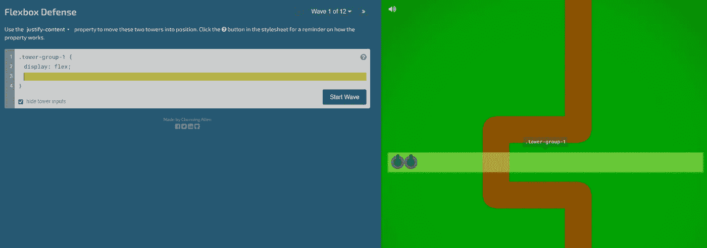
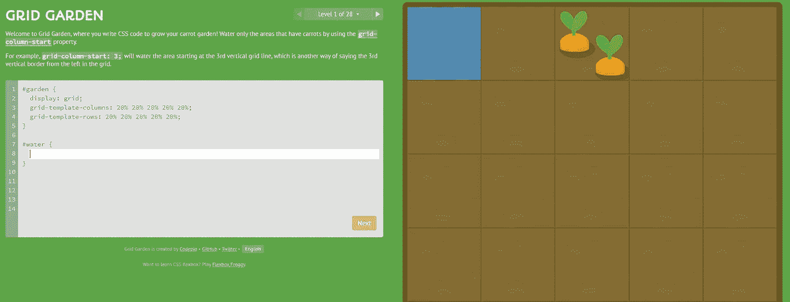
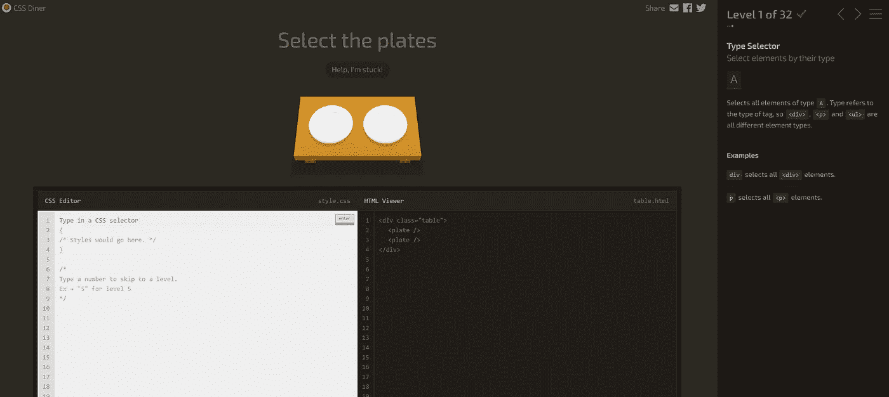
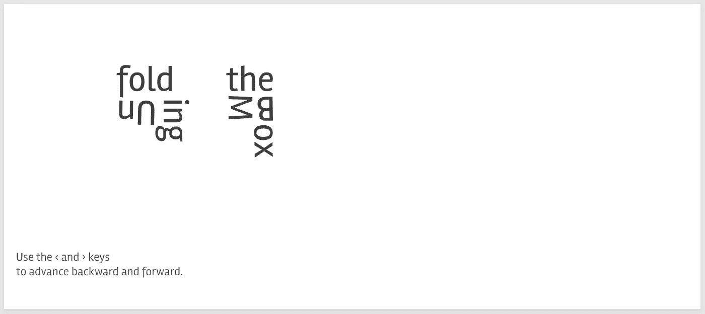

# 5 个可以直观学习 CSS 的网站

> 原文：<https://javascript.plainenglish.io/how-to-learn-css-in-a-fun-way-f714d3619500?source=collection_archive---------12----------------------->

## 如何以有趣的方式学习 CSS

# 1.Flexbox 青蛙

**Flexbox Froggy** 是一款学习 CSS **flexbox** 的游戏。Flexbox 以不易快速掌握著称。该网站帮助您了解所有您需要了解的关于 flexbox 的信息。完成游戏后，你将成为格式化网页内容的专家。

**Flexbox Froggy**

**链接:**

 [## Flexbox 青蛙

### 一个学习 CSS flexbox 的游戏

flexboxfroggy.com](https://flexboxfroggy.com/) 

# 2.Flexbox 防御

又一个类似 **Flexbox Froggy** 的搞笑游戏。就是玩一个防御游戏，你的工具就是 CSS。你应该使用 CSS 来定位你的塔！这将帮助你掌握 CSS 中的定位，这是 CSS 中很难学习和理解的话题之一。

Flexbox Defense

**链接:**

 [## Flexbox 防御

### 你的任务是阻止敌人越过你的防线。不像其他塔防游戏，你必须…

www.flexboxdefense.com](http://www.flexboxdefense.com/) 

# 3.网格 Garden⁣

这次是关于写 CSS 代码来种植你的胡萝卜园！😆只给有胡萝卜的地方浇水，用 CSS 属性去除杂草。这个游戏会让你成为 CSS **网格的专家。**

Grid garden

**链接:**

 [## 网格花园

### 一个学习 CSS 网格布局的游戏

cssgridgarden.com](https://cssgridgarden.com/) 

# 4.CSS Diner⁣

在编辑器中键入一个 **CSS** 选择器(下图所示)来选择表格上的正确项目。如果你答对了，你将进入下一个阶段。

CSS Diner

链接:

 [## CSS 餐厅

### 您将学习 CSS 选择器！选择器是你选择应用样式的元素的方式。附件 1 -一个 CSS…

flukeout.github.io](https://flukeout.github.io/) 

# 5.Unfold⁣

这一次它不是一个游戏，而是一个探索 CSS 3D 变换的动画演示。它以一种互动的、现代的、可视化的方式解释了 CSS 转换和定位。

Unfold

**链接:**

 [## 展开盒子模型

### 糟糕，你的浏览器似乎不能显示 3D 转换。使用‹和键向前和向后移动。这里是…

rupl.github.io](https://rupl.github.io/unfold/) 

我希望这篇文章对你有用。更多有用内容请评论分享。尽情享受吧！

**联系一下** [**中**](https://medium.com/@famzil/)**[**Linkedin**](https://www.linkedin.com/in/fatima-amzil-9031ba95/)**[**脸书**](https://www.facebook.com/The-Front-End-World)**[**insta gram**](https://www.instagram.com/the_frontend_world/)**，或者**[**Twitter**](https://twitter.com/FatimaAMZIL9)**。**[www.fam-front.com](http://www.fam-front.com/)******

********

****@the_frontend_world ❤****

*****更多内容请看*[***plain English . io***](http://plainenglish.io)****