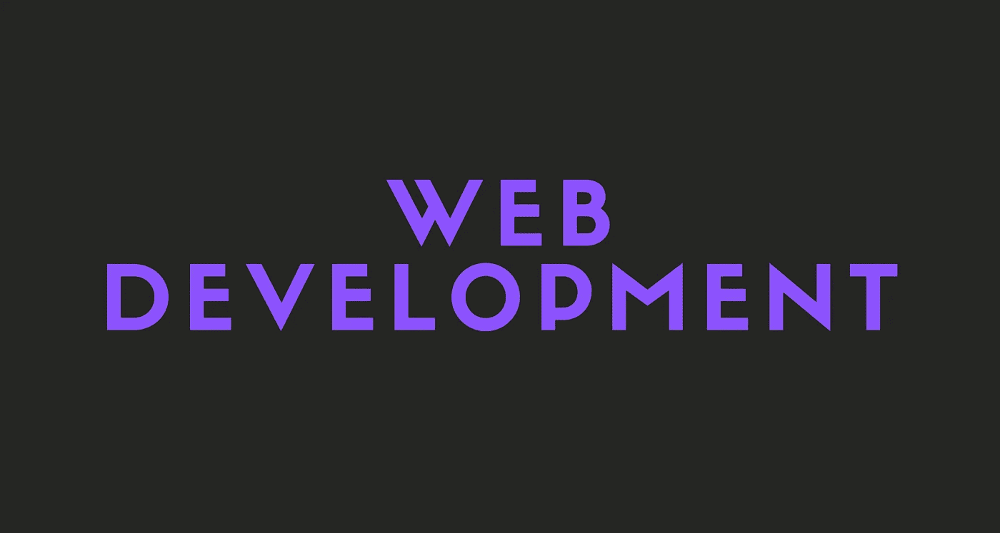

# 如何开始 Web 开发:初学者指南

> 原文：<https://javascript.plainenglish.io/how-to-learn-web-development-f16fe19ec743?source=collection_archive---------25----------------------->

web 开发初学者入门指南。

在这个故事中，你将学习如何开始 web 开发，以及你应该走哪条路。

开始吧！

# 小路

想学 web 开发，一定要选一条路。

以下是三条 web 开发路径。确保在真正学习 web 开发之前决定一个。

如果你不能决定，不要担心。有时候，你实际上不得不花时间编写代码来找到你更喜欢的东西。只要选择全栈，然后看看当你实际上在 web 开发方面变得更好时，你是否喜欢它。

## 全栈

全栈开发是 web 开发中最流行的方式。Fullstack 意味着你可以构建好看的 web 应用和高性能的后端。

一个全栈开发者可以自己构建一个完整的项目。

## 前端

前端开发基本上意味着做大部分 UI 工作。前端开发人员可以设计和编写好看的用户界面，但不能真正构建后端。

一个前端开发人员仍然可以自己构建一个完整的项目，尽管他可能不得不使用像 Firebase 这样的工具来构建后端。前端开发人员的网站可能没有后端开发人员的网站快，但肯定会看起来更好。

## 后端

后端开发人员构建复杂的后端并维护它们。后端开发人员通常只能做基本的前端工作。

但是同样，有像 Tailwind 和 Bootstrap 这样的 CSS 框架可以帮助他们建立看起来合适的网站。

后端开发人员当然可以建立一个网站，而且会比前端开发人员更快。但就设计而言，它不会那么特别。

# 路标

现在你将看到成为一名 web 开发人员的路线图。我也写了你是否必须学习取决于你选择的道路。

## 注意

如果你选择了全栈，你必须学习下面所有的技术和语言。

# HTML、CSS 和 JavaScript

不管你选择哪条路，你都必须学习这三条。

HTML、CSS 和 JavaScript 是 web 开发的基础，没有它们你就无法构建 web 应用。

## 前端

一个前端开发人员应该非常擅长 HTML、CSS 和 JavaScript。

## 后端

后端开发人员应该掌握 JavaScript。HTML 和 CSS 对于后端开发者来说是可选的。

# JavaScript 框架

JavaScript 框架对于构建 web 应用程序非常重要。它们是前端开发者的必备。

## 前端

一个前端开发人员应该学习至少一个 JavaScript 框架。

## 后端

后端开发人员不需要学习任何 JavaScript 框架。学习它们没什么坏处，但是后端不需要。

# 节点. js

Node.js 是基于 Google 的 V8 JavaScript 引擎构建的 JavaScript 运行时。Node.js 主要用于服务器、命令行工具等等。

## 前端

一个前端开发人员不需要学习 Node.js，但至少了解它的基础知识在将来可能会有帮助。

## 后端

后端开发者必须知道 Node.js，没有借口。

# 以打字打的文件

TypeScript 是一种开源语言，它通过添加静态类型定义构建在 JavaScript(世界上最常用的工具之一)之上。不是任何一条路都必须的，但是知道就好。

## 前端

TypeScript 对于前端开发人员来说是可选的。

## 后端

TypeScript 对于后端开发人员来说是可选的。

# 数据库

数据库对于后端开发人员来说非常重要，因为数据库是我们存储数据的地方。最流行的数据库是 MySQL、PostgreSQL 和 MongoDB。

## 前端

前端开发人员不需要了解数据库。

## 后端

数据库是后端开发人员的必需品。后端开发人员应该了解他正在使用的数据库，并且必须能够编写有效的查询。

# 临时演员

还有额外的技术和语言，比如 Redis、Docker、Elixir、Go、Rust 等等。我不打算把他们包括在这个故事里，因为了解他们不是必须的。

我个人建议至少学习 Docker，Redis，和 Elixir。

# 资源

## JavaScript 框架

 [## 2021 年最佳前端 JavaScript 框架对比

### 哪个 JavaScript 框架最适合你？

javascript.plainenglish.io](/best-frontend-javascript-framework-96ecef9791fa) 

## 长生不老药

 [## 什么是仙丹？

### 什么是仙丹，为什么它很牛逼？

medium.com](https://medium.com/geekculture/what-is-elixir-3f6a96d8f642) 

## Docker 和 Apache Cassandra

 [## Docker 和 Apache Cassandra 入门

### Docker 和 Apache Cassandra 快速入门指南。

javascript.plainenglish.io](/getting-started-with-docker-and-apache-cassandra-eeb1fcd89988) 

# 最后的想法

希望这个故事对你有帮助。我很想听听你的选择。

我是怎么说的，如果你不能决定一条道路，就选择全栈，然后看看当你实际上在 web 开发方面变得更好时，你是否喜欢它。

## 仅此而已。感谢您阅读这个故事！

如果你喜欢这个故事，一定要让我们在评论中知道，并随时问我你想问的任何问题。

在 Twitter 上关注我:

 [## re _ ally 边缘

twitter.com](https://twitter.com/Re_allyedge) 

在 Patreon 上支持我:

 [## 阿里木阿尔斯兰卡亚是创造编程故事和教程。帕特里翁

### 今天就成为阿里木阿尔斯兰卡亚的赞助人:在世界上最大的…

www.patreon.com](https://www.patreon.com/allyedge) 

*更多内容看*[***plain English . io***](http://plainenglish.io/)