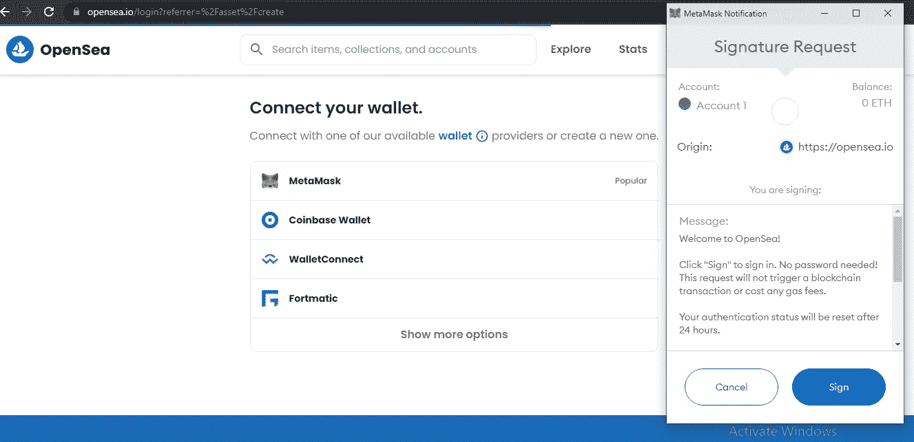
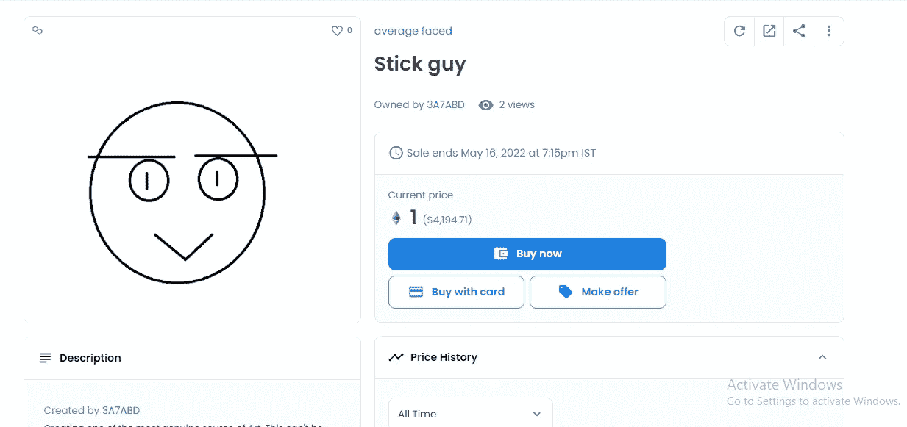

# 如何在不支付任何费用的情况下列出您的第一个 NFT

> 原文：<https://javascript.plainenglish.io/how-to-list-your-first-nft-without-paying-any-charges-53ead5ee039d?source=collection_archive---------5----------------------->

## 销售 NFT 的初学者指南。

Photo by [Monica Garniga](https://unsplash.com/@dolis_ly?utm_source=medium&utm_medium=referral) on [Unsplash](https://unsplash.com?utm_source=medium&utm_medium=referral)

一个[**【NFT】**](/all-about-nft-that-every-programmer-should-know-bcb933d4e71b)基本上就是一个**不可替代的令牌**。它基本上是存储在数字账本上的数字数据。简而言之，它基本上是**一种**数字资产。

有许多创作者愿意在网上列出他们的第一幅 NFT 作品，并试图以应有的价格出售。但是，由于目前的市场收费，许多人不想支付巨额费用，只是让他们的 NFT 引人注目。

刊登你的 NFT 意味着让全世界的买家都可以看到它。那些真正认为你的 NFT 物有所值的人肯定会很乐意投资你的 NFT，并获得你的艺术品的所有权

在这篇文章中，我们将讨论如何轻松地列出你的 NFT，让世界各地的买家都能买到。

 [## 埃隆·马斯克讨厌 Web 3.0、NFT 和区块链技术吗

### 埃隆·马斯克在 Web3.0 和 NFT 上发布的推文

medium.datadriveninvestor.com](https://medium.datadriveninvestor.com/does-elon-musk-hate-the-idea-of-web-3-0-nft-and-blockchain-technology-ff7b28601c17)  [## 什么是区块链，为什么所有程序员都应该了解它

### 一篇关于区块链的信息性文章。

javascript.plainenglish.io](/what-is-blockchain-and-why-all-programmers-should-know-about-it-897d73c24a75) 

## 你需要一个钱包

首先，在出售你的任何 NFT 之前，你需要一个安全的、能够存放你的密码的钱包。您的钱包也将是登录您的 NFT 门户网站的真正钥匙。

在本教程中，我们将使用一个 [**元掩码**](https://metamask.io/index.html) 钱包。这是目前每个 NFT 卖家或买家用来交易密码的最佳钱包。你只需要下载它并创建你的密码。就是这样。

你不需要添加任何卡的细节来出售 NFT，因为你只需要 MetaMask 来接受你的 NFT 付款。基本上，我们将使用 MetaMask 钱包来接收以太坊。

所以基本上把 MetaMask 钱包添加到你的 chrome 扩展中。**免费**记下你的**密码**和**恢复阶段。**一旦你设置好你的 MetaMask 钱包，你就完成了一半的工作。

Add extension to your Chrome browser

 [## 什么是加密货币？作为程序员可以做一个吗？

### 揭开加密货币的基础。

javascript.plainenglish.io](/what-is-cryptocurrency-can-you-make-one-as-a-programmer-5cc92bdfb651) 

## 出售你的 NFT

要列出你的 NFT，我们将使用**平台。它基本上是 NFT 销售平台的主要来源。**

****1。一旦你在 Chrome 浏览器中浏览了 Open Sea，你就会看到这个页面——****

****

**[Open Sea](http://opensea.io) platform landing page**

****2。点击创建选项，您将需要从 MetaMask chrome 扩展直接登录到平台—****

****

**Login Page**

**点击创建并选择 MetaMask wallet 登录到 Open Sea 平台。点击 MetaMask 后，你会得到 MetaMask chrome 扩展的提示，然后点击 sign。现在，您已经通过元掩码扩展成功登录到**公海**平台**

** [## 2022 年的技术趋势

### 2022 年需要的技能。

javascript.plainenglish.io](/technologies-that-will-trend-in-2022-122d2dcf5ca3)** 

****3。添加您在 NFT 的详细信息—****

**一旦您使用 Meta Mask 登录到 Open Sea 平台，您需要添加您愿意出售的 NFT 的详细信息。**

****

**Add your NFT**

**添加所有必需的细节，如**名称**和**描述。跳过所有现在不需要的细节。此外，跳过收集部分，因为这是你的第一次 NFT。****

****4。选择区块链为多边形—****

****

**Select Blockchain as Polygon**

**选择区块链作为多边形将确保您不会被收取任何费用来列出您的 NFT。现在点击**创建**选项。**

** [## 每个程序员都应该读的 3 本书

### 帮助我理解编程基础的书籍。

javascript.plainenglish.io](/3-books-every-programmer-should-read-97ac12422cfb)** 

****5。卖掉你的 NFT —****

**创建 NFT 后，选择“出售”选项。**

****

**Sell your NFT**

****6。添加必要的金额—****

****

**The amount you want for your NFT(DEMO)**

**保持一个公平的数量，你希望你的买家购买你的 NFT。输入金额后，点击**完成列表。****

****7。使用 MetaMask Wallet 登录—****

****

**只需点击签名选项，并允许您的 MetaMask 钱包签名的价格。点击 MetaMask 钱包上的签名，您就完成了。**

**万岁！现在，你已经成功地免费刊登了你的第一张 NFT，无需支付任何费用。**

**8。让买家购买你的 NFT —**

**由于您已经成功创建了您的 NFT，现在买家可以用提到的金额购买您的 NFT。一旦他支付了金额，它将自动转移到您的 MetaMask 钱包。您也可以将您的 [**NFT 链接**](https://opensea.io/collection/average-faced) 分享给合适且感兴趣的买家。**

****

**[**NFT was created by me**](https://opensea.io/collection/average-faced)**

**你可以在这里查看我的 NFT，因为它已经成功上市，任何买家都可以购买。**

**我希望这篇文章对那些试图列出他们的 NFT 的创作者有所帮助。遵循这些步骤，如果你愿意上市你的 NFT 没有支付任何沉重的费用。这肯定会给人们和创作者带来巨大的力量，给他们销售数字艺术的新的可能性。**

** [## 通过我的推荐链接加入 Medium-Aniket

### 作为一个媒体会员，你的会员费的一部分会给你阅读的作家，你可以完全接触到每一个故事…

aniketz.medium.com](https://aniketz.medium.com/membership)  [## 每个程序员都应该关注的 3 个 YouTube 频道

### 我推荐您观看节目内容的最佳 YouTube 频道

javascript.plainenglish.io](/3-youtube-channels-every-programmer-should-follow-66952f1f24e4)  [## 你应该考虑在 2022 年获得的三大 IT 认证

### 真正值得的软件开发人员最佳证书。

javascript.plainenglish.io](/top-3-it-certifications-you-should-consider-getting-in-2022-be852376b083) 

*更多内容看*[***plain English . io***](http://plainenglish.io/)**