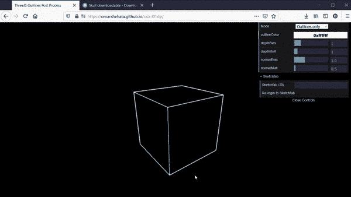
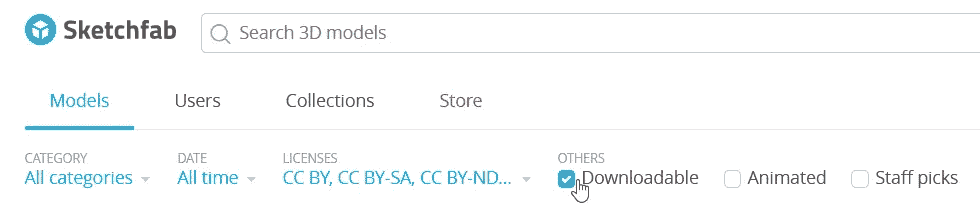
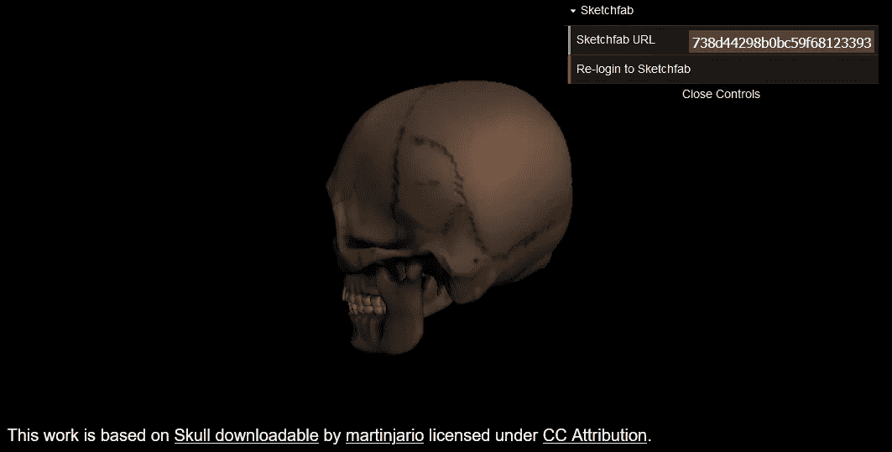

# 如何在 Three.js 应用中直接加载 Sketchfab 模型

> 原文：<https://javascript.plainenglish.io/how-to-load-sketchfab-models-directly-in-a-threejs-app-f4e76bacf5e6?source=collection_archive---------4----------------------->


Photo by [Christopher Gower](https://unsplash.com/@cgower?utm_source=medium&utm_medium=referral) on [Unsplash](https://unsplash.com?utm_source=medium&utm_medium=referral)

Sketchfab 的 API 为您提供了对 web 上最大的 glTF 3D 模型集合的编程访问。本文通过一个简单的代码示例向您展示如何:

1.  让您的用户使用 Sketchfab API 进行身份验证
2.  以包含 glTF 的 zip 文件的形式下载 3D 模型
3.  将这个 zip 文件加载到 Three.js 中

**源代码:**

[](https://github.com/OmarShehata/threejs-sketchfab-example) [## OmarShehata/three js-sketch fab-example

### 这是一个简单的代码示例，说明如何将 3D 模型作为 glTF 从 Sketchfab API 加载到 ThreeJS 场景中。它表明…

github.com](https://github.com/OmarShehata/threejs-sketchfab-example) 

## 它是如何工作的

我最初实现这一点是为了让我的 [WebGL 大纲教程](https://omar-shehata.medium.com/how-to-render-outlines-in-webgl-8253c14724f9)的读者看到他们选择的测试用例的效果，因为我一直在寻找对我的特定极限情况不起作用的算法(但直到我实现/下载并运行它之后，我才会发现)。

这是让用户引入自己的数据(或数百万个示例模型)的一种非常简单的方法。

您可以在这个大纲实时演示中看到它是如何工作的:

1.  打开试玩:【https://omarshehata.github.io/csb-l01dp/ 
2.  点击**登录 Sketchfab**
3.  当返回到应用程序时，在 **Sketchfab URL 字段**中粘贴一个模型的链接，如下:[https://sketch fab . com/3d-models/skull-downloaded-1a 9db 900738d 44298 b 0 BC 59 f 68123393](https://sketchfab.com/3d-models/skull-downloadable-1a9db900738d44298b0bc59f68123393)

该模型必须可由登录的 Sketchfab 帐户下载。



[The demo app](https://omarshehata.github.io/csb-l01dp/) loads a 3D model directly from any Sketchfab URL into a ThreeJS scene

## 1-使用 Sketchfab API 进行身份验证

第一步是用 Sketchfab 注册你的应用。这方面的说明如下:

 [## OAuth 登录-开发人员

### 了解如何通过添加 Sketchfab 身份验证来提高应用程序的 UX。

sketchfab.com](https://sketchfab.com/developers/oauth#registering-your-app) 

在撰写本报告时，目前的程序是与他们联系。

你需要选择一个**重定向 URI** 。这应该是您将部署应用程序的最终 URI。

您将希望使用**隐式**授权类型。我们不能在 web 应用程序中保守 API 密钥的秘密，所以我们转而依赖重定向 URI(如果有人恶意使用你的客户端 ID，Sketchfab 会在登录后将他们重定向到你真正的应用程序，不管是谁发起了登录)。

注册应用程序后，您将拥有一个**客户端 ID** 。

您将使用它将用户发送到 Sketchfab 进行登录，如下所示:

```
const CLIENT_ID = 'YOUR_CLIENT_ID_HERE';
const AUTHENTICATION_URL = `https://sketchfab.com/oauth2/authorize/?state=123456789&response_type=token&client_id=${CLIENT_ID}`;
window.open(AUTHENTICATION_URL, '_blank');
```

一旦登录完成，您需要从 URL 获取访问令牌**。您可以在源代码中找到这样做的代码片段，并将其存储在本地存储中，如下所示:**

[https://github . com/OmarShehata/three js-sketch fab-example/blob/b 780 b 8 C1 EAC 37 fc 71 d8d 803 fc 465 c 874 EFD 5954 c/sketchbaintegration . js # L77-L92](https://github.com/OmarShehata/threejs-sketchfab-example/blob/b780b8c1eac37fc71d8d803fc465c874efd5954c/SketchfabIntegration.js#L77-L92)

您将在后续的 API 调用中使用这个令牌。

## 2-下载 3D 模型

一旦有了令牌，就可以用它来获取 glTF 模型的下载 URI。

下面是获取下载 URI 的代码片段给定任何 Sketchfab URI 如下:[https://sketch fab . com/3d-models/skull-download-1a 9db 900738d 44298 b 0 BC 59 f 68123393](https://sketchfab.com/3d-models/skull-downloadable-1a9db900738d44298b0bc59f68123393)

[https://github . com/OmarShehata/three js-sketch fab-example/blob/b 780 b 8 C1 EAC 37 fc 71 d8d 803 fc 465 c 874 EFD 5954 c/sketchbaintegration . js # L95-L115](https://github.com/OmarShehata/threejs-sketchfab-example/blob/b780b8c1eac37fc71d8d803fc465c874efd5954c/SketchfabIntegration.js#L95-L115)

请注意，如果登录的用户没有下载该模型的权限，此请求将会失败。对于需要购买的商店模型或不可下载的免费模型来说，情况就是如此。

您可以在 Sketchfab 搜索中筛选可下载的模型:



这将显示您可以下载的免费模型或可以购买的模型。

现在我们有了一个包含 glTF 模型的 zip 文件的 URL，我们可以将它传递给 ThreeJS 来加载它。

## 3 —将 ZIP 文件加载到 ThreeJS 中

这是我的棘手之处。通常 ThreeJS 需要一个指向 glTF 文件的直接 URL。为了从一个 zip 文件中加载它，我们将(1)使用 JSZip 将内容解压缩到内存中。

我们不能只将解压缩后的原始内容传递给 ThreeJS，因为 glTF 文件可能通过文件路径(图像或几何资源)引用其他文件。所以我们需要(2)为每个资源创建一个 [Blob](https://developer.mozilla.org/en-US/docs/Web/API/Blob) ，并且(3)用 Blob URI 覆盖 glTF 文件请求的资源。

例如，如果 glTF 文件试图加载“textures/default mat _ base color . JPEG”作为相对文件路径，我们会检测到这一点，并传递以下 URI:

```
//Unzip from JSZip
const file = unzippedBaseColorJPEGFile;
// Create a Blob from this file
const blob = await file.async('blob');
// Create a URL to this Blob
const baseColorBlobUrl = URL.createObjectURL(blob);
// Use ThreeJS's loading manager so instead of loading from relative filepaths we load from the blob URI's we createdconst loadingManager = new THREE.LoadingManager();                            loadingManager.setURLModifier((url) => { if (url == 'textures/defaultMat_baseColor.jpeg') {
    return baseColorBlobUrl;
  }});
```

我们使用 ThreeJS 的 LoadingManager 来完成这项工作。

下面是代码片段，它可以获取任何压缩的 glTF 的 URL，并将其加载到 ThreeJS 中:

[https://github . com/OmarShehata/three js-sketch fab-example/blob/b 780 b 8 C1 EAC 37 fc 71 d8d 803 fc 465 c 874 EFD 5954 c/sketchbaintegration . js # L30-L70](https://github.com/OmarShehata/threejs-sketchfab-example/blob/b780b8c1eac37fc71d8d803fc465c874efd5954c/SketchfabIntegration.js#L30-L70)

## 4-显示属性

在应用程序中使用 Sketchfab 中的 3D 模型要求您显示原作者的署名。在 Sketchfab 上阅读更多相关信息。

我们可以从这个[数据 API 路径](https://docs.sketchfab.com/data-api/v3/index.html#!/models/get_v3_models_uid)中自动获取属性和许可信息。

下面是一个函数，它将在给定 modelID 的情况下构造属性文本:

[https://github . com/OmarShehata/three js-sketch fab-example/blob/8d 126d 00 faf 47 FB 0 b 99 f 2 f 7 c 78 a 25332 CFB 7 b/sketchbaintegration . js # L121-L142](https://github.com/OmarShehata/threejs-sketchfab-example/blob/8d126d00faf47fb0b99f9f2f7c78a25332ccfb7b/SketchfabIntegration.js#L121-L142)

示例应用程序将在左下角显示属性，链接到原始模型 URL、作者的 Sketchfab 个人资料和许可证。



## 已知问题

加载一些 Sketchfab 模型的一个问题是，它们的比例将比当前视口大得多。另一个问题是，有些模型可能不会以原点为中心，所以它们在加载时可能不可见。

在 ThreeJS 中加载模型时对它们进行标准化和缩放将有助于解决这个问题，类似于 Don McCurdy 的 glTF 查看器的工作方式。

感谢阅读！如果你觉得这很有帮助，请关注我的 Twitter @Omar4ur 来查看我的更多作品。不然你也可以在这里找到我[。](https://omarshehata.me/)

[*更多内容尽在 plainenglish.io*](http://plainenglish.io/)