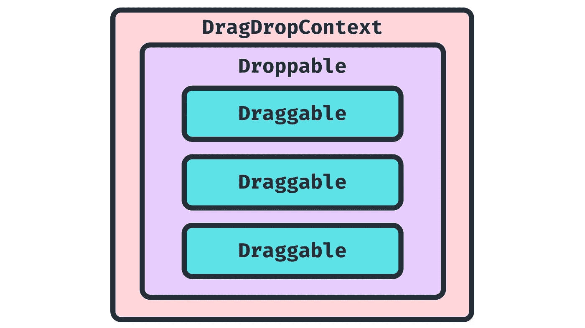
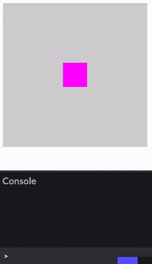
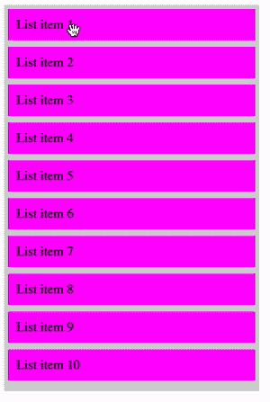

# 如何使用 react-beautiful-dnd 制作一个拖拽列表

> 原文：<https://javascript.plainenglish.io/how-to-make-a-drag-and-drop-list-using-react-beautiful-dnd-bca897774bc8?source=collection_archive---------4----------------------->


Photo from Valerii [https://www.canva.com/p/valeriimingirov/](https://www.canva.com/p/valeriimingirov/)

# 简介:什么是 react-beautiful-dnd？

是一个用于创建拖放列表的 React 库，由 Atlassian 构建。这个图书馆有许多很大的特点:

*   简单易用的 API
*   无障碍兼容( [*全键盘支持和屏幕阅读器支持*](https://github.com/atlassian/react-beautiful-dnd/blob/master/docs/about/accessibility.md) )
*   移动和触摸设备友好

另一个流行的 React 拖放库是`[react-dnd](https://react-dnd.github.io/react-dnd/docs/overview)`。`react-beautiful-dnd`比`react-dnd`简单得多，但是有一些限制，主要是为垂直和水平列表的拖放而设计的。

在这篇博客中，我们将关注`react-beautiful-dnd`——如何设置它，关于 API 的一些细节，以及最后如何实现一个可重新排序的列表。

# 安装

`**react-beautiful-dnd**`是一个 [NPM 包](https://github.com/atlassian/react-beautiful-dnd)。首先，使用 npm 或 yarn 在命令行上安装它:

```
*# Using npm* npm i react-beautiful-dnd*# Using yarn:* yarn add react-beautiful-dnd
```

然后，通过导入，您可以在您的`React`程序中的任何地方使用该包:

```
import { DragDropContext, Droppable, Draggable } from 'react-beautiful-dnd';
```

# 了解 API

`react-beautiful-dnd` API 为我们提供了 3 个主要构件:

## **1) DragDropContext**

要使用拖放，您需要用`**<DragDropContext>**`包装您的`React`树中您希望能够使用拖放的部分。它接受`onDragStart`和`onDragEnd`回调，允许你在用户开始/停止拖动时做一些事情

## **2)可拖动**

要使特定的元素可拖动，需要用`**<Draggable>**`包装它。`<Draggable />`的`React`子节点必须是返回`ReactNode`的函数。该功能有两个支柱:

*   `**provided**`**(**`**DraggableProvided**`**)**——这个物体给了我们一个`ref`和一些`props`需要应用到我们想要拖动的元素上。
*   `**snapshot**`**(**`**DraggableStateSnapshot**`**)**——包含当前拖动状态的相关数据，如`isDragging`存储该元素当前是否被拖动。

## **3)可丢弃**

包裹在`**<Droppable>**`中的元素代表了`**<Draggable/>**`元素可以放入的区域。一个`Droppable`必须至少包含一个`Draggable`项。

`Droppable`儿童功能与`Draggable`类似，接受`**provided**` : ( `DroppableProvided`)和`**snapshot**` ( `DroppableStateSnapshot`)作为道具。



关于这些组件的更多细节，我建议查看[官方文件](https://github.com/atlassian/react-beautiful-dnd/tree/master/docs/api)。

# 构建可重新订购的域名列表

利用我们刚刚学到的知识，现在让我们看看如何使用`react-beautiful-dnd`构建可重新排序的列表。

## 第一步。建造一个可拖动的盒子

首先，让我们在一个容器中构建一个简单的可拖动的盒子。查看下面的反应代码:

*   它有一个单一的`**Draggable**`组件，用`className: item`包裹`div`。这是用`className: container`包裹在`**Droppable**` `div`里面，整个东西都是用`**DragDropContext**`包裹着的
*   在`onDragEnd`中，我们只是给控制台写一条信息
*   我们根据当前是否被拖动(即`snapshot.isDragging`)来添加和删除`item`中的类名
*   我们根据当前是否被拖动来添加和删除`container`中的一个类名(即`snapshot.isDraggingOver`

下面是一些简单的 CSS 来定位容器和项目，并在拖动时改变每个的`background-color`:

这里有一个运行中的代码示例。您会注意到拖动时每个元素的颜色都发生了变化，然后在拖动操作完成时`"Drag ended"`会被记录到控制台:



## 第二步。添加到我们的解决方案中以构建一个可重新排序的列表

现在让我们扩展上面的代码，得到一个可拖动项目的完整列表。首先，这里有一个小的帮助函数来重新排序一个列表。它接受您想要移动的项目的`list`，以及`startIndex`和`endIndex`，返回重新排序的列表:

现在，让我们扩展一下上面的`DraggableExample`组件。在下面的 React 代码中:

*   我们在 React 状态下存储了一个列表`items`。初始值只是一系列从 1 到 10 的数字
*   我们现在不是只呈现一个`<Draggable>`项目，而是循环遍历`this.state.items`并为列表中的每个项目呈现一个`<Draggable>`
*   `onDragEnd`修改为对列表中的项目进行重新排序。该方法接受类型为`DropResult`的`result`，它包含拖动操作的源和目标索引。我们使用这个源和目的地从上面调用我们的`reorder()`方法
*   从`reorder()`获得更新后的列表后，我们更新`this.state.items`

下面是更新后的 CSS 来呈现列表项:

可再订购免打扰列表现已完成。在下面的 GIF 中查看最终结果，或者您可以在 Codepen 上亲自尝试🎉



# 资源

以下是一些额外的资源:

*   `[react-beautiful-dnd](https://github.com/atlassian/react-beautiful-dnd)` [公文](https://github.com/atlassian/react-beautiful-dnd)
*   [纱线上的包装信息](https://yarnpkg.com/package/react-beautiful-dnd)
*   [反应堆和库](https://react-dnd.github.io/react-dnd/docs/overview)
*   [使用`react-beautiful-dnd`将](https://egghead.io/courses/beautiful-and-accessible-drag-and-drop-with-react-beautiful-dnd)列入黑名单
*   【freecodecamp 教程

*感谢您的阅读，希望能有所帮助！*