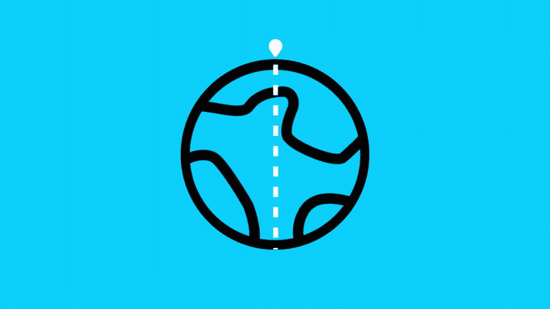

# 你知道地球的另一边有什么吗？

> 原文：<https://javascript.plainenglish.io/how-to-make-a-google-floom-clone-d98566b3d557?source=collection_archive---------17----------------------->

## 从你所在的地方找出地球的另一边有什么。


floom.withgoogle.com

谷歌刚刚宣布了 Android 设备上谷歌浏览器的一些更新。其中一个更新是 Floom。这是一个有趣的工具，它在增强现实中显示了你附近地球上的洞。所以你可以从你现在站的地方看到地球的另一边有什么。



听起来很有趣，但它只能在 Android 设备上使用。不幸的是，我是 iPhone 的所有者，不能尝试这个功能。我无法摆脱这种想法。知道另一边是什么很有趣，我决定调查这个问题。

首先我发现这个另一边叫做**对跖**。

地球上任何地方的对跖点都是地球表面上与其完全相反的点。当通过球体中心的直线连接时，两个点是对跖的。对跖点通常被称为对跖点。

原来一点都不复杂。我们需要计算对面的坐标，并用卫星视图在谷歌地图上显示这个地方。然后我决定实现我的小应用程序，它将显示任何位置的对跖地。

## 现场演示

在文章的最后，你会找到演示的链接，在那里你可以允许自己定位你的坐标，并显示你所在位置的对跖点。或者点击地球上的任何一个地方，看看另一边有什么。

## 履行

这个项目很简单。我们需要创建一个附带谷歌地图 SDK 的 HTML 文件。你可以在这里找到如何获得 API 密匙。

然后我们需要创建一个带有地图初始化的 JavaScript 文件。

```
let map;
let markers = [];
let center = { lat: 50.4501, lng: 30.5234 };
let antipode = document.getElementById('antipode');
let mini = document.getElementById('mini');function initMap() {
  map = new google.maps.Map(document.getElementById('map'), {
    zoom: 14,
    center
  });
}
```

添加在地图上放置标记的功能。

```
function addMarker(location) {
  setMapOnAll(null);
  markers = [];
  const bounds = new google.maps.LatLngBounds();
  const marker = new google.maps.Marker({
    position: location,
    map: map
  });
  markers.push(marker);
  bounds.extend(location); map.fitBounds(bounds);
}
```

然后用浏览器 API 检测用户位置。

```
function getCurrentLocation() {
  if (!navigator.geolocation) {
    alert('Geolocation is not supported by your browser');
  } else {
    navigator.geolocation.getCurrentPosition(success, error);
  }
}function success(position) {
  const point = {
    lat: position.coords.latitude,
    lng: position.coords.longitude
  }; addMarker(point);
}function error() {
  alert('Unable to retrieve your location');
  addMarker(center);
}
```

最重要的部分是计算对面的坐标。怎么做？

```
function getAntipode(point) {
  return {
    lat: point.lat * -1,
    lng: point.lng < 0 ? point.lng + 180 : point.lng - 180
  };
}
```

从球体上的坐标，取**纬度**的相反值(加上或去掉一个减号-)。**经度**加减 180(保持在区间[-180；+180])，用于 GPS 坐标。

之后，我决定使用 Google 静态地图 API 来显示对跖地的卫星视图。为了使它更有趣，我在图片上方添加了一个透明的 png，使它看起来像一个洞。

然后我意识到检查不同位置的对跖点很有趣。因此，我们需要添加点击地图和检查对映体的能力。

这是最终的 js 文件:

而这里是[演示](https://whats-on-another-side.web.app/)。

## 结论

我们星球上的大部分陆地位于海洋的另一边。所以，如果你在你所在的地方的另一边发现了什么，你是幸运的。

感谢阅读！你可以在 Medium 上关注我，获取更多科技文章，也可以在 [Twitter](https://twitter.com/golosay) 上找到我。

*更多内容尽在*[*plain English . io*](http://plainenglish.io/)