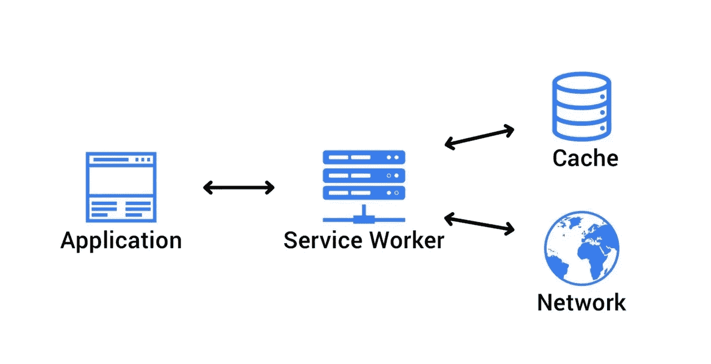
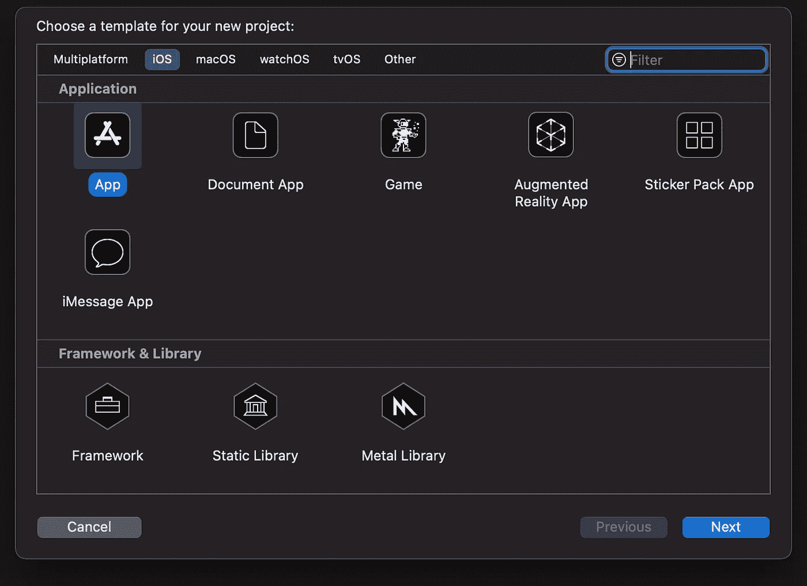
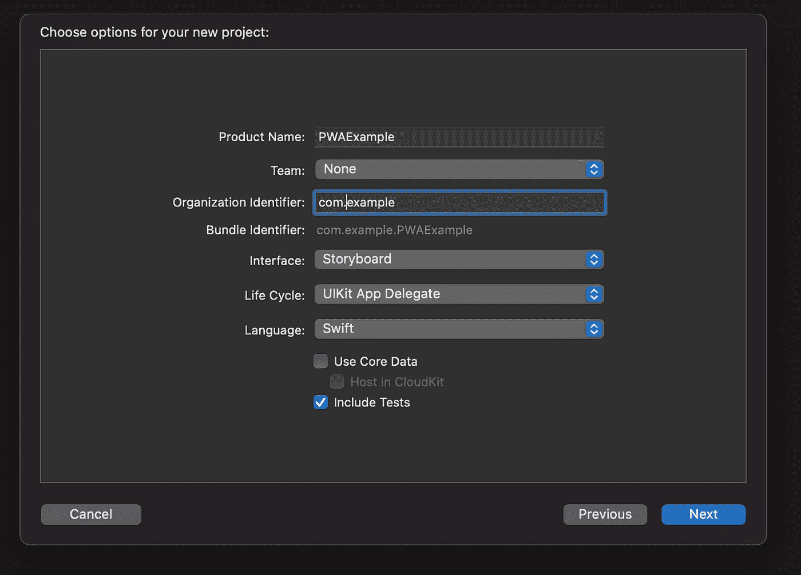
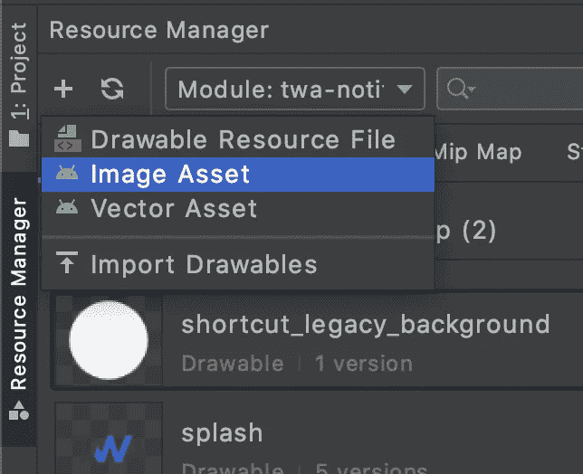
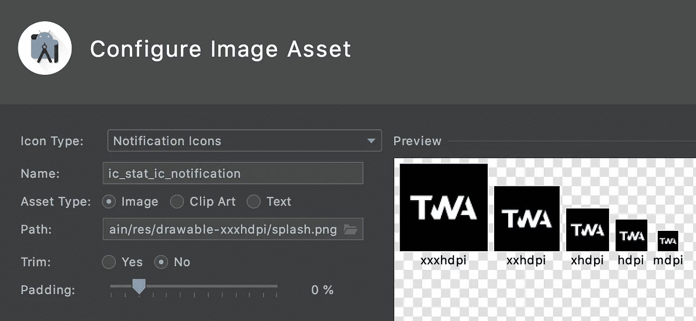

# 如何使用原生包装器制作渐进式 Web 应用程序(PWA)

> 原文：<https://javascript.plainenglish.io/how-to-make-a-pwa-with-a-native-wrapper-9308b5f70f65?source=collection_archive---------16----------------------->

[*由*](https://medium.com/@kateshokurova) [*康斯坦丁·博日科夫*](https://blog.shakuro.com/wp-admin/edit.php?post_type=post&author=36)*[*开发人员在*](https://medium.com/@kateshokurova)*

**

*illustration by Jiani Ma*

*前段时间，我们写了一篇关于渐进式 Web 应用技术的商业价值和本质的文章。今天是时候深入一点技术细节，并向您展示如何通过几个步骤用 PWA 制作一个原生应用程序。*

*重点是，虽然 pwa 速度快，比原生应用程序轻量级得多，而且通常更灵活，但它们有一些我们在上一篇文章中讨论过的限制，主要与它们不能出现在应用程序商店有关。因此，合乎逻辑的后续问题是，是否有可能采用 PWA 并使其看起来像一个原生应用程序，在应用程序商店中发布它，以及所有事情？有！事实上，我们已经提到过它，并讨论了它的好处和要求。是时候研究如何实际创建一个了。*

# *如何制作 PWA*

*首先，让我们看看如何制作一个 PWA。*

***重要注意事项:**你的网站必须有 SSL 证书并支持 HTTPS 协议。不遵守这些要求，PWAs 就无法工作。*

*你需要知道，一个现代的 PWA 申请包括以下关键要素:*

*   *Manifest.json 文件*
*   *服务人员。*

*让我们仔细看看它们。*

# *Manifest.json*

*这个文件的目的是告诉浏览器你的网站可以作为一个渐进的应用程序来执行。它包含应用程序的名称、图标和其他必要信息。你可以在这篇文章中找到更多关于它的参数[。](https://web.dev/add-manifest/)*

*只需添加 Manifest.json 文件，浏览器就会将您的网站视为 PWA，并将其安装为移动应用程序。但到目前为止，它与真正的移动应用程序几乎没有共同之处。*

# *服务人员(软件)*

*简单来说，它是浏览器和你的网站之间的一层。服务工作者是后台执行的脚本，无法阻塞 JavaScript 执行线程，在单独的线程中执行。关键点在于，SW 运行在 *worker* 上下文中，并且不能访问文档对象模型(DOM)。*

**

*服务工作者有自己的生命周期事件。你可以在这里找到更多关于他们的信息。*

*SW 还允许您缓存和欺骗来自浏览器的网站请求。例如，知道你所有的 CSS 和 JS 文件没有改变，你可以缓存它们。在这种情况下，浏览器将从服务人员那里接收这些文件，而无需向您的站点发出请求。*

*为了方便在 SW 中使用 cache 工作，Google 开发了一组 [workbox 库](https://developers.google.com/web/tools/workbox)。本文后面显示的代码就是使用这些库编写的。Workbox 提供了几种缓存策略，旨在满足各种各样的需求。你可以在[谷歌开发者](https://developers.google.com/web/tools/workbox/modules/workbox-strategies#:~:text=A%20caching%20strategy%20is%20a,them%20in%20your%20service%20worker.)上阅读更多关于这些策略的信息。*

***如何连接服务人员***

*要连接 SW，您需要使用浏览器 API，它提供了一种注册 workers 的方法。通常，连接代码有一个通用的形式，你可以在这里熟悉[。](https://gist.github.com/andrew-bazhanov/5dae992c1b1eeb727800a27419100ce2#file-include-sw-js)*

***带工具箱的缓存***

*如前所述，workbox 提供了不同的缓存策略，每种文件类型都需要自己的策略。例如，字体文件最少受到更改，因此，它们可以设置为更长的过期时间。这实际上是一个非常宽泛的话题，我们建议你使用[我们的例子](https://gist.github.com/andrew-bazhanov/d65b8366ad7c0eacf371fa805ecd8efb#file-offline-sw-js)。*

# *如何制作离线模式*

*为了使您的 web 应用程序更类似于本地应用程序，它必须能够在没有互联网连接的情况下工作。*

***完全离线***

*全面离线模式的实现意味着缓存的本地化使用。并不是每个 PWA 应用程序都需要它，因为它可能需要很长时间。主要的想法是在缓存我们的应用程序的所有 HTML 页面，以及一些应用程序正常工作所需的后端响应。与此同时，我们需要让我们的 web 应用程序显示一个弹出窗口或提示来通知用户，并继续进一步处理缓存的数据。在本文中，您可以阅读更多关于服务人员和 web 应用程序[之间的通信。](https://felixgerschau.com/how-to-communicate-with-service-workers/)*

*这个主题很难进行更详细的分析，因为这种方法严重依赖于 web 应用程序本身的架构，并且没有一个普遍接受的实现。*

***离线叠加***

*这个任务的实现几乎总是有相同的解决方案:在安装服务工作器的时候，它沿着 HTML 页面后面的某个路径发出请求，并缓存它。在没有互联网连接的情况下，页面内容将作为覆盖图显示给用户。我们建议在这个页面上添加一个带有``location.reload ()``的刷新按钮，这样当用户确定他们的互联网连接已经恢复时，他们就可以更新应用程序而不必重启它。*

*我们建议在你的网站上创建一个*/离线*页面。然后用[我们的例子](https://gist.github.com/andrew-bazhanov/d65b8366ad7c0eacf371fa805ecd8efb#file-offline-sw-js)。*

# *如何启用 PWA 安装*

*关于这一点[这里有充足的信息](https://web.dev/customize-install/)。*

# *如何使用 PWA 制作 iOS 和 Android 的原生应用*

*目标是在 Google Play 和 app Store 上发布一个 App，PWA 只能从浏览器安装。因此，我们需要一个包装 PWA 的包装，使它看起来像一个真正的本地交易。*

*要开发这种应用，你需要有开发经验的人来开发 iOS 或 Android。*

# *ios*

*对于本机包装器，我们需要创建一个 iOS 项目:*

****

*在新创建的项目中，添加一个 WKWebView。在这里，我们将展示我们的 PWA 应用程序。第一次启动并检查功能，只需调用*

```
*let urlRequest = URLRequest(url: appURL)
 webView.load(urlRequest)*
```

*进一步的定制包括实现 WKWebView 委托方法。要使它完全可操作，定义 3 个方法就足够了。*

*方法 1 告诉我们应用程序已经完成加载，例如，我们可以隐藏进度条:*

```
*func webView(_ webView: WKWebView, didFinish navigation: WKNavigation!)*
```

*在这里，我们向用户处理/显示加载错误:*

```
*func webView(_ webView: WKWebView, didFailProvisionalNavigation navigation: WKNavigation!, withError error: Error)*
```

*这种方法允许我们拒绝或限制/重定向导航。在 PWA 应用程序的情况下，只允许通过属于 PWA 的 URL 导航，而将其余的 URL 留给 Safari 是有意义的。*

```
*func webView(_ webView: WKWebView, decidePolicyFor navigationAction: WKNavigationAction, decisionHandler: @escaping (WKNavigationActionPolicy) -> Void) 
func webView(_ webView: WKWebView, decidePolicyFor navigationAction: WKNavigationAction, decisionHandler: @escaping (WKNavigationActionPolicy) -> Void) {
        guard let url = navigationAction.request.url else {
            decisionHandler(.allow)
            return
        }
        if let host = url.host, host.lowercased().contains(Constant.allowedHost) {
            decisionHandler(.allow)
        } else {
            if UIApplication.shared.canOpenURL(url) {
                UIApplication.shared.open(url, options: [:], completionHandler: nil)
            }
            decisionHandler(.cancel)
        }
    }*
```

*你可以在这里找到完整的项目[。](https://gitlab.com/shakuro-public/ios_pwa_wrapper)*

# *机器人*

*根据我们的主题，您可以在 Android 上开发 3 种类型的应用程序:*

*   ***WebView。**此选项意味着启动您自己的浏览器来执行 PWA。*
*   ***自定义选项卡。**您的应用程序将使用用户自己的浏览器，而无需创建您自己的浏览器。这个选项适用于已经存在的本地应用程序，以及需要打开网页的情况。这种方法不太适合 PWA 执行，因为用户会看到浏览器工具栏。*
*   ***可信网络活动(TWA)** 。实现 PWA 应用程序的标准。有了这个选项，您使用用户浏览器的方式使得他们不会注意到它，这与自定义选项卡相反。*

*好的，我们理解我们需要使用 TWA 方法，但是它的特点是什么呢？*

1.  *我们的 TWA 应用程序和浏览器有一个共同的上下文，这提供了以下优势:如果用户登录到 web 版本的应用程序，他们也登录到 TWA，反之亦然。*
2.  *您不能将 JavaScript 代码注入页面。此外，无法访问 PWA 和服务器之间执行的内容和请求。这些限制确保了用户的安全。但是我们仍然可以通过查询参数传递数据。*
3.  *我们的 PWA 应用程序只能从引用头“知道”它是作为 TWA 启动的。而在 iOS 中，我们可以很容易地从``window.navigator.userAgent``确定这一点。*
4.  *我们仍然能够使用本机平台功能，例如推送通知。*

*为了创建一个 TWA，我们建议使用[泡泡糖](https://github.com/GoogleChromeLabs/bubblewrap)(对于网络开发者来说)，或者 [Android 浏览器助手](https://github.com/GoogleChrome/android-browser-helper)。整个开发过程只包括对已经完成的项目进行配置，即对`build.gradle`文件进行修改。您可以在这里阅读更多关于创建 TWA [的内容。](https://developers.google.com/web/android/trusted-web-activity/quick-start)*

# *如何使用 PWA 发布本地应用程序*

# *应用商店*

*苹果在他们的[文档](https://developer.apple.com/app-store/submitting/)中有关于向应用商店提交应用的详细信息。如果你需要一个有经验的开发人员一步一步的指导，网上有很多，像[这个](https://codewithchris.com/submit-your-app-to-the-app-store/)。*

*请记住，经验告诉我们，最[常见的应用拒绝原因](https://developer.apple.com/app-store/review/#common-app-rejections)如下:*

*   *您严重违反了苹果的指导方针。*
*   *应用程序没有足够的功能被认为是完整的。*
*   *缺乏关于该应用程序的足够信息。*
*   *您没有足够清楚地说明请求访问设备硬件或用户数据的目的。*

# *谷歌游戏*

*谷歌也发布了一组描述应用程序发布过程的文章。*

*请注意，为了不显示浏览器界面(地址、菜单等。)在您的应用程序中将其添加到 Google Play 控制台后，您需要添加[此文件](https://domain.example/.well-known/assetlinks.json)包含以下内容:*

```
*[{
   "relation": ["delegate_permission/common.handle_all_urls"],
   "target": {
       "namespace": "android_app",
       "package_name": "com.company_name.twa.app_name",
       "sha256_cert_fingerprints": ["96:00:...:8D"]
   }
}]*
```

*`package_name`参数必须与您在创建应用程序时指定的参数`applicationId`相匹配。*

*`sha256_cert_fingerprints`参数必须包含将应用添加到 Google Play 控制台后生成的证书，该证书可以通过**应用签名- >应用签名证书- > SHA-256 证书指纹获得。***

# *加分。如何制作原生推送通知*

*目前，创建和发送推送通知的最佳工具是 Firebase，所以在下面的例子中，我们将使用这个特定的服务。*

*如果您不打算使用 PWA 开发本机应用程序，那么您可以使用服务工作者工具来实现推送通知。Firebase 提供了一篇关于它的详细文章。*

*通过 SW 实现推送通知的主要问题是用户必须同意，这可能会使他们不信任应用程序。这是因为服务人员会从用户访问的每个网站上下载。这种确认的存在是为了让他们避免被不请自来的通知轰炸。*

*与 SW 不同，本机应用程序可以在没有用户许可的情况下发送通知，因为它们在安装时对此表示同意。*

*在本文中，我们希望更详细地分析涉及使用本机应用程序的方法。*

# *机器人*

*如前所述，Firebase 已经退出竞争，我们的实现就是基于这项服务。*

*我们将在这里使用来自可用项目[的代码示例。](https://github.com/shakurocom/twa-notifications-example)*

***FCM 连接***

*首先，我们需要将 Google 服务添加到我们的依赖项中: [bundle.gradle](https://github.com/shakurocom/twa-notifications-example/blob/main/build.gradle#L27) 和 [app/bundle.gradle](https://github.com/shakurocom/twa-notifications-example/blob/main/app/build.gradle#L200) 。接下来，您需要下载 google-services.json 文件，您可以在本文中了解更多信息。将该文件放在[应用程序](https://github.com/shakurocom/twa-notifications-example/tree/main/app)中。*

***添加通知图标***

*请注意，Android 风格指南坚持认为图标必须是一个面具，即白色，以便 Android 以后可以用任何颜色填充它。此外，图标应该有不同的大小。要创建图标，请打开资源管理器，按+然后按 Image Asset。*

**

*在出现的窗口中，选择图标类型作为通知图标，并根据您的需要配置图标。*

**

*创建通知图标后，连接到[app/src/main/Android manifest . XML](https://github.com/shakurocom/twa-notifications-example/blob/main/app/src/main/AndroidManifest.xml#L58)中的 Firebase。*

***默认通知通道声明***

*当没有明确分配给通知的通道时，此通道接收通知。为此，我们需要将值添加到 [values/string.xml](https://github.com/shakurocom/twa-notifications-example/blob/main/app/src/main/res/values/srting.xml#L18) 中，并将其连接到[app/src/main/androidmanifest . XML](https://github.com/shakurocom/twa-notifications-example/blob/main/app/src/main/AndroidManifest.xml#L63)。*

***FirebaseMessagingService***

*这个类给了我们处理令牌接收的能力，以及在`onMessageReceived`方法中接收数据消息的能力。你可以在这里找到一个类扩展[的例子](https://github.com/shakurocom/twa-notifications-example/blob/main/app/src/main/java/com/shakuro/twa_demo_app/FcmService.java)，以及了解更多关于它的[连接](https://github.com/shakurocom/twa-notifications-example/blob/main/app/src/main/AndroidManifest.xml#L155)。*

*   ***onNewToken***

*安装后第一次启动应用程序时，以及清除数据后启动应用程序时，都会调用此方法。这是我们必须获取令牌并将其保存在存储器中的地方，我们[使用了](https://github.com/shakurocom/twa-notifications-example/blob/main/app/src/main/java/com/shakuro/twa_demo_app/FcmService.java#L106) SharedPreferences。由于 onNewToken 是在应用程序启动后调用的，我们需要[重启](https://github.com/shakurocom/twa-notifications-example/blob/main/app/src/main/java/com/shakuro/twa_demo_app/FcmService.java#L114)应用程序，以便使用令牌进行启动。实际上，重启应用程序的过程是不可见的。*

*   ***创建通知频道***

*为了简化示例，我们[创建了](https://github.com/shakurocom/twa-notifications-example/blob/main/app/src/main/java/com/shakuro/twa_demo_app/FcmService.java#L84)这种通知通道初始化方法，并将[称为](https://github.com/shakurocom/twa-notifications-example/blob/main/app/src/main/java/com/shakuro/twa_demo_app/FcmService.java#L26)。*

*   ***收到的 on 消息***

*为了理解何时调用这个方法，让我们看看通知和数据消息之间的区别。*

*数据报文*

1.  *它的有效载荷只有数据。*
2.  *有效负载可以有任何字段(标题、正文是可选的)。*
3.  *Firebase 云消息(FCM)不显示通知。*
4.  *它进入`onMessageReceived`，在那里我们可以，例如，根据来自 Firebase 的数据创建一个定制的通知。*

*通知*

1.  *通知中的有效负载是必需的，并且必须包含标题和正文。*
2.  *它可以从数据中接收有效负载，如果用户单击通知，就可以在 LauncherActivity 中获得该有效负载。*
3.  *FCM 显示一个通知，我们不能干预(比如添加一个按钮)。*

*从这些差异中，我们可以得出结论，这个方法只针对数据消息调用。*

*在我们的例子中，我们检查数据是否有有效载荷字段，然后调用传递`remoteMessage`的`createNotification`方法。*

*   ***创建通知***

*在我们的例子中，这个方法负责显示数据消息的通知。*

*   ***id***

*它不必是唯一的，但在将来，它可能是有用的，因为我们可以通过它的 id 找到并删除一个通知。*

*   ***通知意图***

*这是一个点击通知时发生的事件，即启动(重新启动)一个应用程序，将数据 URL 传输到数据。您也可以通过 putExtras 传输任何数据。*

*   ***行动意图***

*单击通知的(操作)按钮时发生的事件。*

***扩展 LauncherActivity 类***

*首先，让我们创建一个[geturlfromentintent](https://github.com/shakurocom/twa-notifications-example/blob/main/app/src/main/java/com/shakuro/twa_demo_app/LauncherActivity.java#L23)方法，负责从数据和附加内容中获取 URL。我们在`createNotification`中输入数据，而 extras 中的 URL 仅在发送带有[数据的通知时包含该数据:{ url }](https://github.com/shakurocom/pwa-for-twa-notifications-example/blob/main/api/index.ts#L24) 。*

*下一步是重写 getLaunchingUrl 方法。它负责在应用程序启动时返回 URL。此时，我们可以通过将令牌作为查询参数来修改 URL。你可以在这里了解更多关于这种方法的信息[。在我们的示例中，我们从 SharedPreferences 获取令牌。请注意，令牌并不总是存在。最常见的是在应用程序安装后第一次启动时，我们已经在 onNewToken 子句中提到过。](https://github.com/shakurocom/twa-notifications-example/blob/main/app/src/main/java/com/shakuro/twa_demo_app/LauncherActivity.java#L44)*

# *ios*

*与 Android 一样，Firebase 是这项工作的最佳选择。*

*目前，有两种方法可以将 FCM 令牌转移到 PWA 应用程序:*

*   ***JavaScript***

*WKWebview 允许在应用程序页面上执行 Javascript，因此我们可以在应用程序加载后随时将令牌传递给应用程序。*

```
***let** jsStr: String = "window.appNotifications.token = '\(token)';"
                actualSelf.webView.evaluateJavaScript(jsStr, completionHandler: { (_, **error**) **in**
                    **if** **let** actualError = **error** {
                        debugPrint(actualError)
                    }
                })*
```

*   ***加载 PWA 时通过 URL 参数传递令牌***

*在这种情况下，在下载 PWA 之前，我们需要发出一个请求，并等待 FCM 令牌被接收。*

```
*InstanceID.instanceID().instanceID { [**weak** **self**] (result, _) **in**
            **guard** **let** actualResult = result **else** {
                **return**
            }
           debugPrint(actualResult.token)
          // Load PWA URL here
        }*
```

*从安全角度来看，这种方法更可取，但有几个缺点:*

*   *如果 Firebase SDK 返回错误而不是`instanceID`，令牌只能在下次启动应用程序时重新发送。*
*   *启动应用程序时会有额外的延迟，因为我们需要等待令牌。*

*完整的项目可在[这里](https://gitlab.com/shakuro-public/ios_pwa_wrapper)获得。*

# *网*

*本机包装器将 FCM 令牌传递给 PWA 令牌。然后，您必须将它发送到后端，使它将用户与设备相关联。为此，您可以使用上述令牌创建一个字段，并在需要时刷新它。*

*你可以点击查看示例[。](https://github.com/shakurocom/pwa-for-twa-notifications-example)*

**由康斯坦丁·博日科夫、弗拉德·奥尼普琴科和凯特·绍库罗娃撰写**

*【https://shakuro.com】最初发表于[](https://shakuro.com/blog/how-to-make-a-pwa-with-a-native-wrapper)**。***

***更多内容请看*[***plain English . io***](http://plainenglish.io/)**