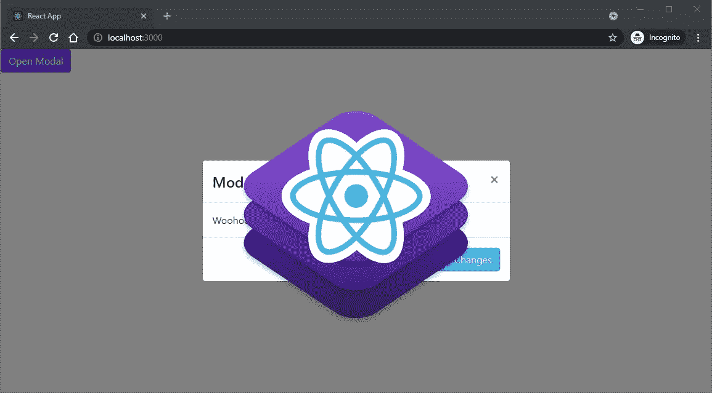
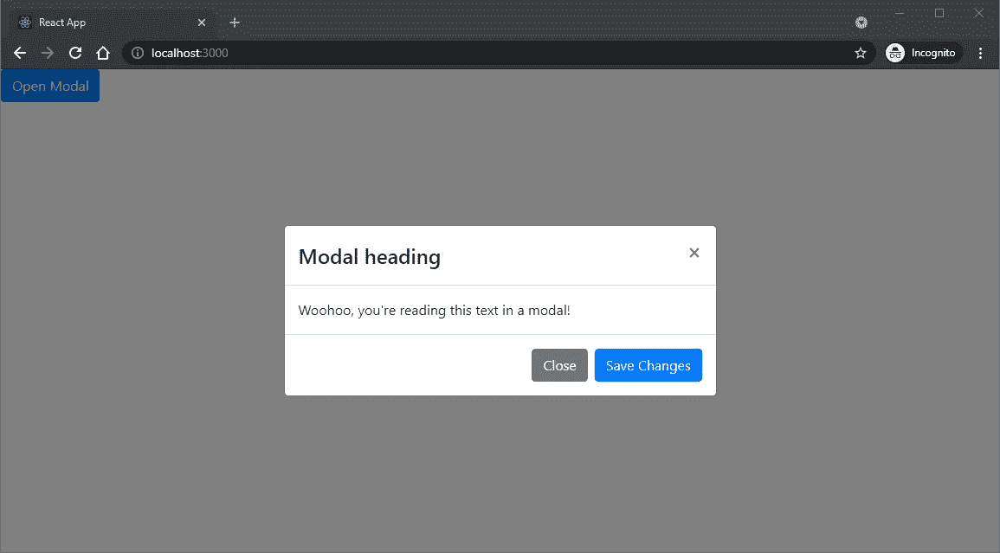
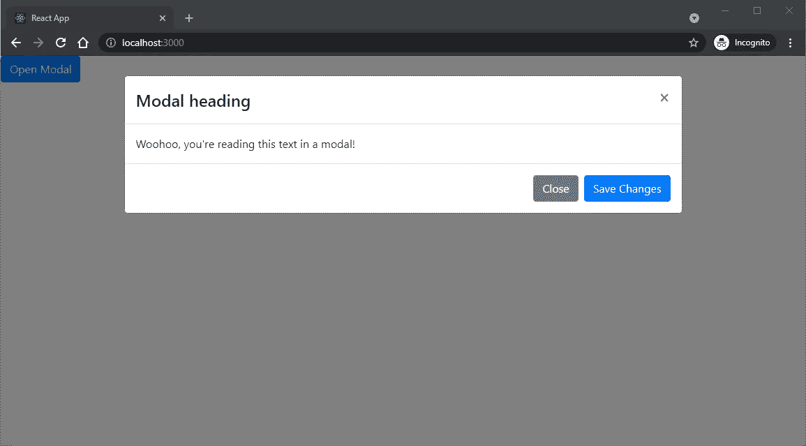
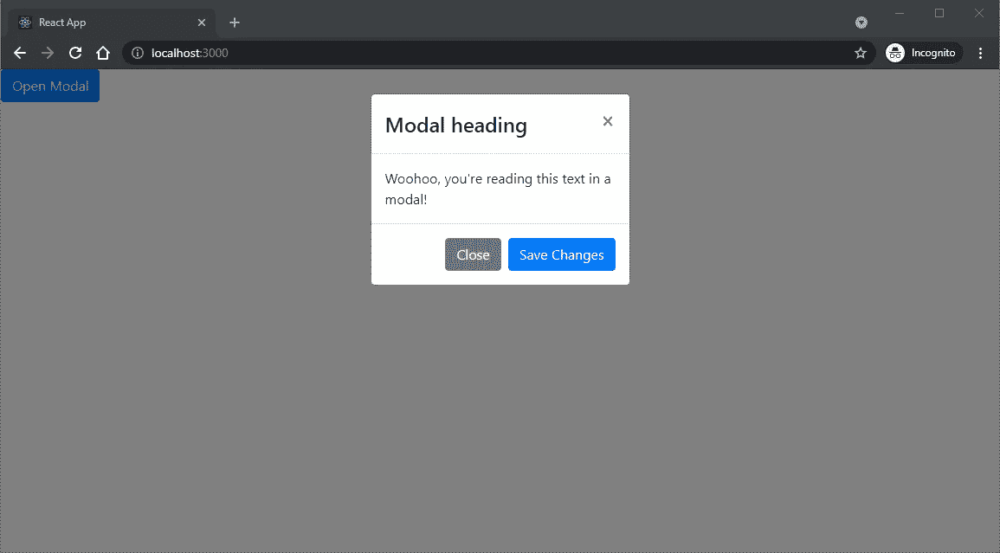

# 如何制作一个反应自举模型

> 原文：<https://javascript.plainenglish.io/how-to-make-a-react-bootstrap-modal-3e6f1c1d855d?source=collection_archive---------18----------------------->



Bootstrap modal 是一个组件，它位于 HTML 文档中的所有其他组件之上。默认情况下，引导模式会在模式后面的所有元素上放置一个透明的深色背景。

React 是一个用于用户界面组件的开源 JavaScript 库。当结合使用时，React 和 Bootstrap 模态可以快速地为编辑表单、额外信息和确认创建干净的 UI 体验。

# **创建您的 React 应用**

**脸书的创造反应应用**

```
C:\Users\Owner\desktop\react> npx create-react-app react-bootstrap
```

从脸书的 create-react-app repo 创建一个 React 应用。它已经配置了 Babel 和 webpack。

如果你是新手，你可以参考 [React 初学者指南](https://www.ordinarycoders.com/blog/article/reactjs-beginners-tutorial)。

**安装 React-Bootstrap**

*Windows 命令提示符*

```
C:\Users\Owner\desktop\react> cd react-bootstrap
C:\Users\Owner\desktop\react\react-bootstrap> npm install react-bootstrap bootstrap@4.6.0
```

[React-Bootstrap](https://react-bootstrap.github.io/) 是一个包含所有用 React 构建的引导组件的包。

本教程中我们唯一需要的组件是 Bootstrap modal。

**配置您的 React 应用**

同样，如果你是新手，请阅读[初学者指南](https://www.ordinarycoders.com/blog/article/reactjs-beginners-tutorial)以获得关于文件配置的指导。

# **创建一个 React 引导模式**

**创建一个 InfoModal.js 文件和组件**

*react-bootstrap>src>(新文件夹)组件>(新文件)InfoModal.js*

```
import React, {useState} from "react"; export default function InfoModal() {
  const [show, setShow] = useState(false);
  const handleClose = () => setShow(false);
  const handleShow = () => setShow(true);
  return (

  );
}
```

React Bootstrap `<Modal>`组件带有一个`<Modal.Header>`、`<Modal.Title>`、`<Modal.Body>`和`<Modal.Footer>`子组件。

从 React 导入`useState`钩子。我们需要这个 React 挂钩来为我们的功能组件添加一个 React 状态。

以前，状态只能添加到类组件中。

接下来，编写您的功能组件`InfoModal`，并声明一个名为`show`的新状态变量。

我们可以在函数组件内部直接调用`useState` Hook，而不是在构造函数中设置`this.state`。

`useState`返回当前状态`show`和使用 JS 语法的数组析构更新状态的函数`setShow`。

现在我们可以将两个处理程序`handleClose`和`handleShow`声明为常量，因此它们是不可变的。然后使用箭头函数将每个函数绑定到组件的实例或 InfoModal 的状态。

这样,`handleClose`和`handleShow`函数可以访问`useState`,并且在模态中被调用时可以更新当前状态`show`。

**添加 React 引导模态**

*react-bootstrap>src>components>info modal . js*

```
import React, {useState} from "react";
import 'bootstrap/dist/css/bootstrap.min.css';
import {Modal, Button} from 'react-bootstrap'; export default function InfoModal() {
  const [show, setShow] = useState(false);
  const handleClose = () => setShow(false);
  const handleShow = () => setShow(true);
  return (
    <>
      <Button className="nextButton" onClick={handleShow}>
        Open Modal
      </Button> <Modal show={show} onHide={handleClose}>
        <Modal.Header closeButton>
          <Modal.Title>Modal heading</Modal.Title>
        </Modal.Header>
        <Modal.Body>Woohoo, you're reading this text in a modal!</Modal.Body>
        <Modal.Footer>
          <Button variant="secondary" onClick={handleClose}>
            Close
          </Button>
          <Button variant="primary" onClick={handleClose}>
            Save Changes
          </Button>
        </Modal.Footer>
      </Modal>
    </>
  );
}
```

逻辑完成后，现在您可以将常量传递给`Modal`组件，并在适当的地方调用它们。

除了从`react-bootstrap`导入`Button`和`Modal`组件之外，导入引导程序缩小的 CSS。

点击“打开模态”按钮时调用`handleShow`，点击“关闭”或“保存更改”按钮时调用`handleClose`。

# **自定义 React 引导模式**

**垂直居中反应自举模态**

*react-bootstrap>src>components>info modal . js*

```
import React, {useState} from "react";
import 'bootstrap/dist/css/bootstrap.min.css';
import {Modal, Button} from 'react-bootstrap'; export default function InfoModal() {
  const [show, setShow] = useState(false);
  const handleClose = () => setShow(false);
  const handleShow = () => setShow(true);
  return (
    <>
      <Button className="nextButton" onClick={handleShow}>
        Open Modal
      </Button> <Modal show={show} onHide={handleClose} centered>
        <Modal.Header closeButton>
          <Modal.Title>Modal heading</Modal.Title>
        </Modal.Header>
        <Modal.Body>Woohoo, you're reading this text in a modal!</Modal.Body>
        <Modal.Footer>
          <Button variant="secondary" onClick={handleClose}>
            Close
          </Button>
          <Button variant="primary" onClick={handleClose}>
            Save Changes
          </Button>
        </Modal.Footer>
      </Modal>
    </>
  );
}
```

将`centered`支柱穿入模态组件，使模态垂直居中。



**大反应自举模态**

*react-bootstrap>src>components>info modal . js*

```
import React, {useState} from "react";
import 'bootstrap/dist/css/bootstrap.min.css';
import {Modal, Button} from 'react-bootstrap'; export default function InfoModal() {
  const [show, setShow] = useState(false);
  const handleClose = () => setShow(false);
  const handleShow = () => setShow(true);
  return (
    <>
      <Button className="nextButton" onClick={handleShow}>
        Open Modal
      </Button> <Modal show={show} onHide={handleClose} size="lg">
        <Modal.Header closeButton>
          <Modal.Title>Modal heading</Modal.Title>
        </Modal.Header>
        <Modal.Body>Woohoo, you're reading this text in a modal!</Modal.Body>
        <Modal.Footer>
          <Button variant="secondary" onClick={handleClose}>
            Close
          </Button>
          <Button variant="primary" onClick={handleClose}>
            Save Changes
          </Button>
        </Modal.Footer>
      </Modal>
    </>
  );
}
```

传入带有`lg`值的`size`道具，制作一个大模态。



**小 React 自举模态**

*react-bootstrap>src>components>info modal . js*

```
import React, {useState} from "react";
import 'bootstrap/dist/css/bootstrap.min.css';
import {Modal, Button} from 'react-bootstrap'; export default function InfoModal() {
  const [show, setShow] = useState(false);
  const handleClose = () => setShow(false);
  const handleShow = () => setShow(true);
  return (
    <>
      <Button className="nextButton" onClick={handleShow}>
        Open Modal
      </Button> <Modal show={show} onHide={handleClose} size="sm">
        <Modal.Header closeButton>
          <Modal.Title>Modal heading</Modal.Title>
        </Modal.Header>
        <Modal.Body>Woohoo, you're reading this text in a modal!</Modal.Body>
        <Modal.Footer>
          <Button variant="secondary" onClick={handleClose}>
            Close
          </Button>
          <Button variant="primary" onClick={handleClose}>
            Save Changes
          </Button>
        </Modal.Footer>
      </Modal>
    </>
  );
}
```

或者将`sm`值传递给小模态的`size`道具。



**静态背景下反应自举模态**

*react-bootstrap>src>components>info modal . js*

```
import React, {useState} from "react";
import 'bootstrap/dist/css/bootstrap.min.css';
import {Modal, Button} from 'react-bootstrap'; export default function InfoModal() {
  const [show, setShow] = useState(false);
  const handleClose = () => setShow(false);
  const handleShow = () => setShow(true);
  return (
    <>
      <Button className="nextButton" onClick={handleShow}>
        Open Modal
      </Button> <Modal show={show} onHide={handleClose} backdrop='static' keyboard="false">
        <Modal.Header closeButton>
          <Modal.Title>Modal heading</Modal.Title>
        </Modal.Header>
        <Modal.Body>Woohoo, you're reading this text in a modal!</Modal.Body>
        <Modal.Footer>
          <Button variant="secondary" onClick={handleClose}>
            Close
          </Button>
          <Button variant="primary" onClick={handleClose}>
            Save Changes
          </Button>
        </Modal.Footer>
      </Modal>
    </>
  );
}
```

将`backdrop`道具设置为`static`并将`keyboard`道具设置为`false`以防止用户在组件外点击或按 escape 键时关闭模态。

*最初发表于*[*https://www.ordinarycoders.com*](https://www.ordinarycoders.com/blog/article/react-bootstrap-modal)*。*

*多内容于* [***浅显易懂***](http://plainenglish.io/)