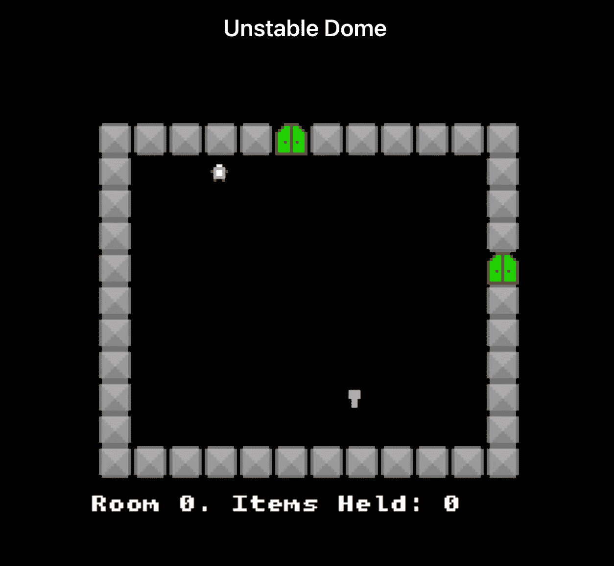
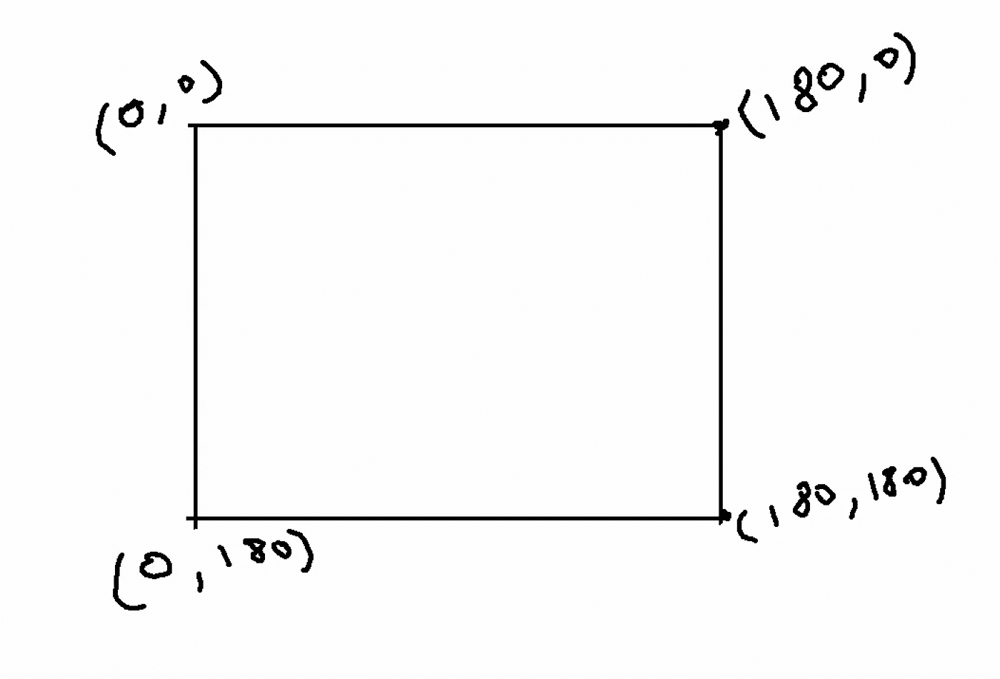
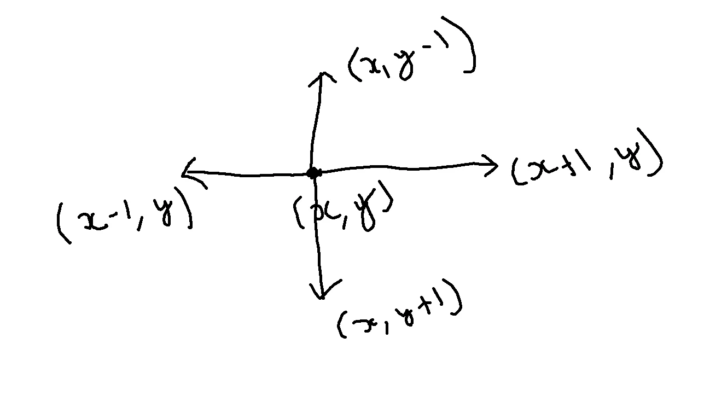

# 如何用 JavaScript 制作一个 RPG 游戏

> 原文：<https://javascript.plainenglish.io/how-to-make-a-rpg-game-using-javascript-cf3e9feff761?source=collection_archive---------10----------------------->

## 第二部分



# 概述

在之前的博客文章[第 1 部分](/how-to-make-an-rpg-game-using-javascript-89b19cd49577)中，我们看到了如何设置我们的环境并安装其他依赖项，以便开始为游戏开发工作设置我们的项目。

如果有人不想阅读，而喜欢通过观看视频来进行开发，那么为此，我也为它制作了一个视频系列。

# 介绍

在这一部分中，我们将看到如何使用二维字符数组来设置我们的地图，添加玩家的移动，以及添加我们的**精灵**之间的碰撞检测，以便找出两个用例:

1.  当**玩家**拿起**按键**时
2.  当**玩家**进入**门**时。

# 游戏引擎命令

在进入游戏开发的逻辑之前，让我们看看一些可用的内置方法，这将有助于我们理解代码流。

(i) **添加** —这个关键字用于给我们的游戏添加文本、图像。

(ii) **按键** —该关键字用于检测键盘上的按键。

(iii) **keyDown** —该关键字用于检测键盘上特定键的长按，我们将使用该关键字来检测玩家的移动。

(四) **loadSprite** —这个关键字用于在游戏中加载我们的 Sprite。

(v)**add level**——这个关键字用于添加我们的 2d 基于字符的地图，以及我们在引擎中加载的图像/精灵。

我们使用的与游戏引擎相关的命令很少，但是它们都是不言自明的。

# 地图表示

在前面的部分中，我们已经定义了游戏地图的大小为 180 x 180，现在我们可以想象这个游戏地图位于图形的第一象限，即角落坐标如下:

1.  左下角— (0，0)。
2.  右下— (180，0)。
3.  左上角— (0，180)。
4.  右上— (180，180)。



## 计算

现在，该做些数学计算了:

map_width = 180 像素

map_height = 180 像素

墙壁 _ 图像 _ 宽度= 11 像素

墙壁 _ 图像 _ 高度= 11 像素

**注意:**如果你想知道，我们是从哪里得到 11 像素宽和高的墙壁图像的，所以这基本上是我们在上一部分下载的 wall.png 的大小。

现在，什么是最大的行和列的大小，我们可以得到我们的二维字符数组来表示我们的地图。

max_row_size = 180/11，所以 max_row_size ≤ 16。

max_column_size = 180/11，所以 max_column_size ≤ 16。

现在，我们还需要在游戏场景和我们创建的地图之间提供一些空间/间隙，所以让我们使用 12 的行大小和 11 的列大小。这只是一个任意的数字，你可以选择任何小于等于 16 的值。

现在，我们已经决定了我们的地图表示所需的尺寸，让我们用字符' = '来表示，它将等同于我们的墙壁图像。

因此，我们的 json 形式的地图看起来会像这样:

```
[
   {
      "layout":[
         "=====1======",
         "=  @       =",
         "=          =",
         "=          =",
         "=          =",
         "=          =",
         "=          =",
         "=          =",
         "=      i   =",
         "=          =",
         "============"
      ]
   }
]
```

让我们看看每个字符代表什么:

1.  = '是我们的**墙**精灵。
2.  ‘1 号’是我们的**门**雪碧。
3.  @ '是给我们的**玩家**雪碧的。
4.  ‘我’是我们的**项**雪碧。

## 代码的当前状态

# 代码解释

1.  第 1 行到第 8 行，我们只是初始化我们的游戏引擎。
2.  从第 11 行到第 15 行，我们加载了我们的图像/精灵和每个精灵的关键点，在我们的代码中使用。
3.  在第 88 行，我们创建了第一个场景 **main** ，使用 start 关键字，我们初始化了不同的场景。
4.  从第 73 行到第 86 行，我们添加了一些要在第一个场景中显示的基本文本。 **Add** 关键字用于在我们的游戏引擎中添加**文本**或任何其他种类的**图形**。之后，我们使用关键字 **keyPress** 检测空格键按压。
5.  从第 19 行到第 35 行，我们以字符串的形式加载游戏地图。
6.  第 36 行用于启动我们的游戏场景。
7.  从第 42 行开始，我们创建了一个名为 roomConf 的数据结构，它基本上让游戏引擎知道每个角色到其各自精灵的映射。
8.  第 68 行非常重要，它有两个参数，一个是我们在上面的步骤中创建的 **roomConf** 变量，另一个是我们基于 json 的 2-D 字符映射表，它基本上呈现并创建了如上图所示的映射表。
9.  从第 70 行开始，我们基本上为每个方向分配 4 个向量，然后将它们映射到每个按键，并基于此改变玩家的方向。为了更好地理解为什么我们用特定的值来表示向量，请看下图



10.现在，检测两个固体物体碰撞的最后一个重要部分-

```
// Update the player position etc - run every frame.    player.action(() => {      
    player.resolve();    
});
```

如果你注意到了，我们已经为我们的墙、门和物品精灵提到了 **solid()** ，所以上面这段代码决定了玩家是否触摸了任何固体物体，我们需要解析每个玩家的动作。

# 冲突检出

在 **Kaboom.js** 游戏引擎中，我们为每个精灵提供了一个名为 overlaps 的方法，我们可以用它来检测两个实体精灵之间的冲突，我们可以在方法中定义实现逻辑。在我们的用例中，需要采取以下行动

1.  当**玩家**与**门**重叠时，我们要完成我们的游戏并显示一个获胜文本。
2.  当**玩家**与**物品(钥匙)**重叠时，那么我们要隐藏**钥匙**并将其从我们的地图中移除。

下面的代码关注上面的用例:-

一旦**玩家**触碰到**门**，我们直接进入**赢家**场景，在屏幕上显示中奖信息。

# 结论

至此，我们结束了第二部分，在这篇文章中，我们看到了如何映射我们的二维字符数组和渲染场景中的精灵，检测**实体()**精灵之间的碰撞，并以**赢得**场景来结束我们的游戏。

感谢所有的支持，完整的游戏代码可以在这里找到——[https://github.com/Kavit900/ludum-dare-49](https://github.com/Kavit900/ludum-dare-49)。

*更多内容请看*[***plain English . io***](http://plainenglish.io)