# 如何用 Bootstrap 5 制作 SaaS 主页

> 原文：<https://javascript.plainenglish.io/how-to-make-a-saas-homepage-using-bootstrap-5-2807b7518271?source=collection_archive---------18----------------------->

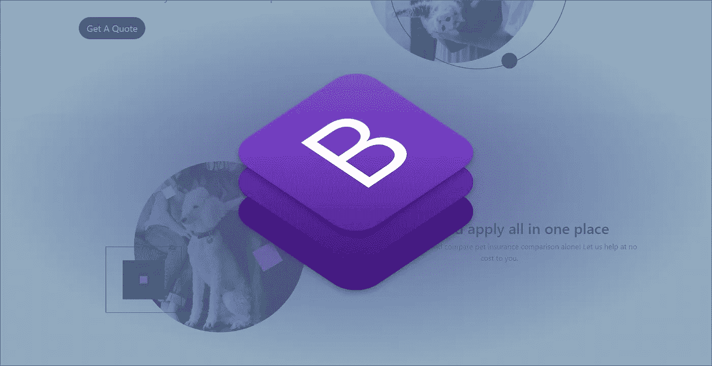

你有一个软件产品，你想为它做一个网站。传统的观点是雇佣一个网络开发人员。然而，如果你想省钱，并对项目的结果有更多的控制，你也可以建立自己的网站。

对于 SaaS、初创企业和企业家来说，建立一个网站并不是一件容易的事情。然而，有很多工具可以帮助你。其中之一是 Bootstrap，它让你更容易创建一个在任何设备上都很棒的网站。在本指南中，我将向你展示如何使用 Bootstrap 5 制作一个简单有效的 SaaS 主页。

# **什么是 SaaS？**

SaaS，即软件即服务，对于基于技术的企业来说是一种非常有利可图的模式。这个想法是，你可以提供你的产品作为每月订阅，并产生经常性收入。一个设计良好的 SaaS 登陆页面可以很好地将潜在用户转化为实际付费用户。但是首先，你需要设计登陆页面本身。

SaaS 最重要的部分是什么？

任何 SaaS 产品最重要的部分是你的登陆/主页。这是你给你的潜在客户留下印象的地方。如果你的预算有限，负担不起设计师的服务，你仍然可以使用免费的、可定制的引导模板创建一个漂亮而有效的主页。

# **什么是自举？**

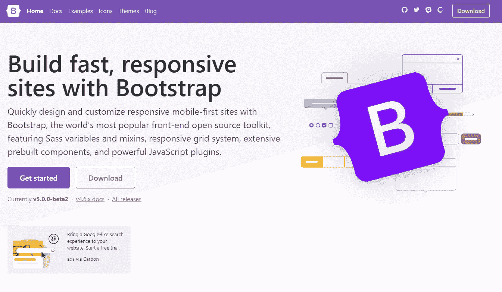

Bootstrap 是最流行的 HTML、CSS 和 JavaScript 框架之一，用于在 web 上开发响应迅速、移动优先的项目。具体来说，这是一个免费的工具集，用于构建移动优先的网站，可以在各种屏幕尺寸下做出响应。它可以免费下载，并获得麻省理工学院的许可。Bootstrap 是由一群热情的开发人员开发的，目的是解决 web 开发中遇到的常见问题。

来自世界各地的许多不同的专业人士都在使用它，它有几个很棒的特性，这使它成为创建 SaaS 产品的完美工具。

**创建一个 HTML 文件**

*home.html*

```
<!DOCTYPE html>
<html lang="en"><head>
  <meta charset="UTF-8">
  <meta name="viewport" content="width=device-width, initial-scale=1.0">
  <meta http-equiv="X-UA-Compatible" content="ie=edge">
  <title>SaaS</title>
</head><body></body></html>
```

首先，你需要一个文本编辑器比如 [Sublime](https://www.sublimetext.com/) 来创建一个 HTML 文件。

Sublime 是一个用于 HTML 等编程和标记语言的免费文本编辑器。

接下来，您需要添加 `DOCTYPE`、`html`、`head`和`body`元素。

如果你完全是编码新手，看一下 [HTML 和 CSS](https://www.ordinarycoders.com/html-and-css) 课程就可以入门了。

**将 Bootstrap 5.0.0 添加到您的 HTML 中**

*home.html*

```
<!doctype html>
<html lang="en">
  <head>
    <!-- Required meta tags -->
    <meta charset="utf-8">
    <meta name="viewport" content="width=device-width, initial-scale=1"> <!-- Bootstrap CSS -->
    <link href="https://cdn.jsdelivr.net/npm/bootstrap@5.0.0-beta3/dist/css/bootstrap.min.css" rel="stylesheet" integrity="sha384-eOJMYsd53ii+scO/bJGFsiCZc+5NDVN2yr8+0RDqr0Ql0h+rP48ckxlpbzKgwra6" crossorigin="anonymous"> <title>SaaS</title>
  </head>
  <body> <!-- Optional JavaScript; choose one of the two! --> <!-- Option 1: Bootstrap Bundle with Popper -->
    <script src="https://cdn.jsdelivr.net/npm/bootstrap@5.0.0-beta3/dist/js/bootstrap.bundle.min.js" integrity="sha384-JEW9xMcG8R+pH31jmWH6WWP0WintQrMb4s7ZOdauHnUtxwoG2vI5DkLtS3qm9Ekf" crossorigin="anonymous"></script> <!-- Option 2: Separate Popper and Bootstrap JS -->
    <!--
    <script src="https://cdn.jsdelivr.net/npm/@popperjs/core@2.9.1/dist/umd/popper.min.js" integrity="sha384-SR1sx49pcuLnqZUnnPwx6FCym0wLsk5JZuNx2bPPENzswTNFaQU1RDvt3wT4gWFG" crossorigin="anonymous"></script>
    <script src="https://cdn.jsdelivr.net/npm/bootstrap@5.0.0-beta3/dist/js/bootstrap.min.js" integrity="sha384-j0CNLUeiqtyaRmlzUHCPZ+Gy5fQu0dQ6eZ/xAww941Ai1SxSY+0EQqNXNE6DZiVc" crossorigin="anonymous"></script>
    -->
  </body>
</html>
```

接下来添加 Bootstrap CDN，快速入门。它也可以通过[下载](https://getbootstrap.com/docs/4.5/getting-started/download/)获得。

# **SaaS 行动号召**

**什么是行动号召？**

行动呼吁或 CTA 是一个短语，旨在通过告诉用户采取什么行动以及如何采取行动来促使用户立即做出反应。

在营销术语中，第一个行动号召放置在折叠上方，或者在这种情况下，在页面滚动上方，以增加 CTA 的可见性，并激励有动机的用户立即对报价采取行动。

**行动号召的例子是什么？**

通常情况下，CTA 会要求用户“注册”、“开始”、“订阅”、“免费试用”或“了解更多”。

选择正确的 CTA 取决于销售的产品。

**什么是好的 SaaS 行动号召？**

一个好的行动号召回答三个问题:

1.产品是什么？

2.他们为什么需要它？

3.他们是怎么得到的？

这三个部分通常分为标题、副标题和按钮，它们一起工作来说服用户采取行动。

下面是两个带有 HTML 代码的 CTA 示例。

**引导 CTA 和导航栏模板#1**

*在浏览器中*

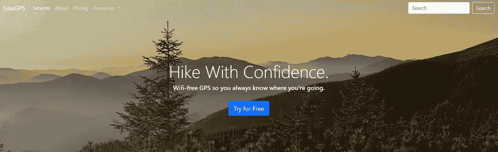

*HTML 代码*

```
<style>
.banner {
    /* The image used */
    background-image:
    /*linear gradient overlay*/
    linear-gradient(to top right, rgba(13,110,253, 0.30) 10%, rgba(0,0,0, 0.20 ) 60%),
    url("mountains.jpg");
    /* Create the parallax scrolling effect */
    background-attachment: fixed;
    /* Prevent image from repeating */
    background-repeat: no-repeat;
    /* Set height */
    height: auto;
    /* Set background size */
    background-size:cover;
    /* Set background position */
    background-position:right center
  }
</style> <div class="banner">
  <!--Navbar-->
  <nav class="navbar navbar-expand-lg navbar-dark bg-transparent">
  <div class="container-fluid">
    <a class="navbar-brand" href="#">hikeGPS</a>
    <button class="navbar-toggler" type="button" data-bs-toggle="collapse" data-bs-target="#navbarScroll" aria-controls="navbarScroll" aria-expanded="false" aria-label="Toggle navigation">
      <span class="navbar-toggler-icon"></span>
    </button>
    <div class="collapse navbar-collapse" id="navbarScroll">
      <ul class="navbar-nav me-auto my-2 my-lg-0 navbar-nav-scroll" style="--bs-scroll-height: 100px;">
        <li class="nav-item">
          <a class="nav-link active" aria-current="page" href="/#services">Services</a>
        </li>
        <li class="nav-item">
          <a class="nav-link" href="#">About</a>
        </li>
         <li class="nav-item">
          <a class="nav-link" href="#">Pricing</a>
        </li>
        <li class="nav-item dropdown">
          <a class="nav-link dropdown-toggle" href="#" id="navbarScrollingDropdown" role="button" data-bs-toggle="dropdown" aria-expanded="false">
            Resources
          </a>
          <ul class="dropdown-menu" aria-labelledby="navbarScrollingDropdown">
            <li><a class="dropdown-item" href="#">Guides</a></li>
            <li><a class="dropdown-item" href="#">Blog</a></li>
            <li><hr class="dropdown-divider"></li>
            <li><a class="dropdown-item" href="#">Share your experience</a></li>
          </ul>
        </li>
        <li class="nav-item">
          <a class="nav-link disabled" href="#" tabindex="-1" aria-disabled="true">Link</a>
        </li>
      </ul>
      <form class="d-flex">
        <input class="form-control me-2" type="search" placeholder="Search" aria-label="Search">
        <button class="btn btn-outline-light" type="submit">Search</button>
      </form>
    </div>
  </div>
</nav><!--CTA-->
  <div class="container text-center text-white">
    <br><br><br><br><br><br>
    <h1 class="display-4">Start Hiking Today.</h1>
    <h5>Use GPS to sure you know where you're going.</h5>
    <br>
    <a class="btn btn-primary btn-lg" href="#" role="button">Try for Free</a>
    <br><br><br><br><br><br>
  </div>
</div>
```

这是一个覆盖在图像上的 CTA，或[英雄横幅](https://www.ordinarycoders.com/blog/article/hero-banners)。

文本在一些山脉的图像上垂直和水平居中，直观地展示了产品与自然的关系。

当用户阅读他们理解的 CTA 时:

1.产品是什么？—无线全球定位系统

2.他们为什么需要它？—所以他们可以自信地徒步旅行，因为他们知道他们要去哪里

3.他们是怎么得到的？点击免费试用的按钮

**引导 CTA 和导航栏模板#2**

浏览器中的

*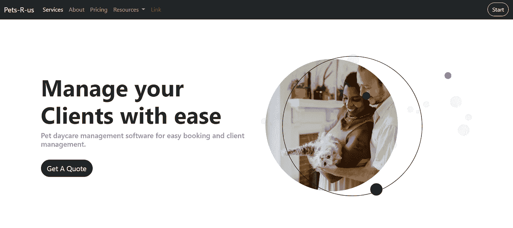*

**HTML 代码**

```
*<style>
    .display-3{
      font-weight:700;
    } .purple{
      color:rgb(108,99,255);
    }
    .btn{
      border-radius:30px
    }
</style> <!--Navbar-->
  <nav class="navbar navbar-expand-lg navbar-dark bg-dark">
  <div class="container-fluid">
    <a class="navbar-brand" href="#">Pets-R-us</a>
    <button class="navbar-toggler" type="button" data-bs-toggle="collapse" data-bs-target="#navbarScroll" aria-controls="navbarScroll" aria-expanded="false" aria-label="Toggle navigation">
      <span class="navbar-toggler-icon"></span>
    </button>
    <div class="collapse navbar-collapse" id="navbarScroll">
      <ul class="navbar-nav me-auto my-2 my-lg-0 navbar-nav-scroll" style="--bs-scroll-height: 100px;">
        <li class="nav-item">
          <a class="nav-link active" aria-current="page" href="/#services">Services</a>
        </li>
        <li class="nav-item">
          <a class="nav-link" href="#">About</a>
        </li>
         <li class="nav-item">
          <a class="nav-link" href="#">Pricing</a>
        </li>
        <li class="nav-item dropdown">
          <a class="nav-link dropdown-toggle" href="#" id="navbarScrollingDropdown" role="button" data-bs-toggle="dropdown" aria-expanded="false">
            Resources
          </a>
          <ul class="dropdown-menu" aria-labelledby="navbarScrollingDropdown">
            <li><a class="dropdown-item" href="#">Insurances</a></li>
            <li><a class="dropdown-item" href="#">Blog</a></li>
            <li><hr class="dropdown-divider"></li>
            <li><a class="dropdown-item" href="#">Share your experience</a></li>
          </ul>
        </li>
        <li class="nav-item">
          <a class="nav-link disabled" href="#" tabindex="-1" aria-disabled="true">Link</a>
        </li>
      </ul>
      <div class="d-flex">
        <button class="btn btn-outline-light" type="submit">Start</button>
      </div>
    </div>
  </div>
</nav><!--CTA-->
  <div class="container py-5 text-right text-dark">
    <div class="row p-5">
      <div class="col-lg-6 col-md-12 my-auto">
        <h1 class="display-3">Manage your Clients with ease</h1>
        <h5 class="purple">Pet daycare management software for easy booking and client management.</h5>
        <br>
        <a class="btn btn-dark btn-lg" href="#" role="button">Get A Quote</a>
      </div>
      <div class="col-lg-6 col-md-12">
        
      </div>
    </div>
  </div>
</div>*
```

*这是另一个 CTA 的例子，但是有专栏而不是英雄横幅。在较小的设备中，右边的图像位于文本下方。*

*该 CTA 的布局如下:*

*1.产品是什么？—狗狗日托软件*

*2.他们为什么需要它？—更轻松地管理预订和客户*

*3.他们是怎么得到的？—通过单击“报价”按钮*

*该图像是通过将一个正方形图像的四角倒圆，然后定制一个 [Adobe XD](https://www.ordinarycoders.com/blog/article/how-to-use-adobe-xd-plugins) SVG 来覆盖在顶部而创建的。*

# ***SaaS 价值主张***

***什么是价值主张？***

*价值主张是另一个营销术语，用来描述公司承诺向用户提供的价值。*

*价值主张和 CTA 密切相关。CTA 通常包含价值主张，因为它们描述了用户为什么需要您的服务。*

***价值主张的例子是什么？***

*价值主张让潜在客户清楚了解产品的优势。价值主张的例子包括你的服务比竞争对手的产品更快、更容易使用、更有用。*

*首先将你的 SaaS 与最接近的竞争对手进行比较，确定你的竞争对手的价值与你自己的价值。然后把这些见解浓缩成容易消化的短语和句子。*

***什么是好的 SaaS 价值主张？***

*一个好的价值主张详细说明为什么你的产品比你的竞争对手提供的类似产品对用户更有价值。*

*在撰写价值主张时，请记住以下三个问题:*

*1.价值是如何传递的？*

*2.价值是如何体验的？*

*3.价值是如何获得的？*

***引导价值主张模板#1***

*浏览器中的*

**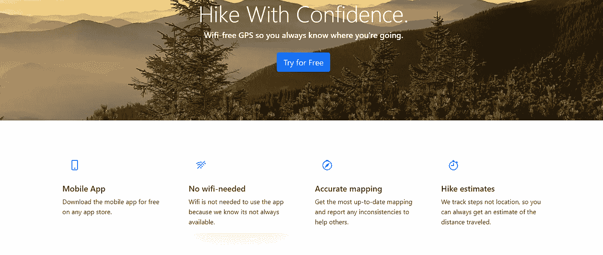**

***HTML 代码***

```
**<style>
 /*background circle for icons*/
    .numberCircle {
      border-radius: 50%;
      width: 60px;
      height: 60px;
      padding: 8px;
      background:rgb(13,110,253, 0.10);
      border: none;
      color: #007bff;
      text-align: center;
      font-size: 25px;
    } p{
      line-height: 25px;
    } /*customize cards*/
    .card{
      border:none;
    } .card:hover {
      box-shadow: 0 40px 60px -20px rgb(27,24,15, 0.15);
        }
</style> <!--Value Proposition-->
<div class="container p-5">
  <div class="row">
    <div class="col-sm-12 col-md-6 col-lg-3 pb-4">
      <a href="/" style="text-decoration: none">
        <div class="card h-100 text-dark">
          <div class="card-body">
            <div class="numberCircle my-3">
              <svg  width="1em" height="1em" fill="currentColor" class="bi bi-phone" viewBox="0 0 16 16">
                <path d="M11 1a1 1 0 0 1 1 1v12a1 1 0 0 1-1 1H5a1 1 0 0 1-1-1V2a1 1 0 0 1 1-1h6zM5 0a2 2 0 0 0-2 2v12a2 2 0 0 0 2 2h6a2 2 0 0 0 2-2V2a2 2 0 0 0-2-2H5z"/>
                <path d="M8 14a1 1 0 1 0 0-2 1 1 0 0 0 0 2z"/>
              </svg>
            </div>
            <h5 class="card-title">Mobile App</h5>
            <p class="card-text">Download the mobile app for free on any app store.</p>
          </div>
        </div>
      </a>
    </div>
    <div class="col-sm-12 col-md-6 col-lg-3 pb-4">
      <a href="/" style="text-decoration: none">
        <div class="card h-100 text-dark">
          <div class="card-body">
            <div class="numberCircle my-3">
              <svg  width="1em" height="1em" fill="currentColor" class="bi bi-wifi-off" viewBox="0 0 16 16">
                <path d="M10.706 3.294A12.545 12.545 0 0 0 8 3C5.259 3 2.723 3.882.663 5.379a.485.485 0 0 0-.048.736.518.518 0 0 0 .668.05A11.448 11.448 0 0 1 8 4c.63 0 1.249.05 1.852.148l.854-.854zM8 6c-1.905 0-3.68.56-5.166 1.526a.48.48 0 0 0-.063.745.525.525 0 0 0 .652.065 8.448 8.448 0 0 1 3.51-1.27L8 6zm2.596 1.404.785-.785c.63.24 1.227.545 1.785.907a.482.482 0 0 1 .063.745.525.525 0 0 1-.652.065 8.462 8.462 0 0 0-1.98-.932zM8 10l.933-.933a6.455 6.455 0 0 1 2.013.637c.285.145.326.524.1.75l-.015.015a.532.532 0 0 1-.611.09A5.478 5.478 0 0 0 8 10zm4.905-4.905.747-.747c.59.3 1.153.645 1.685 1.03a.485.485 0 0 1 .047.737.518.518 0 0 1-.668.05 11.493 11.493 0 0 0-1.811-1.07zM9.02 11.78c.238.14.236.464.04.66l-.707.706a.5.5 0 0 1-.707 0l-.707-.707c-.195-.195-.197-.518.04-.66A1.99 1.99 0 0 1 8 11.5c.374 0 .723.102 1.021.28zm4.355-9.905a.53.53 0 0 1 .75.75l-10.75 10.75a.53.53 0 0 1-.75-.75l10.75-10.75z"/>
              </svg>
            </div>
            <h5 class="card-title">No wifi-needed</h5>
            <p class="card-text">Wifi is not needed to use the app because we know its not always available.</p>
          </div>
        </div>
      </a>
    </div>
    <div class="col-sm-12 col-md-6 col-lg-3 pb-4">
      <a href="/" style="text-decoration: none">
        <div class="card h-100 text-dark">
          <div class="card-body">
            <div class="numberCircle my-3">
              <svg  width="1em" height="1em" fill="currentColor" class="bi bi-compass" viewBox="0 0 16 16">
                <path d="M8 16.016a7.5 7.5 0 0 0 1.962-14.74A1 1 0 0 0 9 0H7a1 1 0 0 0-.962 1.276A7.5 7.5 0 0 0 8 16.016zm6.5-7.5a6.5 6.5 0 1 1-13 0 6.5 6.5 0 0 1 13 0z"/>
                <path d="m6.94 7.44 4.95-2.83-2.83 4.95-4.949 2.83 2.828-4.95z"/>
              </svg>
            </div>
            <h5 class="card-title">Accurate mapping</h5>
            <p class="card-text">Get the most up-to-date mapping and report any inconsistencies to help others.</p>
          </div>
        </div>
      </a>
    </div>
    <div class="col-sm-12 col-md-6 col-lg-3 pb-4">
      <a href="/" style="text-decoration: none">
        <div class="card h-100 text-dark">
          <div class="card-body">
            <div class="numberCircle my-3">
             <svg  width="1em" height="1em" fill="currentColor" class="bi bi-stopwatch" viewBox="0 0 16 16">
              <path d="M8.5 5.6a.5.5 0 1 0-1 0v2.9h-3a.5.5 0 0 0 0 1H8a.5.5 0 0 0 .5-.5V5.6z"/>
              <path d="M6.5 1A.5.5 0 0 1 7 .5h2a.5.5 0 0 1 0 1v.57c1.36.196 2.594.78 3.584 1.64a.715.715 0 0 1 .012-.013l.354-.354-.354-.353a.5.5 0 0 1 .707-.708l1.414 1.415a.5.5 0 1 1-.707.707l-.353-.354-.354.354a.512.512 0 0 1-.013.012A7 7 0 1 1 7 2.071V1.5a.5.5 0 0 1-.5-.5zM8 3a6 6 0 1 0 .001 12A6 6 0 0 0 8 3z"/>
            </svg>
          </div>
          <h5 class="card-title">Hike estimates</h5>
          <p class="card-text">We track steps not location, so you can always get an estimate of the distance traveled.</p>
        </div>
      </div>
    </a>
  </div>
</div>
</div>**
```

**除了 CTA 之外，展示您的价值主张特色卡的最佳方式之一。使用的 SVG 图标在 icons.getbootstrap.com[是免费的。](https://icons.getbootstrap.com/)**

****引导价值主张模板#2****

***在浏览器中***

**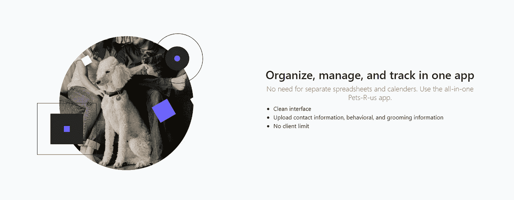**

***HTML 代码***

```
**<!--Value Proposition-->
 <div class="container-fluid py-5 bg-light">
    <div class="container p-5">
      <div class="row">
        <div class="col-lg-6 col-md-12">
          
        </div>
        <div class="col-lg-6 col-md-12 my-auto">
          <h2 class="font-weight-bold text-center">Organize, manage, and track in one app</h2>
          <h5 class="text-muted text-center lead">No need for separate spreadsheets and calenders. Use the all-in-one Pets-R-us app.</h5>
          <ul class="text-right">
              <li>Clean interface</li>
              <li>Upload contact information, behavioral, and grooming information</li>
              <li>No client limit</li>
          </ul>
        </div>
      </div>
    </div>
  </div>**
```

**另一种列出你的价值主张作为要点的方法。**

# ****自举证明****

**什么是奖状？**

**证明是认可产品使用的口头或书面声明。客户对产品有亲身体验，并乐于与他人分享这种体验。**

**通过电子邮件联系你现有的客户，要求他们对你的网站做一个简短的评价。让他们知道你会提供他们网站的反向链接，以感谢他们的时间。但是不要过分要求推荐，如果他们觉得舒服的话，他们会更愿意提交他们的评论。**

****推荐的例子是什么？****

**“使用该产品后，我的销售额增加了 10%！感谢 IT 团队，因为他们易于共事且能力出众”是一个褒奖的例子，它重申了产品的价值，同时也给予员工积极的反馈和感谢。**

**推荐书应该诚实可信。它们不需要成为好的副本。**

**什么是好的 SaaS 推荐书？**

**一份好的推荐应该有助于利用跟风效应提高转化率。潜在客户在明确声明其他人正在有效地使用该产品的基础上，对注册该产品感到放心。**

**一份好的客户证明需要用一个吸引理智和情感的简洁陈述来强调当前客户和产品之间的现有信任。**

**这种信任的一部分包括客户愿意将他们的姓名、头衔、公司/网站，甚至照片显示在他们的声明旁边。**

**在为您的网站选择推荐时，请记住这 3 个问题:**

**1.是否提供了定性证据(情感诉求)？**

**2.它是否提供了定量的证据(数据和统计数据)？**

**3.它是否突出了产品的一个特定用例？**

****自举 SaaS 排名第一的证明材料****

**浏览器中的**

***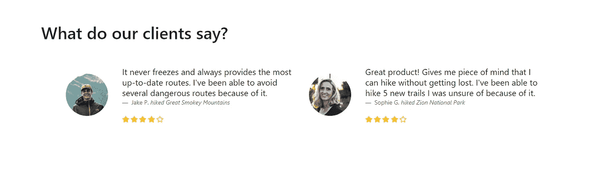***

****HTML 代码****

```
**<style>
/*client images */
    .client {
      height:100px; 
      width:100px; 
      border-radius: 50%; 
      object-fit:cover;
    } /*stars color */
    .bi-star, .bi-star-fill, .bi-star-half{
      color:#ffc107;
    }
</style><!--Testimonials-->
<!--Testimonials-->
 <div class="my-5">
 <div class="container p-5">
    <h1>What do our clients say?</h1>
  <div class="row p-5">
    <div class="col-lg-6 col-md-12">
      <div class="row">
        <div class="col-3 text-center my-auto">
           
        </div>
        <div class="col-9">
      <figure>
        <blockquote class="blockquote">
          <p>It never freezes and always provides the most up-to-date routes. I've been able to avoid several dangerous routes because of it.</p>
        </blockquote>
        <figcaption class="blockquote-footer">
          Jake P. <cite title="Source Title">hiked Great Smokey Mountains</cite>
        </figcaption>
      </figure>

      <svg  width="16" height="16" fill="currentColor" class="bi bi-star-fill" viewBox="0 0 16 16">
        <path d="M3.612 15.443c-.386.198-.824-.149-.746-.592l.83-4.73L.173 6.765c-.329-.314-.158-.888.283-.95l4.898-.696L7.538.792c.197-.39.73-.39.927 0l2.184 4.327 4.898.696c.441.062.612.636.282.95l-3.522 3.356.83 4.73c.078.443-.36.79-.746.592L8 13.187l-4.389 2.256z"/>
      </svg>
      <svg  width="16" height="16" fill="currentColor" class="bi bi-star-fill" viewBox="0 0 16 16">
        <path d="M3.612 15.443c-.386.198-.824-.149-.746-.592l.83-4.73L.173 6.765c-.329-.314-.158-.888.283-.95l4.898-.696L7.538.792c.197-.39.73-.39.927 0l2.184 4.327 4.898.696c.441.062.612.636.282.95l-3.522 3.356.83 4.73c.078.443-.36.79-.746.592L8 13.187l-4.389 2.256z"/>
      </svg>
      <svg  width="16" height="16" fill="currentColor" class="bi bi-star-fill" viewBox="0 0 16 16">
        <path d="M3.612 15.443c-.386.198-.824-.149-.746-.592l.83-4.73L.173 6.765c-.329-.314-.158-.888.283-.95l4.898-.696L7.538.792c.197-.39.73-.39.927 0l2.184 4.327 4.898.696c.441.062.612.636.282.95l-3.522 3.356.83 4.73c.078.443-.36.79-.746.592L8 13.187l-4.389 2.256z"/>
      </svg>
      <svg  width="16" height="16" fill="currentColor" class="bi bi-star-fill" viewBox="0 0 16 16">
        <path d="M3.612 15.443c-.386.198-.824-.149-.746-.592l.83-4.73L.173 6.765c-.329-.314-.158-.888.283-.95l4.898-.696L7.538.792c.197-.39.73-.39.927 0l2.184 4.327 4.898.696c.441.062.612.636.282.95l-3.522 3.356.83 4.73c.078.443-.36.79-.746.592L8 13.187l-4.389 2.256z"/>
      </svg>
      <svg  width="16" height="16" fill="currentColor" class="bi bi-star" viewBox="0 0 16 16">
        <path d="M2.866 14.85c-.078.444.36.791.746.593l4.39-2.256 4.389 2.256c.386.198.824-.149.746-.592l-.83-4.73 3.522-3.356c.33-.314.16-.888-.282-.95l-4.898-.696L8.465.792a.513.513 0 0 0-.927 0L5.354 5.12l-4.898.696c-.441.062-.612.636-.283.95l3.523 3.356-.83 4.73zm4.905-2.767-3.686 1.894.694-3.957a.565.565 0 0 0-.163-.505L1.71 6.745l4.052-.576a.525.525 0 0 0 .393-.288L8 2.223l1.847 3.658a.525.525 0 0 0 .393.288l4.052.575-2.906 2.77a.565.565 0 0 0-.163.506l.694 3.957-3.686-1.894a.503.503 0 0 0-.461 0z"/>
      </svg>
    </div>
      </div>
  </div>
    <div class="col-lg-6 col-md-12">
      <div class="row">
        <div class="col-3 text-center my-auto">
           
        </div>
        <div class="col-9">
      <figure>
        <blockquote class="blockquote">
          <p>Great product! Gives me piece of mind that I can hike without getting lost. I've been able to hike 5 new trails I was unsure of because of it.</p>
        </blockquote>
        <figcaption class="blockquote-footer">
          Sophie G. <cite title="Source Title">hiked Zion National Park</cite>
        </figcaption>
      </figure>

      <svg  width="16" height="16" fill="currentColor" class="bi bi-star-fill" viewBox="0 0 16 16">
        <path d="M3.612 15.443c-.386.198-.824-.149-.746-.592l.83-4.73L.173 6.765c-.329-.314-.158-.888.283-.95l4.898-.696L7.538.792c.197-.39.73-.39.927 0l2.184 4.327 4.898.696c.441.062.612.636.282.95l-3.522 3.356.83 4.73c.078.443-.36.79-.746.592L8 13.187l-4.389 2.256z"/>
      </svg>
      <svg  width="16" height="16" fill="currentColor" class="bi bi-star-fill" viewBox="0 0 16 16">
        <path d="M3.612 15.443c-.386.198-.824-.149-.746-.592l.83-4.73L.173 6.765c-.329-.314-.158-.888.283-.95l4.898-.696L7.538.792c.197-.39.73-.39.927 0l2.184 4.327 4.898.696c.441.062.612.636.282.95l-3.522 3.356.83 4.73c.078.443-.36.79-.746.592L8 13.187l-4.389 2.256z"/>
      </svg>
      <svg  width="16" height="16" fill="currentColor" class="bi bi-star-fill" viewBox="0 0 16 16">
        <path d="M3.612 15.443c-.386.198-.824-.149-.746-.592l.83-4.73L.173 6.765c-.329-.314-.158-.888.283-.95l4.898-.696L7.538.792c.197-.39.73-.39.927 0l2.184 4.327 4.898.696c.441.062.612.636.282.95l-3.522 3.356.83 4.73c.078.443-.36.79-.746.592L8 13.187l-4.389 2.256z"/>
      </svg>
      <svg  width="16" height="16" fill="currentColor" class="bi bi-star-fill" viewBox="0 0 16 16">
        <path d="M3.612 15.443c-.386.198-.824-.149-.746-.592l.83-4.73L.173 6.765c-.329-.314-.158-.888.283-.95l4.898-.696L7.538.792c.197-.39.73-.39.927 0l2.184 4.327 4.898.696c.441.062.612.636.282.95l-3.522 3.356.83 4.73c.078.443-.36.79-.746.592L8 13.187l-4.389 2.256z"/>
      </svg>
      <svg  width="16" height="16" fill="currentColor" class="bi bi-star" viewBox="0 0 16 16">
        <path d="M2.866 14.85c-.078.444.36.791.746.593l4.39-2.256 4.389 2.256c.386.198.824-.149.746-.592l-.83-4.73 3.522-3.356c.33-.314.16-.888-.282-.95l-4.898-.696L8.465.792a.513.513 0 0 0-.927 0L5.354 5.12l-4.898.696c-.441.062-.612.636-.283.95l3.523 3.356-.83 4.73zm4.905-2.767-3.686 1.894.694-3.957a.565.565 0 0 0-.163-.505L1.71 6.745l4.052-.576a.525.525 0 0 0 .393-.288L8 2.223l1.847 3.658a.525.525 0 0 0 .393.288l4.052.575-2.906 2.77a.565.565 0 0 0-.163.506l.694 3.957-3.686-1.894a.503.503 0 0 0-.461 0z"/>
      </svg>
    </div>
      </div>
  </div>
  </div>
</div>
</div>**
```

**当你能提供与每个人相关的名字、面孔和公司时，推荐信是最可信的。**

****引导证明模板#2****

***在浏览器中***

**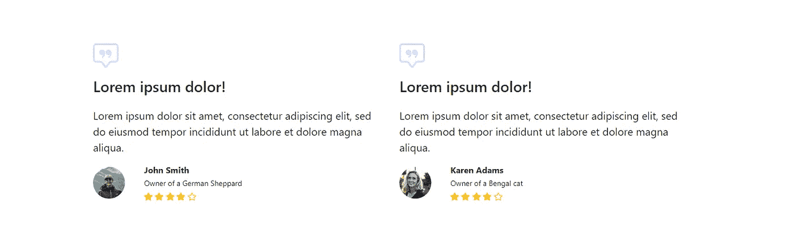**

***HTML 代码***

```
**<style>
   /*client images */
    .client {
      height:60px; 
      width:60px; 
      border-radius: 50%; 
      object-fit:cover;
    } /*quote svgs*/
    .bi-chat-square-quote{
      color:rgb(108,99,255, 0.3);
    } /*stars color */
    .bi-star, .bi-star-fill, .bi-star-half{
      color:#ffc107;
    }
</style> <!--Testimonials-->
  <div class="container p-5">
    <div class="row p-5">
      <div class="col-lg-6 col-md-12">
        <svg  width="3em" height="3em" fill="currentColor" class="my-3 bi bi-chat-square-quote" viewBox="0 0 16 16">
          <path d="M14 1a1 1 0 0 1 1 1v8a1 1 0 0 1-1 1h-2.5a2 2 0 0 0-1.6.8L8 14.333 6.1 11.8a2 2 0 0 0-1.6-.8H2a1 1 0 0 1-1-1V2a1 1 0 0 1 1-1h12zM2 0a2 2 0 0 0-2 2v8a2 2 0 0 0 2 2h2.5a1 1 0 0 1 .8.4l1.9 2.533a1 1 0 0 0 1.6 0l1.9-2.533a1 1 0 0 1 .8-.4H14a2 2 0 0 0 2-2V2a2 2 0 0 0-2-2H2z"/>
          <path d="M7.066 4.76A1.665 1.665 0 0 0 4 5.668a1.667 1.667 0 0 0 2.561 1.406c-.131.389-.375.804-.777 1.22a.417.417 0 1 0 .6.58c1.486-1.54 1.293-3.214.682-4.112zm4 0A1.665 1.665 0 0 0 8 5.668a1.667 1.667 0 0 0 2.561 1.406c-.131.389-.375.804-.777 1.22a.417.417 0 1 0 .6.58c1.486-1.54 1.293-3.214.682-4.112z"/>
        </svg>
        <h3 class="pb-3">Saves so much time!</h3>  
        <figure>
          <blockquote class="blockquote">
            <p>Great product. Love the easy-to-use interface. Saves my employees at least 2 hours by not having to constantly check up with one another and reference a spreadsheet.</p>
          </blockquote>
          <div class="row">
            <div class="col-lg-2 col-md-3 my-auto">
              
           </div>
           <div class="col-lg-10 col-md-9 my-auto">
            <b>John Smith</b>
            <br><small>Founder, Clean Paws</small><br>
            <svg  width="16" height="16" fill="currentColor" class="bi bi-star-fill" viewBox="0 0 16 16">
              <path d="M3.612 15.443c-.386.198-.824-.149-.746-.592l.83-4.73L.173 6.765c-.329-.314-.158-.888.283-.95l4.898-.696L7.538.792c.197-.39.73-.39.927 0l2.184 4.327 4.898.696c.441.062.612.636.282.95l-3.522 3.356.83 4.73c.078.443-.36.79-.746.592L8 13.187l-4.389 2.256z"/>
            </svg>
            <svg  width="16" height="16" fill="currentColor" class="bi bi-star-fill" viewBox="0 0 16 16">
              <path d="M3.612 15.443c-.386.198-.824-.149-.746-.592l.83-4.73L.173 6.765c-.329-.314-.158-.888.283-.95l4.898-.696L7.538.792c.197-.39.73-.39.927 0l2.184 4.327 4.898.696c.441.062.612.636.282.95l-3.522 3.356.83 4.73c.078.443-.36.79-.746.592L8 13.187l-4.389 2.256z"/>
            </svg>
            <svg  width="16" height="16" fill="currentColor" class="bi bi-star-fill" viewBox="0 0 16 16">
              <path d="M3.612 15.443c-.386.198-.824-.149-.746-.592l.83-4.73L.173 6.765c-.329-.314-.158-.888.283-.95l4.898-.696L7.538.792c.197-.39.73-.39.927 0l2.184 4.327 4.898.696c.441.062.612.636.282.95l-3.522 3.356.83 4.73c.078.443-.36.79-.746.592L8 13.187l-4.389 2.256z"/>
            </svg>
            <svg  width="16" height="16" fill="currentColor" class="bi bi-star-fill" viewBox="0 0 16 16">
              <path d="M3.612 15.443c-.386.198-.824-.149-.746-.592l.83-4.73L.173 6.765c-.329-.314-.158-.888.283-.95l4.898-.696L7.538.792c.197-.39.73-.39.927 0l2.184 4.327 4.898.696c.441.062.612.636.282.95l-3.522 3.356.83 4.73c.078.443-.36.79-.746.592L8 13.187l-4.389 2.256z"/>
            </svg>
            <svg  width="16" height="16" fill="currentColor" class="bi bi-star" viewBox="0 0 16 16">
              <path d="M2.866 14.85c-.078.444.36.791.746.593l4.39-2.256 4.389 2.256c.386.198.824-.149.746-.592l-.83-4.73 3.522-3.356c.33-.314.16-.888-.282-.95l-4.898-.696L8.465.792a.513.513 0 0 0-.927 0L5.354 5.12l-4.898.696c-.441.062-.612.636-.283.95l3.523 3.356-.83 4.73zm4.905-2.767-3.686 1.894.694-3.957a.565.565 0 0 0-.163-.505L1.71 6.745l4.052-.576a.525.525 0 0 0 .393-.288L8 2.223l1.847 3.658a.525.525 0 0 0 .393.288l4.052.575-2.906 2.77a.565.565 0 0 0-.163.506l.694 3.957-3.686-1.894a.503.503 0 0 0-.461 0z"/>
            </svg>
          </div>
        </div>      
      </figure>
    </div>
    <div class="col-lg-6 col-md-12">
      <svg  width="3em" height="3em" fill="currentColor" class="my-3 bi bi-chat-square-quote" viewBox="0 0 16 16">
        <path d="M14 1a1 1 0 0 1 1 1v8a1 1 0 0 1-1 1h-2.5a2 2 0 0 0-1.6.8L8 14.333 6.1 11.8a2 2 0 0 0-1.6-.8H2a1 1 0 0 1-1-1V2a1 1 0 0 1 1-1h12zM2 0a2 2 0 0 0-2 2v8a2 2 0 0 0 2 2h2.5a1 1 0 0 1 .8.4l1.9 2.533a1 1 0 0 0 1.6 0l1.9-2.533a1 1 0 0 1 .8-.4H14a2 2 0 0 0 2-2V2a2 2 0 0 0-2-2H2z"/>
        <path d="M7.066 4.76A1.665 1.665 0 0 0 4 5.668a1.667 1.667 0 0 0 2.561 1.406c-.131.389-.375.804-.777 1.22a.417.417 0 1 0 .6.58c1.486-1.54 1.293-3.214.682-4.112zm4 0A1.665 1.665 0 0 0 8 5.668a1.667 1.667 0 0 0 2.561 1.406c-.131.389-.375.804-.777 1.22a.417.417 0 1 0 .6.58c1.486-1.54 1.293-3.214.682-4.112z"/>
      </svg>
      <h3 class="pb-3">Would recommend</h3>  
      <figure>
        <blockquote class="blockquote">
          <p>I never need to worry about relaying special care instructions or freeing schedules. Everything is done instantly through the app.</p>
        </blockquote>
        <div class="row">
          <div class="col-lg-2 col-md-3 my-auto">
            
         </div>
         <div class="col-lg-10 col-md-9 my-auto">
          <b>Karen Adams</b>
          <br><small>Owner, Cat Cafe</small><br>
          <svg  width="16" height="16" fill="currentColor" class="bi bi-star-fill" viewBox="0 0 16 16">
            <path d="M3.612 15.443c-.386.198-.824-.149-.746-.592l.83-4.73L.173 6.765c-.329-.314-.158-.888.283-.95l4.898-.696L7.538.792c.197-.39.73-.39.927 0l2.184 4.327 4.898.696c.441.062.612.636.282.95l-3.522 3.356.83 4.73c.078.443-.36.79-.746.592L8 13.187l-4.389 2.256z"/>
          </svg>
          <svg  width="16" height="16" fill="currentColor" class="bi bi-star-fill" viewBox="0 0 16 16">
            <path d="M3.612 15.443c-.386.198-.824-.149-.746-.592l.83-4.73L.173 6.765c-.329-.314-.158-.888.283-.95l4.898-.696L7.538.792c.197-.39.73-.39.927 0l2.184 4.327 4.898.696c.441.062.612.636.282.95l-3.522 3.356.83 4.73c.078.443-.36.79-.746.592L8 13.187l-4.389 2.256z"/>
          </svg>
          <svg  width="16" height="16" fill="currentColor" class="bi bi-star-fill" viewBox="0 0 16 16">
            <path d="M3.612 15.443c-.386.198-.824-.149-.746-.592l.83-4.73L.173 6.765c-.329-.314-.158-.888.283-.95l4.898-.696L7.538.792c.197-.39.73-.39.927 0l2.184 4.327 4.898.696c.441.062.612.636.282.95l-3.522 3.356.83 4.73c.078.443-.36.79-.746.592L8 13.187l-4.389 2.256z"/>
          </svg>
          <svg  width="16" height="16" fill="currentColor" class="bi bi-star-fill" viewBox="0 0 16 16">
            <path d="M3.612 15.443c-.386.198-.824-.149-.746-.592l.83-4.73L.173 6.765c-.329-.314-.158-.888.283-.95l4.898-.696L7.538.792c.197-.39.73-.39.927 0l2.184 4.327 4.898.696c.441.062.612.636.282.95l-3.522 3.356.83 4.73c.078.443-.36.79-.746.592L8 13.187l-4.389 2.256z"/>
          </svg>
          <svg  width="16" height="16" fill="currentColor" class="bi bi-star" viewBox="0 0 16 16">
            <path d="M2.866 14.85c-.078.444.36.791.746.593l4.39-2.256 4.389 2.256c.386.198.824-.149.746-.592l-.83-4.73 3.522-3.356c.33-.314.16-.888-.282-.95l-4.898-.696L8.465.792a.513.513 0 0 0-.927 0L5.354 5.12l-4.898.696c-.441.062-.612.636-.283.95l3.523 3.356-.83 4.73zm4.905-2.767-3.686 1.894.694-3.957a.565.565 0 0 0-.163-.505L1.71 6.745l4.052-.576a.525.525 0 0 0 .393-.288L8 2.223l1.847 3.658a.525.525 0 0 0 .393.288l4.052.575-2.906 2.77a.565.565 0 0 0-.163.506l.694 3.957-3.686-1.894a.503.503 0 0 0-.461 0z"/>
          </svg>
        </div>
      </div>      
    </figure>
  </div>
</div>
</div>**
```

**一份好的推荐书除了客户的职位和公司(如果适用)之外，还要有客户的姓名和形象。**

**上面的例子可以很容易地用来显示客户的职位和公司。**

# ****自举定价表****

****什么是定价表？****

**价格表是一个 HTML 元素，列出了不同价位的可用功能。这是为了让潜在客户尽可能容易地比较各种方案，选择最符合他们需求的方案。**

****定价表的示例是什么？****

**价格表详细列出了每个计划或订阅的价格、功能和注册。**

**表中的列表示平面图的数量，而行则组织特征。**

**平均而言，定价表上列出了 1-5 个计划。添加适合您的 SaaS 商业模式的栏目/计划的数量。**

****什么是好的 SaaS 定价表？****

**一份好的价格表不会让潜在客户不知所措。相反，它使用简要描述或要点来传达每个计划之间的关键差异。**

**您希望用户能够轻松地浏览价格表，找出差异并做出选择，而不必来回滚动比较选项。**

**让价格和功能成为主要焦点。然后在下面添加一个行动号召报名按钮。**

****引导定价表模板#1****

**浏览器中的**

***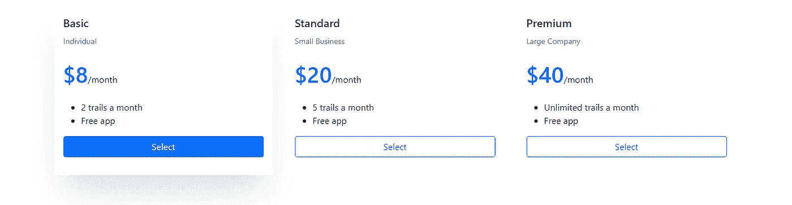***

****HTML 代码****

```
**<!--Pricing Table-->
 <div class="container-fluid">
    <div class="container p-5">
      <div class="row">
        <div class="col-lg-4 col-md-12 mb-4">
          <div class="card card1 h-100">
            <div class="card-body">

              <h5 class="card-title">Basic</h5>
              <small class='text-muted'>Individual</small>
              <br><br>
              <span class="h1 font-weight-bold text-primary">$8</span>/month
              <br><br>
              <ul>
                <li>2 trails a month</li>
                <li>Free app</li>
              </ul>
              <div class="d-grid my-3">
                <button class="btn btn-outline-primary btn-block">Select</button>
              </div>
            </div>
          </div>
        </div>
        <div class="col-lg-4 col-md-12 mb-4">
          <div class="card card2 h-100">
            <div class="card-body">
              <h5 class="card-title">Standard</h5>
              <small class='text-muted'>Small Business</small>
              <br><br>
              <span class="h1 font-weight-bold text-primary">$20</span>/month
              <br><br>
              <ul>
                <li>5 trails a month</li>
                <li>Free app</li>
              </ul>
               <div class="d-grid my-3">
                <button class="btn btn-outline-primary btn-block">Select</button>
              </div>
            </div>
          </div>
        </div>
        <div class="col-lg-4 col-md-12 mb-4">
          <div class="card card3 h-100">
            <div class="card-body">
              <h5 class="card-title">Premium</h5>
              <small class='text-muted'>Large Company</small>
              <br><br>
              <span class="h1 font-weight-bold text-primary">$40</span>/month
              <br><br>
              <ul>
                <li>Unlimited trails a month</li>
                <li>Free app</li>
              </ul>
              <div class="d-grid my-3">
                <button class="btn btn-outline-primary btn-block">Select</button>
              </div>
            </div>
          </div>
        </div>
      </div>    
    </div>**
```

**有时候，定价表与其说是一张桌子，不如说是一堆卡片。这与价值主张示例中使用的卡片 CSS 相同。**

****引导定价表模板#2****

**浏览器中的**

***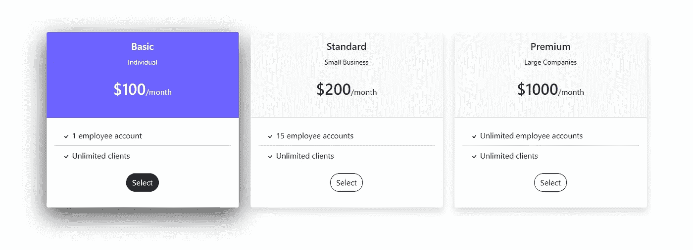***

****HTML 代码****

```
**<style>
    .card {
      border:none;
    } .card:hover {
      box-shadow: 0 1rem 3rem rgba(0,0,0,.75) **!important**;
    } .card:hover .btn-outline-dark{
      color:white;
      background:#212529;
    } .card:hover .bg-light{
      color:white;
      background:#6C63FF **!important**;
    }
</style><!--Pricing Table-->
<!--Pricing Table-->
<div class="container p-5">
  <div class="row">
    <div class="col-lg-4 col-md-12 mb-4">
      <div class="card h-100 shadow-lg">
        <div class="card-header text-center p-3 bg-light">
          <h5 class="card-title">Basic</h5>
          <small>Individual</small>
          <br><br>
          <span class="h2">$100</span>/month
          <br><br>
        </div>
        <div class="card-body">
          <ul class="list-group list-group-flush">
            <li class="list-group-item"><svg  width="16" height="16" fill="currentColor" class="bi bi-check" viewBox="0 0 16 16">
              <path d="M10.97 4.97a.75.75 0 0 1 1.07 1.05l-3.99 4.99a.75.75 0 0 1-1.08.02L4.324 8.384a.75.75 0 1 1 1.06-1.06l2.094 2.093 3.473-4.425a.267.267 0 0 1 .02-.022z"/>
            </svg> 1 employee account</li>
            <li class="list-group-item"><svg  width="16" height="16" fill="currentColor" class="bi bi-check" viewBox="0 0 16 16">
              <path d="M10.97 4.97a.75.75 0 0 1 1.07 1.05l-3.99 4.99a.75.75 0 0 1-1.08.02L4.324 8.384a.75.75 0 1 1 1.06-1.06l2.094 2.093 3.473-4.425a.267.267 0 0 1 .02-.022z"/>
            </svg> Unlimited clients</li>
          </ul>
          <div class="card-body text-center">
            <button class="btn btn-outline-dark" style="border-radius:30px">Select</button>
          </div>
        </div>
      </div>
    </div>
    <div class="col-lg-4 col-md-12 mb-4">
      <div class="card h-100 shadow">
        <div class="card-header text-center p-3 bg-light">
          <h5 class="card-title">Standard</h5>
          <small>Small Business</small>
          <br><br>
          <span class="h2">$200</span>/month 
          <br><br>
        </div>
        <div class="card-body">
          <ul class="list-group list-group-flush">
            <li class="list-group-item"><svg  width="16" height="16" fill="currentColor" class="bi bi-check" viewBox="0 0 16 16">
              <path d="M10.97 4.97a.75.75 0 0 1 1.07 1.05l-3.99 4.99a.75.75 0 0 1-1.08.02L4.324 8.384a.75.75 0 1 1 1.06-1.06l2.094 2.093 3.473-4.425a.267.267 0 0 1 .02-.022z"/>
            </svg> 15 employee accounts</li>
            <li class="list-group-item"><svg  width="16" height="16" fill="currentColor" class="bi bi-check" viewBox="0 0 16 16">
              <path d="M10.97 4.97a.75.75 0 0 1 1.07 1.05l-3.99 4.99a.75.75 0 0 1-1.08.02L4.324 8.384a.75.75 0 1 1 1.06-1.06l2.094 2.093 3.473-4.425a.267.267 0 0 1 .02-.022z"/>
            </svg> Unlimited clients</li>
          </ul>
          <div class="card-body text-center">
            <button class="btn btn-outline-dark" style="border-radius:30px">Select</button>
          </div>
        </div>
      </div>
    </div>
    <div class="col-lg-4 col-md-12 mb-4">
      <div class="card h-100 shadow">
       <div class="card-header text-center p-3 bg-light">
        <h5 class="card-title">Premium</h5>
        <small>Large Companies</small>
        <br><br>
        <span class="h2">$1000</span>/month
        <br><br>
      </div>
      <div class="card-body">
        <ul class="list-group list-group-flush">
          <li class="list-group-item"><svg  width="16" height="16" fill="currentColor" class="bi bi-check" viewBox="0 0 16 16">
            <path d="M10.97 4.97a.75.75 0 0 1 1.07 1.05l-3.99 4.99a.75.75 0 0 1-1.08.02L4.324 8.384a.75.75 0 1 1 1.06-1.06l2.094 2.093 3.473-4.425a.267.267 0 0 1 .02-.022z"/>
          </svg> Unlimited employee accounts</li>
          <li class="list-group-item"><svg  width="16" height="16" fill="currentColor" class="bi bi-check" viewBox="0 0 16 16">
            <path d="M10.97 4.97a.75.75 0 0 1 1.07 1.05l-3.99 4.99a.75.75 0 0 1-1.08.02L4.324 8.384a.75.75 0 1 1 1.06-1.06l2.094 2.093 3.473-4.425a.267.267 0 0 1 .02-.022z"/>
          </svg> Unlimited clients</li>
        </ul>
        <div class="card-body text-center">
          <button class="btn btn-outline-dark" style="border-radius:30px">Select</button>
        </div>
      </div>
    </div>
  </div>
</div>   
</div>**
```

**这是卡片中定价表的另一个例子。你可以看到，它清楚地列出了价格，并比较了三个功能。**

**更多示例参见 [11 引导定价表示例](https://www.ordinarycoders.com/blog/article/bootstrap-pricing-table-example)。**

# ****引导页脚****

****什么是页脚？****

**页脚是网站的最后一部分，位于每个页面的底部。它是一个 HTML 元素，包含对用户有用的链接和资源。**

**它在导航栏中提供链接，同时还包括额外的联系信息，不需要在页面加载时导航到右边。**

****页脚的例子是什么？****

**除了条款和条件之外，页脚还包含指向 cookie 和隐私政策的链接。**

**它们还包含联系信息，如电子邮件、电话号码和街道地址。本质上，客户端需要访问的任何信息都应该在页脚中。**

**这些链接通常以列的形式呈现，以便于浏览。**

**如果适用，页脚还应包含公司的版权。**

****什么是好的页脚？****

**一个好的页脚就像一本书的索引。这是一个相关链接的列表，旨在帮助用户快速找到所需的资源。**

**一些公司喜欢把他们的标志和使命声明放在页脚，作为除了社交媒体之外的另一个有用的资源。**

****引导页脚模板#1****

**浏览器中的**

***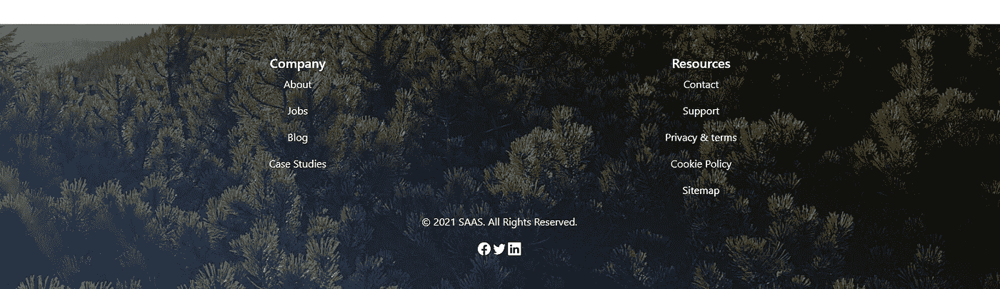***

****HTML 代码****

```
**<style>
    .footer-link{
      color:white;
      text-decoration: none
    } .footer-link:hover {
      color:white;
      text-decoration: underline;
    }
</style><div class="container-fluid banner mt-5 text-white text-center">
  <div class="container p-5">
    <div class="row">
      <div class="col-lg-6 col-md-12">
        <h5>Company</h5>
        <p><a href="/" class="footer-link">About</a></p>
        <p><a href="/" class="footer-link">Jobs</a></p>
        <p><a href="/" class="footer-link">Blog</a></p>
        <p><a href="/" class="footer-link">Case Studies</a></p>
      </div>
      <div class="col-lg-6 col-md-12">
        <h5>Resources</h5>
        <p><a href="/" class="footer-link">Contact</a></p>
        <p><a href="/" class="footer-link">Support</a></p>
        <p><a href="/" class="footer-link">Privacy & terms</a></p>
        <p><a href="/" class="footer-link">Cookie Policy</a></p>
        <p><a href="/" class="footer-link">Sitemap</a></p>
      </div>
    </div> <div class="container p-2">
    <p>© 2021 SAAS. All Rights Reserved.</p>
     <a href="/" class="footer-link">
          <svg  width="1.2em" height="1.2em" fill="currentColor" class="bi bi-facebook" viewBox="0 0 16 16">
            <path d="M16 8.049c0-4.446-3.582-8.05-8-8.05C3.58 0-.002 3.603-.002 8.05c0 4.017 2.926 7.347 6.75 7.951v-5.625h-2.03V8.05H6.75V6.275c0-2.017 1.195-3.131 3.022-3.131.876 0 1.791.157 1.791.157v1.98h-1.009c-.993 0-1.303.621-1.303 1.258v1.51h2.218l-.354 2.326H9.25V16c3.824-.604 6.75-3.934 6.75-7.951z"/>
          </svg></a>
          <a href="/" class="footer-link">
            <svg  width="1.2em" height="1.2em" fill="currentColor" class="bi bi-twitter" viewBox="0 0 16 16">
              <path d="M5.026 15c6.038 0 9.341-5.003 9.341-9.334 0-.14 0-.282-.006-.422A6.685 6.685 0 0 0 16 3.542a6.658 6.658 0 0 1-1.889.518 3.301 3.301 0 0 0 1.447-1.817 6.533 6.533 0 0 1-2.087.793A3.286 3.286 0 0 0 7.875 6.03a9.325 9.325 0 0 1-6.767-3.429 3.289 3.289 0 0 0 1.018 4.382A3.323 3.323 0 0 1 .64 6.575v.045a3.288 3.288 0 0 0 2.632 3.218 3.203 3.203 0 0 1-.865.115 3.23 3.23 0 0 1-.614-.057 3.283 3.283 0 0 0 3.067 2.277A6.588 6.588 0 0 1 .78 13.58a6.32 6.32 0 0 1-.78-.045A9.344 9.344 0 0 0 5.026 15z"/>
            </svg></a>
            <a href="/" class="footer-link">
              <svg  width="1.2em" height="1.2em" fill="currentColor" class="bi bi-linkedin" viewBox="0 0 16 16">
              <path d="M0 1.146C0 .513.526 0 1.175 0h13.65C15.474 0 16 .513 16 1.146v13.708c0 .633-.526 1.146-1.175 1.146H1.175C.526 16 0 15.487 0 14.854V1.146zm4.943 12.248V6.169H2.542v7.225h2.401zm-1.2-8.212c.837 0 1.358-.554 1.358-1.248-.015-.709-.52-1.248-1.342-1.248-.822 0-1.359.54-1.359 1.248 0 .694.521 1.248 1.327 1.248h.016zm4.908 8.212V9.359c0-.216.016-.432.08-.586.173-.431.568-.878 1.232-.878.869 0 1.216.662 1.216 1.634v3.865h2.401V9.25c0-2.22-1.184-3.252-2.764-3.252-1.274 0-1.845.7-2.165 1.193v.025h-.016a5.54 5.54 0 0 1 .016-.025V6.169h-2.4c.03.678 0 7.225 0 7.225h2.4z"/>
          </svg>
        </a>
  </div>
</div>**
```

**这是页脚中使用的同一 CTA 背景横幅图像。社交媒体链接是免费的引导图标。**

****引导页脚模板#2****

***在浏览器中***

**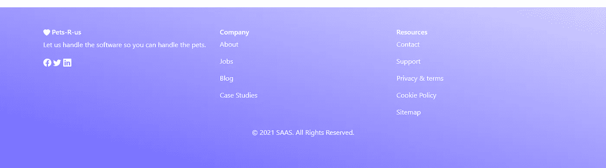**

***HTML 代码***

```
**<style>
    .footer{
      background: linear-gradient(to bottom left, #D2D0FF, #6C63FF);
    } .footer-link{
      color:white;
      text-decoration: none
    } .footer-link:hover {
      color:white;
      text-decoration: underline;
    }
</style> <div class="container-fluid footer mt-5 text-white">
  <div class="container p-5">
    <div class="row">
      <div class="col-lg-4 col-md-12">  
        <h6>
          <svg  width="16" height="16" fill="currentColor" class="bi bi-heart-fill" viewBox="0 0 16 16">
            <path fill-rule="evenodd" d="M8 1.314C12.438-3.248 23.534 4.735 8 15-7.534 4.736 3.562-3.248 8 1.314z"/>
          </svg>
        Pets-R-us</h6>
        <p>Let us handle the software so you can handle the pets.</p>
        <a href="/" class="footer-link">
          <svg  width="1.2em" height="1.2em" fill="currentColor" class="bi bi-facebook" viewBox="0 0 16 16">
            <path d="M16 8.049c0-4.446-3.582-8.05-8-8.05C3.58 0-.002 3.603-.002 8.05c0 4.017 2.926 7.347 6.75 7.951v-5.625h-2.03V8.05H6.75V6.275c0-2.017 1.195-3.131 3.022-3.131.876 0 1.791.157 1.791.157v1.98h-1.009c-.993 0-1.303.621-1.303 1.258v1.51h2.218l-.354 2.326H9.25V16c3.824-.604 6.75-3.934 6.75-7.951z"/>
          </svg></a>
          <a href="/" class="footer-link">
            <svg  width="1.2em" height="1.2em" fill="currentColor" class="bi bi-twitter" viewBox="0 0 16 16">
              <path d="M5.026 15c6.038 0 9.341-5.003 9.341-9.334 0-.14 0-.282-.006-.422A6.685 6.685 0 0 0 16 3.542a6.658 6.658 0 0 1-1.889.518 3.301 3.301 0 0 0 1.447-1.817 6.533 6.533 0 0 1-2.087.793A3.286 3.286 0 0 0 7.875 6.03a9.325 9.325 0 0 1-6.767-3.429 3.289 3.289 0 0 0 1.018 4.382A3.323 3.323 0 0 1 .64 6.575v.045a3.288 3.288 0 0 0 2.632 3.218 3.203 3.203 0 0 1-.865.115 3.23 3.23 0 0 1-.614-.057 3.283 3.283 0 0 0 3.067 2.277A6.588 6.588 0 0 1 .78 13.58a6.32 6.32 0 0 1-.78-.045A9.344 9.344 0 0 0 5.026 15z"/>
            </svg></a>
            <a href="/" class="footer-link">
              <svg  width="1.2em" height="1.2em" fill="currentColor" class="bi bi-linkedin" viewBox="0 0 16 16">
              <path d="M0 1.146C0 .513.526 0 1.175 0h13.65C15.474 0 16 .513 16 1.146v13.708c0 .633-.526 1.146-1.175 1.146H1.175C.526 16 0 15.487 0 14.854V1.146zm4.943 12.248V6.169H2.542v7.225h2.401zm-1.2-8.212c.837 0 1.358-.554 1.358-1.248-.015-.709-.52-1.248-1.342-1.248-.822 0-1.359.54-1.359 1.248 0 .694.521 1.248 1.327 1.248h.016zm4.908 8.212V9.359c0-.216.016-.432.08-.586.173-.431.568-.878 1.232-.878.869 0 1.216.662 1.216 1.634v3.865h2.401V9.25c0-2.22-1.184-3.252-2.764-3.252-1.274 0-1.845.7-2.165 1.193v.025h-.016a5.54 5.54 0 0 1 .016-.025V6.169h-2.4c.03.678 0 7.225 0 7.225h2.4z"/>
          </svg>
        </a>
      </div>
      <div class="col-lg-4 col-md-12">
        <h6>Company</h6>
        <p><a href="/" class="footer-link">About</a></p>
        <p><a href="/" class="footer-link">Jobs</a></p>
        <p><a href="/" class="footer-link">Blog</a></p>
        <p><a href="/" class="footer-link">Case Studies</a></p>
      </div>
      <div class="col-lg-4 col-md-12">
        <h6>Resources</h6>
        <p><a href="/" class="footer-link">Contact</a></p>
        <p><a href="/" class="footer-link">Support</a></p>
        <p><a href="/" class="footer-link">Privacy & terms</a></p>
        <p><a href="/" class="footer-link">Cookie Policy</a></p>
        <p><a href="/" class="footer-link">Sitemap</a></p>
      </div>
    </div> <div class="container p-2">
    <p class="text-center">© 2021 SAAS. All Rights Reserved.</p>
  </div>
</div>**
```

**这是一个有三列和线性渐变背景的页脚。**

**如果你想要更多引导页脚的例子，请访问 [18 响应式引导页脚例子](https://www.ordinarycoders.com/blog/article/bootstrap-footers)。**

***原载于*[*https://www.ordinarycoders.com*](https://www.ordinarycoders.com/blog/article/saas-bootstrap-homepage)*。***

***更多内容请看*[***plain English . io***](http://plainenglish.io/)**