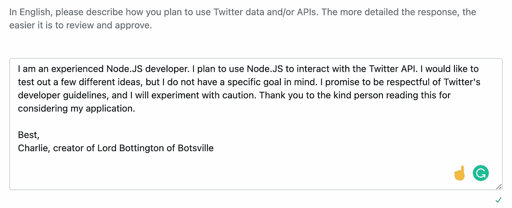

# 如何用 Node.js 制作一个 Twitter Bot

> 原文：<https://javascript.plainenglish.io/how-to-make-a-twitter-bot-with-node-js-61bb5a154ee?source=collection_archive---------5----------------------->

## 创建 Twitter 机器人的初学者友好指南


Photo by [Alexander Shatov](https://unsplash.com/@alexbemore?utm_source=medium&utm_medium=referral) on [Unsplash](https://unsplash.com?utm_source=medium&utm_medium=referral)

编码是达到目的的一种手段，最大的问题是，“什么是目的？”

作为初学者，您的第一个编程努力是打印单词“Hello，world！”一个控制台。对于有抱负的程序员来说，这是一个激动人心的壮举，对于那些经验丰富的开发人员来说，这也是学习新编程语言的第一个里程碑。随着教育的继续，您将学习软件架构的基本概念和各种技术，以释放新的语言能力。一路走来，你可能会开始想，“我如何才能把这个应用到现实世界中呢？”当然，除了打印到控制台之外，还有编程的应用。

嗯，当然有！世界上任何电力驱动的东西都可以通过代码控制，从灯泡到互联网。

今天，我想向您展示将一些文本打印到控制台的相同逻辑是如何将一些文本打印到 Twitter 上的 tweet 的。

我们的目标将是建立一个机器人，每天都像这样发微博，“你好，世界！”一旦你做到了这一点，你的推特机器人就有无限的可能性可以发推特了。

# Twitter 开发者

你需要一个推特账号。如果你已经有一个，我建议你做一个新的，专门用作你的 Twitter 机器人。

我的名字叫博顿顿勋爵，你可以跟着他:

[https://twitter.com/LordBottington](https://twitter.com/LordBottington)

创建帐户后，您需要申请访问 Twitter 开发者门户。

 [## 申请访问- Twitter 开发者

### 申请准入。Twitter APIs 和工具入门。所有新开发人员必须申请一个开发人员帐户…

developer.twitter.com](https://developer.twitter.com/apply-for-access) 

这是我的灵感申请。



Screenshot by Author

完成后，进入您的设置，将您的权限从默认的只读更改为读取、写入和发送邮件。你需要写权限才能发推特。

然后，您应该重新生成令牌和密钥，以遵守新的写权限。一定要把它们保存在某个地方。

# 节点. js

对于这个机器人，我们将使用 Node.js，一个 JavaScript 运行时引擎。如果你没有安装 Node.js，去 https://nodejs.org 的[下载它。如果你用的是 Mac，我推荐用 Homebrew 下载，你可以用下面的命令安装。](https://nodejs.org/)

```
/usr/bin/ruby -e "$(curl -fsSL https://raw.githubusercontent.com/Homebrew/install/master/install)"
```

# 开源代码库

我们将使用 GitHub 托管我们的代码。

[](https://github.com/charlielevine/SirBottingtonOfBotsville#lord-bottington-of-botsville) [## Charlie Levine/SirBottingtonOfBotsville

### 在 GitHub 上创建一个帐户，为 Charlie Levine/SirBottingtonOfBotsville 的发展做出贡献。

github.com](https://github.com/charlielevine/SirBottingtonOfBotsville#lord-bottington-of-botsville) 

# 赫罗库

Heroku 是一个用于托管 Node.js 应用程序的用户友好平台。我们将使用它在云中托管我们的机器人，每天都可以在我们这边自动进行任何维护。

您可以在 https://heroku.com 的[创建一个免费账户。](https://heroku.com.)

一旦你这样做了，为 Twitter 机器人创建应用程序。

# 安装

使用您的终端导航到您的项目将使用的目录，并运行以下命令。

```
npm init
```

在`package.json`中添加一个调用`node index.js`的“开始”脚本。另外，添加键值对`“type”: “module”`来使用 ES6。

安装`**dotenv**`以在我们的本地测试环境中使用环境变量。

```
npm install dotenv
```

安装`**twitter**`用 Node.js 轻松与 Twitter API 交互

```
npm install twitter
```

初始化项目的 git 存储库。

```
git init
```

接下来，添加`.gitignore`来忽略`node_modules`，它存储我们的 NPM 包依赖关系，以及`.env`，它存储我们的环境变量。

Heroku 将安装 NPM 包依赖项，环境变量将直接存储在 Heroku 上。

```
touch .gitignore
```

现在我们需要粘贴之前从 Twitter 开发人员门户保存的密钥和令牌。

```
touch .env
```

确保在 Heroku 上的 config vars 下的设置中也添加这些环境变量。

# 编写机器人代码

```
touch index.js
```

如您所见，代码很简洁。首先，我们从我们的`.env`文件中初始化环境变量，然后我们初始化 Twitter 客户端对象。

从那里，我们调用方法来发送 tweet。您可以在这里阅读 node-twitter 包中的更多方法。

[](https://www.npmjs.com/package/twitter) [## 推特

### Twitter REST 和流 API 的异步客户端库。npm 安装 twitter 您将需要有效的…

www.npmjs.com](https://www.npmjs.com/package/twitter) 

# 部署代码

将您的代码推送到 GitHub，并在 Heroku 上选择自动部署，现在您需要选择 Heroku schedule 插件。

让它调用`npm start`并让它尽可能频繁地运行。

# 那是一个包裹

现在你应该有一个全功能的 Twitter 机器人，每天自己发微博。

感谢您的阅读！

[查理·莱文](https://medium.com/u/6da6b651e31a?source=post_page-----61bb5a154ee--------------------------------)