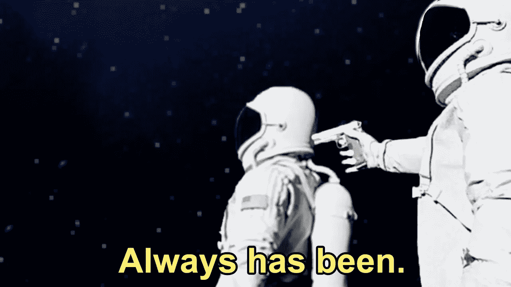
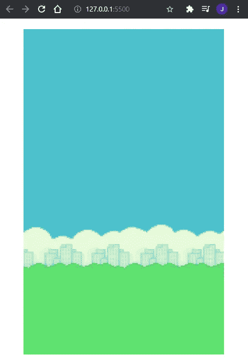

# 如何用 p5.js 制作一个基于网络的 Flappy Bird 克隆体|第 1 部分

> 原文：<https://javascript.plainenglish.io/how-to-make-a-web-based-flappy-bird-clone-with-p5-js-part-1-2913fde25c8a?source=collection_archive---------12----------------------->

你有没有想过制作一个可以在网络上玩的 flappy bird 克隆体？好吧，如果你说是，那么这是给你的教程。如果你说不，那么也许你会有兴趣学习更多关于 p5.js 的知识，我将在本教程中详细介绍。

像这样制作微小的克隆项目是提高编程技能的绝佳方式，甚至可能给你的简历增加令人印象深刻的内容。最棒的是，这只需要 2-3 天——一个完美的周末项目。所以放松一下，让我们开始吧。

What we’ll be making

## **WTF 是 p5.js？**

要回答这个问题，我先来回答我为什么决定做一个网页版的 flappy bird。简单的答案是，它设置起来非常快，完成后也很容易分享——现在每个人都可以使用浏览器。如果你了解 web 浏览器，你就会知道任何繁重的图形渲染都应该在 HTML canvas 元素内部完成。这就是 p5.js 的用武之地，因为它是一个库，提供了一个使用画布的简单接口。你可以用它做很多很酷的事情。当然，出于我们的目的，我们将使用它来呈现我们的游戏内容。

A cool demo made with p5.js by [hanax](https://github.com/hanax/p5js-demos)

该库的工作原理是保持一个内部计时器，告诉自己以固定的时间间隔呈现内容帧。如果您将一系列帧串连在一起，其中对象在帧上的位置会一点一点地变化，您会获得运动的错觉，就像“动画书”漫画的工作原理一样。

那么 p5 怎么知道在框架上渲染什么呢？开箱即用，p5 为您提供了一个渲染函数(它称之为 draw ),该函数每隔一段时间运行一次。为了用 p5 创建一个游戏，我们只需要弄清楚如何使对象出现在帧上，添加一些逻辑来更新每个对象在渲染的每个帧中的位置，最后应用一些游戏逻辑。很简单，你有比赛！

## 等等，都是物理？



不幸的是，p5 没有配备物理引擎，所以我们必须让物体移动。别担心，如果你在高中学过任何物理，这应该不会太难(如果你没有，那也没关系，因为我会给你方程；).

如果你对运动学有所了解，你应该知道物体会随着时间在空间中运动。由于 p5 通过以恒定的间隔渲染帧来“保持时间”，我们只需在 update 函数中添加位置更新代码。

## 那么，如何在屏幕上显示对象呢？

在我们开始编写代码之前，您需要一些资产。转到 my [GitHub repo](https://github.com/JL978/flappy_bird_clone/tree/starter) ，将项目克隆到您的本地机器上，并签出到 starter 分支(我假设您知道如何使用 git)。要在本地运行项目，我建议使用 VSCode live 服务器，它将提供热重新加载功能。或者，如果你喜欢过边缘生活，你可以在任何浏览器中打开 index.html 文件。

现在您已经有了资产，让我们设置画布并在浏览器上显示它。在 index.html 文件中，您将看到托管的 minified p5.js 脚本首先包含在内，这样我们就可以在我们的项目中使用它，我们的入口点将位于底部加载的 index.js 文件中。现在，如前所述，我们需要告诉 p5 将内容渲染到画布上，但在此之前，我们需要告诉它加载资产。

注意，对于下面的块，loadImage、createCanvas 和 background 都是 p5 提供的函数。

```
// index.js
function preload() {
    BG_IMG = loadImage(“assets/bg.png”);BG_IMG = loadImage("assets/bg.png");
    BIRD_IMG = [
       loadImage("assets/bird1.png"),
       loadImage("assets/bird2.png"),
       loadImage("assets/bird3.png"),
    ];
    BASE_IMG = loadImage("assets/base.png");
    PIPE_UP_IMG = loadImage("assets/pipeUp.png");
    PIPE_DOWN_IMG = loadImage("assets/pipeDown.png");
}
```

preload 函数让 p5 知道在画布设置好之前要做什么。您希望预加载所有资产，这可能需要一些时间来加载。

现在，我们需要初始化画布，这将在 setup 函数中完成。p5 确保在预加载后执行设置功能。

```
// index.js// global variables go at the top 
const WIN_WIDTH = 400;
const WIN_HEIGHT = WIN_WIDTH * 1.62;function preload() {
    ...
}function setup() {
    createCanvas(WIN_WIDTH, WIN_HEIGHT);
}
```

最后，如前所述，我们需要告诉 p5 渲染什么。在 p5 中，渲染函数被称为“draw ”,我们将把显示背景函数放入其中。

```
// index.jsfunction preload() {
    ...
}function setup() {
    ...
}function draw() {
    background(BG_IMG);
}
```



Your browser should now be looking like this

恭喜你，你已经用 p5.js 渲染了你的第一个对象。

现在，让我们的每个游戏对象成为对象是一个好主意，因为我们可以封装它们自己的更新逻辑，并在它们自己的对象类中呈现，这将使我们的代码更加整洁。但是对本文来说已经足够了，我们将在这个系列的[第 2 部分](/making-a-web-based-flappy-bird-clone-with-p5-js-part-2-c554254881b1)中继续。

*更多内容尽在*[***plain English . io***](http://plainenglish.io/)