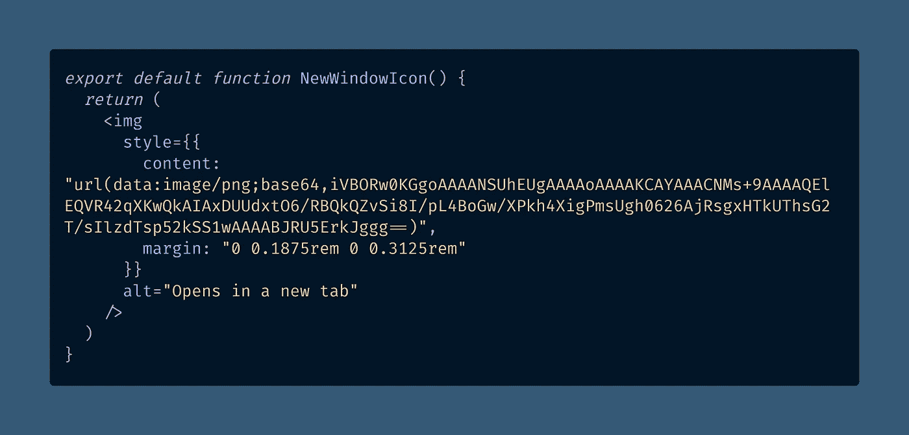

# 如何在 React 的 12 行中创建一个可访问的“在新标签页中打开”图标

> 原文：<https://javascript.plainenglish.io/how-to-make-an-accessible-opens-in-a-new-tab-icon-in-12-lines-of-react-e99ce5f25b5d?source=collection_archive---------16----------------------->

## 想知道如何制作一个维基百科风格的“外部链接”图标来指示链接何时会在新标签页中打开吗？看看这个非常棒的 React 代码示例，它甚至不需要 SVG 图标。


Photo by [Drew Sullivan](https://unsplash.com/@drewsully?utm_source=medium&utm_medium=referral) on [Unsplash](https://unsplash.com?utm_source=medium&utm_medium=referral)

作为一个视力正常的用户，当链接在互联网上没有正常运行时，我会非常恼火。

你是否曾经期待一个链接在一个新窗口中打开，但是当你不得不点击后退按钮时，却失去了你在先前站点的位置？

我确实有。

你能想象如果你试图通过屏幕阅读器使用网络会有多烦人吗？啊！

令人欣慰的是，只需 13 行 React 就可以很容易地添加一个对视力正常和视力不正常的用户都很有用的图标。

# 如何制作“在新窗口中打开”图标

在下面的代码示例中，我们将使用`content` CSS 属性将图像图标直接编码到 React JSX 代码中。

> “`**content**` [CSS](https://developer.mozilla.org/en-US/docs/Web/CSS) 属性用生成的值替换元素。使用`content`属性插入的对象是**匿名** [**替换元素**](https://developer.mozilla.org/en-US/docs/Web/CSS/Replaced_element) 。”
> — [MDN 文档](https://developer.mozilla.org/en-US/docs/Web/CSS/content)

使用 [base64 编码](https://developer.mozilla.org/en-US/docs/Glossary/Base64)，我们将嵌入一个我在 CodePen 上找到的小 PNG 图标[——不幸的是，我无法找到它的原作者。](https://codepen.io/Bets/details/KGBqqb)



[View raw code](https://codesandbox.io/s/this-hidden-feature-of-react-hides-html-attributes-from-the-dom-oky3k?file=/src/NewWindowIcon.tsx:0-394) on CodeSandbox

```
export default function NewWindowIcon() {
  return (
    
  )
}
```

在我的研究中，我看到一些人使用`::after`匹配`target="blank"`来自动将图标添加到任何在新窗口中打开的链接，但我认为这种解决方案不可行，因为你不能添加`[alt](https://developer.mozilla.org/en-US/docs/Web/HTML/Element/img#attr-alt)`文本。

请注意，`alt`属性的文本显示为“在新标签中打开”——这是在当前浏览器行为下最容易理解的表达方式。

视力正常的用户可以看到图标(注意，这是链接的可点击部分)，而失明的用户可以听到替代文本。

**快乐编码！** 🧑‍💻🆕🪟🌚🗽

德里克·奥斯汀博士是《职业编程:如何在 6 个月内成为一名成功的 6 位数程序员 》一书的作者，该书现已在亚马逊上架。