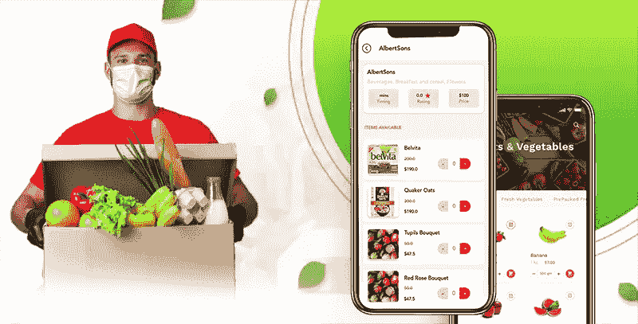
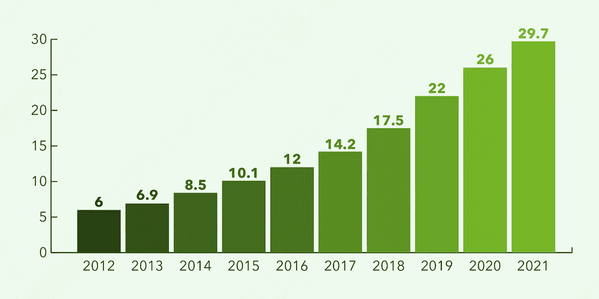
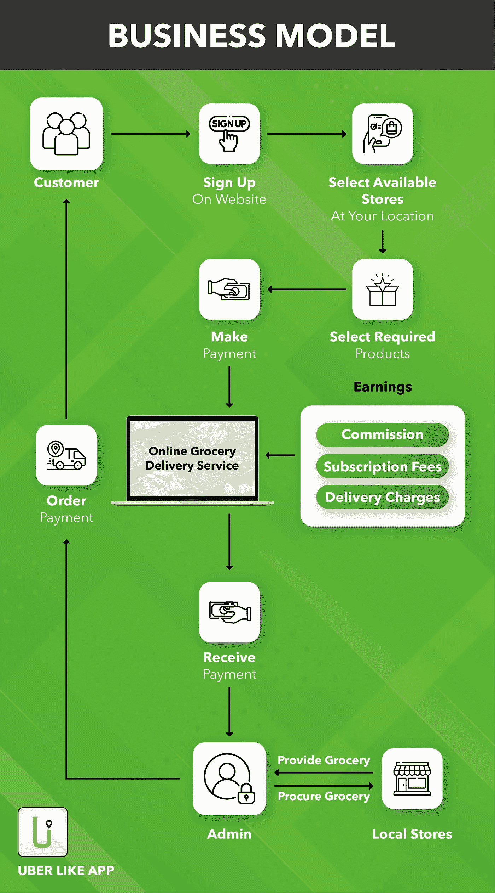
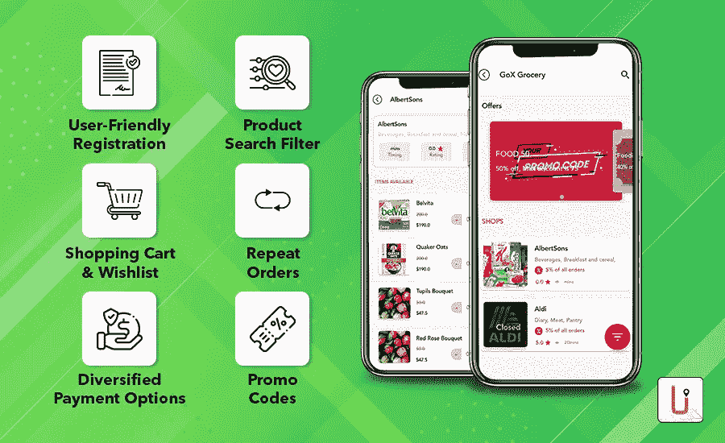
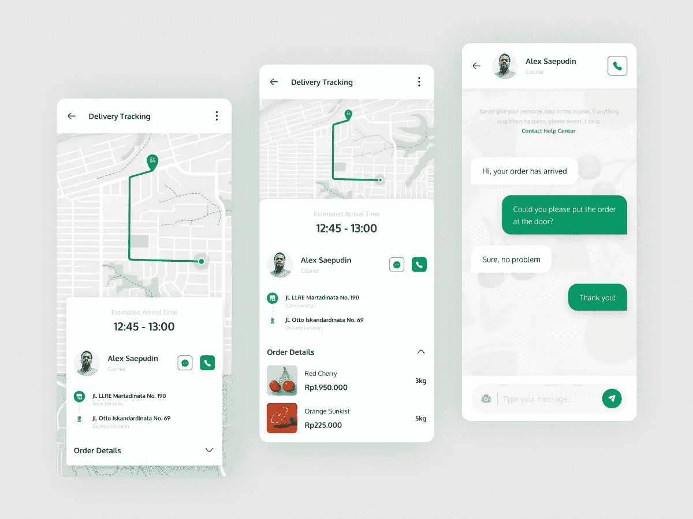
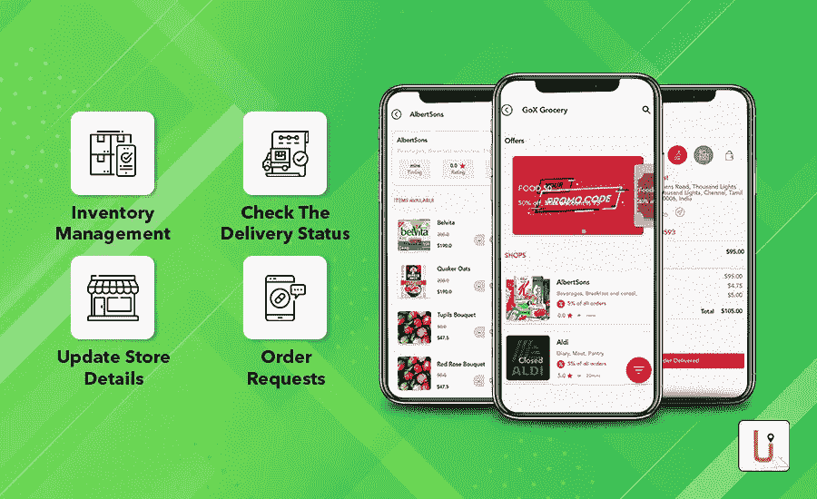
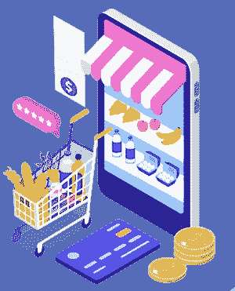

# 如何制作像 Instacart 这样的应用程序:功能和成本估算

> 原文：<https://javascript.plainenglish.io/how-to-make-an-app-like-instacart-features-and-cost-estimation-88db45a2a96e?source=collection_archive---------15----------------------->

随着智能手机和稳定的互联网连接的增长趋势，按需应用程序已变得普遍使用。随着时间的推移，人们开始对网上购物感兴趣，包括食品杂货购物。Instacart 是美国市场上最受欢迎的杂货交付应用程序之一。观察到这一点，企业家们正在积极寻找一种方式来推出一款杂货店送货的 Instacart 克隆应用程序。这是一个信息丰富的博客，引导你了解其独特的商业模式和功能，并了解 Instacart 克隆应用程序开发的成本。

## **新冠肺炎如何影响杂货业**

那些我们每个人走进杂货店，购买必需品，排着长队付款的日子已经一去不复返了。近年来，人们更喜欢按需杂货交付应用程序，因为它们方便舒适。

出乎意料的是，新冠肺炎的爆发极大地增加了对此类应用的需求。几乎大多数人都适应了网上购物的新常态。毫无疑问，这场危机刺激了对杂货配送应用的需求。

例如，近四分之三的美国人已经避免在商店里购物，并开始喜欢杂货应用程序。Instacart 就是这样一款总部位于美国的知名应用，很多人都在使用它。尽管疫情已经接近了它的终点，但是已经没有回头路了。因此，推出像 Instacart 这样的按需杂货交付应用程序将是一个顶级的商业想法。

## **令人印象深刻的 Instacart 克隆商业模式**

Instacart Clone 的基本商业模式是便捷的杂货配送。在这种情况下，顾客只需轻点几下就可以下杂货订单，并在当天或预定的某一天收到货。

以 Instacart 为例。它以众包市场的商业模式运作，当地的杂货店与它合作来迎合他们的顾客。Instacart 本身没有杂货店。相反，该公司与多家杂货店合作。Instacart 这样的应用程序是如何工作的。看一眼吧。

*   希望在线购买杂货的人必须安装杂货交付应用程序并完成注册过程。
*   从众多的杂货店中选择最近的杂货店，然后选择你想买的商品。这些被选中的产品将被立即添加到购物车中，用户可以在其中进行修改。
*   之后，他们会被提示通过信用卡、网上银行、借记卡或电子钱包进行支付交易。
*   然后，当地杂货店处理订单，分配的送货人员将按时完成顾客的订单。
*   管理员(平台所有者)从合作的当地杂货店扣除佣金，并管理付款。

## **insta cart 克隆的基本特征**

Instacart Clone 由顾客/买家应用、送货人应用和商店应用组成。此外，它还有一个管理面板，平台所有者可以管理应用程序的性能，无缝地照看业务。这些模块的功能将由包含的功能决定。我们来看看 Instacart 克隆的基本特性。

> **用户/买家应用功能**

**用户友好的注册—** 注册过程必须简单快捷，用户只需几个步骤即可完成注册。社交媒体整合将通过使用社交媒体凭证注册来缓解这一问题。

**产品搜索过滤器—** 这是杂货交付应用的一个重要功能，方便买家通过应用过滤器轻松搜索杂货。

**购物车&愿望清单—** 您选择的杂货产品将自动保存在购物车中。除此之外，顾客可以将他们想要购买的杂货项目保存在愿望清单中。

**重复订单—** 买家可以查看他们的订单历史记录，并根据需要重复订单。这将节省搜索经常购买的物品的时间。

**多样化的支付选择—** 除了货到付款(COD)之外，数字支付模式的加入将简化交易。确保支付交易是安全的，可靠的，没有麻烦的。

**促销代码—** 忠诚度奖励计划旨在提高用户参与度。因此，考虑为定期购买者提供促销代码，这样他们就不会再考虑选择你的竞争对手的应用程序。

> **配送人员 App 功能**

**创建个人资料—** 与买家应用程序类似，送货人必须填写基本信息才能完成注册流程。他们必须上传管理验证所需的文件。完成后，他们可以管理自己的个人资料。它还包括添加银行详细信息。

**管理请求—** 交付主管可以查看他们目前已经完成的订单，并管理收到的订单请求。由他们根据可用性决定是接受还是拒绝请求。

**交付历史记录—** 使用此功能，交付主管可以检查收到的交付请求总数，同时注意已接受的订单请求。他们将能够知道他们一天完成了多少订单。

**应用内沟通—** 如有任何疑问，送货员将能够与杂货店经理和买家沟通。

**GPS 导航—** 这是按需交付应用的一项重要功能。GPS 导航系统的引入将引导送货员到达客户的位置。

**多个订单—** 配送主管能够同时接受多个订单，并毫不延迟地交付这些订单。

> **杂货店 App 功能**

**库存管理—** 杂货店经理可以管理库存，同时对杂货产品进行分类和细分，以便于买家搜索。

**检查交付状态—** 通常，管理员可以跟踪交付人员的移动。除此之外，供应商甚至可以对其进行监控，以确保订单及时交付。

**更新商店详情—** 创建完商店档案后，供应商可以随时更新详情。它还包括指定商店的开门和关门时间。

**订单请求—** 一旦买家确认订单，杂货店老板就会收到即时通知。因此，他们可以尽快处理订单，以便按时满足客户的需求。

## **开发像 Instacart 这样的杂货交付应用的总成本**

在不了解单个业务需求的情况下，无法预测 Instacart 克隆应用开发的总成本。其他几个因素也会影响成本。以下是将产生重大影响的主要因素。

*   **添加的功能数量**

功能是应用程序的基础，因为它将由功能的包含来决定。功能数量与 Instacart 克隆应用开发成本直接相关。也就是说，成本将随着增加的特征数量的增加而提高。

*   **公司的地理位置**

公司产生的费用因公司所在地而异。除此之外，应用程序开发人员的规模也在考虑之列。这表明了参与应用程序开发的应用程序开发人员的数量以及他们的经验和技能。

*   **开发平台的选择**

平台的选择将在影响成本方面发挥重要作用。当选择多个平台时，成本会相应增加。Android 是一个广泛使用的平台，所以选择这个平台将会有更好的影响。

## **关闭思路**

希望在你选择启动一个杂货递送应用程序之前，你已经收集了足够的信息。然而，到 2024 年，在线杂货交付市场的销售额将超过 1877 亿美元。因此，考虑进入这个市场将是一个明智的选择。为此，选择 Instacart 克隆脚本，这是一个现成的杂货交付应用程序解决方案。有了这个，你可以在几天内启动你的应用。

*更多内容看*[***plain English . io***](http://plainenglish.io/)