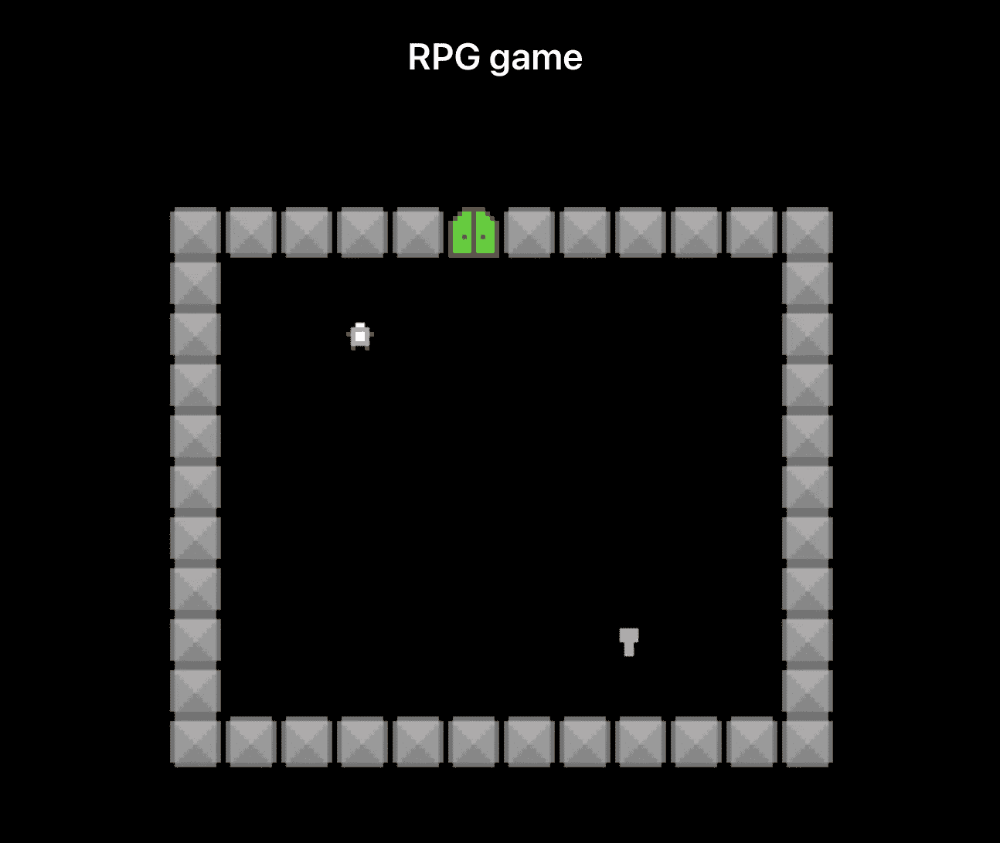
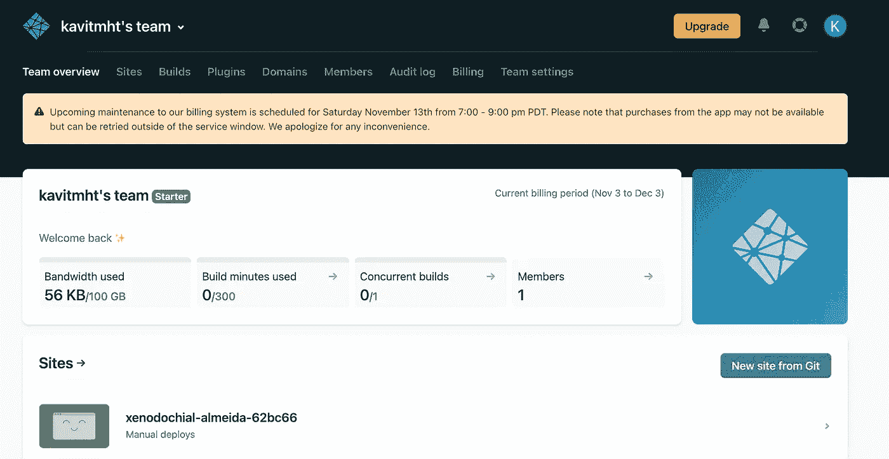
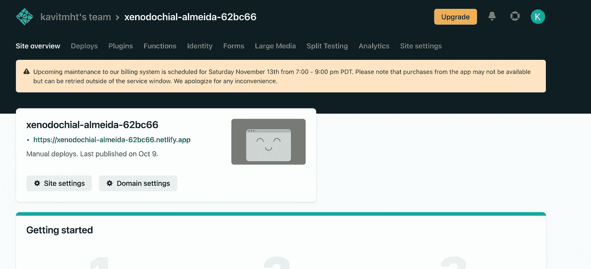

# 如何用 JavaScript 制作一个 RPG 游戏

> 原文：<https://javascript.plainenglish.io/how-to-make-an-rpg-game-using-javascript-14ff26e8d2db?source=collection_archive---------15----------------------->

## 第三部分:使用 [Netlify](https://www.netlify.com/) 作为我们的云服务，我们可以免费托管我们的游戏。



# 概述

在前两篇文章中，我们看到了如何设置和创建我们的游戏。下面提供了文章的链接

1.  [第一部分](/how-to-make-an-rpg-game-using-javascript-89b19cd49577)
2.  [第二部分](/how-to-make-a-rpg-game-using-javascript-cf3e9feff761?source=your_stories_page----------------------------------------)

# 第三部分

这一部分非常简单明了。对于这一部分，我们将使用 [Netlify](https://www.netlify.com/) 作为我们的云服务，在那里我们可以免费托管我们的游戏。

## 什么是 Netlify？

Netlify 是一个自动化现代网络项目的一体化平台。用单一工作流取代您的托管基础架构、持续集成和部署管道。随着项目的增长，集成动态功能，如无服务器功能、用户身份验证和表单处理。

## 步伐

1.  创建并登录**网络生活**。
2.  在第 1 部分中，我们已经安装了一个依赖项，我们将使用它来捆绑我们的游戏，并使用构建文件夹在 Netlify 上发布，然后它将在云上运行，互联网上的每个人都可以访问我们的游戏。以防万一，如果我们错过了安装依赖项，那么运行下面的命令:-

```
npm i parcel-bundler
```

3.现在，在您的`package.json`文件中，确保我们有以下设置。

```
"scripts": {
    "start": "parcel src/index.html",
    "build": "parcel build src/index.html",
    "test": "echo \"Error: no test specified\" && exit 1"
  },
```

4.现在，进入终端并运行以下命令:-

```
npm build
```

这将需要几分钟的时间，在这个过程完成后，您可以在您的工作区中看到一个`dist`文件夹。

5.现在，转到您的 **Netlify** 仪表板，看起来如下所示



6.现在，拿起你的`dist`文件夹，拖放到你的 **Netlify** 仪表板上， **Netlify** 足够智能，可以识别文件夹，它会启动构建过程，几分钟后，它会显示一条成功消息，上面有你的游戏所在的 URL，这就完成了我们的第 3 部分。



**结论**

第三部分到此结束，我的参赛作品可以在这里找到:-[https://ldjam.com/events/ludum-dare/49/unstable-dome](https://ldjam.com/events/ludum-dare/49/unstable-dome)

感谢所有的支持，完整的游戏代码可以在这里找到——[https://github.com/Kavit900/ludum-dare-49](https://github.com/Kavit900/ludum-dare-49)。

*更多内容看*[***plain English . io***](http://plainenglish.io/)