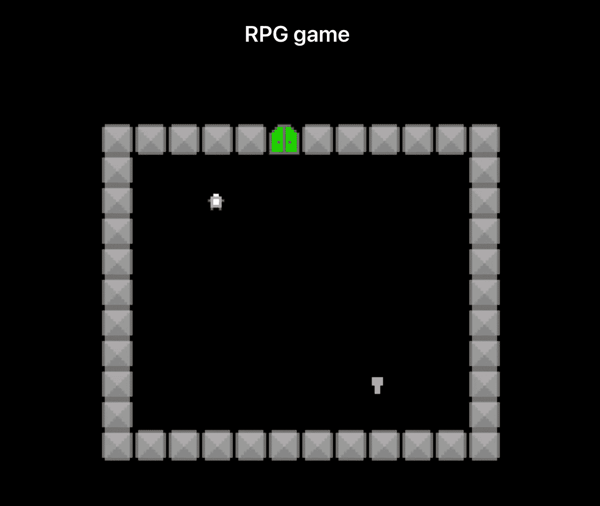
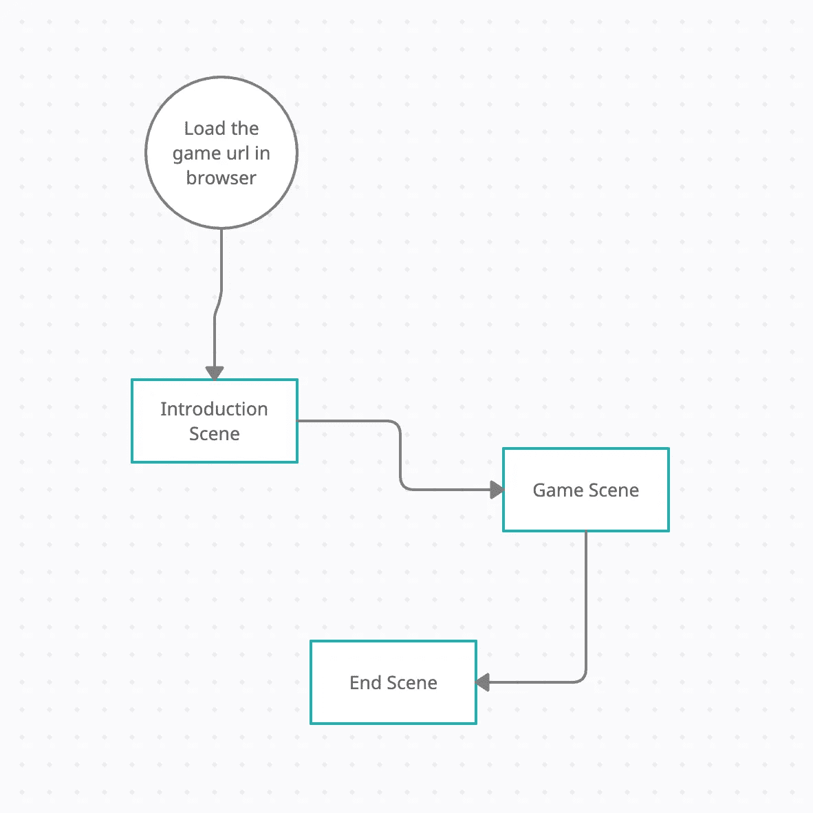

# 如何用 JavaScript 制作一个 RPG 游戏(第一部分)

> 原文：<https://javascript.plainenglish.io/how-to-make-an-rpg-game-using-javascript-89b19cd49577?source=collection_archive---------5----------------------->

## 第 1 部分:用 JavaScript 的基础知识从头开始构建一个 RPG 游戏



# 介绍

最近，我参加了世界上最大的游戏开发竞赛之一——Ludum dare 49。你可以在这里找到我的投稿-[https://ldjam.com/events/ludum-dare/49/unstable-dome](https://ldjam.com/events/ludum-dare/49/unstable-dome)。

compo 比赛持续 48 小时，在这段时间里，你必须从头开始构建一个游戏，制作图形、音乐等，一切都靠你自己。作为这个领域的业余爱好者，我决定用 JavaScript 作为我的游戏编码语言，我使用的游戏引擎是 [Kaboom.js](https://kaboomjs.com/) 。

通过这篇博文，我想分享我的经验以及如何用 JavaScript 的基础知识从头开始构建游戏的基础知识。

对于那些喜欢通过观看视频学习的人，你可以直接参考我为此创建的视频播放列表:-

# 我们要报道什么？

## 第一部分

1.  如何设置我们的开发环境并安装所有需要的依赖项。
2.  导入游戏引擎并在屏幕上渲染图形。

## 第二部分

1.  绘制一个 2d 字符数组作为地图，它将被映射到我们游戏中需要的精灵。
2.  玩家运动和碰撞检测。

## 第三部分

将您的游戏部署到云上，这样世界上的其他人也可以访问它。

# 设置开发环境

1.  创建一个文件夹，你可以给它取任何名字。
2.  然后在终端运行命令:- `npm init`，在设置的不同部分按回车键即可。
3.  现在安装下面三个与`parcel`相关的依赖项。你可以把 Parcel 看作是一个框架，它允许我们构建 web 应用程序。Parcel 内置了一个开发服务器，它会在您进行更改时自动重新构建您的应用程序。Parcel 接受任何类型的文件作为入口点，但是 HTML 文件是一个很好的起点。Parcel 将根据您的所有依赖项构建您的应用程序。

```
npm i parcel-bundler
npm i parcel-plugin-clean-easy
npm i parcel-plugin-static-files-copy
```

4.完成上述步骤后，所有必需的依赖项都已安装。

5.创建一个名为`index.html`的文件，这将是我们程序的入口。在此之后，将下列行添加到`package.json`。

```
"scripts": {
    "start": "parcel src/index.html",
    "build": "parcel build src/index.html",
    "test": "echo \"Error: no test specified\" && exit 1"
  },
```

6.现在，让我们给我们的`index.html`文件添加一些代码。我们将使用<脚本>来导入我们的`Kaboom.js`游戏引擎。下面是我们的`index.html`文件的样子。

```
<html>
  <head>
    <meta charset="utf-8">
    <meta name="viewport" content="width=device-width, initial-scale=1">
    <link rel="stylesheet" href="[https://cdn.jsdelivr.net/npm/bulma@0.9.2/css/bulma.min.css](https://cdn.jsdelivr.net/npm/bulma@0.9.2/css/bulma.min.css)">
    <link rel="stylesheet" href="game.css">
    <title>Unstable Dome</title>
  </head>
  <body>
    <section class="section">
      <div class="columns is-mobile">
        <div class="column is-8 is-offset-2">
          <h1 class="title is-4 has-text-centered">Unstable Dome</h1>
          <div class="canvas-holder">
            <canvas id="game"></canvas>
          </div>
        </div>
      </div>
    </section>
    <script src="[https://kaboomjs.com/lib/0.5.0/kaboom.js](https://kaboomjs.com/lib/0.5.0/kaboom.js)"></script>
    <script src="./main.js"></script>
  </body>
</html>
```

7.现在让我们回到我们的终端并运行`npm run start`。我们将看到我们的服务器正在启动，现在如果转到我们的浏览器，我们将看到一个带有黑框的空白屏幕。这一步完成了开发环境的设置。

# 导入图像资产

你可以从这里下载本博客使用的游戏资源:-[https://github.com/Kavit900/ludum-dare-49/tree/main/public](https://github.com/Kavit900/ludum-dare-49/tree/main/public)

**注意:-** 将这些图像资产添加到`public`文件夹中。

在此之后，将以下几行添加到`package.json`文件中。这将有助于找到图像文件，并将它们作为精灵加载到我们的主游戏逻辑中。

```
"staticFiles": {
    "staticPath": "public",
    "watcherGlob": "**"
  }
```

# 游戏引擎理论

在`Kaboom.js`游戏引擎中，每一个不同的状态都被称为一个`scene`。为了更好地理解什么是`scenes`以及它们是如何使用的，请看下图



在我们的游戏中，我们将会有`three`场景。

**介绍场景:-** 我们将展示玩我们游戏的说明。

游戏场景:- 我们将显示地图，以及玩家和其他关卡的详细信息。

**结束场景:-** 这是获胜状态，当玩家退出门后，我们就结束了游戏。

注意:- 这个游戏只有 1 级，这就是为什么我们只有一个场景的地图。如果你想用不同的设置来移动关卡，你可以创建一个单独的场景或者在`Game scene`中处理一切。

# 游戏逻辑

在这一部分，我们将加载我们的图像到游戏中，并在初始加载时显示它们。

1.  创建一个名为`main.js`的文件
2.  向其中添加以下代码

```
kaboom({
  global: true,
  scale: 3,
  clearColor: [0, 0, 0, 1],
  canvas: document.getElementById('game'),
  width: 180,
  height: 180
});loadSprite('player', 'hero.png');
loadSprite('wall', 'wall2.png');
loadSprite('opendoor', 'opendoor.png');
loadSprite('finaldoor', 'finaldoor.png');
loadSprite('item', 'item.png');window.onload = function() {scene('main', () => {// Display a message telling the player on how to start a new game
    add([
      text('Press space to begin!', 6),
      pos(width()/2, height()/2),
      origin('center')
    ]);// Display player image
    add([
      sprite('player'),
      'player'
    ]);});start('main')
}
```

在上面的代码中，我们用宽度和高度为`180x180`初始化`kaboom`引擎，并将其分配给我们在`index.html`文件中创建的`canvas` DOM 元素。

之后，我们创建我们的`main`场景，这是我们游戏的开始场景，在里面，我们提供一个文本和玩家精灵。

在运行游戏时，你应该在屏幕上看到一段文字和玩家图像。

第一部分到此结束，我的参赛作品可以在这里找到:-[https://ldjam.com/events/ludum-dare/49/unstable-dome](https://ldjam.com/events/ludum-dare/49/unstable-dome)

*更多内容看*[***plain English . io***](http://plainenglish.io/)