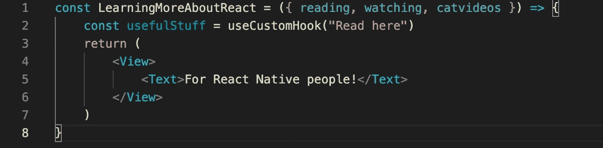
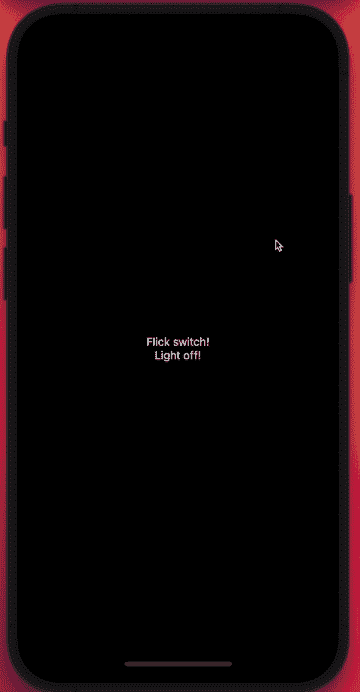

# 如何在 React 中设计和创建定制钩子

> 原文：<https://javascript.plainenglish.io/how-to-make-custom-hooks-in-react-46a8e0fb63cb?source=collection_archive---------6----------------------->

## 在 React 中设计定制钩子的简单教程



在本文中，我们将讨论如何以及何时使用定制的 react 钩子来支持常见的副作用，并进而编写更可靠的代码。

如果你了解抽象，那很好，[有时不了解](https://www.deconstructconf.com/2019/dan-abramov-the-wet-codebase)。尽管如此，有时我们需要比简单的抽象更多的东西来使代码可读和可重用。在定制钩子之外，我们寻求获得与现代钩子的流动性和力量相结合的抽象的优点。在继续之前，如果你还不熟悉的话，我建议阅读一下 React [文档](https://reactjs.org/docs/hooks-custom.html)中的内置挂钩，比如*使用状态*和*使用效果*。

# 构建定制挂钩的 3 个步骤

1.  *组织*。我最喜欢的做法是在项目的顶层创建一个钩子目录，这样所有定制的钩子都很容易找到。事实上，当您创建名为“hooks”的文件夹时，Visual Studio 代码有一个默认图标。按照我的规则，这是个好兆头！
2.  *名字。我喜欢以“使用”开始钩子的名字，然后避免给钩子起像“使用”这样模糊的名字，然后简明扼要地表达它的责任。一个很好的例子可能是“useToggle”。那是相当明显的！*
3.  *设计挂钩！构建定制的 react 挂钩实际上非常简单！只是要警惕什么逻辑放在那里，并记住，如果他们需要清理。错过这一点可能会导致内存泄漏！*

下面我们来看几个例子！

# 简单的自定义挂钩示例

最常见的是，我们在现有的基础上定制钩子。让我们首先创建一个名为 *useToggle* 的超级简单的定制钩子，它利用 *useState* 作为主干。

## 示例 1: useToggle —最适合开/关开关类型的行为

让我们一行一行地看一下这个例子(耐心点，只有 5 行):

1.  首先，我们创建一个名为 *useToggle* 的函数，它采用一个布尔值作为参数，作为钩子的 *initialState* 。如果没有提供，它将默认为假。
2.  接下来，我们使用从 React 的内置 [*useState* 钩子派生的标准表达式。这就是通常用来存放和操作我们的开关的东西。这个表达式将让我们访问*状态*——一个布尔变量(在这种情况下),它将跨渲染持久化——和*设置状态* —一个方法，当传递一个布尔变量时，它将调度状态更新并相应地触发重新渲染。](https://reactjs.org/docs/hooks-state.html)
3.  然后我们定义一个本地 *toggle* 方法，该方法将读取当前状态并设置相反的状态。换句话说，如果状态为真，它会将其设置为假，反之亦然。
4.  最后，从我们的钩子返回一个数组，其中包含对可切换状态([0])和切换方法([1])的引用。这就是全部了。在你的组件中实现它，然后发疯！对于这个简单钩子的优化版本，[参考这里。](https://usehooks.com/useToggle/)
5.  哦对了…还有这个“}”

我们可以使用这些代码来制作一些简单但华而不实的东西，比如下面的电灯开关(代码如下):



## 例 2:useFocusToggle——用于当反应导航屏幕聚焦或模糊时的处理

为了想象这可能有用的场景，想象一下:我的团队发现了一个错误，当我们试图导航到某个屏幕时，应用程序会崩溃。我们很快意识到，一些在后台运行的复杂组件导致了这次崩溃。经过更深入的调查，我了解到当使用 react-navigation 的 [*底部标签导航器*](https://reactnavigation.org/docs/5.x/tab-based-navigation) 时，屏幕在改变标签后不会*卸载*。换句话说，一个解决方案是当屏幕失去焦点时，想办法卸载有问题的组件。首先，我尝试利用 react-navigation 的 [useFocusEffect](https://reactnavigation.org/docs/5.x/use-focus-effect) 功能，但这并不适合我——因为我不断遇到错误，没有时间深入研究——我构建了以下钩子:

这个名为 *useFocusToggle* 的定制钩子接受 1 个必需参数和 2 个可选参数。

1.  *导航(必需)。*这必须是某个[*navigation prop*](https://reactnavigation.org/docs/navigation-prop/)类型，属于使用 react-navigation 的项目中的某个屏幕
2.  *焦点事件(可选)。*这应该是一个回调函数，包含当屏幕聚焦时要执行的任何任务。
3.  *模糊事件(可选)。这应该是一个回调函数，包含当屏幕离开焦点时要执行的任何任务*

从第 2 行开始，钩子建立了一个类似开关的状态来表示实现钩子的屏幕是否被聚焦。

接下来，我们利用两个独立的 useEffect 挂钩，每次导航(prop #1)引用更新时执行。考虑到 react-navigation 的行为，根据应用程序的架构，这种情况通常不会出现超过两次。在每个钩子中，我们使用 react-navigation 的*导航来定义不同但相似的事件监听器。*[*addevent listener*](https://reactnavigation.org/docs/navigation-events/)方法。当屏幕聚焦时，一个侦听器将状态变为 true，并执行 focusEvents (prop #2)中传递的任何回调。当屏幕离开焦点时，另一个监听器将状态变为 false 并执行 blurEvents (prop #3)中传递的任何回调。

最后，我们返回表示屏幕是焦点还是非焦点的状态。

我知道对于这个钩子的用处可能会有一些混淆，在这种情况下，让我确定这个钩子真的只对使用 react-navigation 的顶级屏幕组件有意义。无论如何，如果 useFocusToggle 被一个较低级别的组件调用，那么它需要被它的一个祖先屏幕传递一个导航属性。

回想一下我们最初的困境，即使我们的选项卡屏幕仍然保持挂载状态，这个钩子允许我们通过使用*聚焦的*状态来挂载和卸载子组件。这是一个简单的例子，展示了它的实际效果:

## 何时不使用定制钩子(或一般钩子)

假设你正在为一家企业构建一个结账屏幕，它需要有各种各样的副作用。因此，举例来说，当用户将一件商品添加到购物车时，如果他们花费超过 50 美元，他们将获得 20%的折扣和免费送货(假设业务刚刚起步，可能会非常慷慨，希望获得牵引力)。让我们看看实现这一点的几种方法:

**使用自定义挂钩的方法# 1:**

从技术上讲，我们可以创建一个不必要的自定义钩子，它接受 3 个参数:一个“track”属性，一个条件表达式，它期望属性作为参数并返回一个布尔值，以及一个初始状态。让我们看看它是如何实现的:

每当 amountSpent prop 发生变化时，我们的 useConditionalHook 中的 useEffect 将触发并报告用户是否有资格享受折扣。

**方法#2 无自定义挂钩**

这就是为什么你不需要这个钩子…这里不需要使用 useEffect 和 useState。我们应该永远记住**当道具改变时，我们的组件重新渲染**。因此，大多数表达式(没有被挂钩)被再次读取和执行。总之，我们需要的是一个表达式，如下所示，来替换第 4 行中的钩子，以达到相同的结果:

```
const eligibleForDiscount = amountSpent > 50
```

瞧啊。每次父项更改 amountSpent 时，eligibleForDiscount 都会根据我们的需要准确地更新。我认为避免前一种方法的一个好办法是在使用 props 初始化本地状态时要小心。

我希望你从这篇文章中学到了一些东西！请参考这里的链接进行进一步阅读，如果你觉得这篇文章有趣，有任何问题或评论，请联系我。支持票帮助和感谢你的支持！

*更多内容看*[***plain English . io***](http://plainenglish.io/)