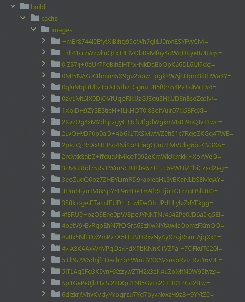

# 如何让 Next.js 图像优化在 AWS 弹性豆茎上工作

> 原文：<https://javascript.plainenglish.io/how-to-make-next-js-image-optimization-work-on-aws-elastic-beanstalk-2776ea255eff?source=collection_archive---------5----------------------->

## 不使用 Vercel，充分利用 Next.js 应用程序


Photo by [Mohammad Rahmani](https://unsplash.com/@afgprogrammer?utm_source=medium&utm_medium=referral) on [Unsplash](https://unsplash.com?utm_source=medium&utm_medium=referral)

我最近参与了一个大型的 [Next.js](https://nextjs.org/) 项目，并将其部署到 [AWS Elastic Beanstalk](https://aws.amazon.com/elasticbeanstalk/) 中。一切工作正常，除了 [Next.js 图像优化](https://nextjs.org/docs/basic-features/image-optimization)。在网上寻找解决方法时，我意识到这是一个相当普遍的问题。

事实上，我了解到许多其他开发人员在使用 Next.js 图像优化特性时遇到了麻烦。显然，当使用除 Vercel 之外的平台来部署 Next.js 应用程序时，这种情况尤其常见。

虽然受欢迎，但几乎没有在线文档。因此，让我们看看如何解决这个问题，并在将 Next.js 部署到 AWS Elastic Beanstalk 时使图像优化按预期工作。

# 诊断映像优化问题

要验证 Next.js 图像优化功能是否如预期的那样工作，请确保使用 Next.js 内置的`[<Image>](https://nextjs.org/docs/api-reference/next/image)`组件，而不是标准的 HTML ``标签。请记住[该特性仅在 Next.js 10](https://nextjs.org/blog/next-10#built-in-image-component-and-automatic-image-optimization) 中可用。

然后，将您的应用程序部署到 AWS Elastic Beanstalk。

现在，访问一个包含至少一个通过`<Image>`组件渲染的图像的网页，用浏览器开发工具检查它。您应该能够看到类似这样的内容:

```

```

要确保一切正常，请遵循以下步骤:

1.通过将您的网站 URL 与``的`src`属性连接起来，构建转换后的图像 URL，如下所示:

```
https://yourwebsite.com/_next/image?url=https%3A%2F%2FyourCDN.com%2Ffoo.jpg&w=1920&q=75
```

2.提取`url`查询参数中包含的字符串:

```
https%3A%2F%2FyourCDN.com%2Ffoo.jpg
```

3.解码[此处](https://meyerweb.com/eric/tools/dencoder/)获取原图网址:

```
https://yourCDN.com/foo.jpg
```

4.比较步骤 1 中检索到的图像文件。在 3 中检索图像文件。如果 1。不同于 3。，则 Next.js 图像优化功能将按预期工作。特别是 1。应该是 [WebP](https://it.wikipedia.org/wiki/WebP) 格式(`.webp`扩展名)并且明显轻于 3。

# 解决 Next.js 图像优化问题

让我们看一下如何在使用 AWS Elastic Beanstalk 时使用 Next.js 图像优化特性解决上述问题的分步指南。

## 1.将`sharp`添加到项目的依赖项中

> 当在您的生产环境中使用`next start`时，强烈建议您通过在您的项目目录中运行`yarn add sharp`来安装`[sharp](https://www.npmjs.com/package/sharp)`。这对于 Vercel 部署来说是不必要的，因为`sharp`是自动安装的。— [下一张/图片](https://nextjs.org/docs/basic-features/image-optimization)

正如官方文档中的[所述，Next.js 映像优化特性依赖于 npm `sharp`库。但这是一个 Next.js](https://nextjs.org/docs/basic-features/image-optimization) `[optionalDependency](https://docs.npmjs.com/cli/v8/configuring-npm/package-json#optionaldependencies)`可能没有安装。因此，您应该使用以下命令将其显式添加到项目的依赖项中:

```
npm install sharp
```

或等效物:

```
yarn add sharp
```

现在，在将应用程序部署到 AWS Elastic Beanstalk 时，您可能会遇到以下错误消息:

```
ERR! sharp EACCES: permission denied, mkdir '/tmp/.npm/_libvips' info sharp Attempting to build from source via node-gyp but this may fail due to the above error info sharp.Please see [https://sharp.pixelplumbing.com/page/install](https://sharp.pixelplumbing.com/page/install) for required dependencies
```

正如这里的[所解释的那样](https://stackoverflow.com/questions/54996422/installing-sharp-on-elastic-beanstalk)，解决方案包括创建一个包含以下行的`.npmrc`文件:

```
unsafe-perm=true
```

特别是，通过将`unsafe-perm`设置为`true`，您将强制 npm 尝试总是在运行脚本的上下文中运行。换句话说，这个选项强制软件包安装程序永远不要切换当前用户和组。因此，在 AWS Elastic Beanstalk 的情况下，这意味着 npm 安装过程将以 root 用户身份执行。这防止你有任何类型的权限问题，并使`sharp`安装完美无瑕。

## 2.修复/var/app/current/build/cache/images 权限

安装`sharp`应该足以解决问题，但是您可能还会遇到另一个问题。具体来说，如果图像优化功能仍然不起作用，请检查您在 AWS Elastic Beanstalk 上的 Next.js 应用程序编写的日志。

您可能会无意中发现类似这样的消息:

```
Dec  6 15:42:47 ip-VVV-XXX-YYY-ZZZ web: [Error: EACCES: permission denied, mkdir '/var/app/current/build/cache/images'] {
Dec  6 15:42:47 ip-VVV-XXX-YYY-ZZZ web: errno: -13,
Dec  6 15:42:47 ip-VVV-XXX-YYY-ZZZ web: code: 'EACCES',
Dec  6 15:42:47 ip-VVV-XXX-YYY-ZZZ web: syscall: 'mkdir',
Dec  6 15:42:47 ip-VVV-XXX-YYY-ZZZ web: path: '/var/app/current/build/cache/images'
Dec  6 15:42:47 ip-VVV-XXX-YYY-ZZZ web: }
```

这意味着 Next.js 试图在`/var/app/current/build/cache/images`下创建一个文件夹，但是它没有正确的权限。这其实也是 Next.js 图像优化功能不起作用的原因。事实上，通过深入研究它是如何工作的，你会了解到它将生成的转换图像存储在`build`内的`cache/images`文件夹中。

这实际上是一个完整的 Next.js 应用程序中的`build/cache/images`文件夹的样子。



The `build/cache/images` folder when Next.js image optimization works

换句话说，为了使图像优化特性工作，Next.js 应用程序需要对`build/cache/images`文件夹的读/写权限。为此，创建一个 bash `build.sh`文件，如下所示:

现在，确保您的`package.json`文件在“脚本”部分包含以下“构建”字段:

```
"scripts": {
  "build": "./build.sh"
}
```

当执行`npm run build`命令时，将启动`./build.sh`命令，结果是`build.sh`脚本运行。

瞧啊！您的构建脚本现在将负责创建所需的具有正确权限的`build/cache/images`文件夹。这应该足以让 Next.js 图像优化特性按预期工作。

# 结论

在 Next.js 10 中引入的图像优化特性代表了一个很大的改进，可以让你构建现代快速的网站。另一方面，在将您的应用程序部署到不同于 Vercel 的平台时，让它按预期工作可能会成为一个挑战。在处理 AWS 弹性豆茎的时候尤其如此。幸运的是，有一个解决方案，并且展示了如何解决与该特性相关的最常见的问题，这正是本文所要讨论的。

感谢阅读！我希望这篇文章对你有所帮助。请随意留下任何问题、评论或建议。

*更多内容看* [***说白了. io***](http://plainenglish.io/) ***。*** *报名参加我们的* [***免费每周简讯点击这里***](http://newsletter.plainenglish.io/) ***。***