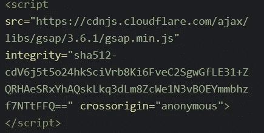
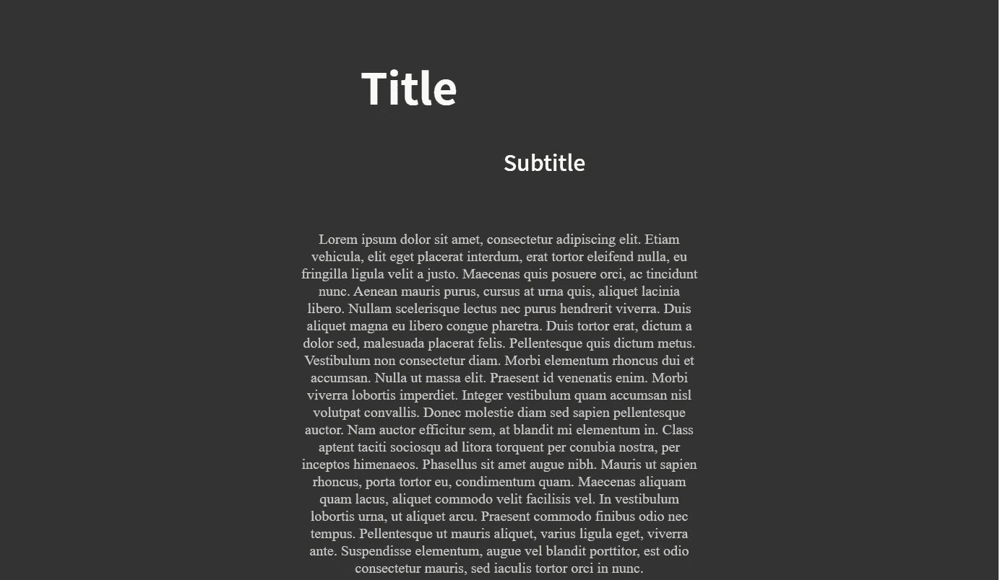

# 如何使用 GSAP 制作基于滚动的 JavaScript 动画

> 原文：<https://javascript.plainenglish.io/how-to-make-scroll-based-animation-in-javascript-using-gsap-cfd65e7cc81f?source=collection_archive---------12----------------------->

*如何使用 GSAP 动画图书馆来制作动画。*

Photo by [Christopher Gower](https://unsplash.com/@cgower?utm_source=medium&utm_medium=referral) on [Unsplash](https://unsplash.com?utm_source=medium&utm_medium=referral)

今天我们将使用 GSAP(绿袜子动画平台)制作一个基于卷轴的动画。基于滚动的动画可以很好地为枯燥的网站增添一些趣味。作为网站开发人员，重要的是我们不仅要为我们的访问者提供信息丰富的网站，还要有视觉吸引力。

使用 GSAP 的好处是它使得实现基于滚动的动画相对容易。对于这个演示，我将使用 CodePen，但是您今天学到的概念也可以使用。完成的 CodePen 将在本文末尾链接。

目标是创建这个动画序列:

# 什么是 GSAP？

GSAP(绿袜子动画平台)是一套流行的 javascript 工具，帮助在网络上创建动画。GSAP 的强大之处在于可以用它创建各种各样的动画，无论是视差动画、交互式故事，还是今天文章的重点，基于滚动的动画。GSAP 在所有主流浏览器上都运行良好，节省了开发人员处理特定浏览器错误的时间。

# 项目设置:将 GSAP 添加到我们的项目

在我们使用 GSAP 开始变魔术之前，有一些初始设置需要完成。我们需要做的第一件事是允许我们的项目实际使用 GSAP。这可以通过使用来自 https://cdnjs.com/libraries/gsap[的 CDN 并将以 **gsap.min.js** 结尾的链接放在 HTML 文档的末尾来实现。它看起来有点像这样:](https://cdnjs.com/libraries/gsap)

Gsap.Min.JS CDN

# 项目设置:向我们的项目添加 HTML

下一步是向我们的站点添加一些 HTML 标记。没有任何动画就不能有基于滚动的动画。

我们还需要添加以下链接，为我们的项目添加不同的字体。你可以随意使用任何字体！让这个项目成为你自己的。

# 项目设置:向我们的项目添加 CSS

下一步是给我们的 HTML 一些样式。将下列 CSS 样式添加到项目中。

如果一切都设置好了，您应该会看到如下内容:

# 创建 GSAP 滚动动画

现在到了你期待已久的部分！是时候使用 GSAP 创建我们的滚动动画了。第一步是为我们的动画设置持续时间和缓动类型的默认值。这是通过使用 gsap.defaults 并像这样传入值来实现的:

之后，我们创建一个新的 GSAP 时间表。如果你不确定 GSAP 时间线是什么，它本质上是一种将多个动画一个接一个链接在一起的方法。这方面的代码如下:

为了实现转换，我们将使用 GSAP **到**函数。GSAP 的**到**函数将一个元素的 CSS 值从其原始值变为**到**函数中指定的 CSS 值。GSAP 还包含一个来自的**函数，它将一个元素的 CSS 值*从*指定值动画化为其当前值。因此，可以把从**到**的**函数看作是**到**函数的逆函数，因为它是从什么开始制作动画的。****

现在我们已经有了一些关于使用 GSAP 的 from 和 to 函数的背景信息，让我们实际制作元素的动画。在这种情况下，我决定使用 GSAP **到**函数，但是使用来自函数的**只需改变一些值就可以获得相同的精确结果。**

转换的代码如下所示:

# 结论

Codepen 的链接可以在 [*这里找到*](https://codepen.io/azizbooker/pen/xxgjdBV) 。

现在我们已经到了文章的结尾，我希望你很好地理解了如何使用 GSAP 动画库来创建滚动动画。我们学习的主要概念是如何在 GSAP 设置默认值，如何创建时间线，以及在 GSAP**到**和**与**功能的区别。

感谢您阅读完我的文章**“如何使用 JavaScript 创建 If 语句一行程序”**。我希望你有美好的一天。以下是我的一些进一步的文章供你阅读:

 [## 你需要了解的 7 个 Javascript 库

### Javascript 库将提高您作为 web 开发人员的效率

medium.com](https://medium.com/aziz-booker/7-javascript-libraries-you-need-to-know-about-27d6e9f1b0d9)  [## 每个开发人员都应该知道的 10 个 VS 代码快捷键

### 简单的快捷方式可以极大地提高你的生产力

blog.devgenius.io](https://blog.devgenius.io/10-vs-code-shortcuts-every-developer-should-know-f2d1058cfe8e)  [## 编写 CSS 助手类如何提高我的生产力

### 为什么在编写 CSS 时应该开始使用助手类

blog.devgenius.io](https://blog.devgenius.io/how-writing-css-helper-classes-improved-my-productivity-c2360d0dab78) 

*更多内容请看*[***plain English . io***](http://plainenglish.io/)