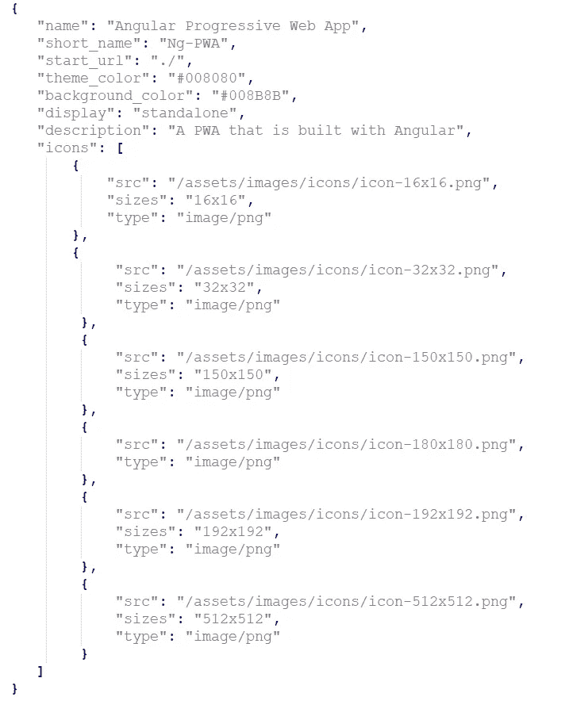
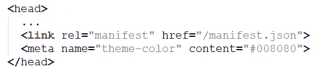
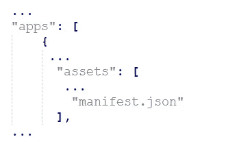
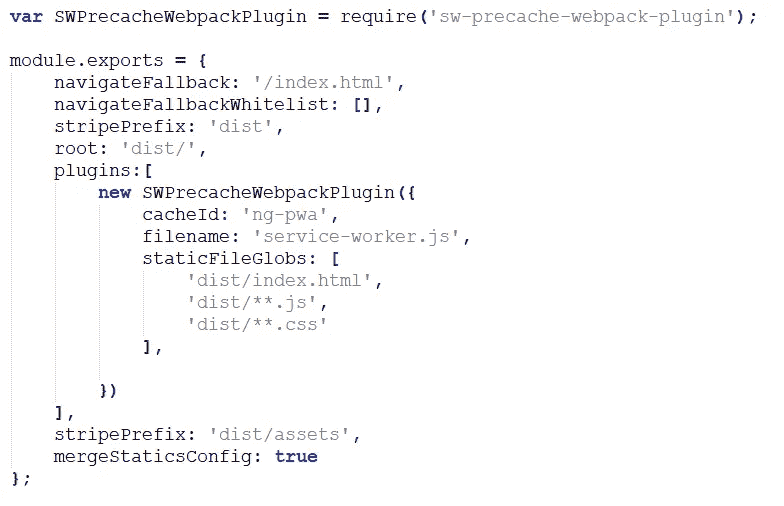
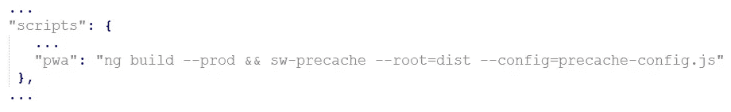
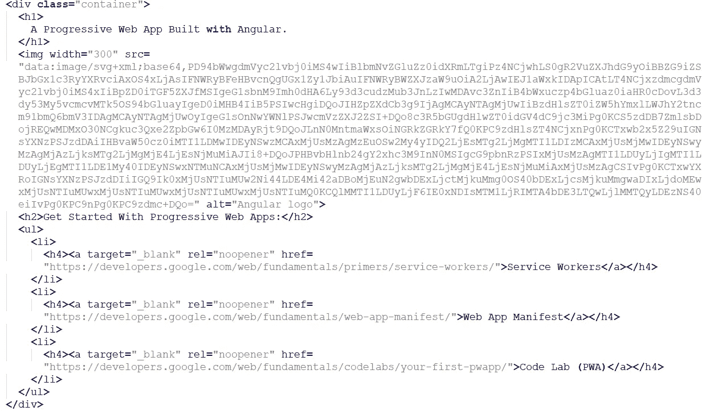
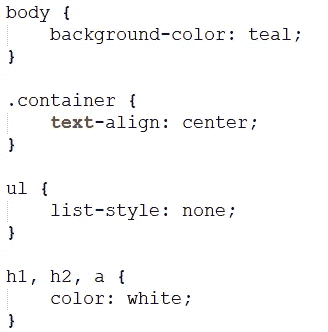
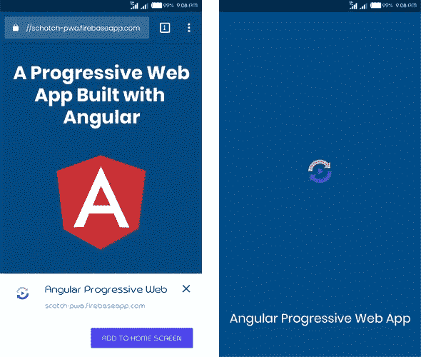

# 如何使用 Angular 让你的应用运行得更快

> 原文：<https://javascript.plainenglish.io/how-to-make-your-app-run-faster-with-angular-b26554582ef?source=collection_archive---------10----------------------->

## 如何提高角度应用程序的性能


计划开发混合应用程序？您应该为您的数字解决方案使用哪种技术和工具来加快开发过程，让您的应用程序运行得更快？这些是一些主要的关注。

无论你是一家不得不白手起家的初创企业，还是一位已经赚了数百万美元的领先企业家，无论是哪种情况，都没有人愿意将自己的投资置于风险之中。用错误的技术开发一个应用程序，只需要一分钟就能让你的整个项目崩溃。

因此，从业务角度来看，有哪些潜在的最佳工具可以帮助您创造最佳收入，为您的业务增添优势，并使您的应用运行速度提高 10 倍？

在如此激烈的竞争中，对用户友好的交互式 web 应用程序的需求变得非常重要，这不仅是为了加速您的业务增长，也是为了让您在 web、移动设备和桌面上都可用。

事实上，JavaScript 是最流行的编程语言，并且在很长一段时间内都是 web 开发领域的主要编程语言之一，因此大多数企业都倾向于使用 JavaScript 框架来开发 web 应用程序。这就是 Angular 开始大肆宣传的地方！

现在，在开始介绍 Angular 之前，你们中的许多人都提出了为什么使用 Angular 而不是 jQuery 的问题。

***“根据***[***stack overflow 调查报告***](https://insights.stackoverflow.com/survey/2020/#technology-most-loved-dreaded-and-wanted-web-frameworks-loved2) ***，虽然纯粹专注于 web 框架，jQuery 一枝独秀为王，但慢慢的，它却在节节败退，棱角分明。”***

> 最常被问到的问题来了——为什么？

事实是，Angular 的各种原因和品质使其成为 2022 年最值得推荐的商业和企业工具之一。

> 让我们简单明了的让你明白！

## **Angular 到底是什么，如何最适合 web 应用？**

Angular 是 web app 开发的理想前端工具之一。它是由 Google 和一个独立的开发者社区共同开发的，完全是关于 HTML、CSS 和 JavaScript 的。但是在这里，Angular 被称为 Angular 2+,它是一个内置的类型脚本，为开发人员创建 web 应用程序的客户端提供了健壮的组件。

虽然 Angular 自 2010 年以来一直存在于行业中，并在以前的版本中不断改进，但它多年来获得了巨大的人气，并在 web 应用程序开发领域的发展势头方面领先。

例如，当前更新的 Angular 版本 9 修复了所有在 Angular 8 中造成问题的错误。该框架不仅比其他框架更好，而且还将 IVY 作为标准呈现器。

简而言之，移动应用程序开发公司可以导入更少的代码，因为现在需要更少的教师。这转化为以前版本所缺乏的另一个优势。

现在，Angular 有了一个定义好的架构和现成的库，通过简单地提供一组通用功能来加速开发过程。

> 不过，我还是问了一个问题:“为什么是棱角分明的？”

# **Angular 的超能力使其成为赢家**

毫无疑问，Angular 在过去几年里在 web 应用程序开发领域开辟了一条新路。因此，大多数组织都希望 [**雇佣一名具有专业技能的应用程序开发人员**](https://www.xicom.ae/solutions/hire-developers/) 。如果出于同样的原因，你也在为你的项目考虑 Angular，那么你需要知道 Angular 的超能力，这些超能力实际上使它成为开发人员最想要和喜爱的框架。

*我们现在没有在项目中使用 Angular 的第一个版本，我分享 Angular 的优点，包括:*

*   ***详细的文档确保对开发者的极大支持！***

对于 Angular 的每个新版本，它都有详细的文档，开发人员可以在其中找到所有必要的信息，快速提出技术解决方案，并能够解决新出现的问题。

*   ***由 Google 支持和维护！***

当谈到开发 web 应用程序时，大多数开发者社区更喜欢 Google 的支持。在 ng-conf 2017 上宣布，谷歌对 Angular 的长期支持使该平台值得信赖。

*   从 MVC 到健壮的基于组件的架构的巨大转变！

Angular 推出的第二个版本采用基于组件的架构，确保应用程序分为独立的逻辑和功能组件。如果你雇佣了一个移动应用程序开发者，那么你就可以更容易地替换和分离组件，并在应用程序的其他部分重用它们，而不会有任何麻烦。

*   ***CLI 自动化整个开发过程***

这是 majorly Angular 应用程序开发公司最喜爱的功能之一，因为它允许他们自动化整个开发过程，并使应用程序初始化、配置和开发尽可能容易。在开发任何随需应变的 web 应用程序的情况下，企业通过几个简单的命令就可以更容易地在其中添加功能、运行单元和进行端到端测试。它不仅提高了代码质量，而且极大地促进了开发过程。

简言之:Angular 的这些特性使它成为开发 web 应用程序的最佳框架选择。但问题是，如何用 Angular 构建一个能快 10 倍运行的 app？

> 下面就来找答案吧！

# **如何用 Angular 构建一个运行速度更快的渐进式 web 应用**

渐进式 web 应用程序被认为是用使其行为像本机应用程序的技术构建的 web 应用程序。投资渐进式应用程序的最大好处是，当网络覆盖不可靠时，能够顺利工作。此外，与原生应用程序不同，渐进式 web 应用程序比任何典型的 web 应用程序运行更快，无需任何安装。

既然你已经下定决心要用 Angular 开发一个应用程序，尽管我在这里假设你知道 Angular 的其他好处。所以我们直接看教程，学习如何用 Angular 构建一个渐进式 app，用 Firebase 部署。

*这里有一个循序渐进的指南，尽量让它简单易懂:*

## **第一步:创建一个新项目**

要使用 Angular 创建新项目，可以使用 CLI。创建项目后，默认情况下，Angular 将生成在本教程项目中没有用的测试文件。所以去掉那些测试文件，你可以使用下面的命令。

```
npx @angular/cli@10.0.0 new ng-pwa — skip-tests
```

> **在这之后，你将被一些配置过程所提升，这些过程将包括:**

*   *您想要添加角度路由吗？否*
*   *您想使用哪种样式表格式？CSS*

在这里，这将创建一个名为“ ***ng-pwa*** ”的新项目目录。

现在您已经准备好启动项目，您可以继续创建 web 应用程序清单了。

## **步骤 2:创建渐进式 Web 应用清单**

web 应用程序清单通常是一个 JSON 文件，它包含的配置使 web 应用程序能够保存在用户屏幕上。这是渐进式网络应用的基本要求，因为它也定义了从主屏幕启动时的外观和行为。

因此，要为您的应用程序创建 web 应用程序清单，您需要使用以下命令在 src 文件夹的根目录下创建一个名为“manifest.json”的新文件:

***纳米 src/manifest.json***

此外，要将内容添加到您的应用程序，请使用以下命令:



***下面是我们添加到 web 应用清单中的主要组件:***

*   我们定义了将附加到用户主屏幕上的应用程序图标的名称，以及一个短名称，该名称将被替换，以防名称太长而无法在屏幕上显示。
*   指定了应用程序的登录页面，当从主屏幕启动开始。网址。
*   theme_color 指定了用户访问应用页面时的颜色。
*   background_color 属性控制应用程序图标显示的背景颜色。
*   使用 display，您可以指定当用户访问应用程序时，浏览器 UI 是否应该隐藏。

由于 web 应用程序预计会在不同类型的设备上以不同的屏幕尺寸浏览，因此需要制作多个维度的应用程序图标副本，以确保无缝体验。

> 因此，每当你把图像资产添加到应用程序中时，转到 index.html 文件，把以下内容添加到部分:



***注意:web 应用清单不会被添加到构建文件夹中，除非我们指示 Angular 支持它。所以您可以通过将 manifest.json 文件添加到*的 apps 部分的 assets 数组中来允许它。angular-cli.json *文件。***

如果该应用程序是由一家 [**软件开发公司**](https://www.xicom.ae/) 开发的，那么这并不是一个严重的问题，但是，如果你自己正在尝试，那么你可以遵循下面的命令:



一旦创建了 manifest.json、修改了 index.html 并编辑了 angular-cli.json，就可以开始下一步了。

## **第三步:添加服务人员**

服务人员是渐进式网络应用的基础，即使在网络不可靠或不可用的情况下，这些应用也能正常工作。服务人员不仅会在没有网络覆盖的情况下保持您的应用程序正常运行，还会拦截请求，管理来自服务器的响应，并与其他东西进行交互。

现在你一定在想，这怎么可能呢？

由于是用 JavaScript 编写的，它们有助于缓存重要的资产和文件，这有助于您的应用程序即使在离线模式下也能保持功能。

所以在将你的应用推向开发流程之前，你需要用 [webpack](https://webpack.js.org/) 来构建一个应用。服务人员能够跟踪和缓存构建文件。

使用***SW-pre cache-web pack-plugin NPM 软件包*** ，您需要安装并配置该软件包。

从 ***ng-pwa*** 目录运行 npm install 命令来安装包，或者 [**雇佣一个 web 应用开发者**](https://www.xicom.ae/services/hire-web-developers/) 来帮助你执行这个命令:

```
**npm install — save-dev sw-precache-webpack-plugin@1.0.0**
```

安装完软件包后，创建一个名为 precache-config.js 的文件。

*以下是配置预缓存的方法:*



要结束服务工作程序设置，您需要创建一个自定义 npm 脚本或命令，用于构建应用程序并在构建文件夹中自动生成服务工作程序文件。

*接下来，转到 package.json 文件，使用下面的命令将以下内容添加到脚本中:*



成功安装***SW-pre cache-web pack-plugin***，创建***pre cache-config . js***和***editing package . JSON***之后，就该进入下一步了。

## **第四步:创建视图**

因为我们的主要焦点是用 Angular 构建渐进式 web 应用程序，尽管我们只有一个单一的视图。

*所以在这里，你需要编辑 app.component.html，用下面的代码替换内容:*



随着上述代码的实现，您将拥有一个包含图像、一些文本和三个链接的网页。

*同样，如果要编辑 app 的样式大小写，则编辑****styles . CSS****并将内容替换为以下代码:*



这段代码创建了一个蓝绿色的背景颜色，居中对齐文本，并给文本一个白色。

*现在，您已经完成了视图，可以继续应用程序的部署过程了！*

## **步骤 5:将应用部署到 Firebase**

服务人员是渐进式 web 应用程序的灵魂，让它在安全的连接上正常工作是企业的主要关注点之一。因此，为了实现这一目标，我们将把应用程序部署到 Firebase，它通过安全连接进行托管。

所以要开始，你将需要访问这里[https://firebase.google.com/.](https://firebase.google.com/.)如果你没有一个帐户，然后首先创建一个可以访问控制台。在控制台上，创建一个新的 Firebase 项目。

*点击控制台页面，选择一个项目，等待过程完成，系统会提示您为项目命名。*

*接下来，在项目仪表盘上点击继续移动。*

*现在回到您的命令终端，运行 npm install 命令来全局安装 firebase 工具包。*

现在 firebase-tools 包将允许您从命令终端测试运行和部署应用程序到 firebase。

要构建 Angular 应用程序并自动生成服务人员，您需要运行`**npm run pwa**`。

现在是时候向应用程序介绍 Firebase 了。运行此命令登录到 fire base“fire base log in”。

现在是时候将 Firebase 引入 Angular app 了。运行以下命令登录 Firebase。此时，您需要添加凭证。在终端上输入你的账户信息。一旦您的凭证通过验证，运行项目中的“firebase init”并回答以下问题:

*   *你准备好继续了吗？(Y/n) = Y*
*   *您希望为此文件夹设置哪些 Firebase CLI 功能？=主持*
*   *为此目录选择一个默认的 Firebase 项目= Your-Firebase-Project-Name*
*   您想将什么用作您的公共目录？=距离
*   *配置为单页 app(将所有网址改写为/index.html)？(y/N) = Y*
*   *文件 dist/index.html 已经存在。覆盖？(y/N) = N*

*使用 firebase_deploy，您的应用程序就可以部署了，并显示如下所示的最终屏幕:*



## **第六步:用 Lighthouse 测试你的应用**

为了测试渐进式网络应用程序的兼容性，我们使用了 lighthouse。它是谷歌制作的 Chrome 扩展，PWA 得分为 91%。

要测试您的渐进式 web 应用程序，请在您的 Google Chrome web 浏览器中打开托管应用程序。然后点击扩展按钮，并选择灯塔。

将显示一个窗口，提示您单击“生成报告”按钮。点击该按钮后，您将暂时看到一个等待灯塔结果消息的屏幕。测试完成后，您将看到一个测试结果屏幕。

万岁，你已经完成了 Angular 的应用程序开发。虽然本教程非常简单易懂。但现在真正的斗争是让它跑得更快。

> 用 Angular 让它跑得超快的主要战术有哪些？

# **使用 Angular 优化 Web 应用构建性能的技巧和提示**

无论你的应用程序开发得多么出色，你使用了什么技术，如果它需要很长时间才能在用户的屏幕上运行，你的放弃率将会越来越高。所以，雇佣一家 [**网络应用开发公司**](https://www.xicom.ae/solutions/web-development/) 是有意义的，它能让你用这些技巧优化你的 Angular 网络应用的性能。

*让我们从最佳选项开始:*

*   **使用构建优化器加速 Angular 应用程序！**

Build Optimizer 是 Angular 团队开发的一款令人惊叹的 Angular Webpack 构建优化工具。该工具帮助您识别可以在构建时删除而不会造成任何不良影响的代码。例如，构建优化器可以从 AOT 构建中移除像@Component 这样的有棱角的装饰器。

*   **优化 Angular App 的代码库！**

通常，有三种方法可以通过延迟加载模块、代码分割和 OnPush 变化检测来优化 Angular app 代码。

然而，大多数 web 应用程序开发人员更喜欢使用 OnPush 更改检测来优化代码:

默认情况下，Angular 将检查每个组件以查看是否有更改，并相应地更新视图。虽然这是一个相对快速的优化代码的过程，但随着应用程序的增长，这些频繁的更新检查会变得更慢。

与其他优化技术不同，OnPush 变化检测会检查应用程序中的每一个变化。OnPush 更改检测仅对@input 参数的更改做出反应，或者是手动触发的检测。

单子到这里还没完！还有各种其他方法来优化你的 Angular 应用程序的性能，但在这里我分享了一些最常用的做法来微调你的应用程序。

# **结论**

作为这篇博客的结尾，可以说 Angular 对于任何类型的 web 应用程序开发来说都是一个极好的选择。所以你需要做的就是雇佣一个 [**移动应用开发公司**](https://www.xicom.ae/solutions/mobile-app-development/) 来开始你的应用。除了这个简短的教程和优化技术，你一定已经了解了 Angular 支持什么样的特性。此外，作为一个精简和快速的应用程序开发工具，它可以帮助您开发一个运行速度比其他人快 10 倍的 PWA。

*更多内容请看*[*plain English . io*](http://plainenglish.io/)