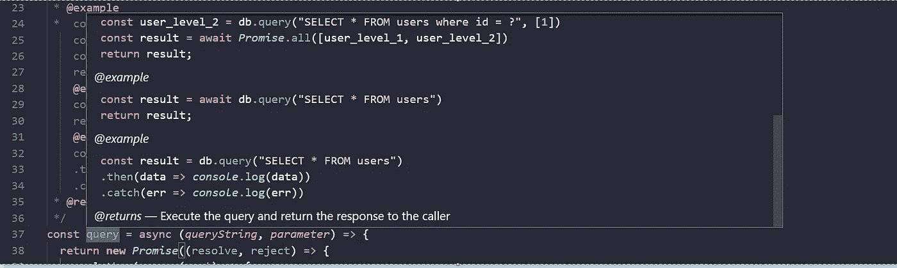
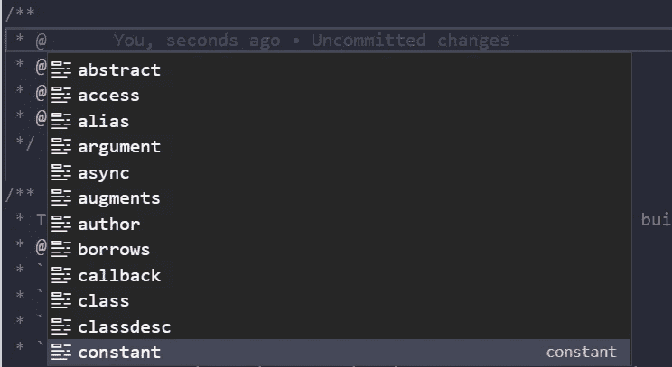

# 如何在 VS 代码中让你的注释看起来很酷

> 原文：<https://javascript.plainenglish.io/how-to-make-your-commenting-look-cool-432abc7c3103?source=collection_archive---------2----------------------->

## Visual Studio 代码中的方法级注释。



# 介绍

每当我们使用某人的代码时，我们总是希望事情是不言自明的。当有人使用我们的代码时，情况也是如此。这就是文件级注释发挥作用的地方。我不会给出更多关于如何写干净好的代码的说明，但是让我们把注意力放在输出上。

这是一个样本图像，我们将实现后的文章。


我先来解释一下图片。这里有一个名为`query`的方法，它接受很少的参数并返回一些东西。因此，每当有人使用这种方法时，我们都会在`hover`上用一个例子来清楚地描述这种方法。

# 开始

你已经知道我们今天要做什么了。所以让我们卷起袖子开始编码吧。

任何语言中传统的注释方式因语法不同而不同，但方法是完全相同的。

> 你可以在一个有开始和结束的块中写一些不可执行的代码。整个块将被称为注释。

我选择 JavaScript，但你可以选择你的类型的任何语言。在 JavaScript 中，我们给出了一个注释框，如下所示，还有一行注释，但这对我们没什么好处。

```
/**your comments**/
```

现在有相当多的标签你可以在任何时候发表评论。如果你在 VSCode 中，那么在你的代码块中添加`@`将会给你你想要的注释类型的建议。一个例子将是这样的。



Available options in the VSCode

在这里，我们不能选择所有的点，但几个。你可以自己阅读，但在此之前，让我们看看一些不使用标签的样式选项。

## 句法

注释的语法非常简单。几个例子是:

**标题**

*   #为了 H1
*   #代表 H2
*   ###代表 H3
*   ####对于 h4
*   等等

**文本样式**

*   `**your text**`为粗体
*   `*your text*`为斜体
*   `~~your text~~`用于删除线
*   `some text [link](https://google.com)` —用于添加链接
*   `- list item` —添加`-`将带来列表
*   `.png` —这是您添加图像的方式
*   `> some text` —它将添加填充/引用

**代码**

要添加代码，您可以这样做:

```
```javascriptif (isAwesome){ return true}```
```

这将包括在您的注释中突出显示代码的语法。

**表**

```
First Header | Second Header------------ | -------------Content from cell 1 | Content from cell 2Content in the first column | Content in the second column
```

这就是如何添加表块。

> 这些标签或多或少类似于`.md`语法，但是 MD 文件比这更丰富。

现在，让我们来谈谈一些有用的标签，它们为我们做了一些准备。

## 参数

第一个是`@param`,在这里您可以添加您的功能所需的参数信息。语法如下。

`@param { string } queryString a string value which is needed to qurey`

## **退货**

`@returns whatever the method is returning`你可以在这里添加任何东西作为返回值。

## 环

`use {@link file#makePublic} to enable access`轻松将任何内部/外部链接添加到您的评论中。

## 例子

```
@examplereadFile((chunk) => {// do other processing for chunksconsole.log(chunk)}).then((data) => {// final processing of contentconsole.log(data)}).catch((e) => console.log({ e }));
```

这将为您自动设置代码样式。

## 其他的

其他一些有用且方便的选项有:

*   `class`
*   `private`
*   `const`
*   `see`

和许多其他人。

# 结论

尽管您已经知道了这一点，但是我为希望开始编码的新手程序员写了这篇文章。希望你们喜欢这篇文章，并从中学到一些新的东西。

*更多内容请看*[***plain English . io***](http://plainenglish.io)