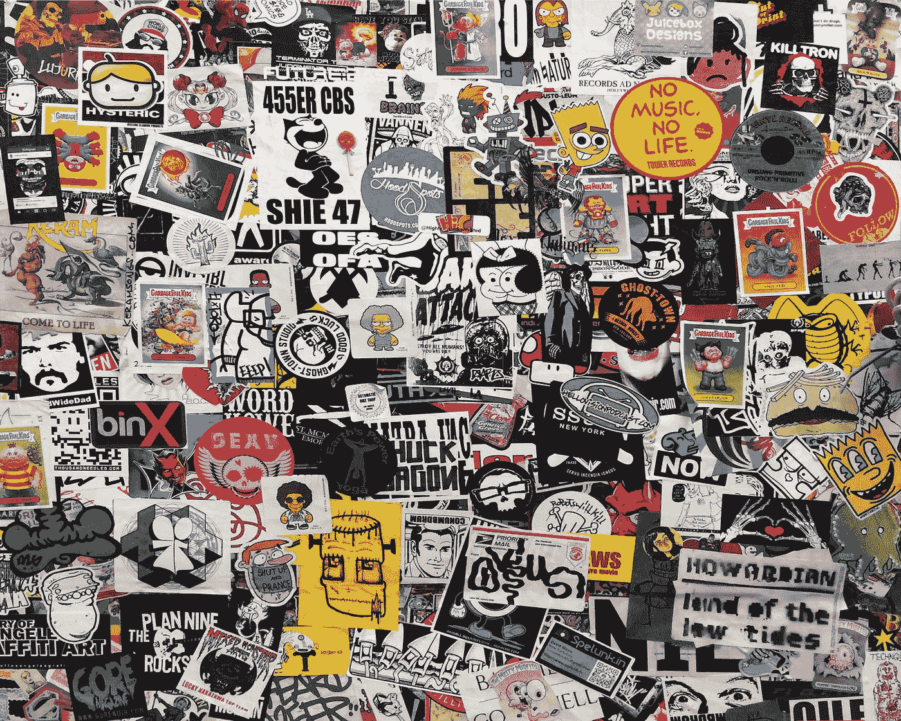
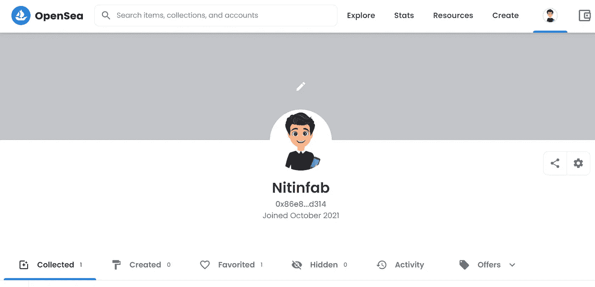
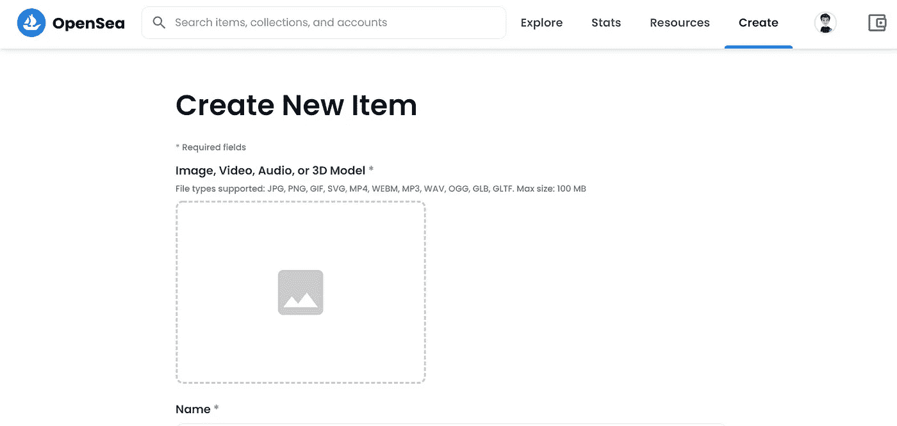
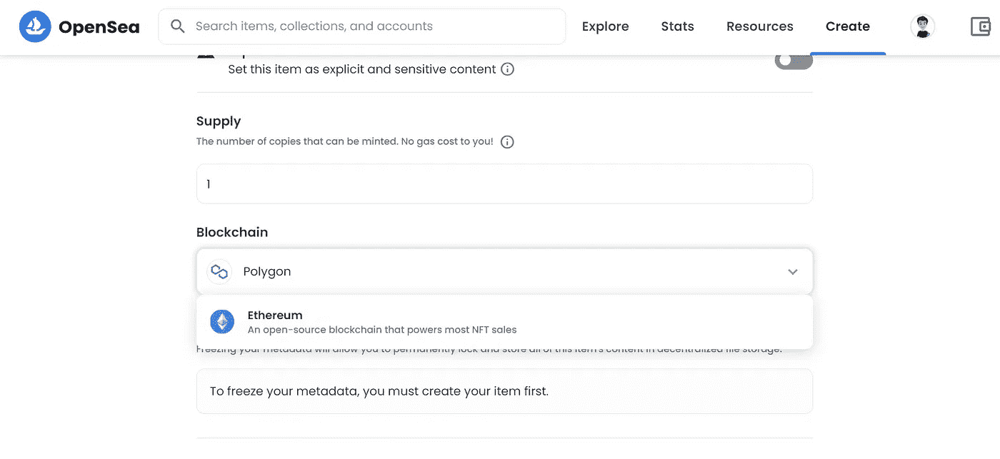
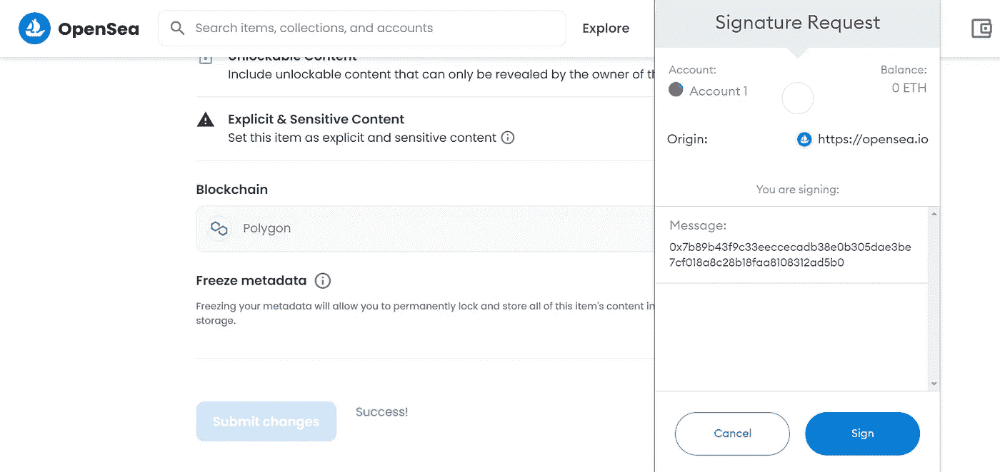

# 如何在 10 分钟内做出你的第一个 NFT

> 原文：<https://javascript.plainenglish.io/how-to-make-your-first-nft-in-under-10-minutes-4ec38c10eb9?source=collection_archive---------7----------------------->

## 并免费出售。

Photo by [Marc Newberry](https://unsplash.com/@downrightpunch?utm_source=medium&utm_medium=referral) on [Unsplash](https://unsplash.com?utm_source=medium&utm_medium=referral)

在 2022 年，我想学习很多新技能，第一个将是 NFT 的。

但是，NFT 是什么？顾名思义，NFT 表示不可替换的令牌，因此它们是不能用其他令牌替换的令牌。假设我们有 1 美元，我们可以很容易地用另一个 1 美元来代替它，但 NFTs 不能被代替。

如果你以前看过或读过 NFTs，你可能知道 [Nyan Cat meme 在网上拍卖中以 59 万美元](https://www.businessinsider.in/tech/news/nyan-cat-flying-pop-tart-meme-sells-for-nearly-600000-as-one-of-a-kind-crypto-art/articleshow/81179350.cms)售出。那是在 2011 年。

# 你能通过 NFTs 销售什么？

可能是虚拟交易卡、音乐、视频、艺术、虚拟房地产，甚至内容写作等等。

但是在哪里？今天平台的数量有限，但在未来，将会更多。

有些是 Rarible，OpenSea，SuperRare，Foundation.app，Mintable。app 等。

# 你能用 NFTs 做什么？

大多数人更喜欢买卖 NFT。其他人试图购买虚拟土地，用于建造虚拟画廊、博物馆，甚至将他们的虚拟土地租给其他任何人。

同样，音乐、视频和内容也可以作为非功能性内容进行买卖。

将来会有更多的非功能性测试的应用。

# 你需要一个超屏蔽钱包

最简单的方法之一是创建一个 Matamask 帐户来管理您的以太坊交易。别紧张，这是免费的，是安全的钱包。

首先访问 [Metamask 官网](https://metamask.io/)，然后下载 chrome 扩展。

创建您的新钱包，添加密码，并尝试将秘密恢复阶段放在一个秘密的地方。

# 然后，创建一个 OpenSea 帐户

正如我刚才所说，有几个选项来列出你的非关税壁垒，但其中一些需要一个气体费。作为一个初学者，我不认为你需要花一些钱，所以我们将使用 OpenSea。

如果您需要在任何其他平台上创建一个帐户，您可以自由地这样做。

现在尝试在 OpenSea 上创建一个帐户。别忘了把你的 Metamask 钱包和 OpenSea 连接起来。

下一步是创建你的 NFT。

# 创建并列出您的第一个 NFT

如果你是艺术家、画家、设计师等，你会比我更清楚如何创造 NFT。

如果你不是其中之一，你可以使用一些免费或付费的在线软件。他们中的一些人来自 Adobe，Figma，甚至 Canva 来创建你的第一个 NFT。

之后，你必须点击右上角的“创建”按钮。

你可以看到这种类型的界面。在这里，你可以上传图片、视频、音频或 3D 模型。此外，还支持不同类型的文件。

上传您的 NFT，为其命名，并提供一些描述(可选)。

然后选择区块链的类型为多边形，它不会收取你任何费用。

甚至你可以试着为一个特定的 NFT 决定供应的数量。

现在点击创建按钮。

稍后你会提示出售你的 NFT，加上你的 NFT 的价格，然后点击完成列表。

OpenSea 将发送一个签名请求到你的 Metamask 账户，你只需要点击签名按钮。

恭喜你创造并上市了你的第一个 NFT。

# 奖金

这个指南只是对 NFT 的介绍，创造和销售他们。如果你想创造一个未来，你必须学习更多关于 NFTs 的知识。

如果你在艺术、音乐、视频方面有一些经验，或者有一大批追随者，你可以很容易地卖掉你的 NFT。如果没有，那就试着了解 NFT 氏症，然后卖掉它。

让我给你举个例子，这里有一个[链接到我的 NFT](https://opensea.io/assets/matic/0x2953399124f0cbb46d2cbacd8a89cf0599974963/61020083189959494952649376193109127936450887639224784539549908073023228870657/) 。是的，我没有与任何人分享它，所以没有人买它。

就这样——谢谢。

***如果你喜欢我的工作，想要支持，可以*** [***请我喝杯咖啡！***](https://www.buymeacoffee.com/nitinfab)

*更多内容看* [***说白了. io***](http://plainenglish.io/) ***。*** *报名参加我们的* [***免费每周简讯这里***](http://newsletter.plainenglish.io/) ***。***