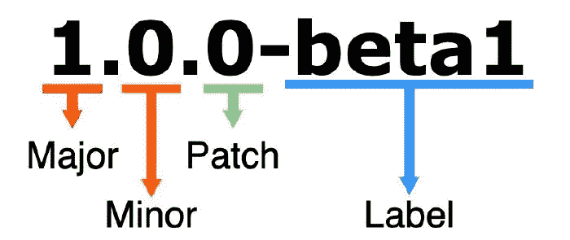

# 如何制作自己的 NPM 套餐

> 原文：<https://javascript.plainenglish.io/how-to-make-your-own-npm-package-eed6233f2e26?source=collection_archive---------3----------------------->

## 关于如何使用 npm 托管您的库以便您可以与世界共享的分步指南。


我越是深入研究创建和开发自己的应用程序，就越是发现自己在利用 npm 包。到目前为止，已经有超过一百万个包裹了。有些软件包有数百万的周下载量，有些有数千。有些很复杂，有些很简单。作为一个喜欢创造的创意者，我忍不住想知道…我如何制作我自己的 npm 包？如果你想知道同样的事情，我有你的答案！

在这篇博客中，我将一步一步地介绍如何使用 npm 发布自己的 Node.js 库。我将要使用的例子是一个简单的库，它将句子中每个单词的第一个字母转换成大写字母。

# 1.开始之前您应该拥有的帐户和安装

开始之前，请确保进行了以下设置:

*   一个 [GitHub 账号](https://github.com/)。
*   一个[国家预防机制账户](https://www.npmjs.com/)。
*   确保已经安装了 [Node.js 和 NPM](https://docs.npmjs.com/downloading-and-installing-node-js-and-npm)。

一旦你建立了你的账户，安装了所有的东西，我们就可以开始制作和发布你的 npm 包了。

# 2.为您的包选择一个名称

如果你像我一样挑剔，这可能是你最艰难的一步。此外，当你认为你有最好的名字时，它可能已经被别人取了。

在你对一个名字太着迷之前，你可以检查你选择的名字是否在 npm 网站上，或者你可以访问这个网站，输入你喜欢的名字，它会告诉你它是否可用:[https://remarkablemark.org/npm-package-name-checker/](https://remarkablemark.org/npm-package-name-checker/)

重要的是你的包名是唯一的，特别是当你打算把它作为一个公共包发布的时候。

对于我在这里使用的例子，我们将要创建的包的名称是`first-letter-case-converter`。

# 3.为您的包创建一个 GitHub 库

接下来在 GitHub 上为您的 npm 包创建一个新的存储库。这个例子的存储库名称应该是`first-letter-case-converter`。确保使用自述文件正确初始化它。

您可能还想为存储库选择一个合适的许可证。尤其是当你打算公开你的 npm 包给其他开发者使用的时候。一个广泛使用的是麻省理工学院许可证，但你可以自己研究，找到适合你的。查看 [GitHub 关于许可一个库的文档](https://docs.github.com/en/github/creating-cloning-and-archiving-repositories/licensing-a-repository)。

# 4.设置作者

请务必将您的姓名、电子邮件和网站保存到 npm。这些细节将在创建时添加到项目的 package.json 文件中。

```
npm set init.author.name "<your-name>"
npm set init.author.email "<your-email-address">
npm set init.author.url "<your-website-url>"
```

# 5.登录国家预防机制

完成此操作后，使用命令`npm login`登录 npm。然后会要求您输入用于创建 npm 帐户的凭据。

# 6.初始化项目

为项目创建一个新目录，并使用`npm init`命令初始化它。请务必填写以下字段:

*   包名
*   版本
*   描述
*   git 储存库
*   关键词
*   许可证

```
(base) ➜  first-letter-case-converter npm initThis utility will walk you through creating a package.json file.
It only covers the most common items, and tries to guess sensible defaults.

See `npm help init` for definitive documentation on these fields
and exactly what they do.

Use `npm install <pkg>` afterwards to install a package and
save it as a dependency in the package.json file.

Press ^C at any time to quit.
package name: (first-letter-case-converter)
version: (1.0.0)
description: Converts the first letter of every word in a sentence to a capital letter. 
entry point: (index.js) app.js
test command: mocha
git repository: https://github.com/<username>/first-letter-case-converter
keywords: capitalize, converter, case, letter
author: johnsmith
license: (ISC) MIT
About to write to /Users/Projects/first-letter-case-converter/package.json:{
  "name": "first-letter-case-converter",
  "version": "1.0.0",
  "description": "Converts the first letter of every word in a sentence to a capital letter",
  "main": "app.js",
  "scripts": {
    "test": "mocha"
  },
  "repository": {
    "type": "git",
    "url": "git+https://github.com/%3Cusername%3E/first-letter-case-converter.git"
  },
  "keywords": [
    "capitalize",
    "converter",
    "case", 
    "letter"
  ],
  "author": "johnsmith",
  "license": "MIT",
  "bugs": {
    "url": "https://github.com/%3Cusername%3E/first-letter-case-converter/issues"
  },
  "homepage": "https://github.com/%3Cusername%3E/first-letter-case-converter#readme"
 }

Is this OK? (yes) yes
(base) ➜  first-letter-case-converter
```

所有这些字段都将添加到 package.json 文件中。

您还可以向 package.json 文件中添加另一个名为“engines”的字段，以指定您的包所兼容的 Node.js 的最低版本:

```
"engines": {
    "node": ">= 9.0.0"
 },
```

# 7.确保您正确更新了软件包的版本

您不必马上担心这个问题，因为您发布到 npm 的初始包的默认版本应该是 1.0.0。也就是说，你应该知道如何提前更新版本，这样当你更新你的软件包时，你就知道你做的是正确的。

随着您的公共包被世界各地的开发人员安装、下载和使用，以及随着您使用的技术的发展和增长，您可能需要更新您的 npm 包。当您更新您的软件包时，您必须更新版本。

Npm 使用一个称为语义版本化(SemVer)的版本化系统，正如我提到的，默认的起始版本是 1.0.0。对于您的包的未来更新，有三种类型的版本更改可以遵循语义版本标准。版本变更的三种类型是主要、次要和修补:



*   **主要**版本是当你对你的软件包进行大的改变时。不兼容的 API 变化就是一个例子。
*   次要版本是指以向后兼容的方式添加功能。
*   **补丁**版本是你做向后兼容的 bug 修正的时候。

预发布和构建元数据的附加标签可作为主标签的扩展。小调。补丁格式。

你可以在这里阅读更多关于语义版本[的内容。](https://semver.org/)

# 8.创建节点模块

接下来的步骤是实现您的包。在这个例子中，我实现了`first-letter-case-converter`包。

在`app.js`或任何您想要设置为入口点的文件中，您将添加适用于您的包的代码。对于`first-letter-case-converter`包，这是我放在`app.js`中的代码:

```
function converter(sentence){
    let capitalized = []
    let words = sentence.split(" ") //split the sentence into words
    words.forEach(word => { 
        let capitalizedWord = word.slice(0, 1).toUpperCase()  word.slice(1) //capitalize the first letter of every word
        capitalized.push(capitalizedWord)         
    })
    let converted = capitalized.join(" ") 
    return converted
}

module.exports = converter
```

我使用了一个叫做`converter`的简单函数。它接受一个字符串形式的句子，并将每个单词的第一个字母变成大写字母。上面代码中最重要的部分是使用`module.exports`导出创建的函数。

# 9.正在初始化 Git

接下来，您必须使用命令为您的项目/包初始化 git:

```
git init
```

然后使用以下命令转移您更改的文件:

```
git add .
```

接下来，将对代码的更改提交到您的本地存储库:

```
git commit -m "initial changes"
```

接下来添加 GitHub 存储库作为项目的远程存储库:

```
git remote add origin <GitHub repository URL>
```

然后从远程存储库中提取更改，然后将本地更改推送到其中。

```
git pull origin master
git push origin master
```

# 10.编写软件包的自述文件

这可能看起来像是一个武断或不必要的步骤，但它实际上真的很重要。有多少次你安装了一个 npm 包，然后不得不在网上搜索或者查看代码示例来弄清楚它是如何工作的？

为您的软件包编写一个好的自述文件对它的成功和广泛使用有很大的帮助。它向您的软件包的用户和潜在用户简要介绍了它的作用以及如何在他们的项目中使用它。

如果你想更好地了解一个好的 npm 包自述文件是什么样子的，你应该看看流行的 npm 包和它们的 GitHub 库。

一般来说，您的自述文件应该包括:

*   对您的软件包及其功能的描述。
*   其他用户如何安装该包以便在他们的项目中使用它。
*   如何在项目中使用包。给出解释用法的代码示例。这很重要！
*   其他人如何为你的计划做出贡献。如果你希望其他开发人员参与这个项目，一定要在你的自述文件中包括这一点。
*   包使用的许可证。

# 11.将包发布到 NPM

这将是最简单的一步。您只需在命令行中运行以下代码:

```
npm publish
```

如果您选择了一个唯一的包名称(一个尚不存在的名称)，您的包将被发布到 npm！

# 12.测试一下

创建一个新项目，并将您的新包作为依赖项安装。下面我正在安装我的`first-letter-case-converter`包:

```
npm install first-letter-case-converter --save
```

然后，您可以将该包导入到新项目中，并根据您的喜好使用它。在我使用的例子中，软件包会将句子中每个单词的首字母转换为大写字母:

```
const converter = require("first-letter-case-converter")

let convertedSentence = converter("i love to learn new things") // The result will be: "I Love To Learn New Things"
```

# 结论

我用了一个简单的例子，但是随着你对创建 npm 包越来越熟悉，你可以把它们变得越来越复杂。最后，一旦你理解了这个过程并且已经测试过了，发布一个 npm 包实际上是相当简单的。

现在你知道如何创建你自己的 npm 包并发布它了！祝你好运，玩得开心，请随时与我分享你创建的 npm 包。

*更多内容看*[***plain English . io***](http://plainenglish.io)