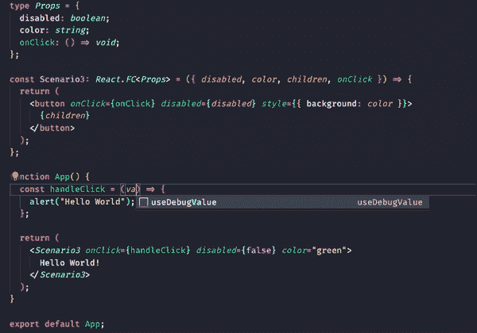

# 如何使用 TypeScript 使 React 组件类型安全

> 原文：<https://javascript.plainenglish.io/how-to-make-your-react-components-type-safe-with-typescript-63d648d361ef?source=collection_archive---------5----------------------->

## 您将了解到在 React 中创建类型安全的组件有多简单，以及这会对 React 代码的编写带来多大的改进


出于各种原因，我喜欢用 TypeScript 编写所有的 React 代码，但其中一个重要原因是，我能够使我的组件开箱即用，这反过来又使它们不容易出错。当涉及到编辑器(如 VS Code)中的代码完成时，这也是一个巨大的好处。如果你习惯于用普通的 JavaScript 编写你的 React 代码，那么我将要展示给你的就相当于使用 prop-type。

# 让我们开始编码吧

在本教程中，我不打算编写完整的 React 项目代码，但是如果您想尝试下面的代码片段，那么您可以在您的终端中运行以下命令(如果您在 Windows 上，可以使用命令提示符或 powershell)。

```
npx create-react-app typescript-demo-app --template typescript
```

这将创建一个使用 TypeScript 的 starter react 应用程序。在它完成创建您的项目后，您可以继续在您选择的代码编辑器中打开它。

下面的代码片段将在几个不同的场景中给出组件类型。

## 场景 1:一个需要所有道具的简单组件

你会注意到我给了**场景 1** 组件一种*反应。FC* 它只是告诉 TypeScript 这实际上是一个 React 功能组件。这很重要，因为 TypeScript 需要知道这一点，这样它才能推断出我们的 arrow 函数中的第一个参数是 props。在上面的例子中，我正在执行对象析构，但是你也可以调用第一个参数 props，然后在 React 代码中编写 props.disabled 和 props.color。

## 场景 2:一个简单的组件，需要孩子和所有道具

你会注意到，在这个场景中，它与第一个场景非常相似。唯一的不同是，我们现在也析构子元素，并把它放在按钮中。我们之所以能够做到这一点，而不必在我们的 Props 类型中包含子对象，是因为我们告诉 TypeScript 需要一个 React.FC 类型。这意味着作为第一个参数中的对象的一部分，子对象将被包含在内。

## **场景 3:具有作为类型**一部分的功能的组件

在这个场景中，我们向道具类型添加了一个新的属性。这个属性只是一个返回 void 的函数(换句话说，它不返回任何东西)。如果你想测试这个，我认为它实际上很有趣。请尝试向 handleClick 函数添加参数或尝试返回一个字符串。您会注意到，这种情况一发生，TypeScript 就对代码不再满意了。下面我举个例子。



## 场景 4:具有可选属性的组件

对于这一个，它是超级容易的。要使一个类型的属性可选，我们只需在`**:**` 前添加一个`**?**`，告诉 TypeScript 该属性是可选的。当然，如果我们没有为属性传递任何东西，我们将不得不考虑它可能是未定义的。幸运的是，这也很容易解决。您将在上面代码片段的第 8 行看到，我只是通过将该属性设置为 false 来赋予它一个默认值。现在，如果我们不为 disabled 传递一个值，它将自动假定该值为 false。

# 结论

我希望您发现这个在 TypeScript 中创建类型安全的 React 组件的小步骤很有帮助。我知道为所有组件创建这些类型可能需要一点前期工作，但这肯定是值得的。您将在代码编辑器中获得更好的自动完成选项，并对组件的正确使用感到安心。