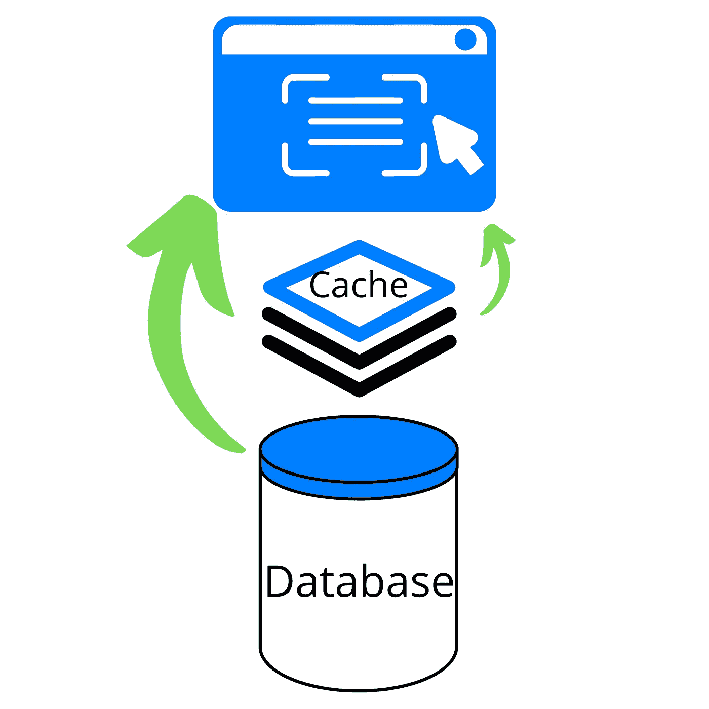

# 如何用几行代码让你的网站速度提高 25 倍

> 原文：<https://javascript.plainenglish.io/how-to-make-your-site-25x-faster-with-a-few-lines-of-code-e13056faac2a?source=collection_archive---------0----------------------->

## 疯狂减少数据加载时间。


Source: Author

有机流量是吸引网站眼球的好方法，谷歌是最受欢迎的搜索引擎，你可以用它来获得有机流量。

虽然谷歌根据很多指标对你的网站进行排名，但是网站加载的速度是关键因素之一。

加载速度快的网站不仅有利于排名，也有利于整体用户体验。

由于大多数开发人员(尤其是独立开发人员)都在使用 JavaScript 框架，如 React 和 Angular，它们可能会在客户端呈现数据，因此获取数据的速度是开发过程的一个重要方面。

有一个简单的方法可以让你的网站加载更快，那就是*缓存*和 CDN(内容交付网络)。

结合使用这两种方法可以奇迹般地缩短加载第一个字节的时间。

在这篇博客中，我将用一个使用 [Redis](https://redis.io/topics/introduction) 的例子来演示缓存，并解释什么是 CDN。

缓存，通俗的说就是把你认为可能会经常用到的数据存储到内存中(称为缓存)。

所以下一次你需要这些数据时，你要检查它是否存储在内存中，如果没有，你就调用数据库来获取它，并可能把它存储到缓存中以备将来使用。



Source: Author

从上图中可以看出，缓存只是包含数据源和应用程序之间频繁访问的数据的数据结构层。

并非所有数据都需要缓存。例如，用户的个人设置或不应该缓存在服务器上。但是，您可以将它们存储在客户端的本地存储中，以便更快地访问。

数据缓存是减少加载时间的最简单的方法之一，同时，您必须明智地选择如何缓存数据。

## 你应该缓存什么？

如前所述，应该缓存频繁访问的数据，以提供快速响应的体验。

不同的开发人员有不同的缓存策略，这取决于他们的偏好和需求。如果你想让我介绍各种常见的缓存策略，那就回复一下这篇博客吧。

以下是您应该缓存的项目的一些示例:

1.  授权和会话令牌
2.  不经常更改的登录页面数据(如投资组合网站中的近期项目)。
3.  博客和帖子草稿可以在缓存中存储一段时间，然后在固定的时间后插入到数据库中。
4.  实时评论流和分析。

## 为什么是 Redis？

尽管您可以自由地使用任何您喜欢的选项，但我强烈建议您至少检查一下 Redis。

Redis 是一个开放源代码的内存数据结构存储，它有我们熟悉的数据类型，如列表、字典、字符串、散列等。

它是一个具有扩展功能的键值数据存储，比如设置到期日期的功能。

根据 Stack Overflow 2021 调查，Redis 是[最受欢迎的数据库。](https://insights.stackoverflow.com/survey/2021)

如果您需要跨多个可用性区域存储数据的持久事务日志，AWS 的 MemoryDB for Redis 是一个很好的选择。

## 装置

如果你在 Linux 上，安装 Redis 非常简单。

前往 [Redis 下载页面](https://redis.io/download)下载最新的稳定版本，或者您可以在您的终端中运行以下命令:

```
sudo apt-get install redis
```

一旦完成 Redis 的安装，只需输入`redis-server`就可以启动 Redis 服务器。该服务器的默认端口是端口 6379。

但是，如果您使用的是 Windows，则有两种选择。

你可以按照[简单指南在你的 Windows 机器上安装一个过时的 Redis](https://redis.com/ebook/appendix-a/a-3-installing-on-windows/a-3-2-installing-redis-on-window/) 或者你可以使用[Windows Subsystem for Linux(WSL)](https://docs.microsoft.com/en-us/windows/wsl/install)获得最新的 Redis。

我个人选择了 WSL 方式，它为我创建了一个 Ubuntu 20.04 系统来安装 Redis 和任何其他我将来可能需要的包。

## 使用

网上有很多关于如何开始使用 Redis 的指南，因此我将提供一个 Redis 如何加速你的网站的演示。

我将创建一个简单的 Node.js 服务器，它从 web 上获取一些数据，然后将它们发送给它的客户端，稍后我们将向它添加缓存，并看到巨大的差异。

下面是一个服务器，它简单地从数据源获取数据，然后将其传递给客户端。

您可以在下图中看到响应时间:


Source: Author. Time taken is 1301ms.

现在我们将使用 Redis 实现缓存。

首先，我们需要一个 npm 包。

```
npm i --save redis
```

一旦安装完毕，我们将把它导入到我们的 server.js 文件中，并创建一个客户机。

```
const *redis* = *require*('redis');const *cacheClient* = *redis.createClient*(); // => Redis client
```

我们需要编辑我们的`app.get()`函数，并向它添加缓存逻辑。

很简单的 if-else 逻辑。我们首先通过调用 Redis 客户端并使用`.get()`获取数据，检查数据是否存在于我们的 Redis 服务器中。

如果数据不存在，那么我们调用数据源来获取新的数据。我们通过调用 Redis 客户机上的`.setex()`函数将这些数据插入 Redis 存储中。

```
cacheClient.setex('sample',60,JSON.stringify(json));
```

第一个参数是我们想要存储的数据的名称(键)，接下来是过期时间，最后实际的数据(值)作为第三个参数。

我们使用`JSON.stringify()`方法将 JSON 数据转换成 string 数据类型。

有了存储在 Redis 存储中的数据，下次调用`app.get(‘/’)`函数时，客户机将能够从 Redis 服务器获取数据，而不是从我们的原始数据源获取。


随着这一点的实现，我们可以立即看到惊人的结果，因为所用的时间只有 52 毫秒，而以前是 1301 毫秒。

这是一个非常简单的缓存观点，Redis 的功能远不止缓存，甚至可以用作一个[永久存储选项。](https://upstash.com/)

我们最终的 server.js 文件将如下所示:

```
const express = require('express')
const app = express();
const redis = require('redis');const fetch = require('cross-fetch');const cacheClient = redis.createClient();
app.get('/', async (req, res, next) => {await cacheClient.get('sample', async (err, data) => {
        if (err) console.error(err);
        if (data) {
            console.log('Data was cached before')
            return res.json({ data: JSON.parse(data) });
        }
        else
          await fetch('[https://jsonplaceholder.typicode.com/photos'](https://jsonplaceholder.typicode.com/photos'))
                .then(response => response.json())
                .then(json => {
                    console.log('Newly fetched data')
                    cacheClient.setex('sample',
                        60,
                        JSON.stringify(json));
           return res.json({ data: json });
        })
})
});
app.listen(3000, () => console.log('listening on port 3000'));
```

## 内容交付网络(CDN)

在服务器上缓存数据当然是一个很大的改进，但是缓存大的 HTML、视频和图像文件呢？

CDN 为这个问题提供了一个简单的解决方案。要知道 CDN 和缓存是不一样的。

> 虽然 CDN 确实缓存内容，但并不是所有缓存数据的东西都可以称为 CDN。

CDN 指的是地理上分布的一组服务器，它们协同工作，提供网站和其他资产(如图像和视频文件)的快速交付。

像网飞和脸书这样的知名网站利用 CDN 的优势，使用离你最近的服务器群将内容快速传送给你。


Source: [Wikipedia](https://en.wikipedia.org/wiki/Content_delivery_network).

CDN 在全球多个地方存储您内容的缓存副本。

因此，如果有人从澳大利亚访问你的英国托管网站，他们将改为访问最近的澳大利亚可用的 CDN 服务器，并获得你的英国托管网站的缓存副本。

> 这也节省了带宽成本，增加了可靠性和正常运行时间。

在一些平台和主机上，默认情况下，CDN 由您支配，一般来说，使用它就像在 HTML 文件中添加一个头一样简单。

就我个人而言，根据我的经验，我发现 [Vercel 的 CDN](https://vercel.com/docs/concepts/edge-network/caching) 是最容易使用的，它有一个很好的详细指南，有一个有用的功能，可以防止你的数据过时。

在 Vercel 中，你只需要添加一个头来通知 CDN 这个站点需要缓存。下面给出了一个标题示例:

```
Cache-Control: s-maxage=1
```

值得注意的是，你在客户端加载的任何数据都不会包含在你网站的缓存 CDN 副本中。这是因为数据是在客户端动态加载的，而不是由服务器呈现的。

但是，您总是可以通过 Redis、CDN 或任何其他选项缓存正在客户端加载的数据，以加快动态加载的速度。

## 最后的想法…

优化和减少加载网站的时间是整个网站开发过程中的关键一步。

根据[谷歌](https://www.thinkwithgoogle.com/marketing-strategies/app-and-mobile/mobile-page-speed-new-industry-benchmarks-load-time-vs-bounce/)，

> 当页面加载时间从 1 秒增加到 10 秒时，移动站点访问者反弹的概率增加了 123%。

通过实施一些策略来缓存数据和使用离客户端最近的服务器，可以减少页面加载时间。

缓存数据还具有经济效益，因为您可以节省带宽成本，并减少对数据库的读写操作。

CDN 与数据缓存策略的结合可以带来惊人的低网页加载时间，从而也增加了你在 Google 上获得更高排名的机会。

如果你喜欢读这篇文章，考虑使用[我的推荐链接](https://medium.com/@anuragkanoria/membership)，这样你就可以通过点击[这里](https://medium.com/@anuragkanoria/membership)无限制地访问我的博客以及其他作者的博客。

CDN 和缓存肯定会成为我未来项目中不可或缺的一部分。

如果你对阅读单干创始人的决策感兴趣，你可以看看我最近关于 AWS 的文章

[](https://aws.plainenglish.io/why-i-chose-not-to-go-with-aws-for-my-saas-product-b13fb0454859) [## 为什么我的 SaaS 产品没有选择 AWS

### 我个人使用 AWS 和其他 IAAS 的经验

aws .平原英语. io](https://aws.plainenglish.io/why-i-chose-not-to-go-with-aws-for-my-saas-product-b13fb0454859) 

*更多内容请看*[*plain English . io*](http://plainenglish.io/)*。报名参加我们的* [*免费周报*](http://newsletter.plainenglish.io/) *。在我们的* [*社区获得独家写作机会和建议*](https://discord.gg/GtDtUAvyhW) *。*