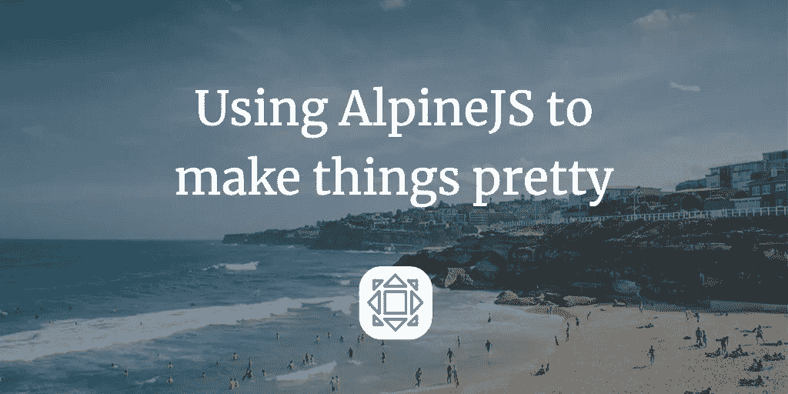
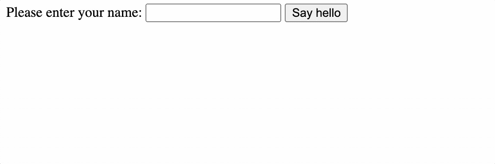
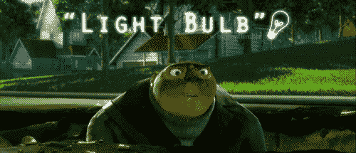
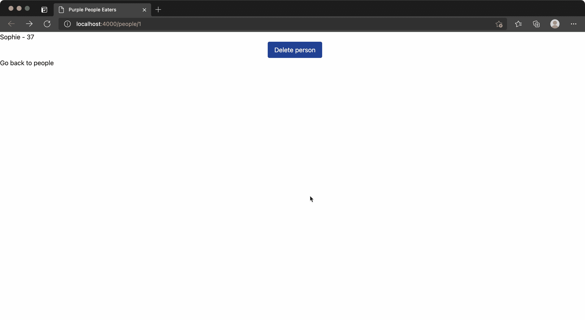

# 如何使用 Alpine.js 使您的网页看起来更漂亮

> 原文：<https://javascript.plainenglish.io/how-to-make-your-web-pages-look-prettier-with-alpine-js-d663a1572f31?source=collection_archive---------11----------------------->



前几天我有一个启示。

## 一开始…

我的想法是，为了让你的用户界面变得美观和反应灵敏，你需要使用 Vue.js、Svelte 或其他一些网络框架。否则，页面会一直停留在那里，直到您单击一个按钮，然后重新加载。傻瓜，我现在知道了。

然后我发现了 Alpine.js，意识到我完全错了。



Example animation of Alpine

上面的动画是下面标记的结果。字面上，就是这样。

```
<html>
  <head>
    <title>Alpine demo page</title>
    <script src="https://cdn.jsdelivr.net/gh/alpinejs/alpine@v2.8.2/dist/alpine.min.js"></script>
  </head>
  <body>
    <div x-data="{ show: false }">
      <label for="name">Please enter your name: </label>
      <input type="text" name="name" x-ref="name">
      <button
        @click="show = !show"
        x-text="show ? 'Stop saying hello' : 'Say hello'"
      ></button>
      <div x-show="show">
        <p x-text="'Hello ' + $refs.name.value"></p>
      </div>
    </div>
  </body>
</html>
```

魔法发生在`x-`标签上:

*   `x-data`声明一个变量——您只能在该块的范围内使用该变量。
*   `x-show`决定能见度。
*   `x-text`控制所开启元素的`innerText`。
*   `@click`可用作倾听事件的简写。这是`x-on`的捷径。
*   `x-ref`添加对元素的引用，使其以后可以通过`$refs`访问。

把这些放在一起，你可以做一些令人惊奇的事情。

## 使用它

在我的大多数项目中，我都有一个单独的页面用于删除项目。流动并不像我希望的那样顺畅，但它起作用了。

然后我有一个“格鲁时刻”。



Lightbulb

为什么是一整页？我真正需要的是一个张贴到正确的网址的请求。我可以用表格来做。我们已经知道 Alpine.js 可以显示和隐藏表单。

事实上，因为没有需要传达的数据，表单只需要围绕提交按钮…

```
<form action="/people/<%= person.id %>/delete" method="POST">
  <div>
    <button>Cancel</button>
    <button type="submit" >Delete</button>
  </div>
</form>
```

如果我们要使用 Alpine.js，那么我们需要稍微调整一下表单，替换掉取消按钮。

```
<button @click.prevent="showDelete = false">Cancel</button>
```

`.prevent`阻止点击事件向上传播-如果没有，那么按钮将注册点击，并且除了隐藏删除对话框，它将实际提交表单并删除项目。

让我们转到(非常有用的) [Alpine 工具箱](https://alpinetoolbox.com/)，我们可以看到，实际上已经有多个模态示例可以从中导出。

[这个精彩的帖子](https://williamrodriguez.com/articles/alpinejs-tailwindcss-responsive-modal-tutorial)是一个很好的起点。我们用上面调整过的形式替换它的主体，我们得到了下面的效果:



我借此机会稍微改进了一下按钮的外观，因为我们已经从示例中引入了 [Tailwind](https://tailwindcss.com/) 。比点击进入一个单独的页面要好的多！

希望您喜欢阅读这篇文章，并学习如何使用 Alpine.js 使您的网站看起来更有吸引力。

*更内容于* [*通俗易懂*](http://plainenglish.io/)