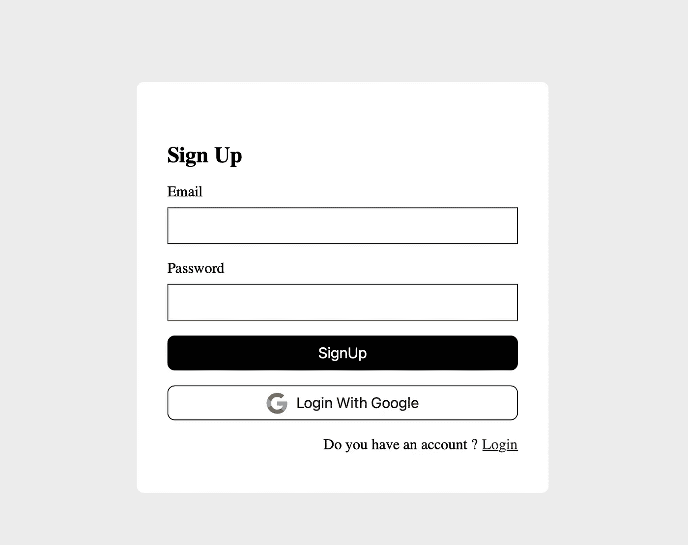
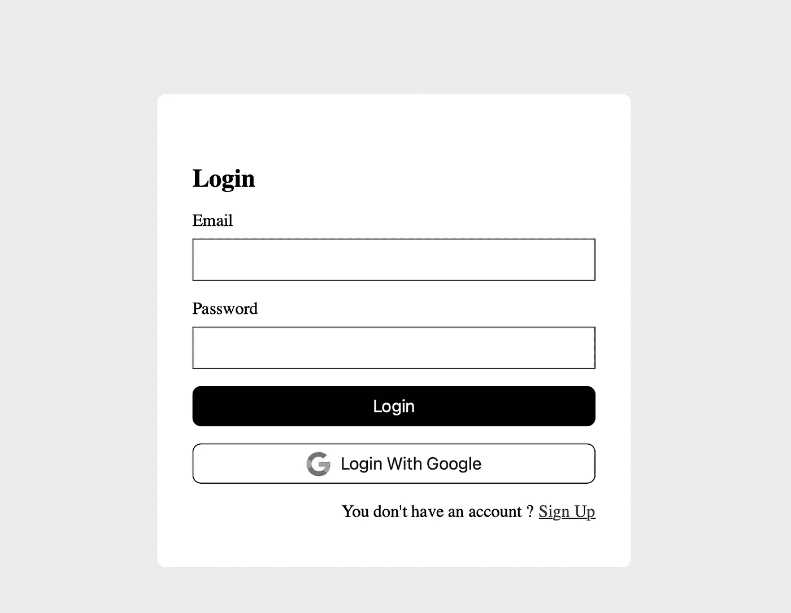
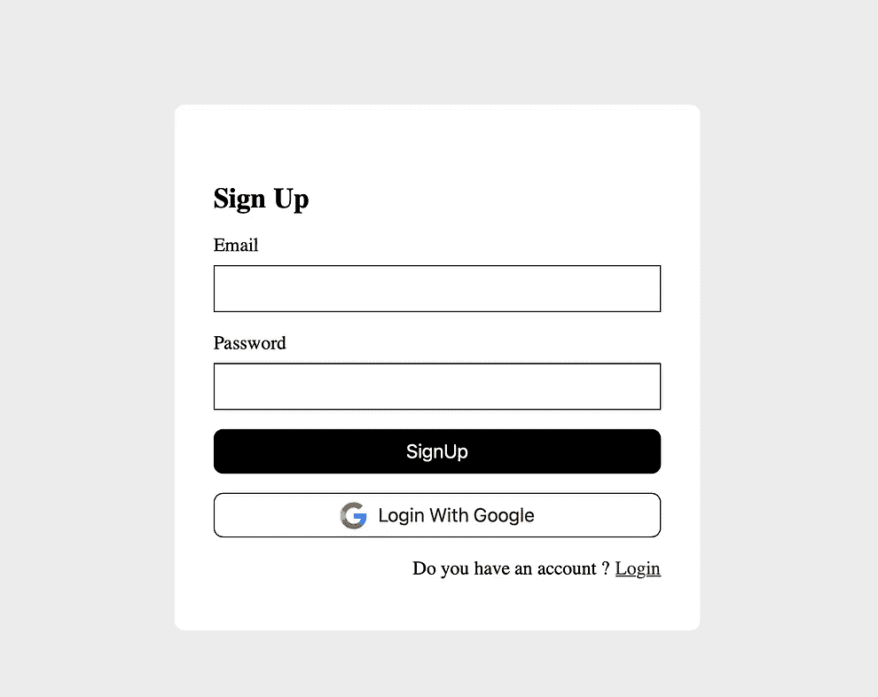

# 如何使用 Firebase 身份验证管理登录和注册？

> 原文：<https://javascript.plainenglish.io/how-to-manage-login-and-signup-with-firebase-authentification-fa2413d18934?source=collection_archive---------7----------------------->

## 火焰基座和角形尖端

## 通过 AngularFire 使用 Firebase 身份验证正确管理您的用户连接。

Photo by [Micah Williams](https://unsplash.com/@mr_williams_photography?utm_source=medium&utm_medium=referral) on [Unsplash](https://unsplash.com?utm_source=medium&utm_medium=referral)

这篇文章是关于使用 Firebase 身份验证管理应用程序上的登录和注册。这不是很有趣吗？

不应该写一整篇文章来讨论如何让用户创建我们应用程序的帐户，或者让他们使用 Firebase 身份验证登录。对于许多人来说，这似乎是 Firebase 文档中最简单的部分，也许他们是对的🤷‍♂️.

相信我，虽然这可能很简单，但当涉及到检查用户是否已经存在于 Firebase 中以避免关于两个本应独立的帐户的冲突时，许多开发人员都会遇到问题。在这里，有几种做法被用来解决这个问题，但在我看来，并不是所有的做法都值得推荐。

写这篇文章的我自己也遇到了同样的问题，我在 Google 上找到的一些答案并没有让我满意，所以我写这篇文章，希望基于 Firebase 本身的文档为您提供一个最佳的解决方案。

# 怎么解决？

我在网上看到有两个解决这个问题的流程，一个我称之为最差，一个我称之为最细。我将在下面的句子中向你解释它们，向你展示我建议你不要使用的方法，以及当你面临这个问题时我强烈建议你使用的方法。

## **a .检查用户是否在 Firestore 中(**错误提示)

在登录的情况下，该解决方案建议通过收集用户的电子邮件来连接用户，以便在 Firestore 中进行检查；如果存在，我们通过 Firebase Auth 连接他，在相反的情况下，我们要求他创建一个帐户。

在注册的情况下，用户的电子邮件被再次检索并在 Firestore 中检查；如果不存在，则创建帐户；如果是，用户被告知该电子邮件已经注册，他/她应该使用另一个电子邮件或登录。

这肯定会过去，但却引起*三个顾虑:*

1.  ***在不必要的时候，您将为此阅读付费，***
2.  *不必要的阅读需要比大多数用户更多的耐心。*
3.  ***当您应该使用单点登录(如与 Google 连接)时，连接和注册管理不善；** *因为在用户登录并选择其连接方式之前，您无法访问该电子邮件地址。**

## *b.请教 Auth，他就是解决方案！(好建议)*

*对于登录和注册，直接使用 Firebase 身份验证。在这一部分中，我将一步一步地向您介绍要实现良好的认证管理应该做些什么。*

*为了一个好的演示，我将开发一个应用程序。该应用程序将在以下版本中开发:*

1.  *[Angular (v12.2.7)](https://angular.io/docs) 这是一个用于前端应用开发的 JavaScript 框架。*
2.  *[AngularFire(7.0.4)](https://github.com/angular/angularfire) 这是 Firebase 的官方角度库。*

*为了让我们更容易理解，我将该解决方案分为三个基本阶段:注册、登录和 LoginWithProvider(本例中为 Google)。我鼓励你通过给定的链接阅读角和角火文档，以熟悉它们。*

> *通过`npm i @angular/fire`在你的电脑上安装 AngularFire，但是要把它添加到你的项目中，你需要做`ng add @angular/fire`*

*项目中 AngularFire 的初始化是通过集成 AngularFireModule : `AngularFireModule.initializeApp(environment.firebase)`来完成的，对于这个例子，我添加了 AngularFireAuth 和 AngularFireAuthGuard 来进行身份验证。*

*app.module.ts*

*environment.ts*

*我已经创建了一个服务，它允许我们为这里的例子实现我们需要的不同特性。*

*auth.service.ts*

> *这个主题中的一个小妙处是下面的代码*

*style.css*

## *b.1 .注册(通过电子邮件)*

**

*sign-up page*

*这是页面的 HTML 代码，在上面的代码中可以找到全局样式(style.css)*

*sign-up.component.html*

*要使用电子邮件和密码管理注册，只需接受这两个参数，然后执行 createUserWithEmailAndPassword 方法就足够了。一个承诺将会得到回报:*

*1️⃣如果成功:你重定向用户到所需的页面；对我们来说，它是主页。*

*出错时的 2️⃣:您有四个选项`email-already-in-use`、`invalid-email`、`operation-not-allowed`和`weak-password`。这四种可能性也给了你在代码中行动的自由。*

*sign-up.component.ts*

## *b.2 .登录(使用电子邮件)*

**

*login page*

*这是页面的 html 代码，在上面的代码中可以找到全局样式(style.css)*

*login.component.html*

*这次要使用电子邮件和密码来管理连接，只需接受两个参数，然后执行 signInWithEmailAndPassword 方法就足够了。一个承诺将会得到回报:*

*成功时的 1️⃣:你再次将用户重定向到想要的页面；对我们来说，这是主页。*

*出错时的 2️⃣:您有四个选项`invalid-email`、`user-disabled`、`user-not-found`和`wrong-password`。这四种可能性为您的代码提供了自由的操作范围。*

*login.component.ts*

## *b.3 .向提供商登录*

****

*Login With Google*

*至于在这种情况下连接到像 Google 这样的 Firebase 提供商，您必须非常小心。您首先必须实现允许您访问提供者的方法，然后通过您的按钮调用它；连接后，不要犹豫，做你想做的。*

*但是这个动作会产生两个错误:*当你已经存在的时候作为新用户登录或者当他是新用户的时候作为老用户登录。**

*要解决这个问题，检查连接的用户就足够了。Firebase 返回登录元数据，因此您可以比较帐户的创建日期和上次登录的日期；如果它们相等，则是新用户，如果不相等，则该用户已经存在于 Firebase 身份验证中。*

> ***注**:该零件的代码可以在前面两个中找到*

# *临终遗言*

*我不能以谈论一个我认为引起这种担忧的主要因素来结束这篇文章。身份验证和 Firestore 不应混淆，后者允许在对这些用户进行身份验证后存储数据。当然，我们使用相同的 uid 来链接经过身份验证的用户和我们放在 Firestore 中的其他数据；我们应该明白，没有经过认证，任何用户都不能进入 Firestore。*

> *如果你想更仔细地查看源代码，可以点击下面的 [**链接**](https://github.com/ShekMak/firebase-auth-management.git)*

# *参考*

* [## Auth | JavaScript SDK | Firebase

### 认证参考

firebase.google.com](https://firebase.google.com/docs/reference/js/v8/firebase.auth.Auth)  [## 如何检查 Firebase 中是否存在用户？

### 感谢贡献一个堆栈溢出的答案！请务必回答问题。提供详细信息并分享…

stackoverflow.com](https://stackoverflow.com/questions/51562995/how-can-i-check-if-user-exists-in-firebase)  [## 使用带有 JavaScript | Firebase 的 Google 登录进行身份验证

### 您可以让您的用户使用他们的 Google 帐户通过 Firebase 进行身份验证，方法是将 Google 登录集成到您的…

firebase.google.com](https://firebase.google.com/docs/auth/web/google-signin)  [## GitHub-shek mak/firebase-auth-management

### 此项目是使用 Angular CLI 版本 12.2.7 生成的。为开发服务器运行 ng serve。导航到…

github.com](https://github.com/ShekMak/firebase-auth-management.git) 

*更多内容请看*[***plain English . io***](http://plainenglish.io/)*