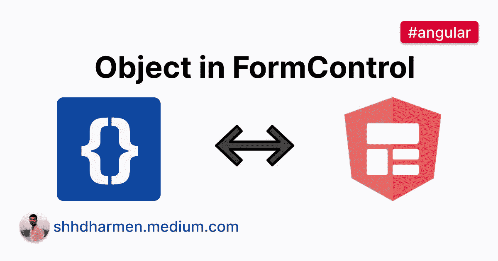
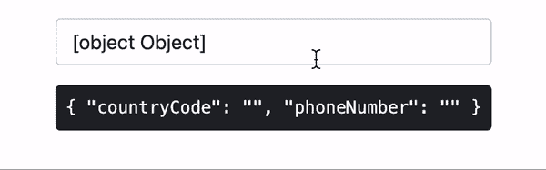
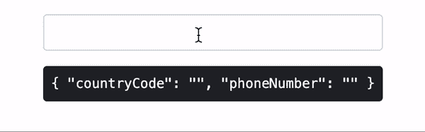
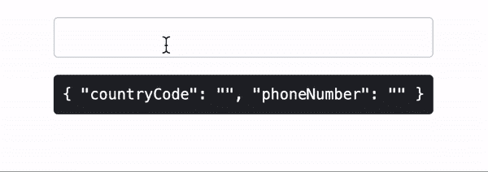

# 如何在角度窗体控件中管理对象

> 原文：<https://javascript.plainenglish.io/how-to-manage-object-in-angular-formcontrol-1fe6ce45364d?source=collection_archive---------4----------------------->

## 如何管理 FormControl 中的对象并处理输入的转换

通常我们将`FormControl`与`string`或`boolean`类型一起使用，因此它只管理简单的值。但是如果我们想要管理的不仅仅是原始数据类型呢？我们可以做到这一点，让我们看看怎么做。

例如，在本教程中，我们将学习如何从同一个表单控件中获取国家代码和数字作为单独的实体，我们还将为其创建自定义输入，以处理 UI 和值之间的转换。

# 电话课

假设我们有一个`Telephone`类，它将保存相关的值:

接下来，让我们拿一个我们想要保持`Telephone`的`input[type=tel]`:

注意我们是如何在`FormControl`中初始化新的`Telephone`类的:

现在让我们来看看输出:

您将注意到的第一件事是`input`在其值中显示了`[object] [Object]`，因为它是对象的字符串表示(在我们的例子中，它是`Telephone`类的成员)。为了修正`input`的值，我们可以简单地在`Telephone`类中提供`toString()`方法。您可以在 [MDN 文档](https://developer.mozilla.org/en-US/docs/Web/JavaScript/Reference/Global_Objects/Object/toString)上了解更多信息。

第二件事是`FormControl`的值最初具有期望的`Telephone`的结构。

但是，如果您修改`input`，`FormControl`的值将变为`string`。我们需要处理从 UI 到`FormControl`的值转换。

为此，我们将使用`CustomValueAccessor`为`input[type=tel]`创建一个自定义输入指令。

# 电话的自定义输入

`InputTelDirective`指令的初始代码如下所示:

> 如果您是第一次接触`ControlValueAccessor`，您可以在以下位置了解更多信息:[在以角度形式实现 ControlValueAccessor 时不要再感到困惑](https://indepth.dev/posts/1055/never-again-be-confused-when-implementing-controlvalueaccessor-in-angular-forms)和[如何使用 ControlValueAccessor 通过自动转换和验证来增强日期输入](https://indepth.dev/posts/1467/how-to-use-controlvalueaccessor-to-enhance-date-input-with-automatic-conversion-and-validation)

对于这个例子，我们只关心`writeValue`和`registerOnChange`。简单来说，`writeValue`用于将`FormControl`的值转换为 UI 值，`registerOnChange`用于将 UI 值转换为`FormControl`的值。

# 从 UI 到`FormControl`的转换

我们将假设用户将以这种形式输入值:`+CC-XXXXXX`，其中连字符(-)之前的字符组合成国家代码，其余的是实际的联系号码。请注意，这并不是一个强有力的指令，只是我们可以从中开始学习的东西。

为了处理这个问题，让我们首先在`input`事件上添加一个监听器:

接下来，让我们修改一下`registerOnChange`方法:

现在让我们看看输出:

很好用！它将 UI 值转换为有效的`FormControl`值，即`Telephone`类的成员。

# 从`FormControl`到 UI 的转换

如果您试图通过`FormControl`设置初始状态，它不会反映在`input`上:

让我们修改`writeValue`方法来处理上述问题:

现在通过`FormControl`设置的值将反映到`input`。

# 确认

现在我们将添加验证部分，以便输入支持开箱即用的验证。

我们将首先在提供者中添加`NG_VALIDATORS`:

接下来，我们将在`Telephone`类中添加`isValid`方法来检查有效性:

最后，我们将实现`Validator`接口并添加`validate`方法:

让我们修改模板以利用验证:

现在让我们看看输出:

# 结论

我们学习了如何管理`FormControl`中的对象，并使用`ControlValueAccessor`来处理转换。

指令的完整代码如下所示:

我还为上面的所有代码创建了一个 [GitHub repo](https://github.com/shhdharmen/multi-value-form-control) 。

*原发布于*[https://indepth . dev](https://indepth.dev/tutorials/angular/object-in-formcontrol)*。*