# 如何衡量和优化 Web 应用程序的性能

> 原文：<https://javascript.plainenglish.io/how-to-measure-and-optimize-the-performance-of-a-web-app-52beb20aabba?source=collection_archive---------8----------------------->

*原载于*[*https://leandrotk . github . io*](https://leandrotk.github.io/2021/01/optimizing-the-performance-of-a-react-progressive-web-app/index.html)

在最后一个季度，我开始在一个有着不同业务目标的新团队中工作。这是一个伟大的团队，一起工作真的很有趣，我们做了很多令人惊叹的工作，我对此感到自豪。

在过去的 4 个月中，我们管理的一个项目是我们正在开发的应用程序的 web 性能改进。这篇文章旨在分享我们在这个过程中所做的改进和学到的东西。

# 语境

在我们开始讨论 web 性能之前，展示这项工作背后的背景是很重要的。

我想提到的第一件事是，我们开始工作的应用程序(PWA)拥有(实际上它仍然拥有)2 年前编写的代码库的大部分。是一个使用 Webpack 3，Babel 6，react-redux 5 等等的 React PWA。少量挂钩。大多数类组件。

该项目没有真正的团队所有权或负责的工程师来照顾代码库。不同的团队需要在 PWA 中到处添加功能，但实际上并不拥有代码库。效果:代码库在特性、错误和技术债务方面不断增长，但是它既没有改进也没有重构。

在这种情况下，我们已经有很多空间来改进代码库。这个项目是我们的焦点，也开始成为我们自己的责任。

我和我的同事成为了这个项目的“服务所有者”。“服务所有者”的想法是某个人(或者在本例中是两个人)作为焦点来清除疑问、管理技术债务、问题、bug 等。基本上，负责一个项目的人。

我们的团队致力于为房屋所有者(房东)提供最佳体验:让他们更容易理解产品，注册新的房屋或公寓，管理房屋的出租和出售。

与产品经理和设计师一起，我们创建了我们希望在该季度发布的功能路线图。同时，性能是为用户提供良好体验的关键因素。我们可以从两个基本的“指标”开始:页面加载和交互时间。这些指标和用户体验之间存在相关性(有时是因果关系)。

我们还希望进行 A/B 测试，并确保性能不是一个会影响这些测试结果的变量。基本上，我们希望防止性能退化，以免影响测试(但是我们需要度量标准——我们很快就会谈到它！).

我们的团队不是性能专家团队。但该公司有一个名为核心 UX 的团队，主要专注于网络性能。在 2020 年前三个季度拥有前端性能经验的团队。

# 该过程

我们的第一个想法是了解我们想要跟踪和关注的指标，并执行“发现”任务，以了解潜在的问题以及我们如何改善用户体验和应用性能。除此之外，我们还尝试与 web 性能团队建立一个渠道来进行讨论，向他们学习，提出问题，并尝试发现性能问题并解决它们。

因此，我们开设了一个新的 Slack 频道来缓解整个想法，并与他们举行两周一次的会议，以展示我们正在做什么，他们正在做什么，讨论提高性能的可能性，并有时间提出问题和展开讨论。

有了这种开放的关系，我们可以学得更快，并优先考虑低挂水果类的任务，以获得更快的结果，而几乎不用付出任何努力。我们将在性能改进部分深入讨论这一点。

整个过程都有文档记录:会议、我们的学习、我们的发现以及性能修复。

# 度量和测量

我们第一次讨论了我们想要跟踪的指标，我的团队开始了解更多。对于不太熟悉的我们来说，起初，这是一堆我们并不真正理解的缩写词。FCP，LCP，FID？那是什么？

为了理解这些术语，我喜欢先理解用户体验指标，因为它们都是联系在一起的。

因此，对于用户体验指标，我喜欢谷歌的这篇以用户为中心的性能指标文章，其中定义了这些指标:

*   **感知加载速度**:一个页面可以多快地加载并呈现所有的视觉元素到屏幕上。
*   **加载&运行时响应**:页面加载和执行任何所需 JavaScript 代码的速度，以便组件快速响应用户交互
*   **视觉稳定性**:页面上的元素会以用户意想不到的方式移动，并潜在地干扰他们的交互吗？
*   平滑度:过渡和动画是否以一致的帧速率呈现，并且从一个状态流畅地过渡到下一个状态？

我喜欢这个，因为它很有共鸣。作为网站用户，我们可以理解这些指标(以及在使用一些“性能差”的网站时可能遇到的挫折)。

这也很有趣，因为我们可以将以用户为中心的指标映射到我们常见的性能指标。

*   **First contentful paint(FCP)**:测量从页面开始加载到页面内容的任何部分呈现在屏幕上的时间。
*   **最大内容绘制(LCP)** :测量从页面开始加载到屏幕上呈现最大文本块或图像元素的时间。
*   **首次输入延迟(FID)** :测量从用户第一次与您的网站交互(即，当他们点击链接、点击按钮或使用自定义的 JavaScript 支持的控件)到浏览器实际能够响应交互的时间。
*   **交互时间(TTI)** :测量从页面开始加载到可视化呈现、加载初始脚本(如果有)以及能够快速可靠地响应用户输入的时间。
*   **总阻塞时间(TBT)** :测量 FCP 和 TTI 之间主线程被阻塞足够长时间以阻止输入响应的总时间。
*   **累积布局偏移(CLS)** :测量从页面开始加载到其生命周期状态变为隐藏之间发生的所有意外布局偏移的累积分数。

我构建了一个简单的表格，将性能指标映射到以用户为中心的指标，以便更容易理解每个缩写。

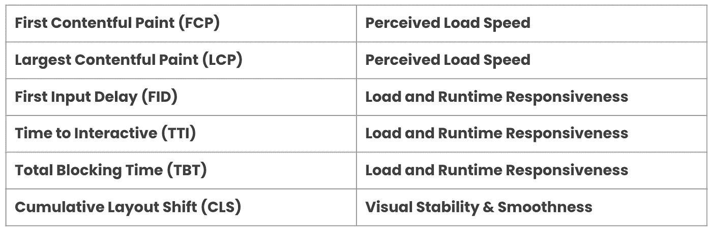

正如我前面说过的，这种关系非常有趣，让我们不仅关注比特和字节，还关注整体的用户体验。

# 工具、审计和知识共享

在对用户体验和性能指标有了更好的理解之后，我们想开始跟踪它们。实验室和现场指标是有区别的。根据谷歌的说法:

*   **实验室指标:**使用工具在一致、受控的环境中模拟页面负载。
*   **字段指标**:关于实际加载页面并与之交互的真实用户。

# 实验室指标

对于实验室指标，我们使用 [Lighthouse CI](https://github.com/GoogleChrome/lighthouse-ci) 在 CI 中设置 Lighthouse。因此，对于每个打开的 Pull 请求(PR ),我们运行 Lighthouse 来收集与性能相关的数据，并锁定 PR，直到我们修复了性能问题。

使用这个工具，我们可以验证 PWA 的各个方面(可访问性、SEO、最佳实践和性能)，而且还可以添加断言，以便在超出我们设置的预算阈值时打破 PRs。

例如，我们可以添加与 JavaScript 和图像大小(以字节为单位)相关的断言:

这个 JavaScript 对象是我们可以用来收集关于性能的不同信息的配置的一部分。为了更好地理解 Lighthouse CI 的配置，请看一下这个文档: [Lighthouse CI 配置](https://github.com/GoogleChrome/lighthouse-ci/blob/master/docs/configuration.md)。

我们正在使用的另一个非常酷的工具是速度曲线。设置和开始收集数据非常简单。这个工具对“未登录页面”更有效，因为我们添加了网站的 URL，并且基于网站负载和交互，它将收集性能指标。

速度曲线仪表板非常灵活，可以显示(或隐藏)我们想要关注的指标。在我们的例子中，我们希望看到 JavaScript 总大小、第一次内容丰富的绘制、最大内容丰富的绘制、累积布局移位、JS 总阻塞时间、后端(TTFB)时间和 Lighthouse 性能分数的变化。

这对于我们的登陆和主页来说非常酷。

我们设置的最后一个工具是性能团队构建的内部工具。这是一款分析应用捆绑包的工具，它现在有 3 个主要功能:

*   **Bundle Analyze Report** :收集并保存 bundle analyzer HTML 结果。
*   **捆绑包预算**:设置预算配置，为捆绑包大小添加阈值。如果一个包的大小超过了阈值，它就会破坏 PR。
*   **Bundle Changes:** 显示 PR 和主(或主要)分支之间的 Bundle 大小变化。它帮助我们很容易地回答“它增加/减少了 X 的包大小吗？”

这个工具在我们的 CI 管道中为每个 PR 运行，结果显示在 Github PR 中(它使用[危险](https://github.com/danger/danger-js)在它后面)。

这些工具非常有趣，因为

*   它帮助我们防止性能退化
*   它还创造了关于网络性能、其度量标准和共享知识的意识

# 字段度量

目前，我们正在使用 [Instana](https://www.instana.com/) 来收集真实的用户性能相关数据。

真实用户监控(RUM)的下一步是在我们的应用中跟踪更多的用户行为，以在 PWA 流中收集 [web 生命指标](https://github.com/GoogleChrome/web-vitals)。

# 性能改进

在这一节中，我想详细介绍我们为提高应用程序的性能和用户体验所做的每个发现和修复背后的过程。

# 登录页面

我们从登录页面开始。第一个动作是使用 [Webpack Bundle Analyzer](https://www.npmjs.com/package/webpack-bundle-analyzer) 分析 JavaScript bundle 的大小。

**补充说明**:两年前，负责登录页面的团队决定使用 react 工具开发登录页面，但在构建时，我们从应用程序中删除了 react，以减少登录页面中的包大小。

这是我们得到的结果:

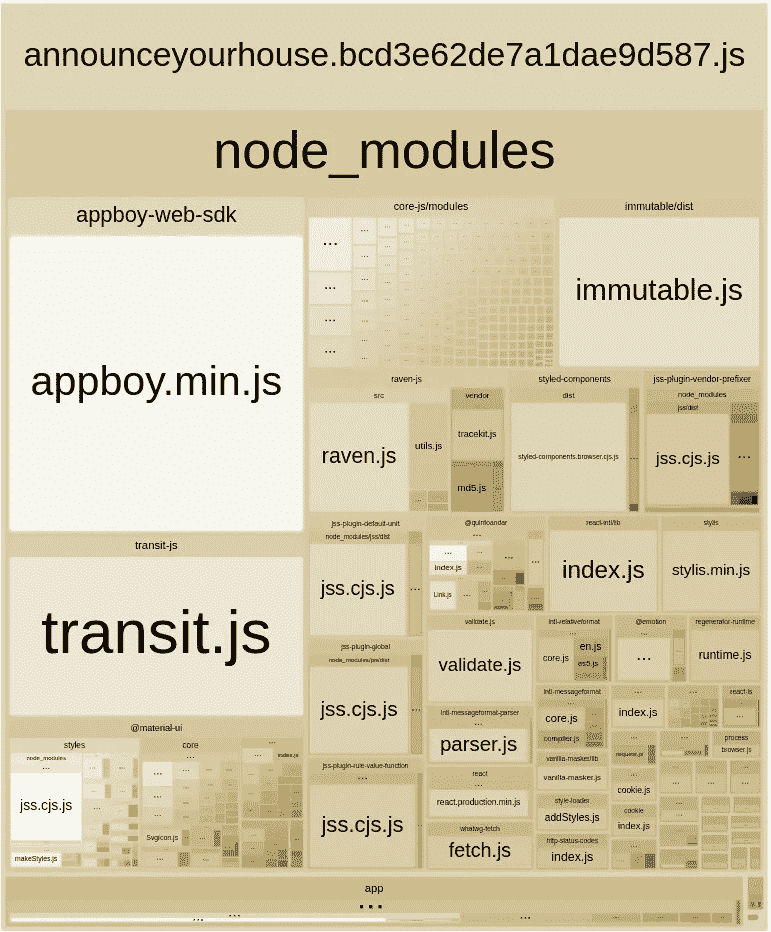

我们可以在这里分析很多东西，但是引起我们注意的是我们的登录页面包中的 React 库。正如我上面所写的，在边注中，React 没有被用于生产，我们无意中在生产中提供了它，使我们的用户无需这样做就可以下载库。

我们在 React 组件文件中有一个常量。我们在登录页面中导入了这个常量。

所以引入这个常数，我们也引入了 React。

一个简单的解决方法是将这个常量从 React 组件文件中分离出来，并从这个新文件中导入它。

并从新文件中导入常量:

让我们看看这一变化对包大小的影响:

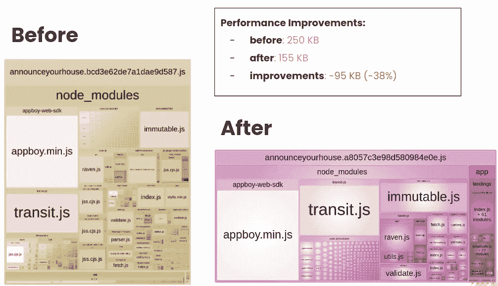

我们减少了 95KB！在仔细分析了我们的包之后，想到我们可以对一个小的变化产生巨大的影响，这很有趣。这将是我们在本文余下部分所做的每一项改进背后的过程:

1.  分析捆绑包
2.  修复性能问题
3.  收集结果并跟踪指标

我们再次运行捆绑包分析器，得到了这个结果:

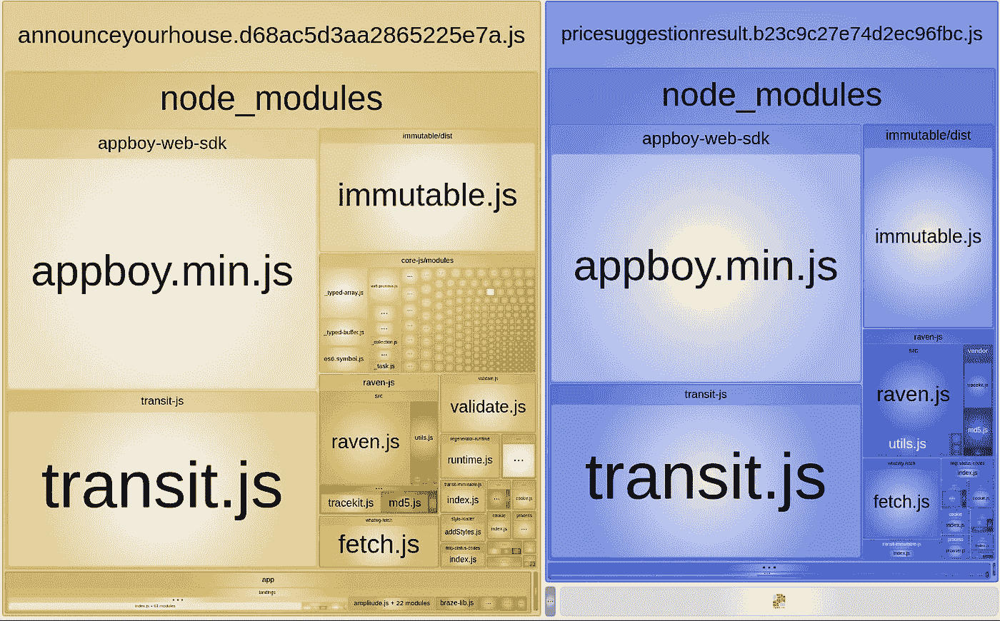

首先引起我们注意的是`appboy.min.js`和`transit.js`库。`appboy`是 Braze，一个我们用于通信的库，`transit`是一个将 JSON 格式数据转换成我们的应用程序状态的库。

`Braze`库与 React 库非常相似。这是一个文件中的`import`语句，登录页面正在使用它，但并没有真正使用`Braze`。

它在文件中导入 Braze 并使用实例作为函数的默认值。简单的解决方案是删除 import 语句，并强制每个使用`aFunction`函数的地方都要通过 braze 实例。因此，我们不需要导入 Braze 并为参数添加默认值:

再次运行包分析器，我们得到了一个惊人的结果。

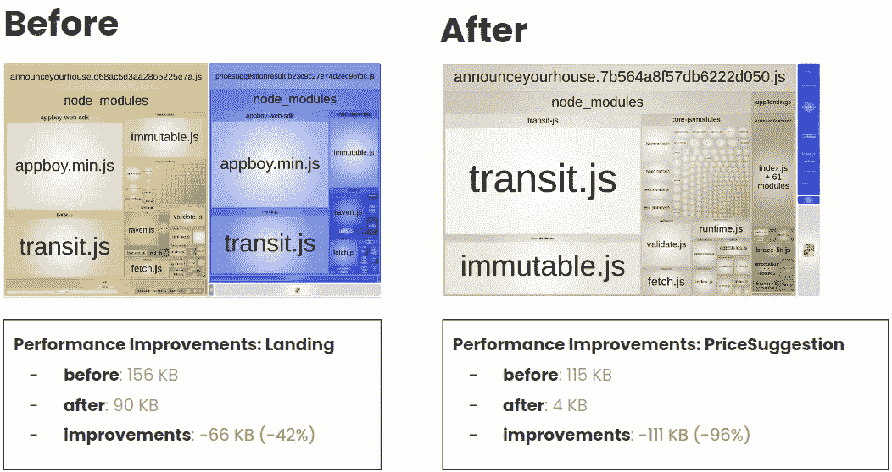

AnnounceYourHouse 登录页面已缩减至 90 KB。我们可以移除将近 50%的主着陆舱。

我们还改进了价格建议登录页面的捆绑包大小。从 115 KB 到 4 KB 是一个惊人的结果。

对于`transit`库，我们做了一个临时的解决方案。它导入库来转换保存在本地存储中的字符串 JSON，以便从该对象的单个属性中获取信息。

临时的解决方案是验证字符串是否包含我们想要的信息，并且不再需要使用`transit`库。

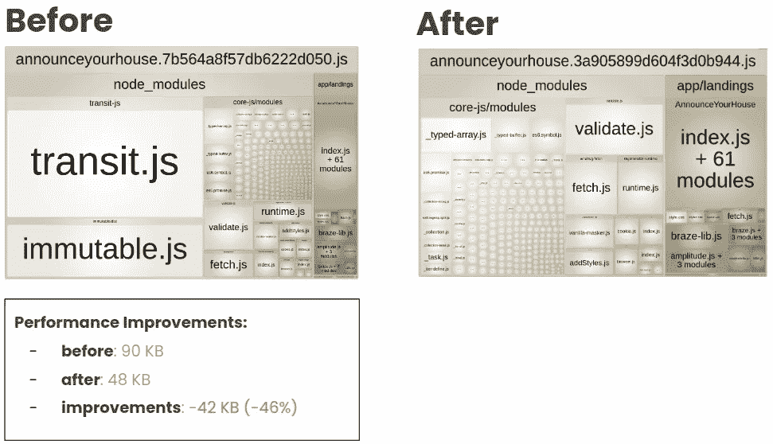

我们可以大大改善主平台的管束尺寸。去掉了几乎 50%的束。

正如我们在指标部分看到的，我们已经设置了速度曲线来跟踪一些页面在整个过程中的性能。因此，对于我们在应用程序中所做的每一项改进，我们都会跟踪这些工具中的指标。

登录页面的总大小急剧减少:-2.16 MB。

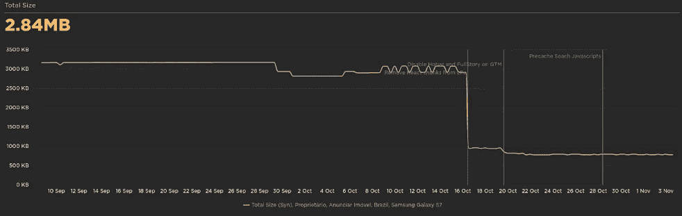

灯塔的表现得分从 73 分到 97 分:

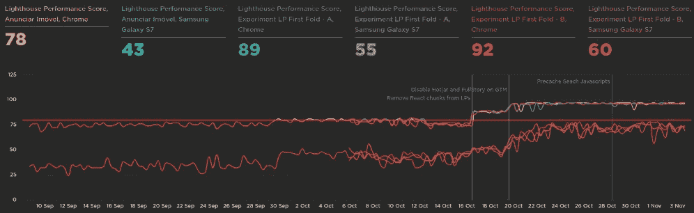

最大的内容丰富的油漆在 1 秒内改进:

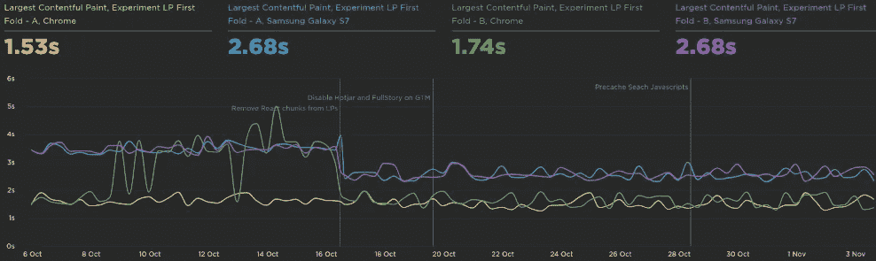

# 供应商区块

当运行`npm run bundle:analyzer`时，我们还注意到我们的供应商块中有很大的依赖性。

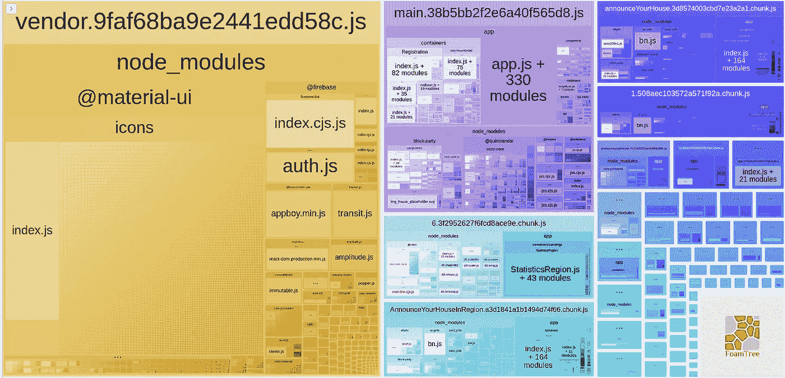

在供应商块中，我们注意到了来自 Material UI 的所有图标。每次用户进入网站，如果块没有缓存在浏览器中，它将需要下载整个块。如果下载量很大，会影响性能，进而影响用户体验。

这是在反应组件中导入材质用户界面图标时的一个[常见问题](https://material-ui.com/guides/minimizing-bundle-size/)。

我们的组件之一是使用内部组件库，该库使用“命名导入”样式来导入材料用户界面图标。在没有合适的巴贝尔插件的情况下，这也将剩余的未使用图标添加到了供应商块中。

我们提出了两种解决方案:

1.  修复从这个内部组件库的导入，我们已经停止使用命名导入。
2.  添加巴贝尔插件，并配置应用程序不添加未使用的模块。

由于这个内部组件库是我们设计系统的第一个也是被弃用的版本，我们不想继续维护它。最好的方法是不再使用这个库，并将所有的代码库转移到使用新的设计系统库(我们正在开发这个库！).

这个性能项目不是我们本季度的主要项目，所以在 sprint 中我们没有太多时间关注它。巴贝尔插件在当时对我们来说是一个更简单明了的解决方案。

我们基本上需要添加这个新的巴别塔插件`babel-plugin-transform-imports`并配置`babelrc`:

有了它，我们就可以防止在供应商块中完全导入库。

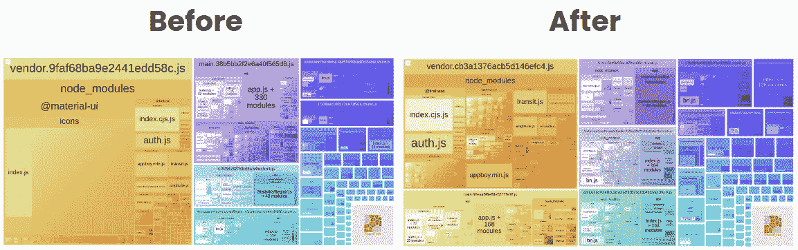

供应商变得越来越小。我们在主要部分也有一些影响(下一部分将很快讨论)。

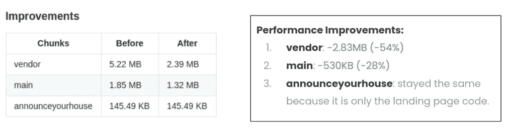

通过这种简单的分析和配置，我们可以将供应商块减少 50%以上(仍然是 2.83 MB，可以改进)。我们以后再说！)和 28%的主要部分。

对整个应用程序来说，这是一个巨大的进步，因为这些块被下载到了每一页上，如果没有缓存在浏览器中的话。

# 主组块

主块在应用程序的所有部分中都有一些公共模块。但是在运行束分析器之后，我们得到了这个:

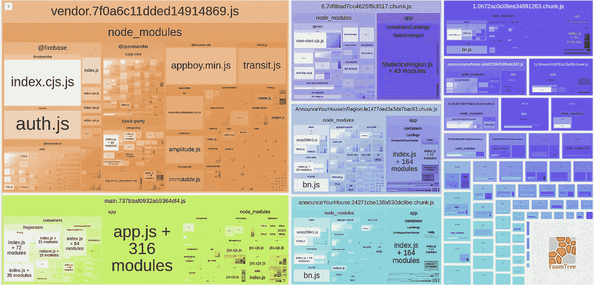

主块是捆绑包中的左下块。引起我们注意的一件事是捆绑包中的一些容器和组件。为什么有些组件只针对一个页面，而我们却让我们的用户下载整个主要部分？

问题很简单:我们的代码拆分工作不正常。

我们最初的想法是确保所有路由都有动态导入，以便我们的组件在每个路由器入口点进行代码分割。这就是问题所在:并不是所有的路由入口点都有可加载的组件，所以它们被加入到主块中，而不是为特定的路由和页面创建自己的块。

在这个应用程序中，我们当时使用的是`react-loadable`，所以想法是简单地创建这些可加载项:

并将它们用于每个路径入口点。

运行 bundle analyzer，我们得到了这个:

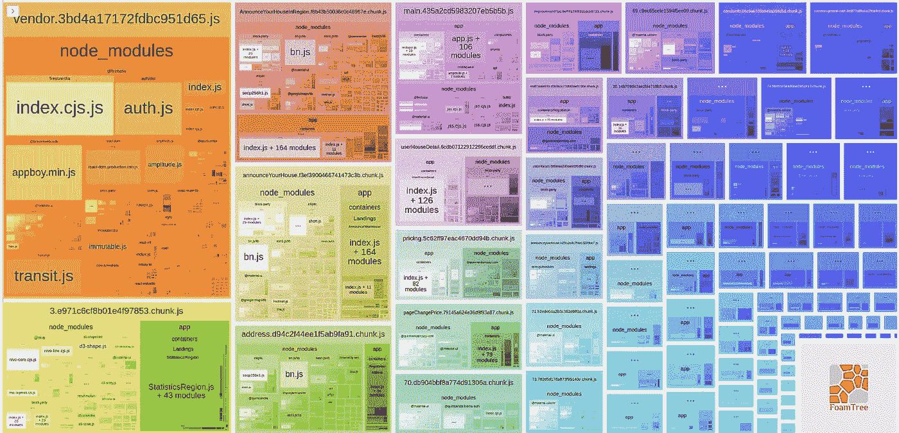

主块要小得多，Webpack 也创建了更多特定于页面的块。

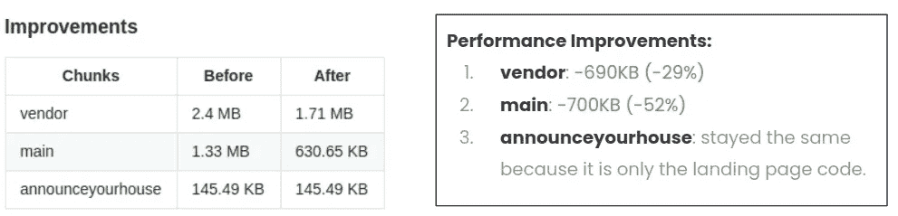

结果是巨大的。主要部分缩小了 50%以上，供应商部分也减少了 29%。

# 缓存最大的依赖项

阅读本文时，您可能会在我们的包中看到一些大的依赖项，如 firebase、braze、immutable 等等。

每次我们发布新产品时，我们的构建系统都会生成一个新的捆绑包。如果与供应商块相关的任何内容发生变化，Webpack 将为该块生成一个新的散列。所以浏览器不会有这个块的缓存版本，它会让用户再次下载它。

但是有时候，或者大多数时候，我们并没有真正改变这些最大的依赖关系(只有当依赖关系升级时)，我们让我们的用户为这一大块买单。

我们的想法是将这些最大的依赖拆分到它自己的块中，并确保浏览器有这个块的缓存版本，并且用户在需要它之前不需要再次下载它。

因为我们当时使用的是 Webpack 3，所以我们需要使用`CommonsChunkPlugin`来将这些依赖项拆分到它自己的块中。

我们创建了所有最大依赖项的列表:

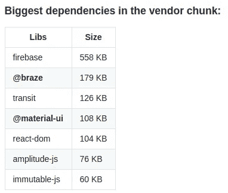

在我们的 Webpack 配置中，它也被映射为列表数据结构:

与`CommonsChunkPlugin`一起，我们只需要遍历这个列表来创建每个块。

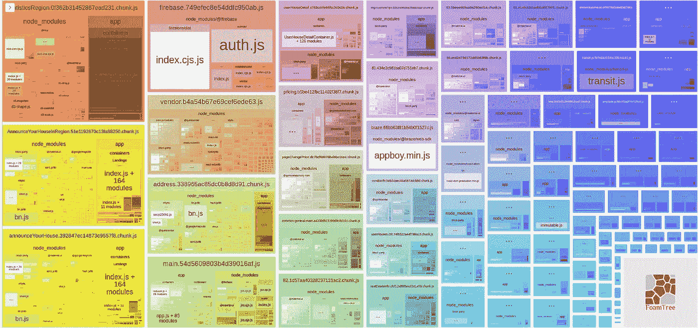

我们可以看到，供应商块变得更小，一些新的块被创建。

运行应用程序时，我们还可以测试每个独立块的下载。

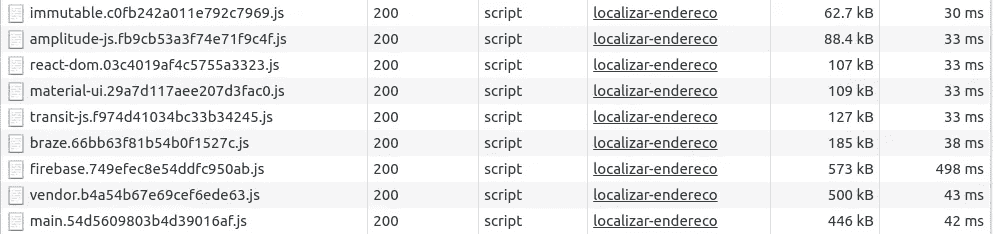

我们得到了一个非常酷的结果:

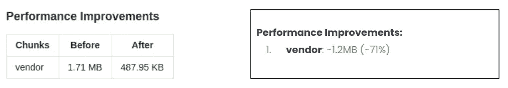

用户仍然需要下载依赖项，但在第一次下载后，浏览器会缓存它们，直到我们删除它们的版本，它们才需要再次下载。如果我们更改供应商块，Webpack 只会为供应商生成一个新的散列，而不会更改其他依赖项。

我们在速度曲线仪表板上看到了一些不错的改进:

正如所料，我们看到了 JavaScript 大小的巨大改进:-1.43 MB

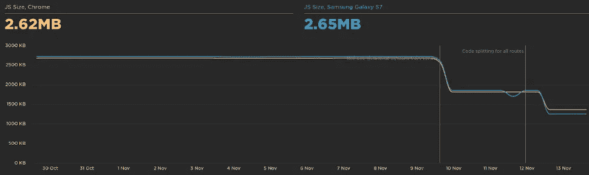

减少 JavaScript 大小还会影响用户被阻止与页面交互的总时间:-1.2s

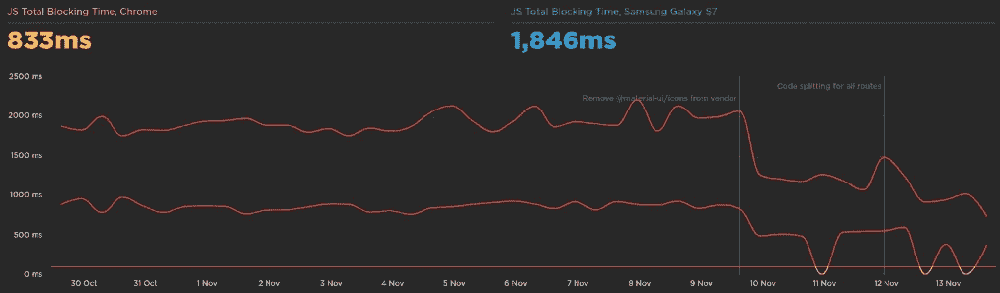

速度指数是一个显示网页内容可见填充速度的指标。我们改进了页面，加载速度加快了 2.2s。

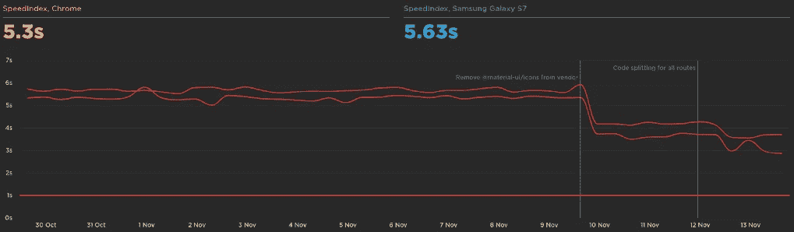

最有争议的油漆从 6s 变成了 3.75s

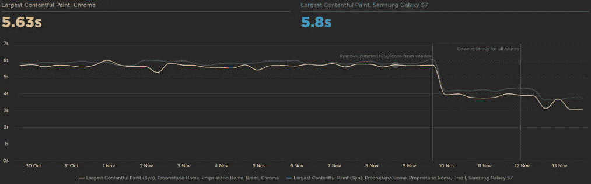

# 概述

为了概括我们在本文中所看到的内容，让我们来看看我们在这次旅程中所做的事情列表:

*   **度量**:度量是绩效改进的基础。
*   **锁**:防止退步&缩放性能知识。
*   **分析**:用数据和指标，分析可能出现的问题。
*   **改进**:代码。
*   **冲击**:测量前后画面。

如果可能的话，我还会建议与在这一性能领域更有经验的人交谈。

# 后续步骤

我们有更多的事情要做，但在最后一个季度，我们没有时间专注于这些事情。这是我现在想到的一系列事情:

*   **更多指标**:记录页面的 rum、ux 指标(参与度、跳出率)、业务指标(转化率)。
*   **管理请求**:服务器请求缓存。
*   **更多分析**:后端、组块、预取等。
*   **可移除依赖关系**:分析可以移除或替换的大依赖关系
*   **Webpack 升级** : bump 到 V5——缓存、优化、代码拆分、树抖动。
*   **Webpack 优化**:需要构建得更快。
*   **不断学习**:多学习发现更多机会。

# 资源

我有一些我在做这个项目的过程中使用的资源。希望对你也有帮助: [Web 性能研究](https://github.com/leandrotk/web-performance-studies)。

*原载于 2021 年 1 月 21 日*[*https://leandrotk . github . io*](https://leandrotk.github.io/2021/01/optimizing-the-performance-of-a-react-progressive-web-app/index.html)*。*