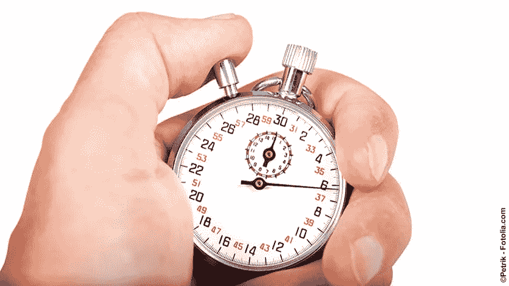

# 如何测量 JavaScript 执行时间

> 原文：<https://javascript.plainenglish.io/how-to-measure-javascript-execution-time-b3cabc5650bd?source=collection_archive---------14----------------------->



当谈到应用程序的性能时，测量性能变得很重要。对于任何要优化的东西，都必须先测量，优化，再测量才能获得收益。因此，测量 JavaScript 执行时间就成了这些步骤之一。

现代浏览器和 Node.js 平台提供了各种 API 来测量代码执行时间。

在这篇文章中，我们将讨论几种测量 JavaScript 执行时间的方法。

# 1.日期对象

跟踪执行时间最简单的方法是使用 date 对象。使用返回自 Unix epoch 以来经过的总毫秒数的`Date.now()`,我们可以存储要测量的函数执行前后的值，然后获得两者的差值。

```
const start = Date.now();

await functionToBeMeasured();const end = Date.now();
console.log(`Execution time: ${end - start} ms`);
```

# 2.控制台时间

另一个简单的解决方案是使用控制台定时器。方法用一个标签启动一个定时器。随后使用相同的标签调用`console.timeEnd()`方法将输出自该方法启动以来经过的时间。

```
console.time('Execution Time');

await functionToBeMeasured();console.timeEnd('Execution Time');
```

# 3.性能计时器

控制台定时器不提供高精度。如果我们想要 1 毫秒增量的精度，我们可以使用像`performance.now()`这样的高分辨率计时器。它还避免了一些与系统时钟的同步问题。

```
const start = performance.now();

await functionToBeMeasured();const end = performance.now();
console.log(`Execution time: ${end - start} ms`);
```

**注:**如果以节点为单位测量，`process.hrtime.bigint()`返回以纳秒为单位的精度。

这涵盖了测量 JavaScript 执行时间的方法。如果我们想开始测量多个函数的 JavaScript 执行时间，我们可以利用 Performance API 和 [Performance Observer](https://developer.mozilla.org/en-US/docs/Web/API/PerformanceObserver) 。它们提供标记来跟踪多个条目并独立地测量它们。

# 在单元测试中测量 JavaScript 执行时间

为了确保函数的执行足够快，它可以成为我们单元测试的一部分。很多框架(Jest，Jasmine 等。)允许设置测试执行的超时时间。如果方法需要更长的时间来执行，那么超时特性可以用来使测试失败。

有了茉莉:

```
describe('testing time duration', () => {
  it('does not take longer than 5 seconds', async () => {
    await functionToBeMeasured();
  }, 5000);
});
```

*原载于 2021 年 7 月 1 日 https://www.wisdomgeek.com*[](https://www.wisdomgeek.com/development/web-development/javascript/measuring-javascript-execution-time/)**。**

**更多内容看* [***说白了. io***](http://plainenglish.io/) ***。*** *报名参加我们的* [***免费每周简讯点击这里***](http://newsletter.plainenglish.io/) ***。****